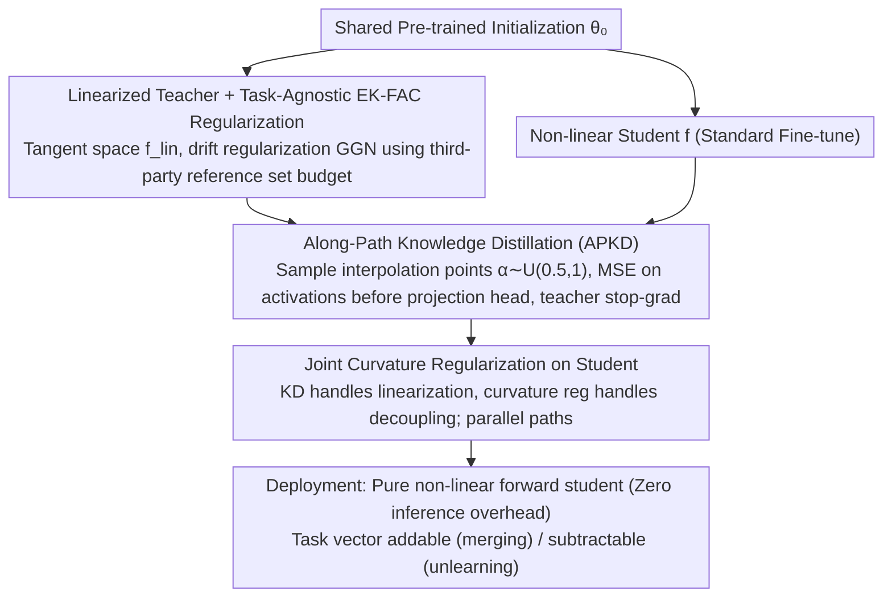

# Distilling Linearized Behavior into Non-Linear Fine-Tuning for Effective Task Arithmetic

**Conference**: ICML 2026  
**arXiv**: [2605.18993](https://arxiv.org/abs/2605.18993)  
**Code**: https://github.com/apanariello4/merge-and-rebase  
**Area**: Model Merging / Model Compression / Task Arithmetic  
**Keywords**: task arithmetic, linearization, knowledge distillation, weight disentanglement, EK-FAC

## TL;DR
This paper proposes DELTA, which distills intermediate activations from a "tangent space linearized teacher" into a standard non-linear student in an online manner. Combined with EK-FAC curvature regularization and sampling along the interpolation path, DELTA ensures that task vectors from standard non-linear fine-tuning inherit properties like "addability, low interference, and robustness to scaling" typically found in linearized models, without introducing any inference overhead.

## Background & Motivation

**Background**: Task arithmetic (Ilharco 2022) utilizes the weight difference $\bm\tau_t=\bm\theta_t-\bm\theta_0$ as a task vector, performing addition (merging tasks) or subtraction (machine unlearning) in the weight space via $\bm\theta_0+\sum_t\alpha_t\bm\tau_t$. Its effectiveness strongly depends on weight disentanglement: applying $\bm\tau_t$ should leave predictions on other tasks' inputs nearly unchanged. Ortiz-Jimenez et al. found that fine-tuning in the tangent space (linearized model $f_{\mathrm{lin}}(\bm x;\bm\theta)=f(\bm x;\bm\theta_0)+\mathrm J_{\bm\theta}f(\bm x;\bm\theta_0)(\bm\theta-\bm\theta_0)$) naturally yields more decoupled task vectors.

**Limitations of Prior Work**: Linearization paths come with three significant costs: (i) Jacobian-vector products double both training and inference costs; (ii) locking optimization in the tangent space harms expressivity, resulting in a lower accuracy ceiling for single tasks; (iii) existing interference-reduction regularizers (such as τJp requiring other tasks' training data and TAK requiring others' KFAC factors) assume a closed set of known tasks, requiring full re-computation when a new task arrives. Standard non-linear fine-tuning has high expressivity but performs poorly in task arithmetic (e.g., achieving only 32% absolute accuracy on ViT-B/32 8-Vision compared to 77% for the linear version).

**Key Challenge**: Expressivity (non-linear) and composability for task arithmetic (linear) appear to be mutually exclusive, yet merging capability relies heavily on the tangent space structure.

**Goal**: To enable students from standard non-linear fine-tuning to satisfy two core conditions—"near-linearity to weight perturbations" and "support localization (modifying in-domain behavior while remaining static out-of-domain)"—thereby achieving merging performance without paying inference costs or requiring data/statistics from other tasks.

**Key Insight**: This paper observes that "near-linearity in weight space" is a property of the parameter space, but it can be induced via "objectives in the activation space." By forcing the hidden activations of a non-linear student to match those of a linearized teacher, optimization is biased toward solutions that are nearly linear with respect to weight perturbations.

**Core Idea**: Use a linearized teacher + online feature distillation + interpolation path sampling + EK-FAC curvature regularization to jointly train a non-linear student. This encapsulates "linearization benefits" into a model that remains a standard non-linear forward pass during inference.

## Method

### Overall Architecture
For each task $t$, two models are maintained simultaneously: a teacher $f_{\mathrm{lin}}(\bm x;\bm\theta_t^T)$ utilizing tangent space linearization and a student $f(\bm x;\bm\theta_t^S)$ utilizing standard non-linear fine-tuning. Both share the same pre-trained initialization $\bm\theta_0$ and are optimized jointly in a single backpropagation pass (not a sequential teach-distill process), applying EK-FAC curvature regularization to both. The teacher provides "low-interference target activations," while the student captures "linearized behavior" via feature-level MSE distillation based on multiple snapshots sampled along the teacher's interpolation path.

### Key Designs

**1. Linearized Teacher + Task-Agnostic EK-FAC: Pushing the teacher toward low interference for any future task**

The composability of task arithmetic relies on weight disentanglement. Thus, the teacher must move in a direction that minimizes perturbations to any other arbitrary input distributions to avoid "crowding" the task vectors of unknown future tasks. The teacher loss is defined as $\mathcal L^T_t = \mathcal L_{\text{task}} + \beta^T\,\mathcal L_{\text{drift}}(\bm\theta_t^T)$, where representation drift under linearization has a closed-form $\mathcal L_{\text{drift}}(\bm\theta_t)\propto (\bm\theta_t-\bm\theta_0)^\top \bm G_t(\bm\theta_0)(\bm\theta_t-\bm\theta_0)$, with $\bm G_t$ being the GGN matrix. A key difference here is that instead of computing the GGN on a known task set (which assumes a closed set), the authors pre-budget an EK-FAC approximation $\mathrm{GGN}_{\mathrm{EK\text{-}FAC}}^l=(U_A^l\otimes U_G^l)S^l(U_A^l\otimes U_G^l)^\top$ using a third-party reference dataset $\mathcal D_\Omega$ (e.g., a 15% subset of ImageNet-21k for vision, $10^5$ C4 samples for text). This transforms the regularizer into a decoupling objective for general input distributions. Unlike τJp (requiring other tasks' data) or TAK (requiring other tasks' KFAC), the reference dataset approach allows for new tasks without retraining old vectors and protects user privacy. EK-FAC also provides more accurate curvature estimation than KFAC by modeling eigenvalues under the Kronecker basis.

**2. Along-Path Knowledge Distillation (APKD): Distilling linearized behavior across the interpolation path**

The teacher's "near-linearity to weight perturbations" must be transferred to the non-linear student, and this must hold not just at $\alpha=1$ but across the path. Instead of distilling logits, the hidden activations before the final projection head are used with an MSE criterion. Crucially, in each SGD step, an interpolation point $\alpha\sim\mathcal U(0.5,1)$ is sampled, and activations are aligned for both teacher and student at the state $\bm\theta_0+\alpha\bm\tau$:

$$\mathcal L_{\text{KD}}=\mathbb E_{\alpha}\Big[\tfrac{1}{B}\sum_i\big\|f(\bm x_i;\bm\theta_0+\alpha\bm\tau_t^S)-\mathrm{SG}[f_{\mathrm{lin}}(\bm x_i;\bm\theta_0+\alpha\bm\tau_t^T)]\big\|_2^2\Big]$$

A stop-gradient is applied to the teacher to prevent backpropagation contamination. While traditional KD at fixed $\alpha{=}1$ only aligns at a single point, causing the student to drift from linear behavior elsewhere, APKD feeds the entire linear trajectory to the student. This acts as an ensemble distillation of a "linearized teacher family," significantly improving $\alpha$-sweep robustness on T5—eliminating the need for validation-set-based coefficient tuning during deployment.

**3. Student-side Joint Curvature Regularization: Separating "linearization" and "decoupling" into independent paths**

Distillation alone is insufficient; the student must also be pushed toward support localization (large in-domain changes, while remaining close to the pre-training state out-of-domain). The student loss is $\mathcal L^S_t=\mathcal L_{\text{task}}(\bm\theta_t^S)+\beta_1\mathcal L_{\text{KD}}+\beta_2\mathcal L_{\text{drift}}(\bm\theta_t^S)$. The distillation term traps the student in a near-linear region, while the curvature term explicitly controls decoupling within that region. The authors' diagnostics (Fig. 6) reveal why both are necessary: "distillation only" provides linearization but weak decoupling, while "curvature only" provides decoupling but weak linearization. Operating both paths simultaneously allows the student to be nearly linear and support localization. This also explains why the student can surpass the teacher: it retains non-linear expressivity outside the tangent space while its activations remain constrained to the region explored by the linearized teacher. This architecture supports both full FT students and LoRA students paired with full FT teachers—the latter allows the teacher to find directions in a high-capacity space while the student replicates it in an efficient low-rank subspace, perfectly fitting "train heavy, deploy light" pipelines.

### Loss & Training
The teacher and student are optimized jointly in a single backpropagation (not sequential). Both share $\bm\theta_0$ and use EK-FAC curvature regularization. Teacher loss: $\mathcal L^T_t = \mathcal L_{\text{task}} + \beta^T\mathcal L_{\text{drift}}$; Student loss: $\mathcal L^S_t = \mathcal L_{\text{task}} + \beta_1\mathcal L_{\text{KD}} + \beta_2\mathcal L_{\text{drift}}$. During inference, the student uses a standard non-linear forward pass with zero overhead.

## Key Experimental Results

### Main Results
Comparison of absolute accuracy for task addition on 8-Vision / 14-Vision / 6-NLI benchmarks. With $\alpha{=}1$ direct addition, DELTA outperforms across 4 backbones:

| Method | 8V ViT-B/32 Abs. | 14V ViT-L/14 Abs. | 14V ViT-B/32 Abs. | 6-NLI T5-Base Abs. |
|------|------|------|------|------|
| Pre-trained | 48.4 | 65.0 | 57.8 | 61.7 |
| Individual fine-tune | 92.8 | 95.8 | 90.2 | 85.9 |
| Non-Linear FT (Ilharco 2022) | 32.0 | 45.3 | 15.6 | 42.0 |
| Linear FT (Ortiz-Jimenez 2023) | 77.4 | 88.0 | 73.7 | 76.0 |
| τJp (Yoshida 2025) | 85.0 | 90.9 | 85.3 | 82.5 |
| TAK (Porrello 2025b) | 86.0 | 91.6 | 84.3 | 79.1 |
| **DELTA (ours)** | **88.3** | **92.7** | **85.9** | 82.3 |

With LoRA students + full FT teachers, DELTA achieves 87.5 absolute / 99.5 normalized accuracy on 8V ViT-B/32, outperforming the runner-up Core+TSV-M (77.9) by 9.6 percentage points.

### Ablation Study

| Configuration | 8V ViT-B/32 Task Arithmetic | Description |
|------|------------------------------------|------|
| Non-linear FT baseline | 32.0 abs | Lacks both linearization and decoupling; task arithmetic fails |
| Student + KD + Curvature (DELTA full) | 88.3 abs | Both components present |
| Student + KD only (no curvature) | Close to DELTA but gap exists | Linearization error near zero, but weak support localization |
| Student + Curvature only (no KD) | Closest to DELTA | Strongest decoupling, but linearization error increases |
| APKD off (Distill at fixed $\alpha{=}1$) | Linearization error rises significantly; robustness on T5 $\alpha$-sweep degrades | Single-point alignment loses along-path properties |
| Task negation 9.6% target / 62.1% control | DELTA outperforms other non-linear methods, trails linear τJp/TAK | Linearization holds residual advantage in subtraction |

### Key Findings
- "Distillation for linearization, curvature regularization for support localization"—these are independent paths. Both are required to reach the task addition ceiling.
- DELTA student consumes the teacher: On T5, each single-task student outperforms the teacher, and the merged average accuracy is also higher. This indicates that non-linear expressivity is not lost to KD; instead, it is guided toward a "near-linear but more expressive" intermediate state.
- LoRA student + full FT teacher is an unexpectedly strong combination, achieving 97.9 normalized accuracy on 8V ViT-B/32, significantly surpassing post-hoc merging methods (Iso-C / TSV-M / Core Space).
- $\alpha$-sweep robustness: DELTA shows a nearly flat curve for $\alpha\in[0.5,1]$, whereas other non-linear methods crash when deviating from 1. This reduces reliance on coefficient tuning.
- Generalization to Generative LLMs: Using LLaMA-3.2-1B + DPO to combine helpfulness and verbosity preference vectors $\bm\theta_{\text{mix}}=\bm\theta_0+\bm\tau_{\text{help}}+\lambda_2\bm\tau_{\text{verb}}$. Distilled DPO's reward Pareto frontier is close to Linear DPO, and preference accuracy exceeds DPO-Mixed and Non-Linear DPO.

## Highlights & Insights
- "Inducing parameter space properties via functional space objectives" is a powerful perspective: this paper provides clean empirical evidence that activation-level MSE + curvature regularization can force a non-linear model to behave "nearly linear" under weight perturbations. The authors speculate that optimization is trapped near $\bm\theta_0$ where first-order Taylor is valid, and simplicity bias naturally pushes the model toward simple (near-linear) fits.
- The "division of labor" diagnostics between distillation and curvature (Fig. 4/5) are elegant, attributing model performance to two interpretable properties.
- Replacing task-specific statistics with reference datasets allows for incremental task additions without breaking previously learned vectors—a critical engineering breakthrough for task arithmetic deployments.
- The asymmetric pairing of LoRA students with full FT teachers naturally fits industry "train in high-capacity, deploy efficiently" workflows and performs better than post-hoc merging.

## Limitations & Future Work
- Training cost is tripled and VRAM usage is doubled (Teacher + Student + Path sampling + EK-FAC pre-calc), which is acknowledged as a core bottleneck.
- For task negation, DELTA still trails strictly linear τJp/TAK, indicating that subtraction still benefits from strict linearity not fully replicated here.
- Curvature regularization depends on the representativeness of $\mathcal D_\Omega$. While sensitivity ablations exist, cross-domain validity (e.g., vision reg for medical tasks) requires further verification.
- Improved merging capability is a double-edged sword; unsafe behaviors could be more easily combined or propagated.
- Distilled DPO is preliminary and lacks curvature integration; a full end-to-end version for generative LLMs is a clear follow-up.

## Related Work & Insights
- **vs Linear FT (Ortiz-Jimenez 2023)**: They train directly in tangent space; DELTA distills those properties into a non-linear student, saving half the cost at inference and achieving higher task addition accuracy.
- **vs τJp (Yoshida 2025)**: τJp uses other tasks' data to regularize drift under linearization. DELTA replaces data dependence with reference datasets + EK-FAC, becoming task-agnostic.
- **vs TAK (Porrello 2025b)**: TAK achieves a dataless state with KFAC but requires KFAC factors for all tasks. DELTA uses a shared reference matrix, allowing incremental task addition.
- **vs Iso-C / TSV-M / Core Space**: These are post-hoc merging methods that correct bias after fine-tuning. DELTA pushes vectors into decoupled regions during training, which is notably more effective for LoRA (14+ points higher in normalized acc).
- **vs DPO (Rafailov 2023)**: DPO treats multi-preference as a single scalar objective; this work explores training preference vectors separately to compose them at inference, allowing for controllable Pareto frontiers.

## Rating
- Novelty: ⭐⭐⭐⭐ The combination of functional space constraints and along-path distillation to induce parameter properties is novel, though individual components are known.
- Experimental Thoroughness: ⭐⭐⭐⭐⭐ Comprehensive coverage across 8/14-task vision, 6-NLI, ViT, T5, LoRA, and DPO with generative LLMs. Diagnostic ablations clearly separate distillation vs curvature functions.
- Writing Quality: ⭐⭐⭐⭐⭐ Clearly articulates the benefits and costs of linearization; Table 1 provides an excellent summary of DELTA's unique advantages.
- Value: ⭐⭐⭐⭐⭐ Transitions task arithmetic from research demos to deployable stages (zero inference cost + incremental tasks). LoRA experiments demonstrate industrial viability.

<!-- RELATED:START -->

## Related Papers

- [\[ICML 2026\] Learning a Zeroth-Order Optimizer for Fine-Tuning LLMs](learning_a_zeroth-order_optimizer_for_fine-tuning_llms.md)
- [\[ICML 2025\] Provable In-Context Vector Arithmetic via Retrieving Task Concepts](../../ICML2025/optimization/provable_in-context_vector_arithmetic_via_retrieving_task_concepts.md)
- [\[ICML 2026\] Utility-Diversity Aware Online Batch Selection for LLM Supervised Fine-tuning](utility-diversity_aware_online_batch_selection_for_llm_supervised_fine-tuning.md)
- [\[ICCV 2025\] Zeroth-Order Fine-Tuning of LLMs in Random Subspaces](../../ICCV2025/optimization/zeroth-order_fine-tuning_of_llms_in_random_subspaces.md)
- [\[ICML 2026\] Bayesian Gated Non-Negative Contrastive Learning](bayesian_gated_non-negative_contrastive_learning.md)

<!-- RELATED:END -->
