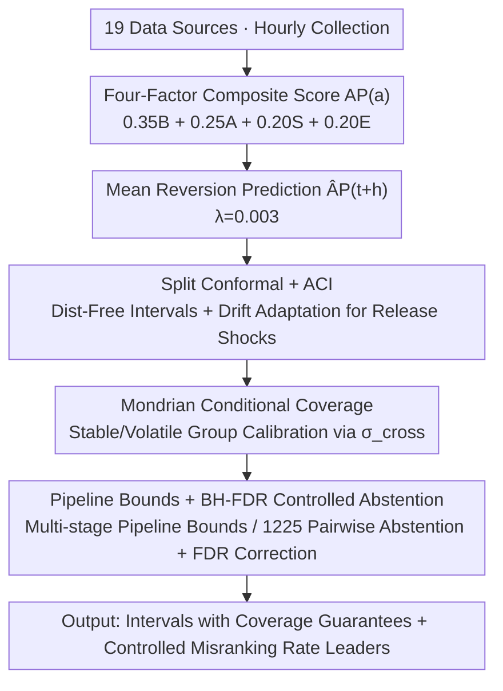

# Distribution-Free Uncertainty Quantification for Continuous AI Agent Evaluation

**Conference**: ICML 2026  
**arXiv**: [2605.19779](https://arxiv.org/abs/2605.19779)  
**Code**: To be confirmed  
**Area**: LLM Evaluation / Uncertainty Quantification  
**Keywords**: conformal prediction, ACI, agent evaluation, FDR, Mondrian

## TL;DR
This paper proposes the AgentPulse framework, which combines split conformal prediction, adaptive conformal inference (ACI), Mondrian conformal, and BH-FDR to provide distribution-free coverage guarantees, composite pipeline uncertainty bounds, and ranking abstention mechanisms with FDR control for continuous scoring of 50 AI agents, treating "measurement uncertainty" as a first-class evaluation output.

## Background & Motivation

**Background**: Benchmarks such as SWE-bench, GAIA, WebArena, and TAU-bench compress agent performance into static scores, while Chatbot Arena uses bootstrap to assign confidence intervals to Elo scores. The community generally treats these point estimates as "conclusive" and ranks models accordingly.

**Limitations of Prior Work**: Evaluation involves three types of uncertainty that no current tools simultaneously address: (i) measurement heterogeneity—different platforms have inconsistent judgments of "quality"; (ii) model specification—rankings shift with slight changes in weighting schemes; (iii) temporal non-stationarity—agent updates cause score drift over time. Bootstrap only addresses single signal sources and relies on the representativeness of empirical distributions; parametric intervals assume Gaussian residuals, which are immediately violated by agent release events.

**Key Challenge**: Evaluation targets are non-iid (due to agent iterations), involve multi-signal fusion (benchmark, adoption, sentiment, ecosystem), and require numerous pairwise comparisons on a leaderboard. No single statistical tool provides simultaneous guarantees across the axes of "distribution-free," "drift-adaptive," "conditional coverage," and "multiple testing."

**Goal**: Provide continuous evaluation with (a) finite-sample coverage guarantees for single agents; (b) composite error bounds for multi-agent pipelines; (c) pairwise comparisons and leaderboard-level FDR control with controlled misranking rates; and (d) per-agent conditional coverage rather than just marginal coverage.

**Key Insight**: Conformal prediction, a suite of distribution-free tools, is migrated to agent evaluation. Four specific challenges are mapped to existing extensions: ACI handles release shocks, Mondrian addresses per-agent conditional coverage, independent/worst-case bounds handle pipeline propagation, and the BH procedure manages leaderboards.

**Core Idea**: Replace bootstrap or parametric intervals with a combination of "split conformal + ACI + Mondrian + BH-FDR," attaching distribution-free, drift-adaptive, conditional coverage, and multiple testing guarantees to a continuous evaluation pipeline.

## Method

### Overall Architecture
AgentPulse collects signals from 19 data sources hourly to calculate a four-factor composite score for 50 agents: 
$\mathrm{AP}(a)=0.35\,B(a)+0.25\,A(a)+0.20\,S(a)+0.20\,E(a)$, where $B$ represents benchmarks (SWE-bench/GAIA/WebArena/HumanEval+/TAU-bench, with a 0.5 neutral prior for missing data), $A$ is a normalized log-composite of GitHub stars/package downloads/VSCode installs, $S$ is sentiment fusion using VADER/TextBlob/FinBERT/DistilBERT-SST2 across 9 platforms ($\kappa{=}0.81$ on 200 calibration texts), and $E$ signifies ecosystem health (contributor depth, issue closure rate, release freshness). Predictions use mean reversion: $\widehat{\mathrm{AP}}_{t+h}(a)=\mathrm{AP}_t(a)+\lambda(\overline{\mathrm{AP}}-\mathrm{AP}_t(a))\cdot h$, with $\lambda{=}0.003$ (ADF tests reject unit roots for 42/50 agents). The uncertainty quantification is supported by three key designs.

### Key Designs

**1. Split Conformal + ACI Double-Layer Coverage: Drift Adaptation on Top of Distribution-Free Foundations**

Parametric intervals assume Gaussian residuals and bootstrap assumes representative empirical distributions; both fail to provide coverage when agent releases or seasonal trends break stationarity. AgentPulse first utilizes split conformal to obtain a distribution-free finite-sample guarantee $\Pr[\mathrm{AP}_{t+h}\in C_{1-\alpha}]\ge 1-\alpha$. Historical scores are split 70/30 into training/calibration sets. The $\lceil(1-\alpha)(n_{\text{cal}}+1)\rceil/n_{\text{cal}}$ quantile $\hat q_{1-\alpha}$ of conformity scores $R_i=|\mathrm{AP}_{t_i+h}-\widehat{\mathrm{AP}}_{t_i+h}|$ is used to form the interval $\widehat{\mathrm{AP}}_{t+h}\pm\hat q_{1-\alpha}$. To handle non-exchangeable shocks like agent releases, the second layer applies ACI to adjust miscoverage online: $\alpha_{t+1}=\alpha_t+\gamma(\alpha-\mathrm{err}_t)$. This automatically widened intervals by 35% within 6 hours of a Windsurf release and contracted them after 48 hours.

**2. Mondrian Conditional Coverage + cross-source $\sigma$ Stratification: Upgrading "Average 80%" to "Per-Agent 80%"**

Marginal 80% coverage can be a misleading average—under standard conformal, volatile agents are obscured by the mean, resulting in only 64.6% average coverage for the volatile subset. The authors use the cross-platform standard deviation $\sigma_{\text{cross}}(a)=\mathrm{std}(\{s_p(a)\})$ as a stratification variable, splitting agents into "stable" ($\sigma_{\text{cross}}<0.04$, n=35) and "volatile" ($\ge 0.04$, n=15) groups to calibrate separate $\hat q_{1-\alpha}$ quantiles. This allows the volatile group to receive wider intervals to compensate for heavy-tailed residuals, bringing coverage back to 80.4% with a 22% increase in width—accurately reflecting their inherent uncertainty.

**3. Pipeline Bounds + BH-FDR Controlled Abstention: Extending Uncertainty to Multi-stage Pipelines and Full Leaderboards**

For multi-stage pipelines (e.g., $a_1\to a_2$), the framework provides dual bounds: an independent bound $\sigma_{\text{pipeline}}=\sqrt{\sigma_1^2+\sigma_2^2}$ and a worst-case bound $\sigma_1+\sigma_2$. Simulations show ground truth falls between these bounds for $\rho\in[-0.5,0.9]$. For pairwise comparisons, conformal intervals are calculated for the difference $\Delta_{ab}$; if $0\in C_\Delta^{1-\alpha}$, the framework abstains (marking them as "indistinguishable"). For leaderboards, conformal p-values for all 1,225 pairs are corrected using BH at $q{=}0.20$. This reduced "confidently ranked pairs" from 69% to 50% while capping the overall misranking rate at 20%.

### Loss & Training
The objective is unsupervised, and all "models" are statistical estimators. The mean reversion parameter $\lambda$ is calibrated via ADF tests, conformal quantiles are taken empirically from the calibration set, ACI step size $\gamma$ updates $\alpha_t$ online, and Dirichlet weight sensitivity is evaluated using 1,000 samples from $\mathrm{Dir}(3.5,2.5,2.0,2.0)$ to assess ranking stability.

## Key Experimental Results

### Main Results
A comparison of coverage at a 24-hour horizon shows that Conformal maintains calibration error $<0.02$, while parametric methods are systematically over-conservative or under-covered:

| Horizon | Parametric Cov. | Parametric Width | Conformal Cov. | Conformal Width |
|---------|-----------------|------------------|----------------|-----------------|
| 1h      | 94%             | 0.021            | 82%            | 0.016           |
| 6h      | 89%             | 0.051            | 83%            | 0.044           |
| 24h     | 83%             | 0.103            | 81%            | 0.098           |
| 48h     | 80%             | 0.145            | 80%            | 0.152           |
| 72h     | 78%             | 0.178            | 79%            | 0.195           |

At 72h, bootstrap coverage drops to 74% (under-coverage), while conformal remains at 79%. ACI widened the width by 35% during release events and was 8% wider than standard split conformal during stable periods.

### Ablation Study
Coverage repair and multiple testing perturbations:

| Configuration                        | Key Metrics       | Description                                                                 |
|--------------------------------------|-------------------|-----------------------------------------------------------------------------|
| Standard Conformal (Volatile subset) | 64.6% Coverage    | 11 out of 15 agents below 75%, 15pp gap from 80% target                     |
| Mondrian Conformal (Volatile subset) | 80.4% Coverage    | Only 2 out of 15 below 75%, width increased by 22%                          |
| Dirichlet Weight Sampling ($k=2$)    | $\tau=0.52$       | Ranking stability drops significantly under near-uniform priors             |
| Dirichlet Weight Sampling ($k=10$)   | $\tau=0.80$       | Default configuration, stable rankings                                      |
| 1225 Pairs (Uncorrected $\alpha=0.20$) | 69% Ranked        | Per-pair error rate of 20% accumulates on the leaderboard                   |
| 1225 Pairs (BH-FDR $q=0.20$)         | 50% Ranked        | Leaderboard misranking rate capped at 20%                                  |

### Key Findings
- The primary axis of error is $\sigma_{\text{cross}}$ rather than the time horizon. Coverage for volatile agents drops to 68% at 72h under standard methods, making Mondrian stratification more effective than simply increasing interval width.
- The B+S sub-composite (excluding GitHub) predicts GitHub stars at $\rho_s{=}0.52$ ($p<0.01$), indicating sentiment is not merely a reflection of GitHub popularity.
- Aspect-level analysis reveals hidden heterogeneity: an agent might score +0.11 in code quality but −0.12 in reliability; average scores mask this variance.
- Correlations between B/A and A/E factors are 0.05 and 0.61 respectively, suggesting the four factors are complementary rather than redundant.

## Highlights & Insights
- The mapping of conformal tools to specific uncertainty challenges (ACI for release shifts, Mondrian for conditional coverage, etc.) serves as a clear "UQ selection checklist" for evaluation.
- $\sigma_{\text{cross}}$ acts as both a volatility metric and a stratification variable for Mondrian conformal prediction.
- Comparisons with bootstrap demonstrate that the assumption of "representative resampling" fails in non-stationary agent evaluation (under-coverage at 72h).
- The "abstention" mechanism aligns leaderboards with their true utility by marking indistinguishable agents rather than forcing arbitrary rankings.

## Limitations & Future Work
- ACI convergence assumes bounded shifts; a fundamental paradigm shift (e.g., replacing a backbone) might violate these assumptions.
- Pipeline bounds: the independent bound is over-conservative if $\rho<0$, yet the paper lacks an automatic rule for selecting between independent and worst-case bounds.
- BH-FDR assumes independence or positive regression dependence among test statistics, which was not explicitly verified for all 1,225 pairs.
- The $n=11$ sample size in portions of the ablation limits power; findings regarding "no effect" require re-testing with larger samples.
- The work considers English NLP signals only; closed-source agents lack adoption signals.

## Related Work & Insights
- **vs Chatbot Arena (bootstrap CI)**: Unlike Chatbot Arena, which resamples a single preference signal, this work handles multi-source factors and provides distribution-free guarantees that perform better under non-stationarity.
- **vs TrueSkill**: TrueSkill provides posterior distributions, whereas this work provides finite-sample frequentist coverage without assuming normality.
- **vs LiveBench**: While LiveBench addresses benchmark obsolescence, it does not provide confidence intervals; this work incorporates benchmark scores into conformal intervals.

## Rating
- Novelty: ⭐⭐⭐⭐
- Experimental Thoroughness: ⭐⭐⭐⭐
- Writing Quality: ⭐⭐⭐⭐
- Value: ⭐⭐⭐⭐

<!-- RELATED:START -->

...

<!-- RELATED:END -->

## Related Papers

- [\[NeurIPS 2025\] Uncertainty Quantification for Reduced-Order Surrogate Models Applied to Cloud Microphysics](../../NeurIPS2025/optimization/uncertainty_quantification_for_reduced-order_surrogate_models_applied_to_cloud_m.md)
- [\[ICML 2026\] HO-SFL: Hybrid-Order Split Federated Learning with Backprop-Free Clients and Dimension-Free Aggregation](ho-sfl_hybrid-order_split_federated_learning_with_backprop-free_clients_and_dime.md)
- [\[ICML 2026\] Bregman meets Lévy: Stochastic Mirror Descent with Heavy-Tailed Noise in Continuous and Discrete Time](bregman_meets_lévy_stochastic_mirror_descent_with_heavy-tailed_noise_in_continuo.md)
- [\[ICML 2026\] LoRe: Adaptive Interaction-Evaluation Routing with Per-Step Interaction Budgets for Iterative Graph Solvers](lore_adaptive_interaction-evaluation_routing_with_per-step_interaction_budgets_f.md)
- [\[ICML 2026\] RACO: Reward-free Alignment for Conflicting Objectives](reward-free_alignment_for_conflicting_objectives.md)

<!-- RELATED:END -->
