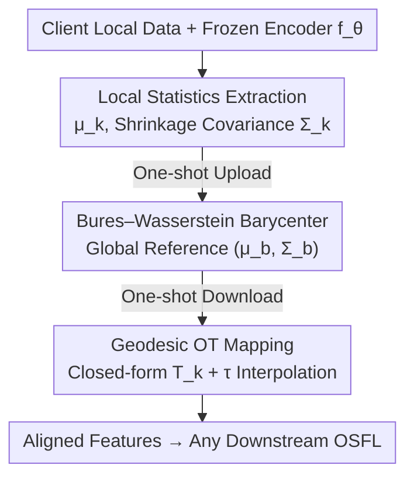

# Distribution Alignment for One-Shot Federated Learning via Optimal Transport

**Conference**: ICML2026  
**arXiv**: [2606.16655](https://arxiv.org/abs/2606.16655)  
**Code**: https://github.com/daniebera/SLOT-Align  
**Area**: Federated Learning / Optimal Transport / Distribution Alignment  
**Keywords**: One-Shot Federated Learning, Distribution Alignment, Domain Shift, Label Shift, Optimal Transport

## TL;DR
This paper proposes SLOT-Align, a training-free, single-round federated feature alignment framework. Each client computes the first and second-order statistics of features using a shared frozen encoder. The server aggregates these into a global reference via a Bures–Wasserstein barycenter. Clients then align local features to this reference using closed-form Optimal Transport (OT) mappings between Gaussians. This approach consistently improves accuracy in extreme one-shot federated scenarios where domain shift is coupled with label shift.

## Background & Motivation

**Background**: Federated Learning (FL) enables multiple clients to collaborate on training without sharing raw data. One-Shot Federated Learning (OSFL) emerges when the communication budget is extremely tight, allowing each client to communicate with the server only once. Current mainstream OSFL methods utilize shared frozen pre-trained encoders, where clients transmit lightweight feature statistics or parametric summaries (e.g., FedCGS, FedPFT), significantly saving communication costs.

**Limitations of Prior Work**: In reality, heterogeneity occurs along multiple axes—client $k$ has different input marginal distributions $\mathbb{P}_k(x)$ (domain shift) and different label marginals $\mathbb{P}_k(y)$ (label shift). Together, these induce client-specific posteriors $\mathbb{P}_k(y\mid x)$, causing learned feature representations to be misaligned across clients. While multi-round FL can correct this iteratively, OSFL lacks the feedback loop, meaning **this misalignment cannot be corrected during learning**.

**Key Challenge**: Existing OSFL methods (distillation, server-side generation, ensemble aggregation, or statistical aggregation) either assume that client feature representations are **already aligned** or treat domain shift and label shift **separately**. The true difficulty lies in their interaction: label shift causes class imbalances, which distort empirical feature moments (mean, covariance) contributed by each client in a non-uniform way. Statistical aggregation methods that assume "client feature summaries are directly comparable" fail in this scenario.

**Goal**: To formalize OSFL as a **distribution alignment problem** under heterogeneous client distributions $\mathbb{P}_k(x,y)$. The goal is to design a preprocessing step that explicitly corrects first and second-order structural misalignments under single-round, training-free constraints, without modifying the optimization of downstream OSFL algorithms.

**Key Insight**: Since all clients share the same frozen encoder, local inputs are mapped into the same latent metric space $\mathbb{R}^m$. Differences between clients can be viewed as "mass displacements" within this space. Alignment is equivalent to transporting each client's feature distribution toward a common reference. Optimal Transport (OT) is a geometry-aware tool for distribution alignment, and the $W_2$ geometry under Gaussian measures provides closed-form transport maps and geodesics.

**Core Idea**: Use Gaussian proxies + Bures–Wasserstein barycenters + closed-form OT mappings to transform the "alignment of heterogeneous feature distributions" into a closed-form calculation solvable in a single round using only first and second-order statistics.

## Method

### Overall Architecture

SLOT-Align is a **training-free preprocessing layer** inserted before downstream OSFL. The pipeline consists of three steps and a single round of communication: ① Each client extracts features using a shared frozen encoder $f_\theta$ and estimates the mean $\mu_k$ and (shrinkage-regularized) covariance $\Sigma_k$ of the local feature distribution, obtaining a Gaussian proxy $\mathcal{N}(\mu_k,\Sigma_k)$. ② Clients transmit these compact statistics to the server, which aggregates means via weighted averaging and covariances via the **Bures–Wasserstein barycenter** to obtain a global reference $\mathcal{N}(\mu_b,\Sigma_b)$, which is then sent back to clients (this round-trip is the only interaction allowed in OSFL). ③ Each client constructs a **closed-form affine OT mapping** $T_k$ from its local Gaussian to the reference Gaussian and uses an interpolation parameter $\tau$ to control alignment strength along the $W_2$ geodesic, transporting all local features to the aligned positions. Finally, the aligned features are fed into any downstream OSFL algorithm that relies on frozen encoders. The entire process involves no learning, no data synthesis, and no modification to downstream optimization targets.

### Key Designs

**1. Gaussian Proxy + Covariance Shrinkage: Compressing "Distribution Alignment" into First and Second-Order Moments**

Directly aligning general (non-Gaussian) deep feature distributions is infeasible under single-round, training-free constraints. The key simplification in SLOT-Align is that in the 2-Wasserstein space $(\mathcal{P}_2(\mathbb{R}^m),W_2)$, **Gaussian measures form a totally geodesic submanifold**, where the $W_2$ distance between Gaussians has closed-form OT maps and geodesics. Thus, each client only estimates the mean $\mu_k=\mathbb{E}[f_\theta(x)]$ and sample covariance $\widehat\Sigma_k$, treating $\mathcal{N}(\mu_k,\Sigma_k)$ as a tractable proxy for the true feature distribution $Q_k=(f_\theta)_\#P_k$. It is not required that $Q_k$ is truly Gaussian, only that its first and second-order structures (location and spread) are preserved, as domain shift (changing $\mathbb{P}_k(x)$) and label shift (reweighting class-conditional features) primarily distort these moments. To handle ill-posed sample covariances in high dimensions or with few samples, Ledoit–Wolf shrinkage is applied:

$$\Sigma_k=\lambda_k\widehat\Sigma_k+(1-\lambda_k)\sigma_k^2\,\mathrm{Id},\qquad \sigma_k^2=\tfrac1m\mathrm{tr}(\widehat\Sigma_k)$$

This ensures $\Sigma_k$ lies within the symmetric positive definite cone $\mathcal{S}_{++}^m$, a necessary numerical prerequisite for Bures–Wasserstein geometry.

**2. Bures–Wasserstein Barycenter: Single-Round Geometrically-Aware Aggregation**

When aggregating client Gaussians into a global reference, simple averaging of covariances ignores the geometry of the covariance manifold. SLOT-Align uses the Bures–Wasserstein barycenter: the mean is a weighted average $\mu_b=\sum_k w_k\mu_k$ (where $w_k=n_k/N$ is the sample weight), and the covariance is:

$$\Sigma_b=\arg\min_{\Sigma\in\mathcal{S}_{++}^m}\sum_{k=1}^K w_k\,B^2(\Sigma,\Sigma_k)$$

where the Bures distance $B^2(\Sigma_1,\Sigma_2)=\mathrm{tr}\!\big(\Sigma_1+\Sigma_2-2(\Sigma_1^{1/2}\Sigma_2\Sigma_1^{1/2})^{1/2}\big)$ is exactly the quadratic OT cost between zero-mean Gaussians, inducing a Riemannian geometry on $\mathcal{S}_{++}^m$. $\Sigma_b$ is solved via fixed-point iteration $\Sigma^{(t+1)}=\sum_k w_k\big((\Sigma^{(t)})^{1/2}\Sigma_k(\Sigma^{(t)})^{1/2}\big)^{1/2}$, which reliably converges for shrinkage-regularized covariances. This barycenter provides a "geometric center" that balances individual client variability with global consistency, serving as a common anchor for alignment.

**3. Closed-form Geodesic OT Mapping + $\tau$ Interpolation: Controllable Transport to Reference**

Upon receiving the global reference, each client constructs the optimal transport mapping from $\mathcal{N}(\mu_k,\Sigma_k)$ to $\mathcal{N}(\mu_b,\Sigma_b)$. Under the quadratic cost, the OT map between Gaussians is affine with a closed-form solution:

$$A_k=\Sigma_b^{1/2}\big(\Sigma_b^{1/2}\Sigma_k\Sigma_b^{1/2}\big)^{-1/2}\Sigma_b^{1/2},\quad b_k=\mu_b-A_k\mu_k,\quad T_k(z)=A_kz+b_k$$

This map precisely transports the source Gaussian to the target, correcting misalignments in both mean and covariance. However, because $(\mu_k,\Sigma_k)$ are estimated from finite samples and are only approximations of the non-Gaussian $Q_k$, a full transport might **over-correct**. SLOT-Align introduces an interpolation parameter $\tau\in[0,1]$, defining the displacement interpolation between the identity map and $T_k$: $T_k^{(\tau)}=(1-\tau)\,\mathrm{Id}+\tau\,T_k$. This corresponds to a **constant-speed geodesic** in $W_2$ space from the source to the barycenter (as the Gaussian submanifold is totally geodesic), satisfying an explicit contraction property:

$$W_2(G_k^{(\tau)},G_b)=(1-\tau)\,W_2(G_k,G_b)$$

Thus, $\tau$ directly controls "how much proxy-level discrepancy to remove"—$\tau=0$ denotes no alignment, while $\tau=1$ denotes full transport. A **single** $\tau$ is used for all clients and datasets, maintaining the non-iterative, training-free nature while providing a simple knob for alignment strength.

### Loss & Training

SLOT-Align does not have any trainable parameters or loss functions—it is a purely geometric, learning-free transformation operating in the local feature space. It does not modify the structure, objective, or optimization of downstream OSFL algorithms. The aligned features $z'=T_k^{(\tau)}(z)$ are directly fed into any downstream OSFL algorithm (e.g., O-FedAvg, FedCGS, FedPFT) with negligible computational overhead.

## Key Experimental Results

### Main Results

Evaluations were conducted on three benchmarks: Office-Home, Digits, and DomainNet, using various pre-trained backbones and SOTA OSFL methods. Top-1 accuracy was reported under combined domain and label shifts (Dirichlet $\alpha$ controls label shift intensity). SLOT-Align was used as a preprocessing step for each OSFL method.

| Setup ($\alpha=0.1$) | Office-Home mean | Digits mean | DomainNet mean |
|------|------|------|------|
| O-FedAvg | 64.19 | 64.70 | 37.69 |
| O-FedAvg + SLOT | **72.05 (+7.86)** | **72.61 (+7.91)** | **40.26 (+2.57)** |
| FedCGS | 84.37 | 67.12 | 51.40 |
| FedCGS + SLOT | **85.05 (+0.68)** | **70.11 (+2.99)** | **56.63 (+5.23)** |
| FedPFT | 74.19 | 73.36 | 48.04 |
| FedPFT + SLOT | **80.74 (+6.55)** | **75.50 (+2.14)** | **51.57 (+3.53)** |

Ours (SLOT-Align) consistently improves macro-average accuracy across all backbone × downstream method combinations. The gain is most significant for the simple O-FedAvg (nearly +8 on Office-Home/Digits) and remains substantial for stronger statistical methods like FedCGS/FedPFT on difficult benchmarks like DomainNet (+3 to +5).

### Ablation Study

| Configuration | Key Finding | Description |
|------|---------|------|
| Label Shift Intensity ($\alpha=0.1$ → $0.05$) | More shift, more gain | SLOT is more valuable under severe joint shifts. |
| Diverse Backbones | Consistent Improvement | Robustness across different encoder architectures. |
| Various Downstream OSFL | Plug-and-play | Can be overlaid without changing downstream optimization. |
| Interpolation Intensity $\tau$ | Single Global Value | No need for client-specific tuning, preserving non-iterative nature. |

### Key Findings
- **Alignment Value Increases with Shift**: As the shift becomes more severe ($\alpha=0.1$ to $0.05$), the gains from SLOT-Align become more pronounced—validating the motivation that label shift non-uniformly distorts feature moments and must be explicitly corrected.
- **Weaker Methods Benefit More**: Simple aggregations like O-FedAvg, which assume pre-aligned features, see the largest gains (nearly +8), suggesting that feature misalignment is a performance bottleneck for many OSFL methods.
- **Geometric Awareness is Essential**: Using the Bures–Wasserstein barycenter (respecting the covariance manifold geometry) instead of simple moment averaging is crucial for correctly aggregating a reference in a single round.

## Highlights & Insights
- Framing OSFL failure under heterogeneity as a **distribution alignment problem** and identifying the hidden assumption of statistical methods ("client summaries are comparable") as fundamentally flawed under joint domain+label shift is a valuable contribution.
- Entirely closed-form, training-free, and single-round: Gaussian proxies compress alignment into first and second-order moments, Bures–Wasserstein barycenters aggregate references in closed-form, and OT provide affine mappings with explicit contraction properties ($W_2(G_k^{(\tau)},G_b)=(1-\tau)W_2(G_k,G_b)$). Every step is analytic, involving near-zero computation and fitting the one-shot constraint perfectly.
- Plug-and-play: As a preprocessing layer, it does not touch downstream optimization and can be overlaid on any frozen-encoder OSFL method. This strategy of "geometric alignment in feature space orthogonal to downstream tasks" is transferable to other training-free scenarios like multi-source domain adaptation or feature-level ensembles.

## Limitations & Future Work
- The Gaussian proxy only captures first and second-order moments, whereas deep features are generally non-Gaussian. When client differences reside in higher-order structures (multimodality, heavy tails), moment alignment may be insufficient. Geodesic interpolation $\tau$ mitigates "over-correction" but as a global hyperparameter may not be optimal for every client.
- It relies on a **shared frozen pre-trained encoder** to map all clients to a common latent space. If the client domains deviate too far from the pre-training distribution, the premise of the alignment (discrepancies stem from statistical shifts rather than architectural divergence) may weaken.
- Experiments focus on vision benchmarks and classification tasks; evaluations on other modalities, tasks (detection/segmentation), and the trade-off between $\tau$ and privacy (potential information leakage from covariance matrices) are less discussed.

## Related Work & Insights
- **vs. FedCGS / FedPFT (Statistical OSFL)**: These methods aggregate global feature statistics but assume client summaries are directly comparable without explicit alignment. SLOT-Align acts as an explicit OT alignment step that can be stacked on top of them.
- **vs. Distillation / Generative OSFL (FedKT, FedDEO, FEDCVAE, etc.)**: These require additional server-side optimization, high computational/memory overhead, and may introduce privacy concerns via synthetic data. SLOT-Align operates directly on compact statistics without learning or data synthesis.
- **vs. FedOT / FedDaDiL (OT in FL)**: Existing OT-based FL works are inherently **multi-round/iterative** (learning transport maps or computing Wasserstein barycenters repeatedly). SLOT-Align is, to the authors' knowledge, the first attempt to bring OT principles into a **non-iterative one-shot** setting by exchanging compact statistics in a single round.

## Rating
- Novelty: ⭐⭐⭐⭐ Compressing multi-round OT alignment into a single-round closed-form solution and identifying alignment assumptions in OSFL.
- Experimental Thoroughness: ⭐⭐⭐⭐ Three benchmarks × multiple backbones × multiple downstream methods across two shift intensities, showing consistent positive gains.
- Writing Quality: ⭐⭐⭐⭐ Clear geometric derivations, strong motivation, and analytical solutions for every step.
- Value: ⭐⭐⭐⭐ Training-free, plug-and-play, zero extra communication; highly practical for extreme communication-constrained federated deployments.

<!-- RELATED:START -->

## Related Papers

- [\[CVPR 2026\] HFedATM: Hierarchical Federated Domain Generalization via Optimal Transport and Regularized Mean Aggregation](../../CVPR2026/optimization/hfedatm_hierarchical_federated_domain_generalization_via_optimal_transport_and_r.md)
- [\[ICLR 2026\] Learning from Algorithm Feedback: One-Shot SAT Solver Guidance with GNNs](../../ICLR2026/optimization/learning_from_algorithm_feedback_one-shot_sat_solver_guidance_with_gnns.md)
- [\[ICLR 2026\] HOTA: Hamiltonian Framework for Optimal Transport Advection](../../ICLR2026/optimization/hota_hamiltonian_framework_for_optimal_transport_advection.md)
- [\[ICML 2026\] Rethinking the Flow-Based Gradual Domain Adaptation: A Semi-Dual Optimal Transport Perspective](rethinking_the_flow-based_gradual_domain_adaptation_a_semi-dual_optimal_transpor.md)
- [\[ICLR 2026\] A Scalable Constant-Factor Approximation Algorithm for $W_p$ Optimal Transport](../../ICLR2026/optimization/a_scalable_constant-factor_approximation_algorithm_for_w_p_optimal_transport.md)

<!-- RELATED:END -->
