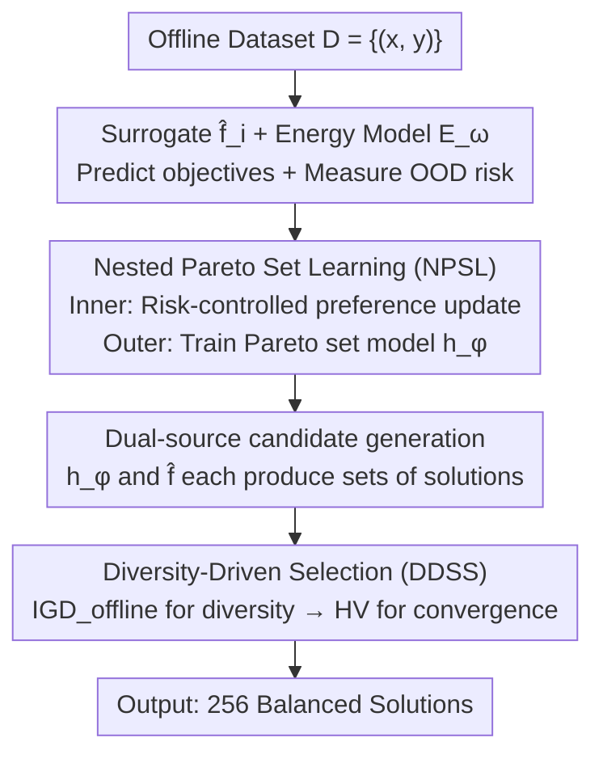

# Diversity-Driven Offline Multi-Objective Optimization via Nested Pareto Set Learning

**Conference**: ICML 2026  
**arXiv**: [2606.15115](https://arxiv.org/abs/2606.15115)  
**Code**: https://github.com/YaolinWen/DOMOO  
**Area**: Optimization / Black-box Optimization  
**Keywords**: Offline Optimization, Multi-Objective Optimization, Pareto Set Learning, Out-of-Distribution Risk, Diversity  

## TL;DR
For offline multi-objective optimization (offline MOO) where "only a fixed offline dataset is available and the true objective function cannot be queried," this paper proposes DOMOO. It utilizes nested Pareto set learning to jointly update preferences and models, embeds an out-of-distribution (OOD) risk suppression factor into the preference gradient, and employs an offline-specific $\text{IGD}_{\text{offline}}$ metric for diversity filtering, thereby obtaining a solution set with better convergence and diversity simultaneously.

## Background & Motivation
**Background**: Multi-objective optimization (MOO) aims to find a set of Pareto optimal solutions among multiple conflicting objectives (e.g., high drug efficacy and low toxicity). Many methods rely on surrogate models to approximate the true objective, but to maintain surrogate accuracy, they typically require **active queries of the true objective function** during training.

**Limitations of Prior Work**: In scenarios like protein engineering and molecular design, evaluating the true objective function is extremely expensive or even dangerous, making online queries impossible—only historical data (offline datasets) can be used. This gives rise to **offline MOO**: recommending a set of solutions representing the best trade-offs based solely on a fixed $\{(\bm{x}_i,\bm{y}_i)\}$ dataset, without further evaluation of true functions.

**Key Challenge**: Offline surrogate models cannot escape the **out-of-distribution (OOD) problem**—predictions for designs far from the training distribution are unreliable. In single-objective optimization, this manifests as overestimating a distant point; in multi-objective optimization, it is worse: if a surrogate **underestimates even a few solutions**, these solutions will erroneously "dominate" many others under Pareto dominance relations. This leads to severe Pareto front imbalance—solutions cluster in high-density regions, and both diversity and convergence collapse. Conservative methods for single-objective optimization (e.g., penalizing predictions for OOD solutions) cannot be directly applied to multi-objective optimization due to the complex Pareto dominance structure. Online MOO methods (Bayesian optimization, evolutionary algorithms) are also crippled by OOD errors once active queries are removed.

**Goal**: Under pure offline constraints without further evaluation, find a set of solutions that are **both diverse and high-quality**, specifically addressing the front imbalance caused by OOD.

**Key Insight**: The authors observe that OOD risk does not act uniformly across the solution space—it varies by objective and is coupled with preference gradients. Therefore, rather than simply bounding scalarization errors, it is better to couple risk directly into "how preferences are updated" and use an evaluation metric that is not misled by the "pseudo-broad fronts" of OOD.

**Core Idea**: Use "Nested Pareto Set Learning + Accumulative Risk Control" to embed risk suppression into preference updates, followed by a diversity-prioritized solution selection using an offline-exclusive $\text{IGD}_{\text{offline}}$ metric.

## Method

### Overall Architecture
The input to DOMOO is an offline dataset $\mathcal{D}=\{(\bm{x}_i,\bm{y}_i)\}_{i=1}^N$ (solutions and their true objective values), and the output is 256 final solutions balancing convergence and diversity. It follows a three-step process: first, train a surrogate model $\hat{f}_i$ for each objective and an energy-based model $E_{\bm{\omega}}$ for risk measurement; then, perform **Nested Pareto Set Learning (NPSL)** guided by the surrogates—the inner loop updates preference vectors with risk control, and the outer loop trains the Pareto set model $h_{\bm{\phi}}$ using the updated preferences; finally, generate candidate solutions using both the Pareto set model and surrogates, and output the final solution set via a **Diversity-Driven Selection Strategy** (using $\text{IGD}_{\text{offline}}$ for diversity followed by HV for convergence).

### Key Designs

**1. Accumulative Risk Control (ARC): Embedding OOD risk factors into preference gradients**

This step addresses the root cause of "surrogate underestimation → false dominance → front collapse." The authors adopt the energy-based model $E_{\bm{\omega}}$ from ARCOO: trained using contrastive divergence and Langevin dynamics negative sampling, it assigns an energy score to each solution $\bm{x}$, and calculates a risk suppression factor:

$$R(\bm{x})=\frac{c\,(E_{\tilde{Q}}-E_{\bm{\omega}}(\bm{x}))}{E_{\tilde{Q}}-E_{\tilde{P}}}$$

where $\tilde{P}$ is the empirical distribution of high-quality solutions in the offline data, $\tilde{Q}$ is the high-risk distribution sampled from $\tilde{P}$ via Langevin dynamics, and $c$ is the initial momentum. The key innovation is: while the single-objective ARCOO only penalizes predictions of OOD solutions, the authors multiply $R(\bm{x})$ directly into the **preference gradient update** (see Eq.2 below). In this way, optimization steps toward unreliable OOD regions are automatically attenuated, while gradient flows toward reliable trade-off regions with data support are preserved—solving the difficulty of risk varying by objective and coupling with preference gradients in MOO.

**2. Nested Pareto Set Learning (NPSL): Inner preference updates and outer model training**

To address the problem where OOD misleads the Pareto set model into pursuing false high-scoring solutions and creating pseudo-diversity, the authors modify PSL into an inner-outer nested structure. Pareto set learning itself learns a mapping $h_{\bm{\phi}}(\bm{\lambda})$ from preference $\bm{\lambda}$ to Pareto solutions using augmented Tchebycheff scalarization. NPSL involves three stages: **Pre-training** initializes with the offline Pareto front (sampling preferences $\bm{\lambda}_{\text{off}}^{(i)} \propto (1/(y^{(i)}_{\text{off},1}-z^*_1),\dots)$ to align the model with the optimal solution distribution); **Exploration** samples preferences uniformly on the simplex from $\text{Dirichlet}(\bm{1}_M)$ to prevent overfitting; **Preference gradient update** adjusts preferences with risk control:

$$\bm{\lambda}_{t}^{(b)}=\bm{\lambda}_{t-1}^{(b)}-\eta_{\text{pref}}\,R\!\left(h_{\bm{\phi}}(\bm{\lambda}_{t-1}^{(b)})\right)\cdot\nabla_{\bm{\lambda}}\hat{g}_{\text{tch\_aug}}(h_{\bm{\phi}}(\bm{\lambda})\mid\bm{\lambda})\Big|_{\bm{\lambda}_{t-1}^{(b)}}$$

The ingenuity lies in calculating the gradient on the solutions $\bm{x}=h_{\bm{\phi}}(\bm{\lambda})$ generated by the current model. Consequently, **preferences leading to poor solutions produce larger gradients and are updated more**, implicitly pushing exploration toward "under-represented" regions of the front. The outer loop then trains $h_{\bm{\phi}}$ using the updated preferences to improve quality: $\bm{\phi}=\bm{\phi}-\frac{\eta_{\text{psl}}}{B}\sum_b\nabla_{\bm{\phi}}\hat{g}_{\text{tch\_aug}}(\cdot)$. The alternation between inner and outer loops considers both diversity and convergence.

**3. $\text{IGD}_{\text{offline}}$ Metric + Diversity-Driven Selection (DDSS): Diversity first, convergence second**

Traditional IGD requires the true Pareto front, which is unavailable in offline scenarios; HV has a fatal flaw offline—surrogates often extrapolate a "pseudo-front" wider than the true front in OOD regions. HV's marginal volume mechanism then picks solutions uniformly along this false front, resulting in clustered, low-quality samples. The authors design an offline-specific metric:

$$\text{IGD}_{\text{offline}}=\frac{1}{n}\sum_{i=1}^{n}\min_{j}\left\|\bm{y}_{\text{off}}^{(i)}-\beta y'\bm{1}_M-\hat{\bm{y}}_{\text{cand}}^{(j)}\right\|_2$$

It substitutes the true front with the "offline front + a translation $y'$ toward the ideal point" ($y'=\max_i\min_m y^{(i)}_{\text{off},m}$, with min-max normalization for scale-invariance). This translation pushes the reference front toward the ideal point, encouraging exploration and broad coverage rather than rewarding solutions that conservatively cling to offline data. The final DDSS is two-stage: first, greedily select up to 128 solutions via $\text{IGD}_{\text{offline}}$ (to ensure diversity and cover different front regions), then fill the remaining slots with HV (to ensure convergence and maximize objective space volume) to reach 256 solutions. The 128 budget is a stable peak identified via hyperparameter analysis from 0 to 256.

### Loss & Training
Surrogate models perform regression for each objective on offline data. The energy-based model is trained using contrastive divergence following ARCOO. Scalarization uses augmented Tchebycheff: $\hat{g}_{\text{tch\_aug}}(\bm{x}\mid\bm{\lambda})=\max_i\{\lambda_i(\hat{f}_i(\bm{x})-(z^*_i-\varepsilon))\}+\rho\sum_i\lambda_i\hat{f}_i(\bm{x})$, where $z^*_i=\min_{\bm{x}\in\mathcal{D}}f_i(\bm{x})$ is the ideal vector, and $\varepsilon,\rho$ are small positive scalars. Preferences and the model are optimized alternately with learning rates $\eta_{\text{pref}}$ and $\eta_{\text{psl}}$.

## Key Experimental Results

### Main Results (Average rank across 5 task categories in Off-MOO-Bench, lower is better)
DOMOO achieves the first rank in both HV and $\text{IGD}_{\text{offline}}$ overall average rankings.

| Metric | DOMOO | Next Best Representative | Description |
|------|-------|----------|------|
| HV Avg Rank | **4.63 ± 0.38** | Multiple Models 6.67 / End-to-End 6.81 | 1st in convergence ranking |
| $\text{IGD}_{\text{offline}}$ Avg Rank | **6.27 ± 0.23** | Multiple Models+IOM 6.63 / End-to-End 7.12 | 1st in diversity ranking |
| HV·Synthetic | **3.89 ± 0.56** | Multiple Models 6.24 | Significant lead in synthetic functions |
| HV·RE | **3.26 ± 0.53** | Multiple Models 6.37 | Best in real engineering tasks |

### Ablation Study (Table 3, metrics after removing modules)

| Configuration | HV·Regex | $\text{IGD}_{\text{offline}}$·MO-Hopper | Description |
|------|----------|------------------|------|
| Full (DOMOO) | **6.52 ± 0.11** | Best | Full Model |
| w/o ARC | 5.72 ± 0.27 | Worse | Remove Accumulative Risk Control |
| w/o NPSL | 4.98 ± 0.33 | Worse | Remove Nested Pareto Set Learning |
| w/o DDSS | 5.25 ± 0.35 | Worse | Remove Diversity-Driven Selection |
| w/o SMG | 6.11 ± 0.33 | — | Remove solution model gradient term |

### Key Findings
- **All three modules contribute**: Removing any of ARC, NPSL, or DDSS leads to a decline in HV or $\text{IGD}_{\text{offline}}$. Risk control handles "avoiding OOD false solutions," nested learning handles "covering under-represented regions," and diversity selection handles "avoiding being misled by pseudo-broad fronts."
- **HV is deceptive offline**: The authors explicitly point out that HV selects solutions uniformly along the pseudo-front extrapolated by surrogates, picking clustered low-quality solutions, which is the direct motivation for introducing $\text{IGD}_{\text{offline}}$.
- **Nested updates offer implicit exploration**: Preferences of poor solutions generate larger gradients and are updated more, automatically pushing sampling toward sparse regions of the front. Visualizations show significantly more uniform solution distributions after preference updates.

## Highlights & Insights
- **Coupling OOD risk into preference dynamics** rather than simply adding bounds to scalarization error—this is a non-trivial step in migrating from single-objective ARCOO to MOO, capturing the essence that risk varies by objective and is coupled with preference gradients.
- **The "shifted reference front" of $\text{IGD}_{\text{offline}}$ is ingenious**: Transforming the offline front into a stricter reference using a shift toward the ideal point constructs an evaluation that requires no true front and avoids rewarding solutions that conservatively stick to the data. It is transferable to any offline evaluation scenario lacking a true front.
- **Two-stage "Diversity First, Convergence Second" selection**: Using two complementary metrics for specialized tasks ($\text{IGD}_{\text{offline}}$ for coverage, HV for quality), with the split point fixed at 128 through hyperparameter scanning, making it clean and reproducible.

## Limitations & Future Work
- **Dependency on energy models for risk estimation**: The reliability of $R(\bm{x})$ depends on how well the energy model is trained; energy models themselves may fail in extreme OOD regions, a failure mode not explored in depth.
- **Scalability with objective dimension $M$**: Experiments focused on 2–3 objectives common in Off-MOO-Bench. Whether Pareto dominance sparsity, preference simplex sampling, and $\text{IGD}_{\text{offline}}$ computation remain manageable for many-objective optimization (large $M$) is not fully verified.
- **Training cost of nested bi-level optimization**: Alternating inner/outer loops plus Langevin sampling for the energy model is heavier than single-layer PSL. The paper lacks runtime/resource comparisons with baselines (some baselines are marked N/A due to runtime/memory limits).
- **Future Directions**: Adaptive adjustment of risk momentum $c$ and shift amount $\beta$; extending the method to mixed/discrete design spaces; exploring lighter risk estimation alternatives to energy models.

## Related Work & Insights
- **vs. Single-objective Offline Optimization (COMs / IOMs / Tri-Mentoring)**: These rely on surrogate conservatism to penalize OOD overestimation but show poor diversity when naively extended to MOO. DOMOO embeds risk control into preference updates and explicitly optimizes diversity.
- **vs. Online MOO (MOBO / Evolutionary Algorithms)**: Online methods rely on active queries to remain immune to OOD, while they are crippled by OOD errors in offline settings (multiple N/A in tables). DOMOO uses surrogates and risk control without any queries.
- **vs. PSL Methods (PSL-MOBO / EPS / CDM-PSL)**: These mostly rely on Gaussian Process surrogates designed for online settings and suffer severe OOD offline. DOMOO’s Nested PSL + Risk Control is specifically restructured for offline scenarios, supplemented by an offline-specific diversity metric.

## Rating
- Novelty: ⭐⭐⭐⭐⭐ "Risk coupling into preference gradients + offline-exclusive IGD" is a substantial new solution for offline MOO.
- Experimental Thoroughness: ⭐⭐⭐⭐ Comprehensive metrics and ablation on 5 Off-MOO-Bench task categories; lacks runtime and high-dimensional comparisons.
- Writing Quality: ⭐⭐⭐⭐ Clear logic from motivation to mechanism; some formulas are dense.
- Value: ⭐⭐⭐⭐⭐ Offline MOO (protein/molecule design) has significant real-world impact; method is reusable.

<!-- RELATED:START -->

## Related Papers

- [\[ICLR 2026\] Gradient-Based Diversity Optimization with Differentiable Top-$k$ Objective](../../ICLR2026/optimization/gradient-based_diversity_optimization_with_differentiable_top-k_objective.md)
- [\[ICML 2026\] Accelerated Multiple Wasserstein Gradient Flows for Multi-objective Distributional Optimization](accelerated_multiple_wasserstein_gradient_flows_for_multi-objective_distribution.md)
- [\[ICLR 2026\] In-Context Multi-Objective Optimization](../../ICLR2026/optimization/in-context_multi-objective_optimization.md)
- [\[ICML 2026\] Multi-Objective Bayesian Optimization via Adaptive ε-Constraints Decomposition](multi-objective_bayesian_optimization_via_adaptive_varepsilon-constraints_decomp.md)
- [\[AAAI 2026\] Pareto-Grid-Guided Large Language Models for Fast and High-Quality Heuristics Design in Multi-Objective Combinatorial Optimization](../../AAAI2026/optimization/pareto-grid-guided_large_language_models_for_fast_and_high-quality_heuristics_de.md)

<!-- RELATED:END -->
