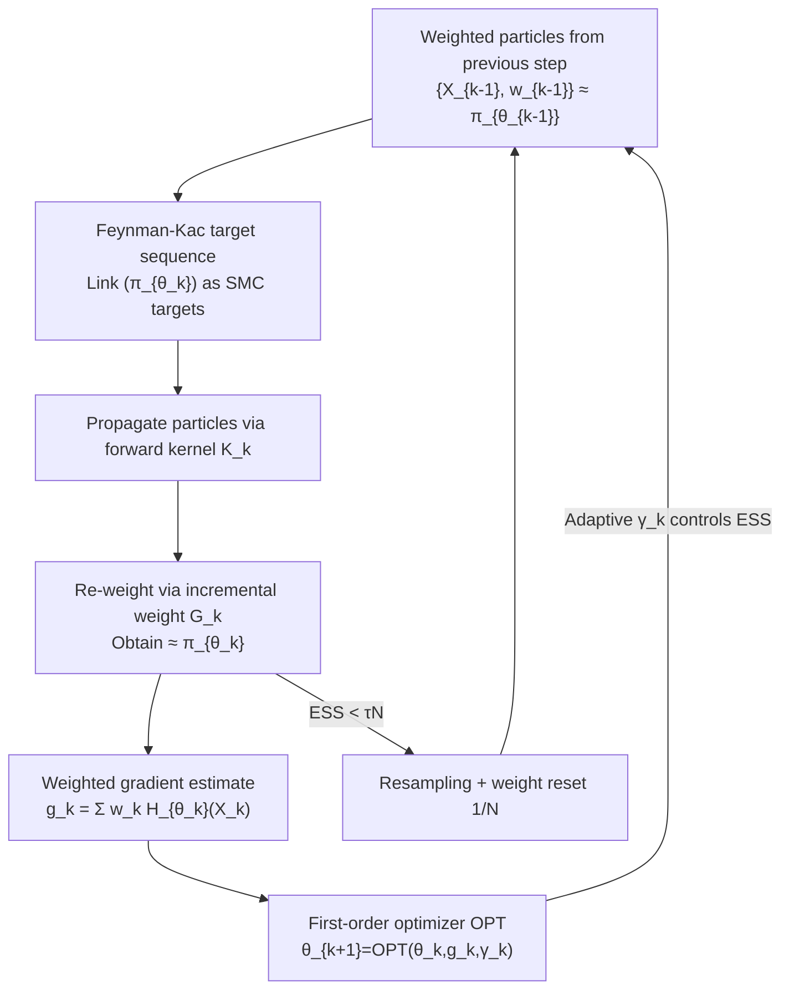

# Efficient Stochastic Optimisation via Sequential Monte Carlo

**Conference**: ICML2026  
**arXiv**: [2601.22003](https://arxiv.org/abs/2601.22003)  
**Code**: https://github.com/akyildiz-group/SOSMC  
**Area**: Optimization / Monte Carlo Sampling  
**Keywords**: Sequential Monte Carlo, Intractable Gradients, Stochastic Optimization, Energy-Based Models, Reward Tuning

## TL;DR
When the gradient of the loss is formulated as an expectation over an intractable parameter-dependent distribution $\pi_\theta$, conventional approaches require an expensive MCMC inner loop for each optimization step. This paper proposes SOSMC, which utilizes a Sequential Monte Carlo (SMC) sampler to link the sequence of distributions $(\pi_{\theta_k})_k$ that evolve slowly with the parameters. By **reusing particles from the previous step** and obtaining weighted gradient estimates, the method eliminates the inner loop, reducing computational cost while providing convergence guarantees. It outperforms single/double-loop baselines in tasks such as EBM reward tuning and image deblurring.

## Background & Motivation

**Background**: A wide range of problems in machine learning involve gradients of the form: $\nabla_\theta\ell(\theta)=\mathbb{E}_{X\sim\pi_\theta}[H_\theta(X)]$, where the gradient is an expectation over a parameter-dependent distribution $\pi_\theta(x)=e^{-U_\theta(x)}/Z_\theta$, and the normalization constant $Z_\theta$ is intractable. This formulation covers tasks such as Maximum Marginal Likelihood Estimation (MMLE), Energy-Based Model (EBM) training, and reward tuning/alignment of generative models.

**Limitations of Prior Work**: Since $\pi_\theta$ depends on the current parameter $\theta$ and cannot be sampled directly, estimating this gradient typically requires running an MCMC inner loop (e.g., Langevin or contrastive divergence). Restarting the inner sampling for every outer optimization step is **computationally expensive and slow to converge**. While methods like Persistent Contrastive Divergence (PCD) save cost by using persistent particles, they maintain **unweighted particles**, leading to biased gradient estimates when the particle distribution lags behind a rapidly changing $\pi_{\theta_k}$.

**Key Challenge**: The deadlock between inner-loop sampling cost and gradient estimation quality—saving cost by reusing old particles leads to lag and bias, while accuracy requires expensive re-sampling at every step. The root cause is that existing methods treat each $\pi_{\theta_k}$ as an **independent** sampling target, failing to exploit the structure where $\theta$ evolves slowly and continuously, making adjacent distributions $\pi_{\theta_{k-1}}$ and $\pi_{\theta_k}$ nearly identical.

**Goal**: To treat the entire sequence of slowly evolving target distributions as the target sequence for an SMC sampler, allowing particles to be **carried over with weights and re-weighted** at each step rather than sampling from scratch.

**Core Idea**: Utilizing the Feynman-Kac framework of SMC samplers (Del Moral et al. 2006), the sequence $(\pi_{\theta_k})$ induced by optimization iterations $(\theta_k)$ is treated as the target sequence for SMC. By performing only **one** SMC update per step (propagation + re-weighting + resampling as needed), weighted particles are obtained to construct a gradient estimate $g_k$ for any first-order optimizer. Existing methods like JALA-EM and Carbone et al. become special cases of this framework.

## Method

### Overall Architecture
SOSMC (Stochastic Optimisation via SMC) integrates "optimization" and "sampling" into a single loop. The outer layer is an arbitrary first-order optimizer $\theta_{k+1}=\textsf{OPT}(\theta_k,g_k,\gamma_k)$, while the inner layer replaces independent multi-step MCMC sampling with **a single SMC update**. The core observation is that the optimization trajectory $(\theta_k)$ automatically defines a sequence of target distributions $(\pi_{\theta_k})$. Since adjacent distributions are highly similar due to small steps in $\theta$, particles can be sequentially transported from $\pi_{\theta_{k-1}}$ to $\pi_{\theta_k}$ similar to standard SMC along an "annealing path": propagating particles with a forward kernel $\mathsf{K}_k$, re-weighting via Feynman-Kac incremental weights $G_k$, and resampling only when the ESS is too low. The re-weighted particles provide the gradient estimate $g_k=\sum_i w_k^{(i)}H_{\theta_k}(X_k^{(i)})$, which is fed back into the optimizer. Performing only one sampling round per outer iteration is the source of its efficiency compared to double-loop methods.

### Key Designs

**1. Feynman-Kac flows linking distribution sequences into sequential sampling targets**

This bridge translates "optimization" into "SMC." The authors define a sequence of unnormalized distributions $\Pi_{\theta_{0:k}}(x_{0:k})=\Pi_{\theta_k}(x_k)\prod_{n=1}^k\mathsf{L}_{n-1}(x_n,x_{n-1})$ on the product space $E^{k+1}$, where $\mathsf{L}$ is a backward kernel and $\Pi_\theta=e^{-U_\theta}$ is the unnormalized density. It is provable that the $x_k$-marginal is exactly $\pi_{\theta_k}$. Combined with a proposal distribution formed by forward kernels $\mathsf{K}_n$, the importance weights satisfy the recursion $W_k=W_{k-1}\,G_k(x_{k-1},x_k)$, with incremental weights:

$$G_k(x_{k-1},x_k)=\frac{\Pi_{\theta_k}(x_k)\mathsf{L}_{k-1}(x_k,x_{n-1})}{\Pi_{\theta_{k-1}}(x_{k-1})\mathsf{K}_k(x_{k-1},x_k)}.$$

Using the Feynman-Kac formula (Theorem 1) and setting the test function $\varphi=H_{\theta_k}$, the intractable gradient $\nabla_\theta\ell(\theta_k)=\pi_{\theta_k}(H_{\theta_k})$ is expressed as a quantity estimable by weighted particles. Crucially, $G_k$ only involves $\Pi_{\theta_{k-1}}$ and $\Pi_{\theta_k}$ from adjacent steps, and the normalization constant $Z_\theta$ cancels out in the ratio. This mathematically justifies "reusing old particles" while bypassing $Z_\theta$.

**2. SOSMC single-loop algorithm: One SMC update per step yields the gradient**

Implemented in Algorithm 1, the method maintains $N$ weighted particles $\{(X_k^{(i)},w_k^{(i)})\}$. In each outer iteration $k$, it performs one round: propagating $\bar X_k^{(i)}\sim\mathsf{K}_k(X_{k-1}^{(i)},\cdot)$, updating weights $W_k^{(i)}=W_{k-1}^{(i)}G_k(\cdots)$, and normalizing them to form the gradient estimate $g_k=\sum_i w_k^{(i)}H_{\theta_k}(\bar X_k^{(i)})$, which is passed to $\textsf{OPT}$. Unlike double-loop MCMC where each $\theta_k$ requires many internal steps, **one propagation and one weighting** suffice here because adjacent targets overlap significantly. Compared to unweighted persistent particles in PCD, SOSMC uses **weighted** particles where the weights explicitly compensate for the lag between the particle distribution and the current $\pi_{\theta_k}$, leading to an asymptotically unbiased direction.

**3. Flexible choice of forward/backward kernels: Unifying existing algorithms**

The framework does not lock the choice of kernels, making it a "meta-method." When the forward kernel is Unadjusted Langevin (ULA) with step size $h$, $\mathsf{K}_k=\mathcal{N}(x_k;x_{k-1}-h\nabla U_{\theta_{k-1}},2hI)$, and the backward kernel is the corresponding reverse Langevin (Remark 1): if $\ell$ is the negative marginal log-likelihood of a latent variable model, it recovers JALA-EM (Cuin et al. 2025); if $\ell$ is the negative log-likelihood of an EBM, it recovers the SMC sampler of Carbone et al. (2023). Alternatively, the forward kernel can be a $\pi_{\theta_k}$-invariant MALA with Metropolis correction, and the backward kernel its time reversal to simplify weights (Remark 2). This flexibility is practical: variants with Metropolis-corrected kernels show robustness on multi-modal targets where single-chain SOUL might get trapped.

**4. ESS adaptive step size: Controlling $\chi^2$ divergence to prevent weight decay**

A common issue in SMC is weight decay. The authors theoretically link the Effective Sample Size $\text{ESS}_k=1/\sum_i (w_k^{(i)})^2$ and the chi-squared divergence of adjacent targets: $\rho_k(\gamma)=N/(1+\chi^2(\pi_{\theta_k}\|\pi_{\theta_{k-1}}))$. For Gaussian $\pi_\theta=\mathcal{N}(\theta,\Sigma)$, they derive:

$$\rho_k(\gamma)=N\exp\!\big(-\gamma^2\|\nabla\ell(\theta_{k-1})\|_{\Sigma^{-1}}^2\big),$$

indicating that **larger step sizes $\gamma$ or larger gradient norms cause exponential drops in ESS** (as the distribution jumps too far for old particles to adapt). Proposition 2 generalizes this intuition. Consequently, a simple multiplicative rule (Remark 4) is used to adapt the step size: increasing $\gamma_k$ when ESS is above a threshold and decreasing it otherwise, serving as a scale-free mechanism to maintain stable discrepancy.

### Loss & Training
The method is not tied to a specific loss—it applies whenever the gradient is $\mathbb{E}_{\pi_\theta}[H_\theta]$. For the idealized (exact expectation) case, Lemma 1 proves Feynman-Kac weights recover the true gradient. Proposition 1 provides a linear convergence result under $\mu$-PŁ and $L$-smooth assumptions with $\gamma\le 1/L$: $\ell(\theta_k)-\inf\ell\le(1-\gamma\mu)^k(\ell(\theta_0)-\inf\ell)$. Strict bounds for bias/MSE under finite particles are left for future work.

## Key Experimental Results

### Main Results
Experiments focus on "intractable gradient optimization," comparing the single-loop Implicit Diffusion (ImpDiff), double-loop SOUL, and various SOSMC kernel variants. In a controlled Langevin reward tuning setting:

| Setting | Compared Methods | Convergence Speed | Key Observation |
|------|----------|----------|----------|
| $V_{\text{dual}}$ & $R_{\text{smooth}}$ | ImpDiff / SOUL / SOSMC | SOSMC and SOUL significantly faster than ImpDiff | SOUL has high run-to-run variance |
| $V_{\text{tight}}$ & $R_{\text{tight}}$ | Same | SOSMC (including MALA variants) is robust | SOUL fails due to single chain getting trapped in modes |

Under fixed wall-clock budgets, SOSMC variants converge faster than ImpDiff. Variants with Metropolis-corrected kernels are particularly robust for multi-modal rewards.

### Ablation Study
The authors verify generality across multiple tasks:

| Task | Baseline | SOSMC Variant | Main Conclusion |
|------|----------|------------|----------|
| 2D EBM reward tuning | ImpDiff | SOSMC-ULA | Better target contours at small $\beta_{\text{KL}}$; weighted particle rewards closely track $\mathbb{E}_{\pi_\theta}[R]$. |
| MNIST ConvEBM reward tuning | ImpDiff | SOSMC-ULA | Improved $\widehat R_{\text{fresh}}$ in high dimensions; no reward hacking. |
| MMLE Image Deblurring | MYPGD | SOSMC-MYULA | Better MSE and SSIM; sharper reconstructions. |

### Key Findings
- **Weighted vs Unweighted is the watershed**: ImpDiff uses the mean of **unweighted** particles after a single Langevin step. When $\theta$ changes rapidly, particles lag, causing $\widehat R_{\text{particle}}$ to deviate from the true $\mathbb{E}_{\pi_\theta}[R]$. SOSMC's **weighted** particles track the true value closely, allowing for significantly shorter evaluation chains.
- **Multimodal targets expose single-chain flaws**: SOUL fails in specific settings ($V_{\text{tight}}$) because its single trajectory cannot jump between modes. SOSMC maintains robustness using a particle population and optional Metropolis correction.
- **ESS theory provides practical guidance**: Equation (19) predicts that large step sizes/gradients cause exponential ESS collapse. The experimental adaptive step size based on this theory maintains stable sampling quality.

## Highlights & Insights
- **Reinterpreting "Optimization Trajectory" as "SMC Annealing Path"**: While standard SMC requires hand-designed intermediate distributions, optimization iterations naturally produce a sequence of slowly evolving, overlapping targets, removing the need for artificial annealing paths.
- **$Z_\theta$ cancellation in incremental weights**: The intractable normalization constant is conveniently canceled out by the ratio of adjacent steps. This is the technical pivot allowing the method to bypass intractability in any scenario where the gradient is an expectation over an unnormalized distribution.
- **Weighted particles as insurance for persistent particles**: Compared to the unweighted persistent particles in PCD/ImpDiff, maintaining importance weights explicitly corrects the bias caused by particle lag at almost no extra cost, enabling shorter evaluation chains.
- **The bridge between ESS and $\chi^2$ divergence**: Linking sampler health (ESS) to optimization step size and gradient norm provides a principled answer to how large a learning rate can be without degrading sampling quality.

## Limitations & Future Work
- **Lack of finite-particle theory**: Linear convergence is only proven for the idealized case. Bias ($\mathcal{O}(1/N)$) and MSE bounds for finite $N$, where the target sequence depends on historical particles, require mean-field or interacting particle tools and are specifically left for future work.
- **Small-scale experiments**: Experiments were conducted on personal hardware/Colab T4, focusing on 2D synthesis, MNIST, and single-image deblurring. The efficiency benefits on large-scale models (Diffusion/LLM) remain unverified.
- **Kernel selection left to the user**: While flexible, the choice of kernels and hyperparameters like $\tau$ and $c$ must be hand-tuned. The paper provides examples but lacks a systematic guide for new problems.

## Related Work & Insights
- **vs Double-loop MCMC (SOUL / Atchadé / De Bortoli)**: These restart MCMC sampling for every outer step, which is expensive and prone to mode-trapping. SOSMC uses a single loop, reuses weighted particles, and is more efficient and robust.
- **vs Implicit Diffusion (ImpDiff, Marion 2025)**: Both use single-loop updates, but ImpDiff's unweighted particles lead to bias during fast $\theta$ changes. SOSMC's weights compensate for this lag.
- **vs PCD / Carbone (2023) / JALA-EM (Cuin 2025)**: These are either unweighted (PCD) or specific instances of SMC optimization. SOSMC serves as a "meta-framework" that unifies and generalizes these approaches under a single theory.

## Rating
- Novelty: ⭐⭐⭐⭐ (Clever perspective shift; unifies multiple existing lines of work)
- Experimental Thoroughness: ⭐⭐⭐ (Covers diverse tasks but remains small-scale and qualitative)
- Writing Quality: ⭐⭐⭐⭐ (Clear derivation; logically structured)
- Value: ⭐⭐⭐⭐ (Provides an efficient, theoretically grounded framework for intractable gradients)

<!-- RELATED:START -->

## Related Papers

- [\[ICLR 2026\] From Sequential to Parallel: Reformulating Dynamic Programming as GPU Kernels for Large-Scale Stochastic Combinatorial Optimization](../../ICLR2026/optimization/from_sequential_to_parallel_reformulating_dynamic_programming_as_gpu_kernels_for.md)
- [\[ICLR 2026\] Contextual Causal Bayesian Optimisation](../../ICLR2026/optimization/contextual_causal_bayesian_optimisation.md)
- [\[ICCV 2025\] Memory-Efficient 4-bit Preconditioned Stochastic Optimization](../../ICCV2025/optimization/memory-efficient_4-bit_preconditioned_stochastic_optimization.md)
- [\[ICLR 2026\] Towards Better Branching Policies: Leveraging the Sequential Nature of Branch-and-Bound Tree](../../ICLR2026/optimization/towards_better_branching_policies_leveraging_the_sequential_nature_of_branch-and.md)
- [\[NeurIPS 2025\] Sharper Convergence Rates for Nonconvex Optimisation via Reduction Mappings](../../NeurIPS2025/optimization/sharper_convergence_rates_for_nonconvex_optimisation_via_reduction_mappings.md)

<!-- RELATED:END -->
