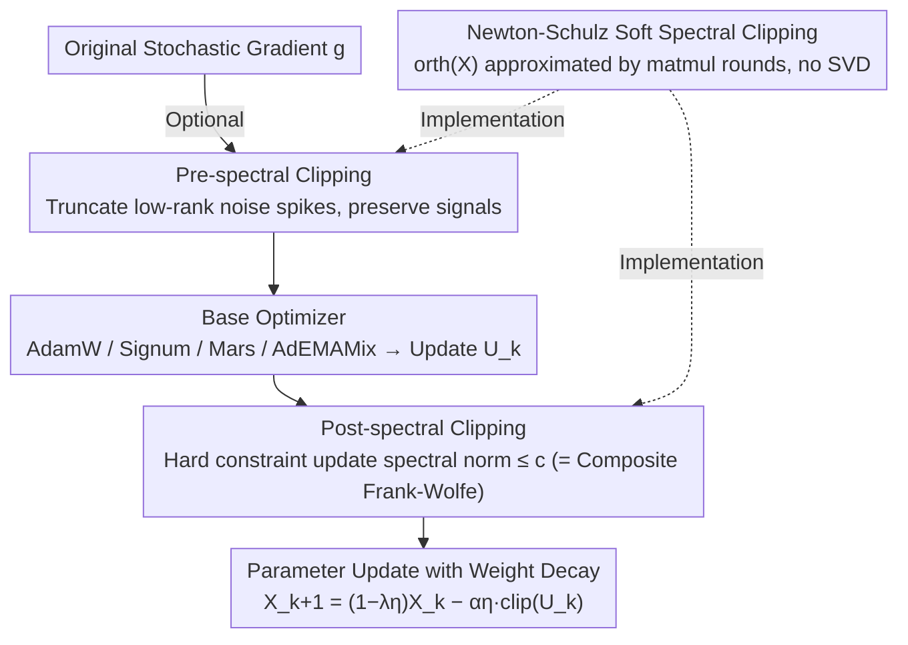

# Enhancing LLM Training via Spectral Clipping

**Conference**: ICML 2026  
**arXiv**: [2603.14315](https://arxiv.org/abs/2603.14315)  
**Code**: https://github.com/mlolab/llm-spectral-clipping (Available)  
**Area**: LLM Efficiency / Optimizers / Spectral Methods  
**Keywords**: Spectral Clipping, Frank-Wolfe, Newton-Schulz, LLM Pre-training, AdamW

## TL;DR
This paper proposes SPECTRA: an optimizer-agnostic wrapper that applies **post-spectral clipping** to the update matrix and optional **pre-spectral clipping** to the original gradients. Theoretically equivalent to the composite Frank-Wolfe algorithm with weight regularization, it consistently reduces validation loss for AdamW / Signum / Mars / AdEMAMix in 124M–1.5B LLM pre-training.

## Background & Motivation

**Background**: Optimizers for LLM pre-training are divided into two categories. The first consists of coordinate-wise methods (AdamW, Signum, AdEMAMix, Mars), which perform independent adaptive scaling for each parameter. The second consists of spectral methods (Shampoo, Muon), which directly manipulate the singular values of the update matrix. Recent benchmarks show that coordinate-wise methods often match or exceed pure spectral methods, yet they **completely ignore the global spectral structure of weights and gradients**.

**Limitations of Prior Work**: Ignoring spectral structure leads to two specific issues. First, the spectral norm of the update matrix $\mathbf{U}_k$ becomes uncontrolled—for Signum, $\|\operatorname{sign}(\mathbf{M}_k)\|_2$ is at least $\sqrt{\max(m,n)}$, and for AdamW, it often explodes in early training or before loss spikes. Following the iterative relation $\|\mathbf{X}_k\|_2 \le (1-\lambda\eta)^k\|\mathbf{X}_0\|_2 + \frac{1-(1-\lambda\eta)^k}{\lambda}\max_i\|\mathbf{U}_i\|_2$, a large update spectral norm inflates the weight spectral norm, destroying training stability and generalization. Second, the singular value spectrum of the original stochastic gradient exhibits **heavy tails**, where a few singular values are orders of magnitude larger than the signal, termed "sparse spectral spikes." Coordinate-wise or global clipping either fails to suppress these spikes or suppresses the signal along with them.

**Key Challenge**: Existing clipping granularities are either too coarse (global) or too fine (coordinate-wise). There is no tool that can **specifically eliminate low-rank noise spikes while strictly constraining the update spectral norm** without introducing the computational overhead of SVD on GPUs.

**Goal**: (i) Add a spectral norm constraint to any base optimizer with decoupled weight decay; (ii) mathematically link spectral clipping to a widely-studied algorithmic framework to provide convergence guarantees and regularization interpretations; (iii) develop a GPU-efficient implementation of spectral clipping independent of SVD.

**Key Insight**: Starting from the simplest update rule $\mathbf{X}_{k+1}=(1-\lambda\eta_k)\mathbf{X}_k - \alpha\eta_k\,\mathrm{clip}^{\mathrm{sp}}_{c_k}(\mathbf{U}_k)$, scalar clipping of singular values after SVD is treated as an atomic operation, which is then wrapped into a complete optimizer using momentum.

**Core Idea**: Use "soft spectral clipping" implemented via Newton-Schulz iteration to replace coordinate/global clipping. This imposes a hard spectral norm constraint on update matrices and filters spectral noise in gradients—essentially solving a **composite Frank-Wolfe problem within a spectral norm ball**.

## Method

### Overall Architecture
SPECTRA is a two-layer wrapper applied to a base optimizer. Given an update matrix $\mathbf{U}_k$ output by any base optimizer (e.g., $\mathbf{M}_k/\sqrt{\mathbf{V}_k}$ for AdamW, $\operatorname{sign}(\mathbf{M}_k)$ for Signum, or corresponding outputs from Mars/AdEMAMix), SPECTRA performs two operations:

1.  **(Optional) Pre-spectral Clipping**: Before the base optimizer receives the gradient, the original stochastic gradient $\mathbf{g}$ is processed via $\mathrm{clip}^{\mathrm{sp}}_{c_{\mathrm{pre}}}(\mathbf{g})$ to truncate spectral spikes before being fed into the optimizer.
2.  **Post-spectral Clipping**: The update $\mathbf{U}_k$ calculated by the base optimizer is processed via $\mathrm{clip}^{\mathrm{sp}}_{c_k}(\mathbf{U}_k)$, and parameters are updated with step size $\alpha\eta_k$, following the rule with decoupled weight decay: $\mathbf{X}_{k+1}=(1-\lambda\eta_k)\mathbf{X}_k - \alpha\eta_k\,\mathrm{clip}^{\mathrm{sp}}_{c_k}(\mathbf{U}_k)$.

The spectral clipping operator is defined by applying scalar clipping to each singular value $\mathbf{S}_{ii}$ in the SVD $\mathbf{X}=\mathbf{U}\mathbf{S}\mathbf{V}^T$: $\mathrm{clip}^{\mathrm{sp}}_c(\mathbf{X}) = \mathbf{U}\,\mathrm{diag}(\mathrm{clip}_c(\mathbf{S}_{ii}))\,\mathbf{V}^T$, ensuring the output spectral norm $\le c$. Since direct SVD is expensive, the key engineering contribution is replacing it with several matrix-matrix multiplications via Newton-Schulz iteration, which is reused for both pre- and post-clipping.

### Key Designs

**1. Post-spectral Clipping = Composite Frank-Wolfe on Spectral Norm Ball: Connecting Heuristics to Theory**

Coordinate-wise methods ignore global spectral structure, leading to uncontrolled spectral norms of $\mathbf{U}_k$ (e.g., $\|\operatorname{sign}(\mathbf{M}_k)\|_2 \ge \sqrt{\max(m,n)}$ for Signum), which in turn inflates weight spectral norms and destroys stability. SPECTRA imposes a hard spectral clipping cap. The authors prove that the SPECTRA update with Polyak momentum:

$$\mathbf{X}_{k+1}=(1-\lambda\eta_k)\mathbf{X}_k-\alpha\eta_k\,\mathrm{clip}^{\mathrm{sp}}_{c_k}(\mathbf{M}_k)$$

is equivalent to solving the stochastic composite Frank-Wolfe problem $\min_{\mathbf{X}\in Q_2}\{f(\mathbf{X})+\psi(\mathbf{X})\}$, where $Q_2=\{\|\mathbf{X}\|_2\le D_2\}$ is the spectral norm ball and $\psi(\mathbf{X})=\frac{\lambda}{2\alpha}\|\mathbf{X}\|_F^2$ is an implicit Frobenius regularization. Hyperparameters correspond as $c_k\equiv\lambda D_2/\alpha$ and $\gamma_k=\lambda\eta_k$, with a convergence rate of $\mathcal{O}(1/K)+\mathcal{O}(\sigma/\sqrt B)$ under convex assumptions. Thus, "clipping singular values after SVD" gains convergence guarantees and tunable parameters: $c, \alpha, \lambda$ directly control the spectral ball radius $D_2=\alpha c/\lambda$ and regularization strength $b=\lambda/\alpha$. Muon is a non-regularized special case where $\alpha\to\infty, c=1/\alpha, b=0$. Changing $\psi$ can derive variants like nuclear norm, Schatten-$p$, matrix entropy, or $\ell_\infty$.

**2. Pre-spectral Clipping: Selectively Suppressing Low-rank Noise Spikes While Preserving Signal**

In LLM training, the singular value spectrum of the original gradient is heavy-tailed; a few "sparse spectral spikes" are one to two orders of magnitude larger than the signal and usually orthogonal to it. Coordinate-wise or global clipping either fails to suppress these spikes or suppresses the signal along with them. SPECTRA applies $\mathrm{clip}^{\mathrm{sp}}_{c_{\mathrm{pre}}}(\mathbf{g})$ before the gradient enters the base optimizer. Let $\mathbf{g}=\mathbf{G}+\mathbf{N}$, where $\mathbf{N}=\ell\mathbf{U}_N\mathbf{V}_N^\top$ is a zero-mean low-rank spike and $\ell\gg\|\mathbf{G}\|_2$. Lemma 4.2 proves that when the anisotropy parameter $\kappa\le q/(25r^2)$, for any $c\ge\|\mathbf{G}\|_2$, $\mathbb{E}_{\mathbf{N}}[\langle\mathbf{G},\tilde{\mathbf{g}}\rangle]\ge\frac13\|\mathbf{G}\|_F^2$ and $\mathbb{E}_{\mathbf{N}}[\|\tilde{\mathbf{g}}\|_F^2]\le r\min(c,\ell+\|\mathbf{G}\|_2)^2+\|\mathbf{G}\|_F^2$. According to matrix perturbation theory, the top-$r$ singular values of $\mathbf{g}$ are dominated by noise while the rest are dominated by signal. Flattening the top-$r$ values to $c$ yields an approximation $\mathbf{G}+c\mathbf{U}_N\mathbf{V}_N^\top$, reducing variance from $r\ell^2$ to $rc^2$. In contrast, global clipping (Lemma 4.3) forces a choice between preserving small signals and variance proportional to $\ell^2$. Matching SGD complexity $\mathcal{O}(L_F F^0/\epsilon^2+r\min(\sqrt rM,\ell)^2 L_F F^0/\epsilon^4)$ is robust to noise level $\ell$, strictly outperforming global clipping's $\mathcal{O}(r\ell^2 L_F F^0/\epsilon^4)$. The geometric observation that "spikes are nearly orthogonal to signals" is the prerequisite for simultaneous noise suppression and signal preservation.

**3. Newton-Schulz Soft Spectral Clipping: GPU-Friendly Implementation Avoiding SVD**

Hard SVD on an $m\times n$ matrix is $\mathcal{O}(mn\min(m,n))$, which is unaffordable for massive LLM weights. The authors observe that $\frac1c\mathrm{clip}^{\mathrm{sp}}_c(\mathbf{X})=\operatorname{orth}(\mathbf{X}):=\mathbf{U}_X\mathbf{V}_X^\top$ (strictly true when $c\le\sigma_{\min}(\mathbf{X})$, otherwise providing a soft version). Since $\operatorname{orth}$ is the operator already used in Muon, it can be approximated using several rounds of Newton-Schulz polynomial iterations as matrix-matrix multiplications on small square matrices. Each round involves only 2-3 matmuls and no SVD. Singular values above the threshold are compressed to $c$, while those below remain largely unchanged, hence "soft" spectral clipping. The matmul-friendly structure keeps SPECTRA's wall-clock overhead comparable to the base optimizer.

### Loss & Training
The target function (cross-entropy) from the base optimizer remains unchanged; SPECTRA only modifies the update direction. The primary hyperparameters are the spectral clipping thresholds $c$ (for both pre- and post-), scale $\alpha$, and weight decay $\lambda$. Together, these determine the spectral ball radius $D_2=\alpha c/\lambda$ and Frobenius regularization strength $b=\lambda/\alpha$ of the equivalent Frank-Wolfe problem.

## Key Experimental Results

### Main Results
Pre-training 124M–1.5B LLaMA-style Transformers using Chinchilla-optimal token counts, comparing final validation loss between base optimizers and SPECTRA-enhanced versions.

| Base Optimizer | Model Scale | Vanilla Val Loss | + SPECTRA | SOTA? |
| :--- | :--- | :--- | :--- | :--- |
| AdamW | 124M–1.5B | Baseline | Consistently Lower | Near SOTA |
| Signum | 124M–1.5B | Weak | Large Drop | Significant Gain |
| Mars | 124M–1.5B | Strong Baseline | Further Drop | Achieves SOTA |
| AdEMAMix | 124M–1.5B | Strong Baseline | Further Drop | Achieves SOTA |
| Muon | — | — | SPECTRA reduces to Muon as $\alpha\to\infty, c=1/\alpha$ | Framework Includes |

### Ablation Study

| Configuration | Key Metric | Description |
| :--- | :--- | :--- |
| Vanilla AdamW | Baseline Val Loss | Uncontrolled update spectral norm (Fig F.10) |
| + Post-spectral Clip | Lower Loss + Smaller Weights | Validates "Implicit Frobenius Regularization" theory |
| + Pre-spectral Clip | Further Drop (noisy layers) | Validates denoising of sparse spikes (Lemma 4.2) |
| + Global Clip (Ref) | Signal suppressed together | Validates limitations of Lemma 4.3 |
| High LR Training | Vanilla diverges; SPECTRA stable | Spectral constraints allow larger learning rates |

### Key Findings
-   **SPECTRA Consistently Improves**: It reduces validation loss for all base optimizers (AdamW / Signum / Mars / AdEMAMix), with the best combination reaching current SOTA for LLM pre-training.
-   **Implicit Regularization Confirmed**: The Frobenius norm of trained model weights is significantly smaller than vanilla, matching the Frank-Wolfe interpretation $\psi(\mathbf{X})=\frac{\lambda}{2\alpha}\|\mathbf{X}\|_F^2$ from Proposition 3.1.
-   **Supports Larger Learning Rates**: Hard constraints on spectral norms absorb the risk of update explosions from large LRs, allowing for shorter warm-ups or higher LR ceilings.
-   **Spectral Spikes Truly Exist**: Layer-wise singular value statistics across 124M LLaMA training (Fig F.9, F.11, F.14) show that the top-$r$ singular values of original gradients are often an order of magnitude larger than the signal and nearly orthogonal to it—providing the geometric basis for pre-clipping efficiency.

## Highlights & Insights
-   **Algorithm-Theory Correspondence**: Translating a heuristic "SVD-then-clip" operation into composite Frank-Wolfe with convergence rates provides a "theory for tuning"—where $D_2$ and $b$ have clear geometric meanings.
-   **Geometric Separation: Spectral vs. Global Clipping**: Lemmata 4.2/4.3 elegantly demonstrate that global clipping cannot make spike-aware trade-offs between "preserving signal" and "suppressing variance." Spectral clipping achieves both by only modifying top-$r$ singular values.
-   **Unifying View of Muon**: Explaining Muon as a special case of SPECTRA where $b=0$ clarifies the relationship between "spectral normalization" and "spectral clipping + regularization."

## Limitations & Future Work
-   Experiments are focused on the 124M–1.5B range; validation at larger scales (>10B) is required.
-   Optimal granularity for heterogeneous weight structures like MoE or GLU has not been explored.
-   Newton-Schulz "soft" clipping accuracy depends on the number of iterations; detailed end-to-end wall-clock comparisons are needed beyond the Appendix summaries.
-   Pre-clipping theory assumes noise anisotropy $\kappa\le q/(25r^2)$, which requires further verification for naturally structured gradients like KV projections in Attention layers.

## Related Work & Insights
-   **vs. Muon (Jordan et al., 2024)**: Muon normalizes all singular values to 1, equivalent to SPECTRA with $\alpha\to\infty, c=1/\alpha, b=0$ (spectral constraint without regularization). SPECTRA uses finite $\alpha$ to restore Frobenius regularization, leading to better generalization in LLMs.
-   **vs. Global Gradient Clipping (Pascanu, You et al.)**: Global clipping forces a choice between signal and variance under heavy spikes; SPECTRA uses spectral clipping to retain both.
-   **vs. Shampoo / Spectral Preconditioner**: Shampoo uses $(\mathbf{G}\mathbf{G}^T)^{-1/4}$ for conditioning (curvature). SPECTRA avoids preconditioning and focuses on spectral norm constraints for stability and regularization, offering lower overhead and orthogonality to coordinate-wise methods.
-   **vs. Mars / AdEMAMix**: These are next-gen coordinate-wise methods. SPECTRA treats them as base optimizers, further lowering loss and proving that spectral constraints and coordinate-wise adaptivity are complementary.

## Rating
-   Novelty: ⭐⭐⭐⭐ Mapping spectral clipping to composite Frank-Wolfe is a fresh insight.
-   Experimental Thoroughness: ⭐⭐⭐⭐ Comprehensive comparison across multiple base optimizers with rich diagnostics in the appendix.
-   Writing Quality: ⭐⭐⭐⭐ Clear structure from motivation to theory and experiment.
-   Value: ⭐⭐⭐⭐⭐ A plug-and-play wrapper that consistently improves LLM pre-training and is orthogonal to other SOTA work.

<!-- RELATED:START -->

## Related Papers

- [\[ICML 2026\] AdaGC: Enhancing LLM Pretraining Stability via Adaptive Gradient Clipping](adagc_enhancing_llm_pretraining_stability_via_adaptive_gradient_clipping.md)
- [\[NeurIPS 2025\] MeCeFO: Enhancing LLM Training Robustness via Fault-Tolerant Optimization](../../NeurIPS2025/optimization/mecefo_enhancing_llm_training_robustness_via_fault-tolerant_optimization.md)
- [\[ICML 2026\] Memory-Efficient LLM Pretraining via Minimalist Optimizer Design](memory-efficient_llm_pretraining_via_minimalist_optimizer_design.md)
- [\[ICML 2026\] Test time training enhances in-context learning of nonlinear functions](test_time_training_enhances_in-context_learning_of_nonlinear_functions.md)
- [\[ICML 2026\] RMNP: Row-Momentum Normalized Preconditioning for Scalable Matrix-Based Optimization](rmnp_row-momentum_normalized_preconditioning_for_scalable_matrix-based_optimizat.md)

<!-- RELATED:END -->
