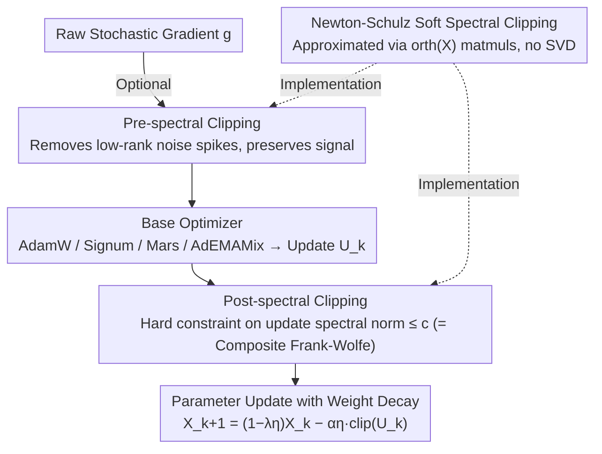

# Enhancing LLM Training via Spectral Clipping

**Conference**: ICML 2026  
**arXiv**: [2603.14315](https://arxiv.org/abs/2603.14315)  
**Code**: https://github.com/mlolab/llm-spectral-clipping (Available)  
**Area**: LLM Efficiency / Optimizers / Spectral Methods  
**Keywords**: Spectral Clipping, Frank-Wolfe, Newton-Schulz, LLM Pre-training, AdamW

## TL;DR
This paper proposes SPECTRA: an optimizer-agnostic wrapper that applies **post-spectral clipping** to the update matrix and optional **pre-spectral clipping** to the raw gradients. Mathematically equivalent to a composite Frank-Wolfe algorithm with weight regularization, SPECTRA consistently reduces validation loss for AdamW, Signum, Mars, and AdEMAMix in 124M–1.5B LLM pre-training.

## Background & Motivation

**Background**: Optimizers for LLM pre-training are divided into two categories. The first consists of coordinate-wise methods (AdamW, Signum, AdEMAMix, Mars), which independently apply adaptive scaling to each parameter. The second consists of spectral methods (Shampoo, Muon), which directly manipulate the singular values of the update matrix. Recent benchmarks show coordinate-wise methods often match or exceed pure spectral methods, but they **completely ignore the global spectral structure of weights and gradients**.

**Limitations of Prior Work**: Ignoring spectral structure leads to two specific issues. First, the spectral norm of the update matrix $\mathbf{U}_k$ can grow uncontrollably—$\|\operatorname{sign}(\mathbf{M}_k)\|_2$ is at least $\sqrt{\max(m,n)}$ for Signum, and often explodes for AdamW during early training or before loss spikes. From the iteration relation $\|\mathbf{X}_k\|_2 \le (1-\lambda\eta)^k\|\mathbf{X}_0\|_2 + \frac{1-(1-\lambda\eta)^k}{\lambda}\max_i\|\mathbf{U}_i\|_2$, a large update spectral norm expands the weight spectral norm, compromising stability and generalization. Second, the singular value spectrum of raw stochastic gradients is **heavy-tailed**, where a few singular values are orders of magnitude larger than the signal (termed "sparse spectral spikes"). Coordinate-wise or global clipping either fails to suppress these spikes or suppresses the signal along with them.

**Key Challenge**: Existing clipping granularities are either too coarse (global) or too fine (coordinate-wise). There is no tool that can **selectively remove low-rank noise spikes while strictly constraining the update spectral norm** without resorting to computationally expensive SVD.

**Goal**: (i) Add a spectral norm constraint to any base optimizer with decoupled weight decay; (ii) Mathematically link spectral clipping to a well-studied algorithmic framework to provide convergence guarantees and regularization interpretations; (iii) Develop a GPU-efficient implementation of spectral clipping independent of SVD.

**Key Insight**: Starting from the simple update rule $\mathbf{X}_{k+1}=(1-\lambda\eta_k)\mathbf{X}_k - \alpha\eta_k\,\mathrm{clip}^{\mathrm{sp}}_{c_k}(\mathbf{U}_k)$, the operation of clipping singular values after SVD is treated as an atomic operation, which is then wrapped into a full optimizer using momentum.

**Core Idea**: Use Newton-Schulz iteration to implement "soft spectral clipping" as a replacement for coordinate/global clipping. This applies hard spectral norm constraints to the update matrix and filters spectral noise from the gradient—essentially solving a **composite Frank-Wolfe problem within a spectral norm ball**.

## Method

### Overall Architecture
SPECTRA is a two-layer wrapper applied to a base optimizer. Given an update matrix $\mathbf{U}_k$ from any base optimizer (e.g., $\mathbf{M}_k/\sqrt{\mathbf{V}_k}$ for AdamW, $\operatorname{sign}(\mathbf{M}_k)$ for Signum, or outputs from Mars/AdEMAMix), SPECTRA performs two steps:

1.  **(Optional) Pre-spectral clipping**: Before the base optimizer receives the gradient, the raw stochastic gradient $\mathbf{g}$ undergoes $\mathrm{clip}^{\mathrm{sp}}_{c_{\mathrm{pre}}}(\mathbf{g})$ to truncate spectral spikes before being fed into the optimizer.
2.  **Post-spectral clipping**: The update $\mathbf{U}_k$ calculated by the base optimizer is processed via $\mathrm{clip}^{\mathrm{sp}}_{c_k}(\mathbf{U}_k)$. Parameters are then updated with step size $\alpha\eta_k$ using the rule with decoupled weight decay: $\mathbf{X}_{k+1}=(1-\lambda\eta_k)\mathbf{X}_k - \alpha\eta_k\,\mathrm{clip}^{\mathrm{sp}}_{c_k}(\mathbf{U}_k)$.

The spectral clipping operator is defined by applying scalar clipping to each singular value $\mathbf{S}_{ii}$ in the SVD $\mathbf{X}=\mathbf{U}\mathbf{S}\mathbf{V}^T$: $\mathrm{clip}^{\mathrm{sp}}_c(\mathbf{X}) = \mathbf{U}\,\mathrm{diag}(\mathrm{clip}_c(\mathbf{S}_{ii}))\,\mathbf{V}^T$, ensuring the output spectral norm is $\le c$. To avoid expensive SVD, Newton-Schulz iterations approximate this via matrix-matrix multiplications.

### Key Designs

**1. Post-spectral Clipping = Composite Frank-Wolfe on Spectral Norm Ball: Linking Heuristics to Theory**

Coordinate-wise methods ignore the global spectral structure, allowing the spectral norm of $\mathbf{U}_k$ to go out of control (e.g., $\|\operatorname{sign}(\mathbf{M}_k)\|_2 \ge \sqrt{\max(m,n)}$ in Signum). SPECTRA enforces a hard spectral clipping. The authors prove that the SPECTRA update with Polyak momentum:

$$\mathbf{X}_{k+1}=(1-\lambda\eta_k)\mathbf{X}_k-\alpha\eta_k\,\mathrm{clip}^{\mathrm{sp}}_{c_k}(\mathbf{M}_k)$$

is equivalent to solving the stochastic composite Frank-Wolfe for $\min_{\mathbf{X}\in Q_2}\{f(\mathbf{X})+\psi(\mathbf{X})\}$, where $Q_2=\{\|\mathbf{X}\|_2\le D_2\}$ is the spectral norm ball and $\psi(\mathbf{X})=\frac{\lambda}{2\alpha}\|\mathbf{X}\|_F^2$ is an implicit Frobenius regularization. The hyperparameters correspond to $c_k\equiv\lambda D_2/\alpha$ and $\gamma_k=\lambda\eta_k$. Under convexity assumptions, the convergence rate is $\mathcal{O}(1/K)+\mathcal{O}(\sigma/\sqrt B)$. This provides a theoretical basis for the clipping operation, where $c, \alpha, \lambda$ directly control the spectral ball radius $D_2=\alpha c/\lambda$ and regularization strength $b=\lambda/\alpha$. Muon is a special case with no regularization where $\alpha\to\infty, c=1/\alpha, b=0$.

**2. Pre-spectral Clipping: Selectively Removing Low-rank Noise Spikes While Preserving Signal**

In LLM training, raw gradients exhibit a heavy-tailed singular value spectrum. A few "sparse spectral spikes" can be orders of magnitude larger than the signal and are often nearly orthogonal to it. SPECTRA applies $\mathrm{clip}^{\mathrm{sp}}_{c_{\mathrm{pre}}}(\mathbf{g})$ before the base optimizer. Let $\mathbf{g}=\mathbf{G}+\mathbf{N}$, where $\mathbf{N}=\ell\mathbf{U}_N\mathbf{V}_N^\top$ is a zero-mean low-rank spike with $\ell\gg\|\mathbf{G}\|_2$. Lemma 4.2 proves that for any $c\ge\|\mathbf{G}\|_2$, $\mathbb{E}_{\mathbf{N}}[\langle\mathbf{G},\tilde{\mathbf{g}}\rangle]\ge\frac13\|\mathbf{G}\|_F^2$ and variance is reduced from $r\ell^2$ to $rc^2$. Compared to global clipping (Lemma 4.3), which must choose between preserving the signal or reducing variance, spectral clipping achieves both by flattening only the top-$r$ singular values dominated by noise.

**3. Newton-Schulz Soft Spectral Clipping: GPU-Friendly Implementation without SVD**

Exact SVD is $\mathcal{O}(mn\min(m,n))$, which is prohibitive for large LLM weights. The authors observe that $\frac1c\mathrm{clip}^{\mathrm{sp}}_c(\mathbf{X})=\operatorname{orth}(\mathbf{X}):=\mathbf{U}_X\mathbf{V}_X^\top$ (strictly when $c\le\sigma_{\min}(\mathbf{X})$, otherwise yielding a soft version). As $\operatorname{orth}$ is used in Muon, it can be approximated through Newton-Schulz polynomial iterations using matrix-matrix multiplications. This makes the wall-clock overhead of SPECTRA comparable to the base optimizer.

### Loss & Training
The objective function (cross-entropy) remains unchanged. SPECTRA only modifies the update direction. Main hyperparameters include the clipping thresholds $c$, scale $\alpha$, and weight decay $\lambda$, which together determine the spectral ball radius $D_2$ and Frobenius regularization $b$.

## Key Experimental Results

### Main Results
Pre-training LLaMA-style transformers (124M–1.5B parameters) using Chinchilla-optimal token counts, comparing base optimizers with SPECTRA-enhanced versions.

| Base Optimizer | Model Size | Vanilla Val Loss | + SPECTRA | SOTA Status |
| :--- | :--- | :--- | :--- | :--- |
| AdamW | 124M–1.5B | Baseline | Consistent decrease | Near SOTA |
| Signum | 124M–1.5B | Weaker | Significant decrease | Significant improvement |
| Mars | 124M–1.5B | Strong Baseline | Further decrease | Achieves SOTA |
| AdEMAMix | 124M–1.5B | Strong Baseline | Further decrease | Achieves SOTA |
| Muon | — | — | SPECTRA generalizes Muon | Framework includes it |

### Ablation Study
| Configuration | Key Metric | Note |
| :--- | :--- | :--- |
| Vanilla AdamW | Baseline Loss | Update spectral norm explodes (Fig F.10) |
| + Post-spectral Clipping | Lower Val Loss + Smaller Weight Norm | Validates Implicit Frobenius Regularization theory |
| + Pre-spectral Clipping | Further gain in layers with heavy noise | Validates Lemma 4.2 sparse spike removal |
| + Global Clipping | Signal suppressed, no significant gain | Validates Lemma 4.3 limitations |
| High Learning Rate | Vanilla diverges; SPECTRA stable | Spectral constraints allow larger lr |

### Key Findings
- **Consistent Improvement**: SPECTRA reduces validation loss for AdamW, Signum, Mars, and AdEMAMix, with the best combinations reaching SOTA.
- **Empirical Validation of Regularization**: The Frobenius norm of trained weights is lower than vanilla models, consistent with the $\psi(\mathbf{X})=\frac{\lambda}{2\alpha}\|\mathbf{X}\|_F^2$ interpretation.
- **Allows Larger Learning Rates**: Hard spectral constraints mitigate the risk of update explosions, making shorter warm-ups or higher learning rate caps feasible.
- **Existence of Spectral Spikes**: Layer-wise singular value statistics (Fig F.9) confirm that raw gradient top-$r$ singular values are often an order of magnitude larger than the signal and nearly orthogonal to it.

## Highlights & Insights
- **Algorithm-Theory Correspondence**: Translating a heuristic "SVD-based clip" into a composite Frank-Wolfe problem with convergence rates provides clear geometric meanings for hyperparameters $D_2$ and $b$.
- **Geometric Separation of Spectral vs. Global Clipping**: Lemma 4.2/4.3 demonstrates that global clipping cannot balance signal preservation and variance reduction in the presence of spikes, whereas spectral clipping can.
- **Unified View of Muon**: Muon is interpreted as a special case of SPECTRA with $b=0$, clarifying the relationship between spectral normalization and spectral clipping with regularization.

## Limitations & Future Work
- Experiments were conducted up to 1.5B parameters; verification on larger scales (>10B) is needed.
- The optimal granularity of spectral clipping for heterogeneous structures like MoE or GLU has not been explored.
- Newton-Schulz accuracy depends on iteration counts; while wall-clock overhead is addressed, further trade-off analysis is possible.
- Theory assumes noise anisotropy $\kappa\le q/(25r^2)$, which requires more granular verification for structured layers like KV projections in Attention.

## Related Work & Insights
- **vs. Muon (Jordan et al., 2024)**: Muon normalizes all singular values to 1 ($b=0$), whereas SPECTRA adds Frobenius regularization (finite $\alpha$), yielding better generalization in LLMs.
- **vs. Global Gradient Clipping**: Global clipping faces a trade-off between suppressing noise and preserving signals; SPECTRA avoids this by targeting specific singular values.
- **vs. Shampoo**: Shampoo uses curvature for preconditioning; SPECTRA focuses on stability and regularization via spectral norm constraints.
- **vs. Mars / AdEMAMix**: These are state-of-the-art coordinate-wise methods. SPECTRA shows that spectral constraints and coordinate-wise adaptivity are complementary rather than mutually exclusive.

## Rating
- **Novelty**: ⭐⭐⭐⭐ Establishing the equivalence between spectral clipping and Frank-Wolfe is a significant insight.
- **Experimental Thoroughness**: ⭐⭐⭐⭐ Comprehensive comparison across multiple optimizers and model sizes.
- **Writing Quality**: ⭐⭐⭐⭐ Clear structure with helpful hyperparameter mappings.
- **Value**: ⭐⭐⭐⭐⭐ A plug-and-play wrapper that consistently improves LLM training and is orthogonal to other SOTA methods.

<!-- RELATED:START -->

## Related Papers

- [\[NeurIPS 2025\] MeCeFO: Enhancing LLM Training Robustness via Fault-Tolerant Optimization](../../NeurIPS2025/optimization/mecefo_enhancing_llm_training_robustness_via_fault-tolerant_optimization.md)
- [\[ICML 2026\] Memory-Efficient LLM Pretraining via Minimalist Optimizer Design](memory-efficient_llm_pretraining_via_minimalist_optimizer_design.md)
- [\[ICML 2026\] Test time training enhances in-context learning of nonlinear functions](test_time_training_enhances_in-context_learning_of_nonlinear_functions.md)
- [\[ICML 2026\] RMNP: Row-Momentum Normalized Preconditioning for Scalable Matrix-Based Optimization](rmnp_row-momentum_normalized_preconditioning_for_scalable_matrix-based_optimizat.md)
- [\[ICML 2026\] Muon in Associative Memory Learning: Training Dynamics and Scaling Laws](muon_in_associative_memory_learning_training_dynamics_and_scaling_laws.md)

<!-- RELATED:END -->
