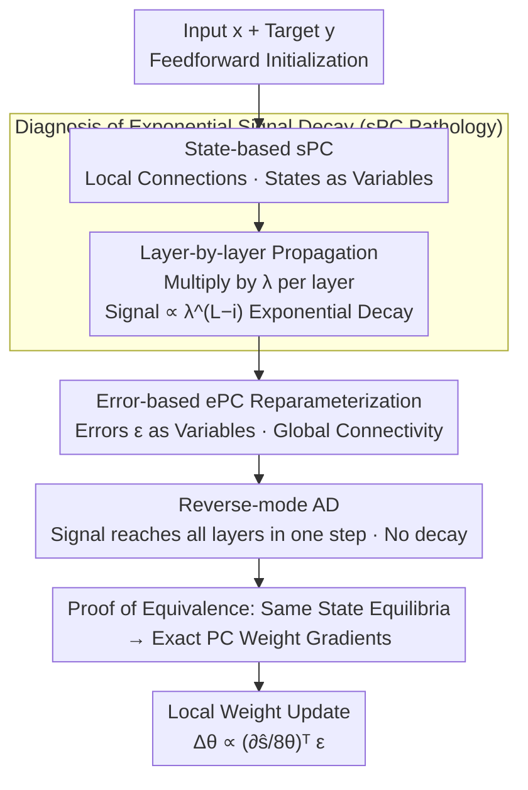

# ePC: Fast and Deep Predictive Coding in Digital Simulation

**Conference**: ICML2026  
**arXiv**: [2505.20137](https://arxiv.org/abs/2505.20137)  
**Code**: https://github.com/cgoemaere/error_based_PC  
**Area**: Optimization / Bio-inspired learning algorithms  
**Keywords**: Predictive Coding, Backpropagation Alternative, Signal Decay, Deep Scalability, Energy Minimization

## TL;DR
This paper identifies a neglected root cause where "state-based Predictive Coding (sPC) exponentially decays training signals with network depth in digital simulations," leading to training failure and extremely slow convergence in deep networks. The authors propose ePC, an equivalent reparameterization that changes the optimization variable from states to errors. It calculates exactly the same state equilibria and weight gradients as sPC but utilizes reverse-mode AD to allow signals to reach all layers in a single step. Consequently, ePC converges over 100 times faster in deep networks and matches the performance of backpropagation on deep architectures.

## Background & Motivation
**Background**: Predictive Coding (PC), rooted in neuroscientific theories of cortical function, has recently been recast as a "inference-then-plasticity" machine learning algorithm and a brain-inspired alternative to backpropagation. It generates weight gradients in two steps: first, weights $\theta$ are fixed, and neural states $s$ are iteratively adjusted to minimize energy $E$ (the sum of local prediction errors across layers); once states converge to equilibrium, weights are updated using a local rule. This paradigm of "pushing activity to equilibrium before modifying weights" is thought to improve the loss landscape and reduce training signal interference, offering advantages in online/continual learning.

**Limitations of Prior Work**: PC is theoretically suited for analog hardware—evolving naturally like physical systems with extreme energy efficiency. However, such hardware does not yet exist, so PC currently relies almost entirely on **digital simulation**. Using numerical solvers to iteratively find state equilibria requires many steps, incurring massive overhead compared to backpropagation, which is naturally fit for digital hardware. Worse still, Pinchetti et al. (2025) observed a "depth anomaly": deep PC models often perform worse than shallow ones, the opposite of backpropagation's behavior. Existing solutions either modify the PC gradient formula, impose fixed-prediction assumptions, or only apply to residual architectures—a general solution for standard feedforward networks remains missing.

**Key Challenge**: The authors attribute the seemingly unrelated issues of "computational inefficiency" and "failure to scale with depth" to a single root cause: **hardware-algorithm mismatch**. For biological plausibility, PC deliberately breaks the computational graph into local connections, forcing signals to propagate layer by layer. While effective on physical substrates, in digital simulations, the signal is decayed by the state learning rate $\lambda$ (which must be $<1$ for stability) each time it crosses a layer. Successive multiplications result in **exponential decay with respect to depth**.

**Key Insight**: Since strict locality is only intended for analog hardware and is not strictly necessary for simulation, this constraint can be relaxed. The key observation is that sPC is just "one" instantiation of PC (often overlooked in literature). One can switch to an equivalent reparameterization to eliminate signal decay in digital simulations without altering the essence of PC learning.

**Core Idea**: Change the primary optimization variables of PC from **states $s$** to **errors $\epsilon$**. This reconnects the locally connected computational graph into a globally connected one, enabling reverse-mode AD to deliver output loss signals to all layers in one step without decay—this is error-based PC (ePC).

## Method

### Overall Architecture
To understand ePC, one must first recognize the pathology of sPC and how ePC treats it. The energy of sPC is the sum of prediction errors across layers and the output loss:

$$E(s,\theta)=\tfrac{1}{2}\sum_{i=0}^{L-1}\|s_i-\hat{s}_i\|^2+\mathcal{L}(\hat{y},y),\quad \hat{s}_i:=f_{\theta_i}(s_{i-1}).$$

A training step consists of two phases: the state phase (fix $\theta$, evolve states according to $\partial s_i/\partial t=-\nabla_{s_i}E$ until equilibrium) and the weight phase (fix $s$, update weights once via $\Delta\theta_i\propto -\nabla_{\theta_i}E=(\partial f_{\theta_i}/\partial\theta_i)^\top\epsilon_i$). Importantly, the weight update only utilizes the **final equilibrium state**; the trajectory to reach it is irrelevant. This provides the freedom to change the solver. ePC retains the same energy but sets errors $\epsilon$ as the primary variables. After reconnecting the graph, it uses AD to find equilibrium and recovers states via $s_i:=\hat{s}_i+\epsilon_i$. The comparison is as follows:

### Key Designs

**1. Diagnosis of Exponential Signal Decay: Revealing the common cause of slowness and depth failure in sPC**

This is the "pathological" cornerstone of the paper. After feedforward initialization in sPC, all internal energy is zeroed out, leaving only the output energy $E_L$ non-zero. State updates should theoretically drive a backward wavefront from output to input, advancing one layer per step. However, the authors measured that the signal **advances in discontinuous jumps**, stagnating at deep layers with increasing delays. Tracking this step-by-step revealed that as the energy gradient propagates from one layer to the next, it is decayed by the state learning rate $\lambda$ ($\lambda < 1$ for stability). For each additional layer, it is multiplied by $\lambda$ again, so the first non-zero signal reaching the state of layer $i$ is approximately:

$$\Delta s_i\propto \lambda^{L-i}\,\nabla_{\hat{y}}\mathcal{L},$$

which is exponentially decayed by the depth $L$. For typical $\lambda \in [0.01, 0.1]$, the signal drops below numerical precision within 4–8 update steps (float32 addition is only effective within 8 orders of magnitude, $1+10^{-8}=1$). This explains three things: why theoretically continuous propagation behaves like discrete jumpy delays, why deep layers might remain entirely untrained (yet are misidentified as "equilibrated" by convergence metrics), and why only difficult/mislabelled samples generating large output gradients can penetrate deep layers (causing a systematic bias where different layers train on different data subsets). The authors emphasize that this decay is **unavoidable**, even in ultra-stable architectures like µPC—common remedies (increasing learning rate, increasing precision, fine-tuning initialization, changing optimizers) only address symptoms.

**2. Error-based Reparameterization ePC: Changing variables to reconnect the local graph into a global one**

Addressing the cause directly, ePC no longer uses states $s$ as optimization variables, but instead uses errors $\epsilon$. The energy is rewritten as:

$$E(\epsilon,\theta)=\tfrac{1}{2}\sum_{i=0}^{L-1}\|\epsilon_i\|^2+\mathcal{L}(\hat{y},y),\quad \hat{y}=f_\theta(x,\epsilon).$$

The core dynamics remain unchanged: iteratively update $\epsilon$ to minimize $E$, then take one gradient step for $\theta$. The difference lies in the computational graph structure: sPC deliberately breaks the graph to force local information ($\hat{y}=\text{func}(s_{L-1})$), whereas ePC reconnects the entire network so that the output directly depends on all error variables $\hat{y}=\text{func}(x,\epsilon_0,\epsilon_1,\dots,\epsilon_{L-1})$. Thus, the error update gradient becomes $\nabla_{\epsilon_j}E=\epsilon_j+(\partial\hat{y}/\partial\epsilon_j)^\top\nabla_{\hat{y}}\mathcal{L}$, which can be computed across the network simultaneously using reverse-mode AD. States are recovered using $s_i:=\hat{s}_i+\epsilon_i$ when needed—conceptually equivalent to a forward pass from the input with perturbations $\epsilon_i$ at each layer. The authors stress that this **remains a valid PC algorithm**: AD is merely an efficient computational backend for finding state equilibria and does not participate in weight updates. Weight updates (formula $\Delta\theta_i\propto(\partial\hat{s}_i/\partial\theta_i)^\top\epsilon_i$) remain temporally local and follow PC principles; thus, ePC is not simply a "hybrid of PC and BP."

**3. Equivalence Proof: ePC and sPC calculate identical equilibria and exact PC gradients**

The justification for ePC's removal of locality is its **proven equivalence** to sPC: both are valid parameterizations of PC that converge to the same state equilibrium, thereby producing the same (exact) PC weight gradients (proof in Appendix C.2, validation in C.1). This separates "speed" from "correctness"—ePC is not an approximate acceleration, but an exact equivalent one. Its speed stems from **decoupling stability from propagation speed**: in sPC, both are entangled by $\lambda$ (which controls both stability and propagation). In contrast, ePC uses reverse-mode AD to deliver signals to all layers without decay **before** applying $\lambda$ in the error update step—thus $\lambda$ only affects stability and no longer restricts propagation reach. Consequently, all layers begin optimizing simultaneously from the first step, regardless of depth, completely eliminating exponential decay. This also provides a theoretical explanation for why "feedforward state initialization" works so well in PC: it is essentially performing the first step of ePC.

### Loss & Training
The energy function itself is the training objective, and the output loss $\mathcal{L}$ can be chosen freely (experiments use MSE or Cross-Entropy CE). Within each weight update step: first, iterate $T$ steps to find the error/state equilibrium (ePC uses AD, sPC uses SGD discretization $s_i\leftarrow s_i-\lambda\nabla_{s_i}E$), then perform one local weight update $\theta_j\leftarrow\theta_j-\eta\nabla_{\theta_j}E$ using the equilibrium errors. This process repeats over data batches, consistent with standard deep learning.

## Key Experimental Results

### Proof of Concept: 20-layer Linear Network / MNIST
A 20-layer linear network was chosen because it is deep enough to exhibit issues and has a unique analytical equilibrium solution that serves as ground truth. Both methods used the same weights (obtained via backprop) with hyperparameters tuned for convergence speed. Results show both sPC and ePC converge to the analytical optimum (confirming equivalence), but **ePC is over 100 times faster than sPC**. Signal propagation is visually apparent: sPC takes ~30 steps to reach layer 9 ($s_9$) and nearly 100 steps to finish all 20 layers to $s_0$; ePC has long since converged by then, with all layers optimizing from the first step. On deep non-linear MLPs, sPC requires >100,000 steps to truly converge, highlighting the necessity of ePC.

### Main Results: Four Datasets × Multi-depth Architectures
Following the benchmarks of Pinchetti et al. (2025), backpropagation is used as the gold standard. Test accuracy (%, 5 seeds, bold indicates best within confidence interval):

| Architecture / Dataset (CE loss) | ePC | sPC | Backprop |
|------|------|------|------|
| VGG-5 / CIFAR-10 | **88.27** | 84.66 | **87.95** |
| VGG-5 / CIFAR-100 Top-1 | **63.39** | 56.85 | **63.83** |
| VGG-7 / CIFAR-10 | 88.84 | 77.98 | **89.60** |
| VGG-9 / CIFAR-100 Top-1 | 60.65 | 54.19 | 61.11 |
| ResNet-18 / CIFAR-10 | **91.73** | "43.19" | **91.85** |
| ResNet-18 / CIFAR-100 Top-1 | 69.47 | "16.01" | **71.46** |

("…" indicate sPC results on ResNet-18 were unstable in the authors' implementation; values cited from Pinchetti et al. 2025.)

### Ablation Study (Depth Scaling Perspective)

| Training Algorithm | Variation with Depth | ResNet-18 Performance | Gap with Backprop |
|------|------|------|------|
| sPC | **Degrades** with depth | Unstable (CIFAR-100 Top-1 only ~16–23%) | Significantly behind |
| ePC | **Improves** steadily with depth | Near Backprop (91–69%) | Mostly within confidence intervals |
| Backprop | Improves with depth | Gold Standard | — |

### Key Findings
- **ePC scales with depth, sPC does not**: Most notably on ResNet-18, ePC achieved performance close to backpropagation, while sPC collapsed to low percentages due to instability, directly validating that "eliminating signal decay unlocks depth."
- **ePC matches backpropagation on most datasets/architectures**, often falling within statistical confidence intervals. Trends are consistent across both losses (MSE/CE), though both ePC and sPC are more hyperparameter-sensitive under CE.
- **The MSE version of ePC slightly outperformed backprop on VGG-7** (CIFAR-100 Top-1 66.55 vs 66.23), suggesting ePC is not just "barely catching up" but has its own advantages in certain configurations.

## Highlights & Insights
- **Unifying Two Isolated Problems**: Computational inefficiency and failure to scale with depth have been studied separately; this paper explains both through "exponential signal decay + hardware-algorithm mismatch." This insight into a common pathology is more valuable than any single trick.
- **Exact Equivalent Acceleration, Not Approximation**: ePC is proven to compute the same equilibrium and weight gradients as sPC, meaning the 100x speedup is "free"—distinct from works that trade accuracy for speed.
- **Decoupling Stability and Propagation Speed**: sPC's entanglement of both in $\lambda$ is the problem; ePC's strategy of "arriving first, then stabilizing" could be transferred to other iterative equilibrium solvers (e.g., DEQ, Hopfield-like networks).
- **Theorizing a "Common Folklore"**: Why feedforward state initialization works so well—it is essentially the first step of ePC, and this paper provides the theoretical backing.

## Limitations & Future Work
- **Abandonment of Analog Realizability**: By using global connectivity and reverse-mode AD, ePC can no longer be directly mapped to analog hardware. Its position is a "simulation tool for accelerating sPC digital validation" to pave the way for analog chip development, rather than a final bio-plausible implementation.
- **Scope Limited to "Inference then Plasticity" First Step**: This paper only tackles state/error inference. PC weight update rules and their generalization differences vs. BP (discussed in Appendices C.3/C.4) remain to be fully explored.
- **Hyperparameter Sensitivity under CE**: Under cross-entropy loss, both ePC and sPC are more sensitive, and a visible gap remains between ePC and BP on ResNet-18 (69.47 vs 71.46).
- **Instability of sPC Baselines**: ResNet-18 sPC values were borrowed from other works due to implementation instability, which slightly weakens the direct comparability of that specific result.

## Related Work & Insights
- **vs. Standard sPC**: Both share identical energies and weight update rules and are proven equivalent. sPC enforces a local graph for bio-plausibility, resulting in exponential decay and slow training in deep digital simulations. ePC reconnects the graph using AD for equilibrium, achieving 100x speedup and depth scalability at the cost of analog realizability.
- **vs. Gradient Formula Modification / Fixed-Prediction / µPC**: These either change the PC gradient, add constraints, or are limited to residual structures. ePC uses a unified exact reparameterization for standard networks without altering PC learning.
- **vs. Backpropagation**: ePC uses reverse-mode AD as a computational backend, but weight updates remain temporally local and follow PC principles. It is essentially PC, not BP, though it matches BP in performance on many tasks.
- **vs. ODE Solvers / Momentum Optimizers / One-step Approximations**: These attempt to optimize the solver within the sPC framework, treating symptoms rather than the cause (decay remains). ePC changes the parameterization to eliminate the root cause.

## Rating
- Novelty: ⭐⭐⭐⭐⭐ Identifies the ignored exponential signal decay root cause and solves it with an exact equivalent error reparameterization.
- Experimental Thoroughness: ⭐⭐⭐⭐ Systematic comparison across four datasets and multiple deep architectures + analytical validation on 20-layer linear nets, though ResNet sPC baseline has minor comparability flaws.
- Writing Quality: ⭐⭐⭐⭐⭐ Logical flow from pathology diagnosis to reparameterization to equivalence proof is seamless; algorithm comparisons are clear.
- Value: ⭐⭐⭐⭐⭐ Unlocks deep scaling for PC, clearing a core hurdle for digital validation and the analog hardware roadmap of bio-inspired learning.

<!-- RELATED:START -->

## Related Papers

- [\[ICML 2026\] $α$-PFN: Fast Entropy Search via In-Context Learning](α-pfn_fast_entropy_search_via_in-context_learning.md)
- [\[ICML 2026\] LiMuon: Light and Fast Muon Optimizer for Large Models](limuon_light_and_fast_muon_optimizer_for_large_models.md)
- [\[ICLR 2026\] DeepAFL: Deep Analytic Federated Learning](../../ICLR2026/optimization/deepafl_deep_analytic_federated_learning.md)
- [\[AAAI 2026\] ECPv2: Fast, Efficient, and Scalable Global Optimization of Lipschitz Functions](../../AAAI2026/optimization/ecpv2_fast_efficient_and_scalable_global_optimization_of_lipschitz_functions.md)
- [\[ICML 2025\] AdvPrompter: Fast Adaptive Adversarial Prompting for LLMs](../../ICML2025/optimization/advprompter_fast_adaptive_adversarial_prompting_for_llms.md)

<!-- RELATED:END -->
