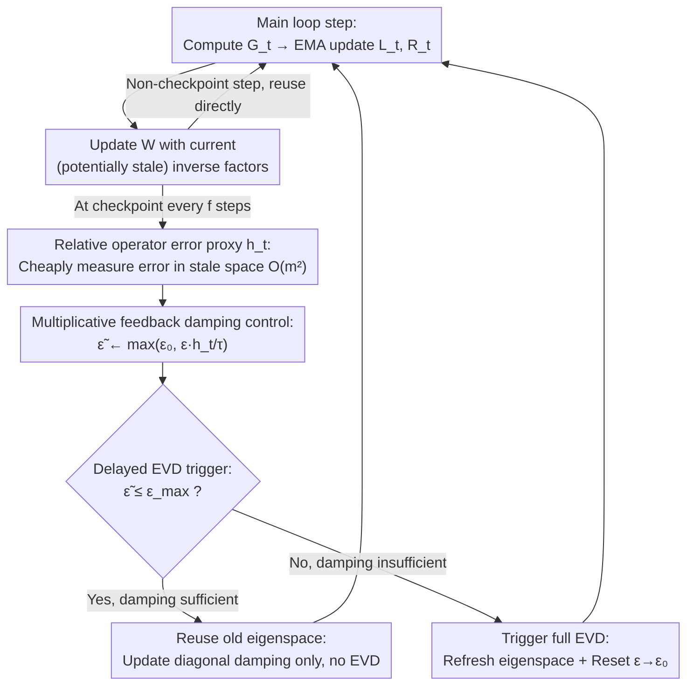

# FOAM: Frequency and Operator Error-Based Adaptive Damping Method for Reducing Staleness-Oriented Error for Shampoo

**Conference**: ICML2026  
**arXiv**: [2606.02365](https://arxiv.org/abs/2606.02365)  
**Code**: https://github.com/REAL-KENTECH/FOAM.git (Available)  
**Area**: Optimizer / Second-order Preconditioning / Numerical Stability  
**Keywords**: Shampoo, Adaptive Damping, EVD Frequency, Preconditioner Staleness, Kronecker Decomposition

## TL;DR
FOAM couples Shampoo's damping coefficient $\epsilon$ and eigenvalue decomposition (EVD) trigger frequency into a feedback control loop via a "relative operator error proxy $h_t$" that can be cheaply estimated in the stale eigenspace. It reduces EVD calls by over 80% on large model training while maintaining convergence quality.

## Background & Motivation

**Background**: In large model training, pure first-order methods (SGD, Adam) are computationally cheap per step but converge slowly and are sensitive to ill-conditioned curvature. Kronecker-factored second-order preconditioners—the Shampoo family—reshape gradients by computing the $-1/p$ power inverse of left and right factors $L_t, R_t$, outperforming AdamW on recent benchmarks like AlgoPerf. However, the core bottleneck of Shampoo is the necessity of performing EVD every step to obtain $L_t^{-1/p}$ and $R_t^{-1/p}$, which incurs significant computational overhead.

**Limitations of Prior Work**: Practical engineering implementations generally adopt a "stale Shampoo" heuristic—performing EVD only every fixed $\mathbf{f}$ steps and reusing old inverse root factors for intermediate steps. The choice of $\mathbf{f}$ is entirely manual, lacking theoretical guidance and failing to adapt to the actual drift of gradient statistics during training.

**Key Challenge**: The authors point out that staleness is not merely a minor "slower convergence" issue; it simultaneously harms two aspects: (i) convergence (a "staleness term" of $(1-\beta^{\mathbf{f}}) R_{\mathrm{SG}}^4 / \epsilon_0^2$ appears in the discounted regret upper bound), and (ii) numerical stability (the Lipschitz constant of the inverse root mapping $A \mapsto A^{-1/p}$ is proportional to $1/(p \epsilon_0^{(p+1)/p})$; a smaller $\epsilon_0$ leads to higher sensitivity to drift, making overall training prone to instability). In other words, staleness $\mathbf{f}$ and damping $\epsilon$ are coupled variables that must be controlled jointly.

**Goal**: Transform the decisions of "when to refresh EVD" and "what $\epsilon$ to use" from manually tuned constants into interpretable feedback control. Requirements include: (a) trigger criteria based on actual operator error rather than empirical schedules, (b) decision overhead significantly lower than a single EVD, and (c) maintaining stability even with drastically reduced EVD frequency.

**Key Insight**: The authors found that the full $mn \times mn$ preconditioner error $P_t - \hat{P}_t$ can be decomposed into an additive form of the operator errors $\Delta_L, \Delta_R$ of the individual factors via Kronecker identities. From the perspective of perturbation theory, "controlling the relative error of each $m\times m$ and $n \times n$ factor" is a sufficient condition for overall stability, costing only $O(m^2 + n^2)$. Given the dual nature of $\epsilon$—acting as both a numerical stabilizer and a suppressor of useful preconditioning information—using **$\epsilon$ as a feedback control variable** becomes a natural solution.

**Core Idea**: Define a "relative operator error proxy $h_t$" that can be computed within the stale eigenspace and integrate it into a multiplicative feedback loop: if $h_t > \tau$, increase $\epsilon$ to suppress error; if $h_t \le \tau$, decrease $\epsilon$ to lift suppression. A true EVD is triggered only when $\epsilon$ reaches $\epsilon_{\max}$ and still cannot resolve the error.

## Method

### Overall Architecture
FOAM is embedded in the "update rule" $\mathcal{U}(\cdot)$ slot of the general Shampoo main loop (Algorithm 1). Each main loop step performs three efficient operations: compute gradient $G_t$, update second moments $L_t = \beta L_{t-1} + (1-\beta) G_t G_t^\top$ and $R_t = \beta R_{t-1} + (1-\beta) G_t^\top G_t$ via EMA, and update parameters $W_{t+1} = W_t - \eta \hat{L}_t^{-1/p} G_t \hat{R}_t^{-1/p}$ using current (potentially stale) inverse root factors.

The core logic of FOAM occurs at a "checkpoint" every $\mathbf{f}$ steps, executing a three-stage control flow independently for the left and right factors: first, sense the relative operator error under current damping using proxy $h_t$; second, update $\epsilon_t$ via multiplicative rules; finally, check if the updated $\epsilon_t$ is within $\epsilon_{\max}$. If yes, continue reusing the old eigenspace and only update the damping term ($O(m^2)$ cost); if no, trigger a full EVD and reset $\epsilon$ to the baseline $\epsilon_0$. This mechanism forms a feedback loop around $\epsilon$:

### Key Designs

**1. Relative operator error proxy $h_t$: Sensing inverse root error of stale factors without EVD**

To replace blind schedules with symptomatic triggers, the first requirement is a signal that cheaply measures error in an already stale eigenspace. The authors prove that the left factor inverse root error is bounded by:

$$\frac{\|\Delta_L^{(1)}\|_F}{\|\hat{L}_t^{-1/p}\|_F}\le \frac{\alpha}{p}\cdot \text{RC}(\epsilon_{t-1}),\quad \text{RC}(\epsilon)=\big\|\hat{L}_t^{-1/2}(L_t-\hat{L}_t)\hat{L}_t^{-1/2}\big\|_F,$$

where $\text{RC}$ is the "whitened drift Frobenius norm" and $\alpha(\epsilon)=\|\hat{L}_t^{-1/p}\|_2/\|\hat{L}_t^{-1/p}\|_F$ is the scale coefficient for spectral to Frobenius norm. Denoting the right side as $h_t$, all quantities can be calculated using cached eigenvectors $Q_L$ and eigenvalues $D_L$, with a cost of only $O(m^2)$. This is more targeted than prior work (e.g., diagonalization residuals): while residuals measure how well the space diagonalizes statistics, $h_t$ is anchored to the inverse root norm $\|\hat{L}_t^{-1/p}\|_F$, anisotropically amplifying drift in small eigenvalue directions—precisely where the inverse root mapping effect is strongest and most likely to trigger numerical instability.

**2. Multiplicative feedback damping control: Transforming $h_t$ into tracking damping $\epsilon_t$**

With the error signal established, $\epsilon$ follows it rather than remaining constant. The control rule uses a multiplicative form:

$$\epsilon_t \leftarrow \max\big(\epsilon_0,\ \epsilon_{t-1}\cdot h_t/\tau\big),$$,

where $\tau\in(0,1)$ is the tolerance threshold for relative error. If $h_t>\tau$ (error exceeds limit), $\epsilon$ is increased proportionally; if $h_t\le \tau$ (sufficient margin), $\epsilon$ is decreased proportionally. The floor $\epsilon_0$ ensures $\epsilon$ does not drop low enough to re-trigger Lipschitz sensitivity. Multiplicative feedback is essential because $(1-\beta^{\mathbf{f}})$ grows linearly with $\mathbf{f}$ after introducing refresh cycles; furthermore, since operator error depends on $\epsilon$ via a power law $\epsilon^{-(p+1)/p}$, multiplicative feedback matches this decay rate, enabling stable regulation across a wide dynamic range.

**3. Delayed EVD trigger based on $\epsilon_{\max}$: Adapting refresh frequency to real drift**

Damping cannot be increased indefinitely—Theorem 5.4 indicates that excessively large $\epsilon_0$ causes the $\epsilon_0 D^2$ term in regret to explode. Thus, FOAM checks if the updated $\tilde{\epsilon}_t \le \epsilon_{\max}$ holds: if so, it assembles $\hat{L}_t^{-1/p}=Q_L(D_L+\epsilon_t I_m)^{-1/p}Q_L^\top$—recalculating only the diagonal damping while keeping $Q_L$ and $D_L$ fixed; if $\tilde{\epsilon}_t > \epsilon_{\max}$, damping is no longer sufficient, triggering a full $\text{EVD}(L_t)$ and resetting $\epsilon$ to $\epsilon_0$. $\epsilon_{\max}$ ensures damping does not suppress useful preconditioning while serving as the sole trigger for EVD, making the frequency strictly adaptive to real spectral drift.

### Loss & Training
FOAM does not change the original Shampoo loss objective; it only replaces the update rule $\mathcal{U}(\cdot)$. Key hyperparameters include the sensing period $\mathbf{f}$, relative error threshold $\tau$, maximum damping $\epsilon_{\max}$, and baseline damping $\epsilon_0$. For ViT, these are $(20, 0.75, 3\times10^{-7}, 10^{-9})$, and for Conformer, $(50, 0.4, 1\times10^{-7}, 10^{-9})$. $\mathbf{f}$ denotes when the proxy $h_t$ is checked and does not directly equal the EVD interval—the actual EVD interval is extended by the $\epsilon_{\max}$ trigger condition.

## Key Experimental Results

### Main Results
FOAM is compared with stale Shampoo across three large-scale tasks: (1) ViT-small @ ImageNet-1K, (2) Conformer @ LibriSpeech, and (3) GPT-2 @ Wikitext-103 (Appendix). The evaluation metric is the wall-clock time required to achieve equivalent or better final performance.

| Task / Model | Metric | Stale Shampoo | FOAM | Key Finding |
|---|---|---|---|---|
| ImageNet-1K / ViT-small | Top-1 val. Acc. + wall-clock | baseline | Higher acc. / Lower loss / Significant time reduction | FOAM is in the "performance-time" top-left blue region |
| LibriSpeech / Conformer | WER + wall-clock | baseline | Lower WER / Less time | Also located in the advantageous blue region |
| Wikitext-103 / GPT-2 | PPL + wall-clock | baseline | Comparable or better than Shampoo | Consistent trend in Appendix J |

### Ablation Study

| Configuration | Training Loss | Wall-clock Time | Description |
|---|---|---|---|
| Full FOAM (Adaptive $\epsilon$ + Triggered EVD) | Lowest | Minimum | Blue triangle; Pareto-optimal for performance-time |
| Increase $\mathbf{f}$ without adaptive $\epsilon$ | Significant increase | Moderate | Green square; staleness allows spectral drift, training fails |
| Adaptive $\epsilon$ without EVD refresh | Moderate decrease | Significant increase | Purple diamond; increased $\epsilon$ suppresses error but preconditioning quality drops |
| EVD Call Count (FOAM vs Stale) | — | — | EVD calls for $L$ factor drop to $\approx 10\%$, $R$ factor to $\approx 5\%$ on ViT |

### Key Findings
- Both adaptive damping and triggered refresh are essential: only by combining "proxy $h_t$ for damping control" and "$\epsilon_{\max}$ for EVD triggering" can both training loss and wall-clock time be reduced, confirming the theoretical insight that $\mathbf{f}$ and $\epsilon$ must be controlled jointly.
- FOAM advantages are robust to hyperparameter sweeps: most configurations of $(\mathbf{f}, \tau, \epsilon_{\max}, \epsilon_0)$ fall within the "advantageous blue region," indicating that the feedback control absorbs hyperparameter sensitivity.
- $\epsilon$ dynamics match intuition: during training, $\epsilon_t$ increases as staleness accumulates and drops back to $\epsilon_0$ after an EVD refresh, reflecting a sawtooth pattern; the stale baseline remains at a small constant, lacking a buffer against large drifts.

## Highlights & Insights
- Unified "when to refresh" and "damping magnitude" into a single feedback loop: previously separate hyperparameters in the Shampoo family, FOAM uses $\epsilon$ to "withstand drift" and $\epsilon_{\max}$ to "refresh" when damping is insufficient, a split that matches control theory intuition.
- Replaced "diagonalization residual" with "relative operator error" as the trigger criterion: the authors clarify the geometric difference; the latter aligns with the perturbation-sensitive directions (small eigenvalues) of the inverse root mapping, providing a more symptomatic health signal.
- Theoretical and engineering alignment: the $r(1-\beta^{\mathbf{f}}) R_{\mathrm{SG}}^4 / \epsilon_0^2$ term in the discounted regret is not just mathematical; it explicitly reveals the first-order relationship between increased damping and increased staleness, which FOAM's multiplicative feedback directly addresses.

## Limitations & Future Work
- Admitted Limitations: The paper provides full regret proofs for $p=2$ (Shampoo2); $p=4$ is in the appendix. Theoretical assumptions include loss convexity and sub-Gaussian tail bounds for gradients, which are coarse approximations in deep network training.
- Identified Limitations: Four hyperparameters $(\mathbf{f}, \tau, \epsilon_{\max}, \epsilon_0)$ still require selection. Currently, $L$ and $R$ factors are handled independently; whether a global signal can jointly schedule them remains open. The proxy $h_t$ is a Frobenius upper bound and might be conservative in highly low-rank or rapid-change scenarios.
- Future Work: Making $\epsilon_{\max}$ adaptive (e.g., tied to current regret estimates) could eliminate a hyperparameter. Incorporating models of staleness caused by network latency in distributed asynchronous training could push the control loop to the system level.

## Related Work & Insights
- **vs Stale Shampoo (Gupta et al., 2018)**: They rely on a fixed schedule $\mathbf{f}$ and a fixed $\epsilon_0$ for noise resistance; FOAM replaces both with closed-loop variables driven by proxy $h_t$.
- **vs SOAP / Purifying Shampoo (Eschenhagen et al., 2026)**: They use "diagonalization residuals" for EVD refreshes; FOAM argues these are distinct from inverse root error and uses relative operator error as a more targeted health signal.
- **vs Damaskinos et al., 2018**: While they use scalar damping for stale gradients in asynchronous SGD, FOAM uses $\epsilon$ inside second-order preconditioners to suppress operator error in Kronecker factors.
- **vs SPlus (Frans et al., 2026)**: SPlus uses engineering stabilizers; FOAM utilizes provable relative error upper bounds from perturbation theory to drive both stability and trigger criteria.

## Rating
- Novelty: ⭐⭐⭐⭐☆ Using $\epsilon$ as a feedback variable and relative operator error as a trigger is a significant perspective shift for the Shampoo family.
- Experimental Thoroughness: ⭐⭐⭐⭐☆ Covers ViT/Conformer/GPT-2 across multiple modalities with robust ablation and hyperparameter sweeps; only lacks cross-comparison of $p$ values.
- Writing Quality: ⭐⭐⭐⭐⭐ Strong integration of theory, motivation, algorithm, and experiments; clarifies why damping acts as an inhibitor and why relative error is a better health signal.
- Value: ⭐⭐⭐⭐☆ Over 80% reduction in EVD calls without accuracy loss makes this a drop-in replacement for large model training teams using second-order preconditioning.

<!-- RELATED:START -->

## Related Papers

- [\[ICML 2026\] Taming the Loss Landscape of PINNs with Noisy Feynman-Kac Supervision: Operator Preconditioning and Non-Asymptotic Error Bounds](taming_the_loss_landscape_of_pinns_with_noisy_feynman-kac_supervision_operator_p.md)
- [\[NeurIPS 2025\] Revisiting Orbital Minimization Method for Neural Operator Decomposition](../../NeurIPS2025/optimization/revisiting_orbital_minimization_method_for_neural_operator_decomposition.md)
- [\[NeurIPS 2025\] Purifying Shampoo: Investigating Shampoo's Heuristics by Decomposing its Preconditioner](../../NeurIPS2025/optimization/purifying_shampoo_investigating_shampoos_heuristics_by_decomposing_its_precondit.md)
- [\[ICML 2026\] Adaptive Preconditioners Trigger Loss Spikes in Adam](adaptive_preconditioners_trigger_loss_spikes_in_adam.md)
- [\[ICML 2026\] Multi-Objective Bayesian Optimization via Adaptive ε-Constraints Decomposition](multi-objective_bayesian_optimization_via_adaptive_varepsilon-constraints_decomp.md)

<!-- RELATED:END -->
