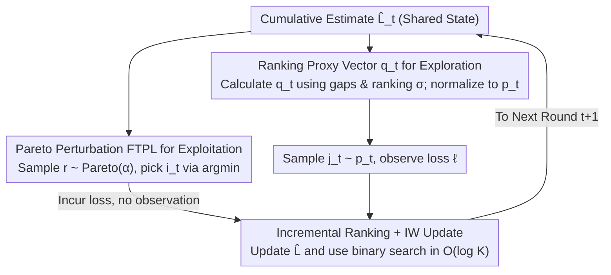

# Follow-the-Perturbed-Leader for Decoupled Bandits: Best-of-Both-Worlds and Practicality

**Conference**: ICML 2026  
**arXiv**: [2510.12152](https://arxiv.org/abs/2510.12152)  
**Code**: Not disclosed  
**Area**: Online Learning / Bandits / Optimization  
**Keywords**: Follow-the-Perturbed-Leader, Decoupled bandits, Best-of-Both-Worlds, Pareto perturbation, Convex-optimization-free  

## TL;DR
This paper designs the first Best-of-Both-Worlds (BOBW) FTPL algorithm for the decoupled multi-armed bandit problem (where each round selects one arm to "exploit" and another to "explore"). By employing Pareto perturbations for exploitation and a proxy $q_{t,i}$—dependent only on the ranking of cumulative estimated losses—to define the exploration distribution, the algorithm eliminates the need for per-step convex optimization required by FTRL or geometric resampling required by standard FTPL. It achieves regret bounds of $\mathcal{O}(\sqrt{KT})$ in adversarial environments and $\mathcal{O}(K/\Delta_{\min})$ in stochastic environments, matching state-of-the-art FTRL methods while being approximately 130× faster for $K=2$.

## Background & Motivation

**Background**: In the standard multi-armed bandit (MAB) setting, a single arm must simultaneously handle exploration and exploitation. Avner et al. (2012) introduced decoupled bandits, where an agent chooses $i_t$ to incur loss (no observation) and $j_t$ to observe loss (no loss incurred). This setting originates from ultra-wideband communications, sim-to-real robotics, and recommendation systems. Rouyer & Seldin (2020) achieved BOBW guarantees using Decoupled-Tsallis-INF with $\mathcal{O}(\sqrt{KT})$ adversarial and $\mathcal{O}(K/\Delta_{\min})$ stochastic regret, which is the current theoretical SOTA.

**Limitations of Prior Work**: Decoupled-Tsallis-INF follows the FTRL framework, requiring a convex optimization problem with Tsallis entropy regularization over a $(K-1)$-dimensional simplex to obtain the exploitation probability vector $w_t$. Even with Newton iteration and warm starts, this optimization is burdensome for real-time scenarios like ultra-wideband communications across milliseconds.

**Key Challenge**: FTPL is naturally lightweight as it replaces regularization with stochastic perturbations, yielding actions via a simple argmin. However, existing decoupled bandit algorithms mandate that the exploration probability $p_{t,i}$ be a function of the exploitation probability $w_{t,i}$. Since FTPL lacks a closed-form expression for $w_t$, it typically requires Geometric Resampling (GR) to estimate it, incurring costs of $\mathcal{O}(K^2)$ or $\mathcal{O}(K\log K)$ per step. Estimating the full vector $w_t$ to define the exploration distribution increases this to $\mathcal{O}(K^2\log K)$, negating FTPL's speed advantages and making it slower than FTRL.

**Goal**: To design an FTPL algorithm for the decoupled setting that maintains $\mathcal{O}(K\log K)$ per-step complexity while achieving BOBW regret bounds comparable to Decoupled-Tsallis-INF.

**Key Insight**: The existing requirement that "$p_t$ is a function of $w_t$" is a sufficient but not necessary condition. A proxy vector $q_t$ can be constructed using only currently available quantities (cumulative estimated loss $\hat L_t$, learning rate $\eta_t$, and ranking $\sigma_{t,i}$) if it can be analytically linked to $w_t$ via tight inequalities.

**Core Idea**: Ours uses Pareto($\alpha$) perturbations for FTPL exploitation (corresponding to Tsallis entropy FTRL with $\beta=1-1/\alpha$). It defines the exploration distribution $p_{t,i}$ by normalizing a proxy $q_{t,i}=\big(\min\{1/(1+\eta_t\hat{\underline L}_{t,i}),\,1/\sigma_{t,i}^{1/\alpha}\}\big)^{(\alpha+1)/2}$, which serves as a computable upper-bound proxy for $w_{t,i}^{1/2+1/(2\alpha)}$. This utilizes pure ranking and assignment without convex optimization or resampling.

## Method

### Overall Architecture
The algorithm performs three steps each round: ① Draw $K$ perturbations $r_{t,i}$ from a Pareto distribution $\mathcal{P}_\alpha$ and select the exploitation arm $i_t=\arg\min_i\{\hat L_{t,i}-r_{t,i}/\eta_t\}$. ② Calculate the exploration distribution $p_t$ directly from rankings and sample $j_t\sim p_t$ to observe $\ell_{t,j_t}$. ③ Update the cumulative loss using IW estimates: $\hat L_{t+1}=\hat L_t+\ell_{t,j_t}p_{t,j_t}^{-1}e_{j_t}$. The process involves no convex optimization or resampling; the dominant per-step overhead is maintaining the ranking in $\mathcal{O}(K)$ (incremental update with binary search insertion in $\mathcal{O}(\log K)$).

Note that $p_t$ and $w_t$ are independent in computation: the exploitation arm depends on the argmin of perturbed losses, while the exploration arm depends on rankings and loss gaps. Both share the same cumulative loss estimate but follow entirely separate pipelines.

### Key Designs

**1. Pareto Perturbation FTPL for Exploitation: Matching Tsallis-INF without Optimization**

FTPL exploitation requires only an argmin. The issue lies in the choice of perturbation. Early FTPL bandits used Gumbel perturbations (corresponding to Exp3), which have a softmax closed form but suboptimal stochastic regret. Ours uses a Pareto distribution $\mathcal{P}_\alpha$ with shape $\alpha>1$ and density $f(x)=\alpha/x^{\alpha+1}$. Exploitation arm selection is $i_t=\arg\min_i\{\hat L_{t,i}-r_{t,i}/\eta_t\}$. Previous work has shown Pareto-perturbed FTPL corresponds to Tsallis-entropy FTRL with $\beta=1-1/\alpha$, providing the necessary decay rates for BOBW. The lack of a closed-form $w_{t,i}$ necessitates the proxy approach.

**2. Ranking-based Proxy $q_t$ for Exploration: Bypassing Geometric Resampling**

To avoid the $\mathcal{O}(K^2\log K)$ cost of estimating $w_t$ via GR, the authors define a computable proxy using loss gaps $\hat{\underline L}_{t,i}=\hat L_{t,i}-\min_j\hat L_{t,j}$ and rankings $\sigma_{t,i}$:

$$q_{t,i}=\Big(\min\Big\{\tfrac{1}{1+\eta_t\hat{\underline L}_{t,i}},\ \tfrac{1}{\sigma_{t,i}^{1/\alpha}}\Big\}\Big)^{(\alpha+1)/2},\qquad p_{t,i}=\frac{q_{t,i}}{\sum_j q_{t,j}}.$$

The terms inside the $\min$ function represent decay based on loss value and ranking. Taking researchers the power $(\alpha+1)/2$ approximates $w_{t,i}^{1/2+1/(2\alpha)}$, matching the $w_{t,i}^{1-\beta/2}$ term in Decoupled-Tsallis-INF. The tight inequality $q_{t,i}\le w_{t,i}^{1/2+1/(2\alpha)}\lesssim w_{t,i}^{1-1/\alpha}$ (Lemma D.2) allows for theoretical convergence without solving for $w_t$.

**3. Incremental Ranking Maintenance + Self-bounding Analysis**

On the implementation side, IW estimation only updates the selected arm $j_t$, meaning most arm rankings shift by at most one position. Using binary search takes $\mathcal{O}(\log K)$, and the subsequent block update is $\mathcal{O}(K)$ on average. On the analytical side, Lemma 3.4 decomposes regret into stability and penalty (eliminating the extra $\log T$ factor in prior works). Self-bounding techniques converge to $\mathcal{O}(\sqrt{KT})$ adversarial and $\mathcal{O}(K/\Delta_{\min})$ stochastic regret. Setting $\alpha=3$ aligns with the optimal $\beta=2/3$ configuration of Decoupled-Tsallis-INF.

## Key Experimental Results

### Main Results

| Setting | Metric | EXP3 (β=1) | FTRL (β=2/3, Decoupled-Tsallis-INF) | FTPL (Ours, α=3) |
|--------|------|------|----------|------|
| Adversarial 8 arms, $\Delta=0.125$ | Cumul. Regret (Lower is better) | Highest | Mid | **Lowest** |
| Stochastic 5 arms, Simple $\mu_1$, $\Delta_{\min}=0.05$ | Cumul. Regret | Higher | Lower | **Lowest** |
| Stochastic 5 arms, Hard $\mu_2$, $\Delta_{\min}=0.002$ | Cumul. Regret | High | Mid | **Lowest** |
| SCS Convex Solver, $K\in\{2,\ldots,64\}$ | Time/Step (ms) | — | Significantly Higher | **↓~130× ($K=2$)** |
| Newton+warm start, Increasing $K$ | Time Slope | — | Steepest Slope | **Flattest Slope** |

### Ablation Study

| Dimension | FTRL (Newton + warm start) | FTPL (Sorting) | FTPL (improved, Ours) |
|------|---------|---------|---------|
| Per-round Dependency | Convex Optimization | Vector Re-sorting | Incremental Binary Search |
| Avg. Step Complexity | Unbounded (≥ $\mathcal{O}(K)$ × #iter) | $\mathcal{O}(K\log K)$ | **$\mathcal{O}(K)$ average** |
| Requires $w_t$ Estimation | Yes (Optimizer) | No | **No** |
| Requires GR | No | No (Ours bypasses) | **No** |
| Adversarial Regret | $\mathcal{O}(\sqrt{KT})$ | $\mathcal{O}(\sqrt{KT})$ | $\mathcal{O}(\sqrt{KT})$ |
| Stochastic Regret | $\mathcal{O}(K/\Delta_{\min})$ | $\mathcal{O}(K/\Delta_{\min})$ | $\mathcal{O}(K/\Delta_{\min})$ |

### Key Findings
- The intuition that "FTPL is slower than FTRL" only holds for unoptimized implementations. Ours proves that by bypassing $w_t$ estimation, FTPL's incremental complexity ($\mathcal{O}(K)$) is lower than FTRL's iterative optimization. The scalability advantage increases with $K$.
- Using ranking rather than raw loss values as a proxy is a core design choice: ranking is a robust statistic insensitive to noise/scale and is cheap to maintain.
- For $\alpha=3$ ($\beta=2/3$), the theoretical "optimal shape" of FTPL matches FTRL, confirming that Ours simply provides a more efficient implementation path for the same theoretical performance.
- In "hard" stochastic instances ($\mu_2$, gaps $\Delta_{\min}=0.002$), FTPL leads FTRL/EXP3 consistently, suggesting better constants in the self-bounding analysis.

## Highlights & Insights
- The methodology of using computed proxies instead of true probabilities is generalizable. In many bandit variants (contextual, combinatorial) where FTPL's $w_t$ is hard to compute, finding a computable upper bound with the correct inequality can achieve BOBW.
- Utilizing "ranking" as a valid state variable is mathematically clever—it simplifies a complex geometric object (the optimal solution on the probability simplex) into $\sigma_{t,i}\in\{1,\ldots,K\}$.
- The incremental ranking + binary search implementation is an architectural optimization that achieves "theoretical complexity and practical constants" simultaneously.
- The authors suggest the proxy approach could be extended to other online learning frameworks like the Prod family, moving beyond just decoupled bandits.

## Limitations & Future Work
- The $K/\Delta_{\min}$ factor in the stochastic regret bound is larger than the $\sqrt{K}/\Delta_{\min}$ achieved by FTRL with log-barrier and arm-dependent learning rates (Jin 2023). Extending FTPL to arm-dependent learning rates is non-trivial.
- For $\alpha > 3$, the $K$ dependence degrades, limiting the flexibility of tuning $\alpha$ outside $(1, 3]$.
- The algorithm relies on the unique best arm assumption and has no guarantees for instances with multiple optimal arms.
- Empirical evaluation was performed up to $K=256$. For massive scales ($K \gtrsim 10^4$ in industrial rec-sys), further benchmarking of PRG overhead and ranking maintenance is required.

## Related Work & Insights
- **vs Decoupled-Tsallis-INF (Rouyer & Seldin 2020)**: Comparable BOBW regret, but Ours eliminates convex optimization.
- **vs Avner et al. 2012 (Decoupled Exp3)**: Ours introduces the first BOBW guarantee for the FTPL framework in this setting. 
- **vs Honda 2023 / Lee 2024 (FTPL-BOBW for MAB)**: Those works use GR to estimate $1/w_{t,i_t}$ for standard MAB. Ours extends this to decoupled settings where GR on the full vector is too expensive, introducing the $q_t$ proxy as a non-trivial generalization.
- **vs Jin et al. 2023 (Log-barrier FTRL)**: Jin's constant is tighter ($\sqrt{K}$ vs $K$), but Ours trades a theoretical constant for significantly lower system latency.

<!-- RELATED:START -->

## Related Papers

- [\[NeurIPS 2025\] Oracle-Efficient Combinatorial Semi-Bandits](../../NeurIPS2025/optimization/oracle-efficient_combinatorial_semi-bandits.md)
- [\[ICML 2025\] BOPO: Neural Combinatorial Optimization via Best-anchored and Objective-guided Preference Optimization](../../ICML2025/optimization/bopo_neural_combinatorial_optimization_via_best-anchored_and_objective-guided_pr.md)
- [\[ICML 2026\] URS：统一的神经路由求解器](urs_a_unified_neural_routing_solver_for_cross-problem_zero-shot_generalization.md)
- [\[ICML 2026\] Learning-Augmented Scalable Linear Assignment Problem Optimization via Neural Dual Warm-Starts](learning-augmented_scalable_linear_assignment_problem_optimization_via_neural_du.md)
- [\[ICML 2026\] SPSsafe: Safeguarded Stochastic Polyak Step Sizes for Non-smooth Optimization](safeguarded_stochastic_polyak_step_sizes_for_non-smooth_optimization_robust_perf.md)

<!-- RELATED:END -->
