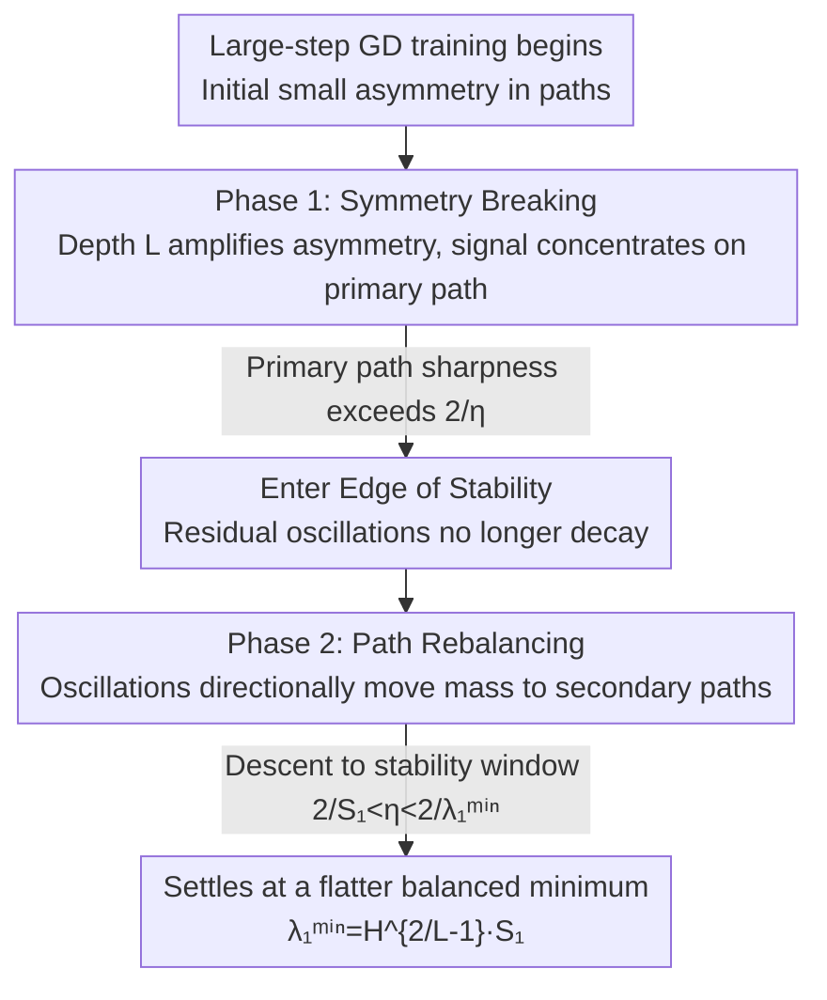

# Gradient Descent with Large Step Size Restores Symmetry in Deep Linear Networks with Multi-Pathway

**Conference**: ICML 2026  
**arXiv**: [2606.05219](https://arxiv.org/abs/2606.05219)  
**Code**: To be confirmed  
**Area**: Optimization Theory / Deep Linear Networks / Implicit Bias / Edge of Stability  
**Keywords**: Multi-pathway Deep Linear Networks, Large Learning Rate, Symmetry Breaking, Edge of Stability, Sharpness

## TL;DR
Previous analyses using Gradient Flow (GF) for multi-pathway deep linear networks concluded a "winner-takes-all" phenomenon—signals concentrate on a single path, leading to symmetry breaking. This paper demonstrates that discrete Gradient Descent (GD) with large step sizes tell a different story: single-path solutions are sharp minima; distributing signals across multiple paths reduces sharpness by a factor of $H^{2/L-1}$. Consequently, oscillations at the Edge of Stability (EoS) overturn early symmetry breaking and enter a "path rebalancing" phase, ultimately favoring shared over single-path exclusive representations.

## Background & Motivation

**Background**: Understanding the training dynamics of deep networks and characterizing the "implicit bias" of optimizers (selecting among many global minima) is a core problem in deep learning theory. Deep Linear Networks (DLN) serve as a standard testbed because they are analytically tractable while retaining the essence of over-parameterization and representation learning. Recently, multi-branch/multi-pathway DLNs have gained attention: Shi et al. (2022) proved using GF that parallel paths exhibit "winner-takes-all" behavior—one path dominates feature learning while others become redundant, causing symmetry breaking.

**Limitations of Prior Work**: Gradient flow assumes an infinitesimal learning rate, representing a continuous-time approximation that **ignores the discrete dynamics of large-step GD used in practice**. Real training often operates at the Edge of Stability (EoS), where GD actively interacts with the loss curvature to avoid sharp minima. Thus, a key question remains: does the symmetry breaking predicted by GF still hold under large learning rate GD?

**Key Challenge**: There are two opposing forces at play. One is the **architectural bias** of GF—where depth $L$ amplifies initial small asymmetries by the power of $L-1$, forcing the system toward single-path dominance. The second is the **implicit bias** of large-step GD—which tends toward flat minima. A small learning rate allows the former to dominate, reproducing symmetry breaking; however, once the learning rate is large enough to destabilize sharp single-path minima, the latter should push the network toward flat, balanced configurations across paths. Which one wins and when the transition occurs is what this paper aims to answer.

**Goal**: To answer this by decomposing the training of multi-pathway DLNs into "geometry + dynamics" layers: (1) Which is sharper on the loss landscape, single-path or balanced solutions? (2) Will the oscillations of large-step GD push the network from single-path back to balance, and how? (3) How large can the learning rate be without causing the trajectory to collapse?

**Key Insight**: Decouple the dynamics into scalar recursions per mode on the target-aligned SVS (Singular Vector Stationary) manifold, allowing closed-form characterization of sharpness, phase, and stability.

**Core Idea**: Replace the "asymptotics of continuous GF" with "directional oscillations of discrete GD at EoS" to re-evaluate multi-path competition—proving that balanced solutions are flatter and that oscillations are a directional drift moving mass from the primary path to secondary paths, rather than mere noise.

## Method

### Overall Architecture

This is a pure theoretical analysis focused on a deep linear network with $H$ parallel paths, each of depth $L_h$: the end-to-end mapping of the $h$-th path is the product of weights $\Omega_h=W_{hL_h}\cdots W_{h1}$, and the total network mapping is the sum of paths $M=\sum_{h=1}^H\Omega_h$. The Frobenius loss $\mathcal L(\Theta)=\tfrac12\|M-M_\star\|_F^2$ is used to fit the target matrix. The analysis progresses in three parts: first, decoupling the loss by target singular modes on the SVS manifold to calculate the sharpness of each global minimum (Section 4); then, characterizing the two-phase dynamics of large-step GD—early symmetry breaking followed by late-stage rebalancing (Section 5); and finally, deriving the upper bound of the learning rate from the "deep linear chain" to ensure the trajectory survives oscillations without collapsing (Section 6). The pivotal turning point is "sharpness = the scale for selecting minima by learning rate."

### Key Designs

**1. SVS Decoupling: Reducing multi-path dynamics to per-mode scalar recursions**

Directly analyzing the non-convex dynamics of weight multiplication is difficult. The authors follow target-aligned parameterization: let the target SVD be $M_\star=U_\star\Sigma_\star V_\star^\top$, and align each path's end-to-end singular vectors with the target—the SVS set requires each layer $W_{h\ell}=Q_{h\ell+1}\Sigma_{h\ell}Q_{h\ell}^\top$, with the first and last orthogonal matrices fixed as $V_\star,U_\star$. Thus, adjacent orthogonal matrices cancel out in the product, and the path mapping $\Omega_h=U_\star(\prod_\ell\Sigma_{h\ell})V_\star^\top$ is diagonal in the target basis. GD preserves the SVS set, so it suffices to track scalar mode coefficients $\sigma_{hi}=u_{\star i}^\top\Omega_h v_{\star i}$ and $\sigma_i=\sum_h\sigma_{hi}$, neatly decoupling the loss into $\mathcal L=\sum_i \tfrac12(\sum_h\sigma_{hi}-\sigma_{\star i})^2$. Combined with depth-balanced initialization $W_{h\ell}(0)=\alpha_h^{1/L_h}I_d$, the trajectory is pinned to the "depth-balanced manifold" (where internal singular values satisfy $\sigma_{hi}^{(\ell)}=\sigma_{hi}^{1/L_h}$), allowing sharpness and dynamics to be calculated in closed form. This serves as the scaffolding for all subsequent conclusions.

**2. Sharpness-Parallelism Theorem: Distributing signals to $H$ paths reduces sharpness by $H^{2/L-1}$**

The challenge is judging whether "single-path vs. balanced" solutions are more likely filtered out by large learning rates, requiring quantified sharpness. Sharpness = the maximum eigenvalue of the Hessian at a global minimum. On the SVS depth-balanced manifold, the Hessian is block-diagonal by mode, and each block is rank-one; the non-zero eigenvalue for mode $i$ is:

$$\lambda_i=L\sum_{h=1}^H \sigma_{hi}^{2-\frac{2}{L}}$$

When $L>2$, under the constraint $\sum_h\sigma_{hi}=\sigma_{\star i}$, $\lambda_i$ is minimized at **equipartition** ($\sigma_{1i}=\cdots=\sigma_{Hi}=\sigma_{\star i}/H$), with the minimum sharpness $\lambda_i^{\min}=L\,H^{2/L-1}\sigma_{\star i}^{2-2/L}$. Compared to a single path, the reduction factor is:

$$\frac{\lambda_i^{\min}}{\lambda_i^{\min}(H=1)}=H^{\frac{2}{L}-1}<1$$

Since $2/L-1<0$, the larger the number of paths $H$ or depth $L$, the smaller the ratio and the flatter the balanced solution. This theorem is the backbone: it shows that **sparse single-path solutions are the sharpest configurations on the depth-balanced manifold, while balanced solutions are the flattest**—thus, large learning rates naturally reject the former.

**3. Two-phase Rebalancing Dynamics: EoS oscillations as directional drift, not noise**

With the sharpness ranking established, Section 5 characterizes the trajectory under a large learning rate ($\eta>2/S_1$, where $S_1=L\sigma_{\star1}^{2-2/L}$ is the single-path sharpness). **Phase 1: Symmetry Breaking**: Early in training, singular values are small and local sharpness is below $2/\eta$. Dynamics resemble GF, where the relative growth rate $\dot\sigma_{hi}/\dot\sigma_{ki}=(\sigma_{hi}/\sigma_{ki})^{L-1}$ amplifies initial asymmetries by depth $L$, concentrating signals in the primary path. **Phase 2: Rebalancing**: As the primary path $\sigma_{11}$ approaches $\sigma_{\star1}$ and sharpness rises above $2/\eta$, GD can no longer settle into this sharp minimum and enters EoS, where residuals oscillate instead of decaying. The authors use conservation law analysis in the appendix to clarify the mechanism: under GF, a conservation law fixes the "path imbalance coordinate" $z$, and zero-loss sharpness grows with $\|z\|^2$; large-step GD breaks this law at EoS—under self-stabilization, residuals alternate signs and $\|z\|$ decays slightly every two steps, turning oscillations into a **directional drift towards the flat/balanced minimum**. This drift occurs only when sharpness exceeds $2/\eta$, spreading $\sigma_{hi}$ until it falls within the stability window $2/S_1<\eta<2/\lambda_1^{\min}$. With heterogeneous depths ($L_h$ varies), the conclusion is stronger: GF favors "dynamically faster" shallow paths, while large-step GD favors "flatter" distributed configurations; the two forces conflict, and GD eventually overrides structural asymmetry to distribute signals according to the Lagrange condition in Eq. (18).

**4. Worst-case Return Threshold (WCR): Deeper networks tolerate wider large-step windows**

Rebalancing requires $\eta>2/S_1$, but $\eta$ also has an upper bound: rebalancing must first pass through a transient single-path phase, and excessive steps could push primary path singular values past zero, causing sign flips, destroying the SVS description, and failing rebalancing. The worst case occurs when signals are concentrated in a single path—degenerating into a 1D "deep linear chain" mapping $w_{t+1}=w_t-\eta\,w_t^{L-1}(w_t^L-\sigma_{\star1})$, with fixed point $w_\star=\sigma_{\star1}^{1/L}$. "Two-step return safety" is defined: any overshoot from $(0,w_\star)$ must return within $(0,w_\star)$ after one more step. This yields the Worst-case Return threshold $\eta_{\mathrm{WCR}}(L,\sigma_{\star1})=\gamma_{\mathrm{WCR}}(L)/S_1$, where $\gamma_{\mathrm{WCR}}(L)>2$ depends only on depth and is the root of a single scalar equation (solvable via bisection). Key conclusion: $\gamma_{\mathrm{WCR}}(L)=\Theta(\log L)$ grows unboundedly with depth, so **deep networks tolerate a larger "overshoot but returnable" learning rate window**—this also explains why learning-rate warm-up is useful: sharpness is highest during the early formation of the primary path, and an early large step might exceed $\eta_{\mathrm{WCR}}$ to trigger a sign flip; warm-up delays the large step until the trajectory has passed the most vulnerable single-path bottleneck.

### Loss Function / Training Strategy
The training objective is the squared Frobenius loss in Eq. (3), and optimization is standard discrete GD (Eq. 4) with a fixed step size $\eta$. Theoretical results center on "which interval $\eta$ falls into": $\eta<2/S_1$ reproduces GF symmetry breaking; $2/S_1<\eta<\min\{2/\lambda_1^{\min},\eta_{\mathrm{WCR}}\}$ triggers and stabilizes rebalancing; more generally, falling into $2/S_p<\eta<\min\{2/S_{p+1},\eta_{\max}\}$ rebalances the first $p$ modes (rank-$p$ balance). Verification uses numerical experiments with $L=20, H=2$ linear networks (Figs. 1–2, 4) and two-path MLPs with Tanh activation (Fig. 3) to observe the same phase transitions.

## Key Experimental Results

As this is a theoretical paper, "experiments" consist of numerical/visualizations validating the theory rather than benchmark comparison tables. The table below summarizes core theoretical conclusions vs. learning rate intervals:

### Main Results (Theoretical + Numerical Validation)

| Learning Rate Interval | Dynamical Behavior | Final State | Validation |
|--------|------|------|------|
| $\eta<2/S_1$ (Small step) | Close to GF | Single-path dominance (Winner-takes-all) | Fig. 1 top row |
| $2/S_1<\eta<2/\lambda_1^{\min}$ (Large step) | Symmetry breaking → EoS oscillation → Rebalancing | Balanced across paths (Flatter) | Figs. 1–2 |
| $\eta=2/\lambda_1^{\min}$ | Settles exactly at the balance boundary | Fully balanced minimum | Fig. 1 |
| $\eta>\eta_{\mathrm{WCR}}$ | Transient single-path overshoot past zero | Sign flip, rebalancing fails | Fig. 5 |

### Key Quantitative Relations

| Quantity | Expression | Meaning |
|------|---------|------|
| Mode Sharpness | $\lambda_i=L\sum_h\sigma_{hi}^{2-2/L}$ | Top Hessian eigenvalue at global minimum |
| Min Balanced Sharpness | $\lambda_i^{\min}=L\,H^{2/L-1}\sigma_{\star i}^{2-2/L}$ | Achieved at equipartition |
| Parallel Reduction Factor | $H^{2/L-1}<1$ | Reduction ratio relative to single-path sharpness |
| WCR Ratio | $\gamma_{\mathrm{WCR}}(L)=\Theta(\log L)$ | Safety large-step window grows with depth |

### Key Findings
- **GD vs. GF yield qualitatively opposite predictions**: For the same architecture, a small step size reproduces GF's winner-takes-all, while a large step leads to balance—implicit bias depends not only on architecture but more importantly on discrete step size.
- **Oscillation is a "feature," not a "bug"**: Violent oscillations at EoS are not numerical noise but a directional force moving mass from primary to secondary paths, actively pulling the network toward flat minima.
- **Depth plays a dual role**: It exacerbates early symmetry breaking by amplifying asymmetry via $L-1$ powers, but it also expands the rebalancable learning rate window via $\Theta(\log L)$—depth makes symmetry breaking stronger, but also makes GD more capable of reversing it.
- **Generalization to Non-linearity**: Tanh two-path MLPs similarly transition from winner-takes-all to a balanced $K_{11}\approx K_{21}$ configuration under large learning rates (Fig. 3), though they typically require slightly larger $\eta$ than linear networks.

## Highlights & Insights
- **The "Sharpness ranking determines implicit bias" storyline is clean**: Prove single-path = sharpest and balanced = flattest, then let large-step GD naturally filter out sharp solutions—turning a dynamical problem into a geometric one, creating a logical closed loop.
- **Explaining EoS oscillations as directional drift** and providing a mechanism via broken conservation laws + self-stabilization (rather than just descriptive phenomenology) is a step beyond empirical observation.
- **The WCR threshold naturally explains warm-up**: Deeper networks have wider safety windows, but early sharpness peaks may exceed the top boundary, necessitating small steps through the fragile transient phase before scaling up—an insight transferable to general deep networks.
- **"Disenchantment" of GF-based conclusions**: Conclusions based on continuous-time analysis (e.g., lottery tickets, sparse subnetworks, structural bias toward shallow paths) may be rewritten by large-step discrete dynamics, suggesting a needed re-evaluation of such analyses.

## Limitations & Future Work
- The theory strictly holds for deep **linear** networks + SVS depth-balanced manifold + square $d\times d$ matrices + aligned targets; non-linearity is only empirically observed on Tanh MLPs without rigorous proof.
- Conclusions depend on depth-balanced initialization ($W_{h\ell}(0)=\alpha_h^{1/L_h}I$) and symmetric targets $M_\star=V_\star\Sigma_\star V_\star^\top$; whether trajectories remain on the manifold under general initialization/asymmetric targets is not fully covered.
- Characterization of sharpness-rebalancing focuses on the top mode, finite paths, and depth ranges (numerical experiments mostly $L\le20, H=2$, heterogeneous $\{3,5,7\}$); extrapolation to ultra-deep, ultra-wide, or real large models remains an open question.
- Authors' stated next steps: extending analysis to modular architectures like Mixture-of-Experts and Multi-head Attention—which can be viewed as "multi-pathway" but with non-linearities and gating, increasing difficulty.

## Related Work & Insights
- **vs. Shi et al. (2022) (GF Multi-pathway)**: They proved winner-takes-all using GF; this paper shows that once the infinitesimal learning rate assumption is dropped for large-step GD, winner-takes-all is no longer persistent and is overridden by rebalancing—a direct correction of the former's applicability boundary.
- **vs. Ghosh et al. (2025) (Edge-of-Stability in Deep Matrix Factorization)**: They studied oscillations and convergence after crossing the stability threshold in single-path scenarios, focusing on "interlayer balance gaps" (visible only with asymmetric initialization). This paper extends to multi-pathway scenarios and emphasizes that path imbalance is a **spontaneous attractor** of GF regardless of initialization, with GD's discrete instability actively countering this intrinsic bias.
- **vs. Damian et al. (2023) / Cohen et al. (2021, 2025) (EoS / Self-stabilization / Central Flow)**: These works characterize how GD escapes sharp directions toward flat minima; this paper instantiates this mechanism within multi-pathway competition, providing an analytical picture of "oscillation = directional mass transfer between paths."

## Rating
- Novelty: ⭐⭐⭐⭐⭐ Uses discrete large-step GD to overturn GF's winner-takes-all and provides a closed-loop theory of sharpness-rebalancing-WCR.
- Experimental Thoroughness: ⭐⭐⭐⭐ Theoretically consistent with linear/non-linear numerical validation, though lacks large-scale empirical evidence (due to theoretical constraints).
- Writing Quality: ⭐⭐⭐⭐ Clear three-phase progression; notation is dense and requires optimization theory background.
- Value: ⭐⭐⭐⭐ Warns that a class of GF-based architectural bias conclusions needs re-evaluation under discrete dynamics and explains warm-up along the way.

<!-- RELATED:START -->

## Related Papers

- [\[ICML 2026\] Flatland: The Adventures of Gradient Descent with Large Step Sizes](flatland_the_adventures_of_gradient_descent_with_large_step_sizes.md)
- [\[ICLR 2026\] Gradient Descent with Large Step Sizes: Chaos and Fractal Convergence Region](../../ICLR2026/optimization/gradient_descent_with_large_step_sizes_chaos_and_fractal_convergence_region.md)
- [\[ICML 2026\] Balancing Learning Rates Across Layers: Exact Two-Step Dynamics and Optimal Scaling in Linear Neural Networks](balancing_learning_rates_across_layers_exact_two-step_dynamics_and_optimal_scali.md)
- [\[ICML 2026\] Dynamics and Representation Structure of Local Approximations to Gradient-Based Learning in Linear Recurrent Neural Networks](dynamics_and_representation_structure_of_local_approximations_to_gradient-based_.md)
- [\[ICML 2026\] Adaptive Sharpness-Aware Minimization with a Polyak-type Step size: A Theory-Grounded Scheduler](adaptive_sharpness-aware_minimization_with_a_polyak-type_step_size_a_theory-grou.md)

<!-- RELATED:END -->
