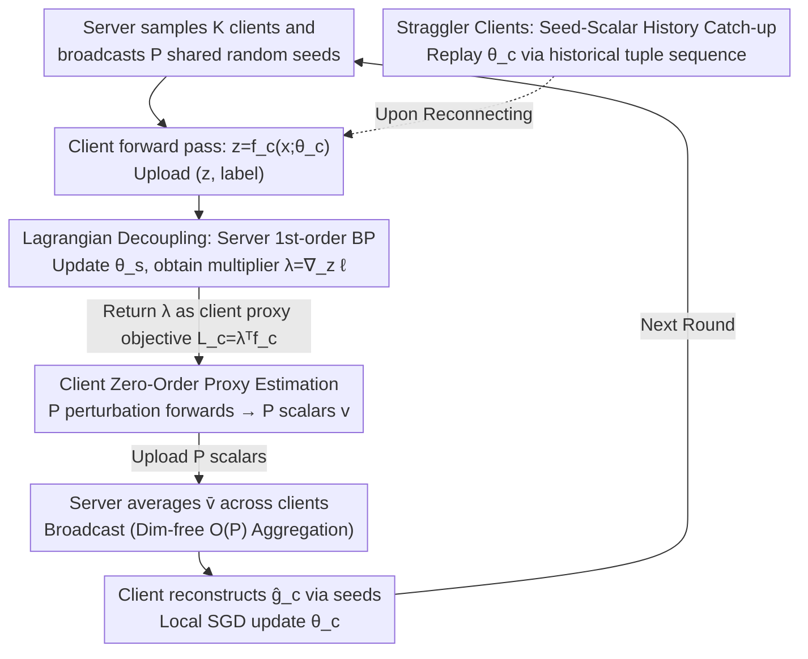

# HO-SFL: Hybrid-Order Split Federated Learning with Backprop-Free Clients and Dimension-Free Aggregation

**Conference**: ICML 2026  
**arXiv**: [2603.14773](https://arxiv.org/abs/2603.14773)  
**Code**: Not disclosed  
**Area**: Optimization / Federated Learning / Distributed Training  
**Keywords**: Split Federated Learning, Zero-Order Optimization, Backprop-Free, Dimension-Free Aggregation, Edge Fine-tuning

## TL;DR
HO-SFL decouples the client and server in split federated learning (SFL) via Lagrangian variable lifting. The server continues to perform first-order backpropagation (BP), while the client performs only zero-order (ZO) perturbed forward passes. By utilizing shared random seeds, the uplink communication per round is compressed to $\mathcal{O}(P)$ scalars, reducing edge VRAM to inference levels for large model fine-tuning while maintaining a convergence rate of $\mathcal{O}(\sqrt{d_c/PT})$.

## Background & Motivation

**Background**: Edge fine-tuning of large models has become a new requirement in federated learning. Mainstream frameworks include FL (McMahan 2017) and SFL (Thapa 2022). The latter splits the model into two parts: a heavy server-side segment for large-scale computation and a light client-side segment on edge devices to reduce computational pressure.

**Limitations of Prior Work**: Standard SFL still requires clients to execute a full BP on their sub-model to obtain gradients. For LLMs with billions of parameters, the activation cache required for BP far exceeds the memory of mobile or IoT devices, even when only a few layers are kept. Works like MeZO replace BP with zero-order optimization (ZO) to reduce VRAM to inference levels, but the variance of the ZO estimator scales linearly with dimension $d$, causing the convergence rate to degrade to $\mathcal{O}(\sqrt{d/T})$, which is nearly infeasible for large models.

**Key Challenge**: BP is accurate but memory-intensive; ZO is memory-efficient but converges slowly. Directly combining them (e.g., FedZO, MU-SplitFed) still leaves the entire system burdened by high-dimensional ZO variance, as the client and server share the same optimization objective $\ell(f_s(f_c(\bm x;\bm\theta_c);\bm\theta_s),y)$. Since parameters are coupled, both sides must use the same optimization order.

**Goal**: To decouple client-server optimization, allowing each side to select the most suitable optimization order for its resources, while compressing model aggregation communication from $\mathcal{O}(d_c)$ to $\mathcal{O}(P)$.

**Key Insight**: The implicit equality "client activation = server input" $\bm z=f_c(\bm x;\bm\theta_c)$ is expressed as an explicit equality constraint. By introducing a Lagrangian multiplier $\bm\lambda$ through variable lifting, the original composite objective is split into two decoupled sub-problems.

**Core Idea**: The server-side activation gradient $\bm\lambda=\nabla_{\bm z}\ell$ derived from BP serves as the optimal Lagrangian multiplier for the constraint problem. By treating it as the client's "local proxy objective" $\mathcal{L}_c(\bm\theta_c)=\bm\lambda^\top f_c(\bm x;\bm\theta_c)$, the client only needs to perform ZO perturbation estimation on this scalar proxy function. Since the proxy function at the client side is only $d_c\ll d$ dimensional, it fundamentally isolates the ZO dimensional dependency to a small subspace.

## Method

### Overall Architecture
A single communication cycle consists of four phases: ① The server samples $K$ clients and broadcasts a set of shared random seeds $\{s_p^t\}_{p=1}^P$. ② Each client performs a forward pass with current parameters $\bm\theta_c^t$ to obtain activations $\bm z_m^t=f_c(\bm x_m;\bm\theta_c^t)$, which are uploaded to the server along with labels. ③ The server completes the remaining forward pass $\hat y_m=f_s(\bm z_m^t;\bm\theta_s^t)$ and standard BP to obtain $\bm g_{s,m}^t=\nabla_{\bm\theta_s}\ell$ and activation gradients $\bm\lambda_m^t=\nabla_{\bm z_m^t}\ell$; it updates $\bm\theta_s$ and returns $\bm\lambda_m^t$ to the corresponding client. ④ Each client regenerates $P$ Gaussian perturbations $\bm u_p^t\sim\mathcal{N}(\bm 0,\bm I_{d_c})$ using the shared seeds, runs $P$ small perturbation forward passes $\tilde{\bm z}_{m,p}^t=f_c(\bm x_m;\bm\theta_c^t+\mu\bm u_p^t)$, and computes $P$ **scalars** $v_{m,p}^t=\bm\lambda_m^{t\top}(\tilde{\bm z}_{m,p}^t-\bm z_m^t)$ to upload. The server averages these across clients to obtain $\bar v_p^t$ and broadcasts it back. Clients regenerate $\bm u_p^t$ using the same seeds and reconstruct the gradient estimate $\hat{\bm g}_c^t=\frac{1}{P\mu}\sum_p\bar v_p^t\bm u_p^t$ for a local SGD step.

In this workflow, the client never performs backpropagation, never stores activation maps, and never uploads/downloads vectors the size of parameter dimensions.

### Key Designs

**1. Objective Rewriting via Lagrangian Decoupling: Splitting the SFL Objective**

Previous works like FedZO/MU-SplitFed perform ZO on the overall objective $\ell(f_s(f_c(\bm x;\bm\theta_c);\bm\theta_s),y)$, where variance is tied to the total model dimension $d$ because client and server parameters are coupled. This paper explicitly writes the constraint $\bm z=f_c(\bm x;\bm\theta_c)$ and constructs the Lagrangian via variable lifting:

$$\mathcal{L}_\lambda=\ell(f_s(\bm z;\bm\theta_s),y)+\bm\lambda^\top(f_c(\bm x;\bm\theta_c)-\bm z)$$

Solving for the stationary condition $\nabla_{\bm z}\mathcal{L}_\lambda=\bm 0$ yields $\bm\lambda^t=\nabla_{\bm z}\ell(f_s(\bm z^t;\bm\theta_s^t),y)$. This is exactly the activation gradient already computed in the BP chain rule, providing the multiplier at "zero extra computational cost." The client sub-objective becomes $\mathcal{L}_c(\bm\theta_c)=\bm\lambda^\top f_c(\bm x;\bm\theta_c)$. Each side can now choose its optimal optimization order. Crucially, client ZO now only acts on $\mathcal{L}_c$, shrinking dimensional dependency from $d$ to $d_c$, which enables the $\mathcal{O}(\sqrt{d_c/PT})$ convergence rate.

**2. Client ZO Proxy Estimation with Server Feedback: BP-Free and Directionally Aligned**

To obtain low-variance, accurate gradient estimates without BP or activation maps, the client fixes an anchor $\bm z_m^t=f_c(\bm x_m;\bm\theta_c^t)$. For each shared seed $s_p^t$, it regenerates perturbation $\bm u_p^t$ and performs forward passes $\tilde{\bm z}_{m,p}^t$. Since the proxy function $\bm\lambda^\top f_c$ is linear with respect to $\bm\theta_c$ (once $\bm\lambda$ is fixed), the finite difference simplifies into a scalar $v_{m,p}^t=\bm\lambda_m^{t\top}(\tilde{\bm z}_{m,p}^t-\bm z_m^t)$. Clients only upload $P$ scalars. The server broadcasts the average $\bar v_p^t = \frac{1}{K}\sum_m v_{m,p}^t$, and clients reconstruct $\hat{\bm g}_c^t = \frac{1}{P\mu}\sum_p\bar v_p^t\bm u_p^t$. This achieves three things: "navigation" of the ZO estimate by server feedback for accuracy, dimension-free $\mathcal{O}(P)$ aggregation, and latency masking through parallelization of client perturbations and server BP.

**3. Seed-Scalar History Catch-up for Stragglers: Scalars instead of Gigabytes**

Standard FL/SFL requires re-downloading the entire model (often GBs for LLMs) when a client reconnects. HO-SFL has the server store historical broadcast tuples $\{(s_p^\tau, \bar v_p^\tau)\}_{p,\tau}$. A client stuck at round $t'$ only needs to pull tuples for $\tau\in[t',t)$, reconstruct perturbations $\bm u_p^\tau=\mathrm{PRG}(s_p^\tau)$, and sequentially replay updates $\bm\theta_c^{\tau+1}\leftarrow\bm\theta_c^\tau-\eta\hat{\bm g}_c^\tau$. Model synchronization is transformed from "parameter transmission" to "scalar transmission," keeping the downlink at $\mathcal{O}(P)$.

### Loss & Training
The global objective remains $\mathcal{L}(\bm\theta)=\frac{1}{M}\sum_m\mathbb{E}_{\xi_m\sim\mathcal{D}_m}[\ell(\bm\theta;\xi_m)]$. By choosing a learning rate $\eta=\Theta(\sqrt{P/(T d_c)})$ and a smoothing parameter $\mu=\mathcal{O}((PT)^{-1/4}d_c^{-5/4})$, the bias term is kept at the same order as variance and optimization terms, resulting in the convergence rate $\mathcal{O}(\sqrt{d_c/PT})$. Settings use $P=5$ for vision and $P=2$ for language tasks, with $\mu=10^{-3}$.

## Key Experimental Results

### Main Results

| Task / Model | Metric | SplitLoRA (1st-Order) | ZO-SFL (Pure ZO) | HO-SFL (Ours) |
|--------|------|------|----------|------|
| GLUE-SST2 / OPT-125M | Acc (%) | 87.5 | 52.8 | **87.6** |
| GLUE-RTE / OPT-125M | Acc (%) | 57.8 | 52.0 | **59.2** |
| GLUE-SST2 / Gemma-3-270M | Acc (%) | 90.3 | 51.8 | **90.8** |
| GLUE-RTE / Gemma-3-270M | Acc (%) | 59.6 | 54.2 | **65.0** |
| GLUE-SST2 / LLaMA-3.2-1B | Acc (%) | **94.4** | 61.5 | 93.9 |
| GLUE-RTE / LLaMA-3.2-1B | Acc (%) | 70.0 | 49.1 | **73.3** |
| SQuAD / LLaMA-3.2-1B | F1 | ≈ 0.60 (FO) | DNF | Matches FO |

On CIFAR-10, HO-SFL convergence curves nearly match SFL in IID settings. In Non-IID settings, HO-SFL outperforms SFL because it allows for step-wise aggregation (dimension-free), whereas SFL suffers from client drift.

### Ablation Study

| Dimension | SFL / SplitLoRA | ZO-SFL / MU-SplitFed | HO-SFL |
|------|---------|---------|---------|
| Client BP Required | Yes | No | **No** |
| Client VRAM | Training-level | Inference-level | **Inference-level** |
| Aggregation Uplink | $\mathcal{O}(d_c)$ | $\mathcal{O}(d_c)$ | **$\mathcal{O}(P)$** |
| Convergence Rate Dim-dep | $d$-independent (FO) | $\mathcal{O}(\sqrt{d/T})$ | **$\mathcal{O}(\sqrt{d_c/PT})$** |
| Non-IID Robustness | Impacted by drift | Poor/Non-convergent | Minimal impact |
| Straggler Recovery | Full model downlink | Full model downlink | **$\mathcal{O}(P)$ scalars + seeds** |

### Key Findings
- **Dimensional Decoupling**: Restricting ZO to the client segment $d_c$ rather than the total $d$ improves the theoretical rate from $\mathcal{O}(\sqrt{d/T})$ to $\mathcal{O}(\sqrt{d_c/PT})$. This is reflected in results where pure ZO baselines fail on LLMs, but HO-SFL matches first-order performance.
- **Scalability**: As model size scales from 125M to 8B (64×), HO-SFL performance remains consistent with SplitLoRA, proving its structural scalability.
- **Non-IID Advantage**: Dimension-free aggregation allows frequent (step-wise) global updates, which significantly suppresses client drift compared to standard SFL.

## Highlights & Insights
- Using Lagrangian multipliers to absorb activation consistency is an elegant use of convex optimization tools. The multiplier being exactly the activation gradient ensures zero additional overhead.
- The linearity of the client proxy objective $\bm\lambda^\top f_c(\bm x;\bm\theta_c)$ with respect to $\bm\theta_c$ (given fixed $\bm\lambda$) cleans up the variance structure compared to applying ZO to the full loss, which is fundamental for hybrid-order scaling.
- The combination of shared seeds, scalar aggregation, and PRG history replay transforms model synchronization into a scalar problem, a system design trick applicable to most federated frameworks.

## Limitations & Future Work
- The server still performs full BP; this solution reduces client VRAM but not server computation, making it dependent on a powerful central server.
- Theoretical analysis relies on gradient regularity constant $\Gamma$. For very deep client segments (large $d_c$), this constant may degrade.
- Benefits are limited to the client segment; server-side parameters remain large. Further research is needed for massive ZO scaling on the server.
- Sequential catch-up $\mathcal{O}(t-t')$ for stragglers could become a bottleneck in highly heterogeneous device populations.

## Related Work & Insights
- **vs MeZO (Malladi 2023)**: MeZO uses ZO to reduce LLM VRAM on a single machine. HO-SFL adapts this to SFL but prevents variance explosion by using server BP feedback as "navigation."
- **vs DeComFL (Li 2025)**: DeComFL uses shared seeds for dimension-free communication in FL. HO-SFL extends this to SFL with hybrid optimization.
- **vs MU-SplitFed (Liang 2026)**: MU-SplitFed uses unbalanced server-client updates but remains essentially pure ZO. HO-SFL provides a cleaner Lagrangian decoupling.
- **vs FSL-SAGE (Nair 2025)**: FSL-SAGE uses client auxiliary models to estimate server gradients for parallelization, but clients still run BP. HO-SFL eliminates client BP entirely.

<!-- RELATED:START -->

## Related Papers

- [\[NeurIPS 2025\] Covariances for Free: Exploiting Mean Distributions for Training-free Federated Learning](../../NeurIPS2025/optimization/covariances_for_free_exploiting_mean_distributions_for_training-free_federated_l.md)
- [\[ICML 2026\] Learning Dynamics of Zeroth-Order Optimization: A Kernel Perspective](learning_dynamics_of_zeroth-order_optimization_a_kernel_perspective.md)
- [\[ICML 2026\] Learning a Zeroth-Order Optimizer for Fine-Tuning LLMs](learning_a_zeroth-order_optimizer_for_fine-tuning_llms.md)
- [\[ICML 2026\] Distribution-Free Uncertainty Quantification for Continuous AI Agent Evaluation](distribution-free_uncertainty_quantification_for_continuous_ai_agent_evaluation.md)
- [\[ICML 2026\] Delayed Momentum Aggregation: Communication-efficient Byzantine-robust Federated Learning with Partial Participation](delayed_momentum_aggregation_communication-efficient_byzantine-robust_federated_.md)

<!-- RELATED:END -->
