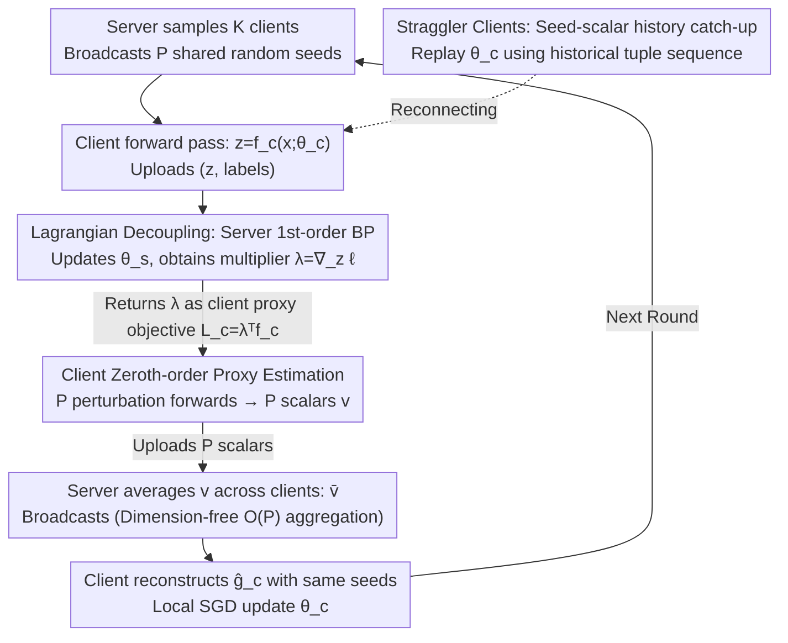

# HO-SFL: Hybrid-Order Split Federated Learning with Backprop-Free Clients and Dimension-Free Aggregation

**Conference**: ICML 2026  
**arXiv**: [2603.14773](https://arxiv.org/abs/2603.14773)  
**Code**: Not released  
**Area**: Optimization / Federated Learning / Distributed Training  
**Keywords**: Split Federated Learning, Zeroth-Order Optimization, Backprop-Free, Dimension-Free Aggregation, Edge Fine-tuning

## TL;DR
HO-SFL decouples the client and server in Split Federated Learning (SFL) through Lagrangian variable lifting. The server continues to execute first-order backpropagation (BP), while clients perform only zeroth-order (ZO) perturbed forward passes. By leveraging shared random seeds, the uplink communication per round is compressed to $\mathcal{O}(P)$ scalars. This reduces the VRAM requirement for fine-tuning large models on edge devices to inference-level while maintaining a convergence rate of $\mathcal{O}(\sqrt{d_c/PT})$.

## Background & Motivation

**Background**: Fine-tuning large models on edge devices has become a critical demand in federated learning. Dominant frameworks include FL (McMahan 2017) and SFL (Thapa 2022). The latter splits the model into two parts by layers: the heavy server-side segment handles intensive computation, while the lightweight client-side segment remains on the edge to reduce client-side computational pressure.

**Limitations of Prior Work**: Standard SFL still requires clients to perform a full BP on their local sub-model to obtain gradients. For LLMs with millions or billions of parameters, the activation cache required for BP far exceeds the memory capacity of smartphones or IoT devices, even if only a few layers are kept on the client. Recent works like MeZO use zeroth-order optimization (ZO) instead of BP to reduce VRAM to inference levels; however, the variance of ZO estimators scales linearly with the dimension $d$, causing the convergence rate to degrade to $\mathcal{O}(\sqrt{d/T})$, which is nearly impractical for large models.

**Key Challenge**: BP is accurate but memory-intensive; ZO is memory-efficient but converges slowly. Directly combining them (e.g., FedZO, MU-SplitFed) causes the entire system to suffer from the high-dimensional variance of ZO because the client and server share a single optimization objective $\ell(f_s(f_c(\bm x;\bm\theta_c);\bm\theta_s),y)$. Their parameters are coupled, forcing the entire system to be constrained by the same optimization order.

**Goal**: Decouple the client-server dependency to allow each side to choose the optimization order best suited to its resources, while compressing model aggregation communication from $\mathcal{O}(d_c)$ to $\mathcal{O}(P)$.

**Key Insight**: Explicitly formulate the implicit equality "client activation = server input" ($\bm z=f_c(\bm x;\bm\theta_c)$) as an equality constraint. By introducing a Lagrangian multiplier $\bm\lambda$ through variable lifting, the original composite objective is split into two decoupled sub-problems.

**Core Idea**: The activation gradient $\bm\lambda=\nabla_{\bm z}\ell$ derived from the server's BP is effectively the optimal Lagrangian multiplier for the constrained problem. By treating this as the client's "local proxy objective" $\mathcal{L}_c(\bm\theta_c)=\bm\lambda^\top f_c(\bm x;\bm\theta_c)$, the client only needs to perform ZO perturbation estimation on this scalar proxy function. Since the proxy function operates only on the client-side dimension $d_c\ll d$, this fundamentally isolates the ZO dimensionality dependence to a small subspace.

## Method

### Overall Architecture
A single communication cycle consists of four phases: ① The server samples $K$ clients and broadcasts a set of shared random seeds $\{s_p^t\}_{p=1}^P$; ② Each client performs a forward pass with the current parameters $\bm\theta_c^t$ to obtain activations $\bm z_m^t=f_c(\bm x_m;\bm\theta_c^t)$, which are uploaded to the server along with labels; ③ The server completes the remaining forward pass $\hat y_m=f_s(\bm z_m^t;\bm\theta_s^t)$ and standard BP to obtain $\bm g_{s,m}^t=\nabla_{\bm\theta_s}\ell$ and activation gradients $\bm\lambda_m^t=\nabla_{\bm z_m^t}\ell$. It updates $\bm\theta_s$ and sends $\bm\lambda_m^t$ back to the corresponding client; ④ Each client regenerates $P$ Gaussian perturbations $\bm u_p^t\sim\mathcal{N}(\bm 0,\bm I_{d_c})$ using the shared seeds, performs $P$ small-perturbation forward passes $\tilde{\bm z}_{m,p}^t=f_c(\bm x_m;\bm\theta_c^t+\mu\bm u_p^t)$, calculates $P$ **scalars** $v_{m,p}^t=\bm\lambda_m^{t\top}(\tilde{\bm z}_{m,p}^t-\bm z_m^t)$ and uploads them. The server averages these across clients to obtain $\bar v_p^t$ and broadcasts it. Clients use the same seeds to regenerate $\bm u_p^t$ and reconstruct the gradient estimate $\hat{\bm g}_c^t=\frac{1}{P\mu}\sum_p\bar v_p^t\bm u_p^t$ to complete one local SGD step.

Throughout this process, the client never performs backpropagation, never stores activation maps, and never uploads or downloads vectors of parameter-dimension size.

### Key Designs

**1. Objective Rewriting via Lagrangian Decoupling: Splitting the SFL step into independent sub-problems.**

Previous works like FedZO/MU-SplitFed perform ZO on the entire objective $\ell(f_s(f_c(\bm x;\bm\theta_c);\bm\theta_s),y)$, where the variance depends on the full model dimension $d$ because the client and server parameters are coupled. This paper formulates the "client activation = server input" equality $\bm z=f_c(\bm x;\bm\theta_c)$ as an explicit constraint. Using variable lifting, the Lagrangian is constructed as:

$$\mathcal{L}_\lambda=\ell(f_s(\bm z;\bm\theta_s),y)+\bm\lambda^\top(f_c(\bm x;\bm\theta_c)-\bm z)$$

Solving the stationarity condition $\nabla_{\bm z}\mathcal{L}_\lambda=\bm 0$ yields $\bm\lambda^t=\nabla_{\bm z}\ell(f_s(\bm z^t;\bm\theta_s^t),y)$. This is exactly the activation gradient already calculated in the BP chain rule, resulting in "zero additional computational cost" for the multiplier. Consequently, the client's sub-objective reduces to $\mathcal{L}_c(\bm\theta_c)=\bm\lambda^\top f_c(\bm x;\bm\theta_c)$. Each side focuses on $\bm\theta_s$ or $\bm\theta_c$ respectively, selecting the optimal optimization order for their resources. Crucially, the client's ZO now only acts on $\mathcal{L}_c$, shrinking the dimensional dependency from $d$ to $d_c$, which leads to the $\mathcal{O}(\sqrt{d_c/PT})$ convergence rate.

**2. Client-Side Zeroth-Order Proxy Estimation via Server Feedback: Eliminating BP while aligning with global directions.**

Clients must obtain low-variance and accurate gradient estimates without BP or activation maps. The mechanism involves fixing an anchor point $\bm z_m^t=f_c(\bm x_m;\bm\theta_c^t)$ and regenerating perturbations $\bm u_p^t$ for each shared seed $s_p^t$ to perform perturbed forward passes $\tilde{\bm z}_{m,p}^t$. Since the proxy function $\bm\lambda^\top f_c$ is linear regarding $\bm\theta_c$ (at the multiplier point), the finite difference simplifies to a scalar $v_{m,p}^t=\bm\lambda_m^{t\top}(\tilde{\bm z}_{m,p}^t-\bm z_m^t)$. Clients only upload $P$ scalars. The server averages these as $\bar v_p^t=\frac{1}{K}\sum_m v_{m,p}^t$ and broadcasts them. Each client then uses the same seeds to independently reconstruct $\hat{\bm g}_c^t=\frac{1}{P\mu}\sum_p\bar v_p^t\bm u_p^t$. This step simultaneously achieves three goals: the ZO estimate is "guided" by the server's activation gradient for better accuracy; communication is reduced to $P$ scalars (plus seeds), achieving dimension-free $\mathcal{O}(P)$ aggregation; and client perturbations can run in parallel with server BP to hide latency.

**3. Seed-Scalar History Catch-up for Stragglers: Replacing GB-sized model downloads with dozens of scalars.**

In standard FL/SFL, a disconnected client must download the entire model upon reconnection, which can be several GBs for LLMs. HO-SFL addresses this by having the server store a history of broadcast tuples $\{(s_p^\tau,\bar v_p^\tau)\}_{p,\tau}$. A client stuck at round $t'$ only needs to pull tuples for $\tau\in[t',t)$. It regenerates perturbations using the PRG $\bm u_p^\tau=\mathrm{PRG}(s_p^\tau)$, reconstructs gradients as $\hat{\bm g}_c^\tau=\frac{1}{P\mu}\sum_p\bar v_p^\tau\bm u_p^\tau$, and replays the sequence $\bm\theta_c^{\tau+1}\leftarrow\bm\theta_c^\tau-\eta\hat{\bm g}_c^\tau$. No high-dimensional parameters are ever downloaded. This transforms "model synchronization" from "parameter transfer" to "scalar transfer," making the downlink $\mathcal{O}(P)$ as well, combined with parallel pipelining to mitigate idle time typical in SFL.

### Loss & Training
The global objective remains $\mathcal{L}(\bm\theta)=\frac{1}{M}\sum_m\mathbb{E}_{\xi_m\sim\mathcal{D}_m}[\ell(\bm\theta;\xi_m)]$. Using a learning rate $\eta=\Theta(\sqrt{P/(T d_c)})$ and a smoothing parameter $\mu=\mathcal{O}((PT)^{-1/4}d_c^{-5/4})$ ensures the bias term is of the same order as the variance-optimization term, resulting in an overall convergence rate of $\mathcal{O}(\sqrt{d_c/PT})$. For vision tasks $P=5$, for language tasks $P=2$, with $\mu=10^{-3}$.

## Key Experimental Results

### Main Results

| Task / Model | Metric | SplitLoRA (FO) | ZO-SFL (Pure ZO) | HO-SFL (Ours) |
| :--- | :--- | :--- | :--- | :--- |
| GLUE-SST2 / OPT-125M | Acc (%) | 87.5 | 52.8 | **87.6** |
| GLUE-RTE / OPT-125M | Acc (%) | 57.8 | 52.0 | **59.2** |
| GLUE-SST2 / Gemma-3-270M | Acc (%) | 90.3 | 51.8 | **90.8** |
| GLUE-RTE / Gemma-3-270M | Acc (%) | 59.6 | 54.2 | **65.0** |
| GLUE-SST2 / LLaMA-3.2-1B | Acc (%) | **94.4** | 61.5 | 93.9 |
| GLUE-RTE / LLaMA-3.2-1B | Acc (%) | 70.0 | 49.1 | **73.3** |
| SQuAD / LLaMA-3.2-1B | F1 | ≈ 0.60 (FO) | Diverges | Matches FO |

On CIFAR-10 under IID settings, HO-SFL's convergence curve is nearly identical to standard SFL. Under Non-IID settings, HO-SFL outperforms SFL due to its ability to aggregate at every step (dimension-free) without suffering as much from client drift.

### Ablation Study

| Aspect | SFL / SplitLoRA | ZO-SFL / MU-SplitFed | HO-SFL |
| :--- | :--- | :--- | :--- |
| Client BP Required | Yes | No | **No** |
| Client VRAM | Training (Activations) | Inference | **Inference** |
| Aggregation Uplink | $\mathcal{O}(d_c)$ | $\mathcal{O}(d_c)$ | **$\mathcal{O}(P)$** |
| Rate Dim Dependency | $d$-independent (FO) | $\mathcal{O}(\sqrt{d/T})$ | **$\mathcal{O}(\sqrt{d_c/PT})$** |
| Non-IID Robustness | Affected by client drift | Slow/Diverges | Minimal (Each-step Agg) |
| Straggler Recovery | Full model downlink | Full model downlink | $\mathcal{O}(P)$ scalars + seeds |

### Key Findings
- Dimensional decoupling is critical: Restricting ZO to the client segment $d_c$ rather than the total $d$ improves theoretical convergence from $\mathcal{O}(\sqrt{d/T})$ to $\mathcal{O}(\sqrt{d_c/PT})$. Pure ZO baselines (ZO-SFL/MU-SplitFed) fail to converge on LLMs, whereas HO-SFL matches first-order performance.
- Scalability: Scaling the model from 125M to 8B (64×) shows HO-SFL still matches SplitLoRA on SQuAD F1, indicating the framework is structurally scalable.
- In Non-IID scenarios, dimension-free aggregation outperforms first-order SFL because it allows for aggregation at every step rather than every few steps, significantly suppressing client drift.

## Highlights & Insights
- Using Lagrangian multipliers to absorb activation consistency constraints is an elegant application of convex optimization tools. The resulting multiplier equals the activation gradient from the BP chain rule, providing a "mathematical free lunch" with zero extra computation.
- The client proxy objective $\bm\lambda^\top f_c(\bm x;\bm\theta_c)$ is linear relative to $\bm\theta_c$ (with a fixed $\bm\lambda$). This allows ZO finite differences to effectively eliminate higher-order terms, creating a cleaner variance structure than standard ZO on the full loss.
- The combination of shared seeds, scalar aggregation, and PRG history catch-up transforms "model synchronization" from "parameter transfer" to "scalar transfer." This abstraction can be migrated to any federated/split training framework.

## Limitations & Future Work
- The server still performs full BP. The solution saves client VRAM but not server computation, meaning it is not fully "decentralized" and relies on a powerful central coordinator.
- Theoretical analysis relies on non-convex SGD frameworks and regularity constants $\Gamma$. For very deep client segments where $d_c$ is large, these constants may deteriorate.
- Dimension-free benefits only apply to the client segment. The server segment remains large; future work is needed to address ZO dimensionality if the entire model is moved to the edge.
- The sequential catch-up $\mathcal{O}(t-t')$ for stragglers may bottleneck slow clients in highly heterogeneous device populations.

## Related Work & Insights
- **vs MeZO (Malladi 2023)**: MeZO uses ZO to reduce LLM VRAM to inference levels on a single machine. HO-SFL adapts this to distributed SFL but avoids the variance explosion of pure ZO by using server BP feedback for navigation.
- **vs DeComFL (Li 2025)**: DeComFL uses shared random seeds for dimension-free communication in FL. HO-SFL extends this to SFL and integrates hybrid optimization.
- **vs MU-SplitFed (Liang 2026)**: MU-SplitFed also uses ZO on clients in SFL but uses an imbalanced "Server multi-step, Client few-step" update. HO-SFL provides a cleaner theoretical decoupling via Lagrangian variable lifting.
- **vs FSL-SAGE (Nair 2025)**: FSL-SAGE uses auxiliary client models to estimate server gradients for parallelization, but clients still run BP. HO-SFL eliminates client BP entirely.

## Related Papers

- [\[ICLR 2026\] Beyond Aggregation: Guiding Clients in Heterogeneous Federated Learning](../../ICLR2026/optimization/beyond_aggregation_guiding_clients_in_heterogeneous_federated_learning.md)
- [\[NeurIPS 2025\] Covariances for Free: Exploiting Mean Distributions for Training-free Federated Learning](../../NeurIPS2025/optimization/covariances_for_free_exploiting_mean_distributions_for_training-free_federated_l.md)
- [\[ICML 2026\] Distribution-Free Uncertainty Quantification for Continuous AI Agent Evaluation](distribution-free_uncertainty_quantification_for_continuous_ai_agent_evaluation.md)
- [\[ICML 2026\] Learning Dynamics of Zeroth-Order Optimization: A Kernel Perspective](learning_dynamics_of_zeroth-order_optimization_a_kernel_perspective.md)
- [\[ICML 2026\] Learning a Zeroth-Order Optimizer for Fine-Tuning LLMs](learning_a_zeroth-order_optimizer_for_fine-tuning_llms.md)

<!-- RELATED:END -->

<!-- RELATED:START -->

## Related Papers

- [\[ICLR 2026\] Beyond Aggregation: Guiding Clients in Heterogeneous Federated Learning](../../ICLR2026/optimization/beyond_aggregation_guiding_clients_in_heterogeneous_federated_learning.md)
- [\[NeurIPS 2025\] Covariances for Free: Exploiting Mean Distributions for Training-free Federated Learning](../../NeurIPS2025/optimization/covariances_for_free_exploiting_mean_distributions_for_training-free_federated_l.md)
- [\[ICML 2026\] Learning Dynamics of Zeroth-Order Optimization: A Kernel Perspective](learning_dynamics_of_zeroth-order_optimization_a_kernel_perspective.md)
- [\[ICML 2026\] Learning a Zeroth-Order Optimizer for Fine-Tuning LLMs](learning_a_zeroth-order_optimizer_for_fine-tuning_llms.md)
- [\[ICML 2026\] Distribution-Free Uncertainty Quantification for Continuous AI Agent Evaluation](distribution-free_uncertainty_quantification_for_continuous_ai_agent_evaluation.md)

<!-- RELATED:END -->
