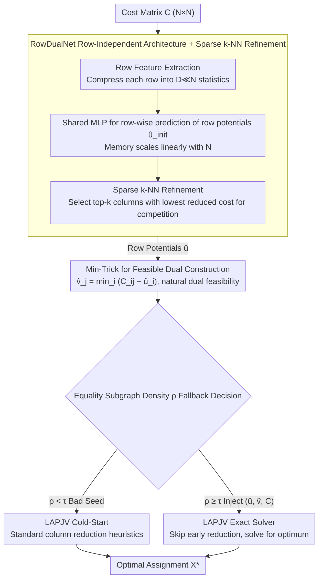

# Learning-Augmented Scalable Linear Assignment Problem Optimization via Neural Dual Warm-Starts

**Conference**: ICML 2026  
**arXiv**: [2605.09382](https://arxiv.org/abs/2605.09382)  
**Code**: None  
**Area**: Combinatorial Optimization / Learning-Augmented Algorithms / Multi-Object Tracking  
**Keywords**: Linear Assignment Problem, Dual Variables, Warm-Start, LAPJV, Row-Independent Networks  

## TL;DR
Training a lightweight network to predict dual variables $\hat{u}$ of the Linear Assignment Problem (LAP) and constructing feasible duals $\hat{v}$ via the Min-Trick to warm-start the exact LAPJV solver. This maintains optimality while achieving over $2\times$ end-to-end acceleration for instances of scale $N=16{,}384$.

## Background & Motivation

**Background**: The Linear Assignment Problem (LAP) is a fundamental primitive for matching-based problems, frequently invoked in scenarios like multi-object tracking (MOT), scheduling, and transportation. Current mainstream solvers follow either exact or learning-based paths: classical Hungarian / Jonker-Volgenant (LAPJV) provide provably optimal solutions but have a worst-case complexity of $\mathcal{O}(N^3)$; recent GNN-based neural solvers sacrifice precision for speed.

**Limitations of Prior Work**: When $N \geq 10^3$, the cubic complexity of LAPJV dominates the latency of real-time systems. Meanwhile, neural alternatives may violate hard assignment constraints and are often bottlenecked by $\mathcal{O}(N^2 H)$ memory due to edge features, failing to scale beyond $N \approx 2{,}000$ for truly large-scale applications.

**Key Challenge**: There is a tension between exactness and scalability—integrating neural networks into the pipeline often either breaks optimality or exhausts GPU memory. Without neural networks, the budget is consumed by the $\mathcal{O}(N^3)$ search.

**Goal**: To guarantee global optimality at industrial scales (up to $N=16{,}384$) while outperforming the cold-start LAPJV in end-to-end wall-clock time, ensuring robustness to distribution shifts and zero-shot transferability to real-world data.

**Key Insight**: Utilizing a fact from LP duality theory—providing LAPJV with a set of near-optimal feasible dual variables is equivalent to "resuming" the dual-ascent algorithm from a state near convergence. Thus, the neural network's role is not to replace the solver, but to predict high-quality initial duals.

**Core Idea**: Use a row-independent RowDualNet to predict row potentials $\hat{u}$, then constructively derive column potentials $\hat{v}$ via the Min-Trick $\hat{v}_j = \min_i (C_{ij} - \hat{u}_i)$ to ensure dual feasibility. A lightweight threshold-based fallback ensures that poor predictions merely revert to a standard cold-start.

## Method

### Overall Architecture
The input is an $N \times N$ cost matrix $C$, and the output is the exact optimal assignment matrix $X^\ast$. The pipeline consists of four stages: (1) Row feature extraction—compressing $C$ into $F \in \mathbb{R}^{N \times D}$ by retaining $D \ll N$ statistics per row (min, mean, entropy, rank); (2) RowDualNet predicts a scalar $\hat{u}_i$ independently for each row on the GPU, followed by a sparse k-NN refinement to capture inter-row competition; (3) Min-Trick calculates $\hat{v}$ in blocks on the GPU and determines fallback based on equality subgraph density $\rho$; (4) Injecting $(\hat{u}, \hat{v}, C)$ into a modified C++ implementation of LAPJV on the CPU to skip early reductions and proceed directly to exact solution searching.

### Key Designs

**1. RowDualNet Row-Independent Architecture + Sparse k-NN Refinement: Linear memory for scalability**

GNN-based neural matching typically hits a wall at $N \approx 2000$ because fully connected edge features require $\mathcal{O}(N^2 H)$ memory. This work compresses the cost matrix $C$ row-wise into $D \ll N$ statistics, using a shared MLP for row-independent prediction. This keeps memory growth linear $\mathcal{O}(N)$. To address the lack of inter-row competition, a sparse k-NN refinement step calculates a "pseudo reduced cost" $C_{ij} - \hat{u}_{init,i}$ and aggregates only the top-$k$ columns. Since the optimal assignment selects only one column per row, competition signals concentrate on columns where reduced costs are near zero; fixing $k \ll N$ captures these signals while allowing the model to scale to $N=16{,}384$.

**2. Min-Trick for Feasible Dual Construction: Turning feasibility into a definition**

Typical approaches that project infeasible learned solutions back to the feasible region are slow and can negate neural speed gains. The authors use a constructive step: once $\hat{u}$ is obtained, they set

$$\hat{v}_j = \min_i (C_{ij} - \hat{u}_i),$$

which by definition ensures $\hat{u}_i + \hat{v}_j \leq C_{ij}$. This $\mathcal{O}(N^2)$ step is parallelized on the GPU. Crucially, LAPJV's optimality does not depend on the network's accuracy—the network only determines how close the warm-start is to convergence, while feasibility is guaranteed by construction.

**3. Fallback based on Equality Subgraph Density: Safeguarding the worst case**

Sparse equality subgraphs from poor predictions can slow down LAPJV. The authors define the equality subgraph density

$$\rho = \frac{1}{N} \sum_{i,j} \mathbb{I}\big(|C_{ij} - \hat{u}_i - \hat{v}_j| < \epsilon\big),$$

representing the average degree of edges with reduced costs near zero. If $\rho < \tau$, the prediction is discarded, and LAPJV reverts to standard cold-start heuristics. Since the overhead $T_{\text{overhead}} = \mathcal{O}(N^2 \log N)$ is asymptotically negligible compared to $\mathcal{O}(N^3)$, "neural seeding that is never slower" is strictly guaranteed.

### Loss & Training
Supervised training uses ground-truth duals $u^\ast$ from LAPJV as targets. The loss includes a MAE term between $\hat{u}$ and $u^\ast$, plus a Complementary Slackness regularization term that forces reduced costs on optimal edges toward zero. Training is multi-scale on $N \in \{512, 1536, 2048, 3072\}$ with 1700+ matrices, followed by zero-shot evaluation at $N=16{,}384$ to test out-of-distribution generalization.

## Key Experimental Results

### Main Results

| Dataset | Scale | Speedup (vs SciPy) | Speedup (vs LAP) | Optimality |
|---------|-------|--------------------|------------------|------------|
| Dense Uniform Synthetic | $N=16384$ | $\approx 2.0\times$ | $\approx 2.5\times$ | 0% gap |
| Block-Structured Synthetic | $N=16384$ | $\approx 2.25\times$ | $\approx 4.0\times$ | 0% gap |
| MOT (Real-world) | $N \geq 8000$ | $\approx 2\times$ | $\approx 1.25\times$ | 0% gap |
| OSM 7 Cities | $N=10000$ | $1.4\text{-}1.6\times$ | $1.3\text{-}1.8\times$ | 0% gap |

### Ablation Study

| Configuration | Behavior | Description |
|---------------|----------|-------------|
| RowDualNet (full) | $\approx 76\%$ of assignments solved in greedy phase | Augmenting path search reduced by $\approx 68\%$ |
| Cold-start LAPJV | Only $\approx 26\%$ solved greedily | Requires subsequent extensive shortest-path searches |
| Linear Regression instead of RowDualNet | Slower than baseline for $N > 4096$ | Validates necessity of non-linear feature learning |
| Row Mean / Random Heuristic | speedup $<1$ | Simple statistics fail to capture competition structures |

### Key Findings
- Speedup stems from the increase in "equality subgraph density": neural seeds let LAPJV skip the expensive "price war" phase and enter a near-converged state.
- Stability of end-to-end runtime improved significantly—coefficient of variation dropped from $\approx 45\%$ to $\approx 30\%$, suppressing the high worst-case/best-case ratios of the baseline.
- At $N=16{,}384$, neural components account for $<7\%$ of total time, with 93% remaining in the CPU exact solver, indicating true algorithmic acceleration rather than hardware-bound gains.

## Highlights & Insights
- Treating the neural network as a "solver accelerator" rather than a "solver replacement" realizes the "learned duals" framework by Dinitz et al. (2021) at a system level. The Min-Trick bypasses projection algorithms by building feasibility into the construction.
- The "see less to scale more" philosophy of row-independent blocks with sparse k-NN is insightful—while GNNs struggle with $\mathcal{O}(N^2)$ edge messages, explicitly modeling only the top-$k$ signals yields orders of magnitude in memory savings.
- The fallback mechanism provides strict asymptotic safety, making the "learning-augmented + worst-case safety" paradigm highly suitable for industrial systems.

## Limitations & Future Work
- Limited to dense square LAPs; non-square, sparse LAPs, or Quadratic Assignment Problems (QAPs) are not discussed.
- Training depends on offline LAPJV for ground truth, which is costly for very large $N$; semi-supervised or self-supervised training for RowDualNet could improve scalability.
- Neural overhead is disproportionately high at small scales ($N=512$), suggesting that an adaptive decision on whether to use neural seeds is needed.
- Gains on MOT ($1.25\times$) are lower than on synthetic dense data, possibly due to matrix sparsity, yet a sparse neural predictor was not explored.

## Related Work & Insights
- **vs Dinitz et al. 2021 "learned duals"**: They proposed the theoretical framework but used slow projection algorithms; this work uses the Min-Trick to scale to $N=16{,}384$.
- **vs GNN-based matching (Liu 2024 / Aironi 2024)**: They predict assignment matrices but sacrifice optimality and suffer from $\mathcal{O}(N^2)$ memory; this work maintains exactness and $\mathcal{O}(N)$ memory.
- **vs SciPy / LAP libraries**: This work adds a warm-start layer on top, so advantages grow with $N$ while maintaining a 0% optimality gap.

## Rating
- Novelty: ⭐⭐⭐⭐ Industrial scaling of learned duals using Min-Trick for feasibility.
- Experimental Thoroughness: ⭐⭐⭐⭐ Synthetic, MOT, and OSM data up to $N=16384$.
- Writing Quality: ⭐⭐⭐⭐ Clear theoretical guarantees and engineering details.
- Value: ⭐⭐⭐⭐ High practical value for real-time tracking and large-scale scheduling.

<!-- RELATED:START -->

## Related Papers

- [\[ICLR 2026\] Dual Optimistic Ascent (PI Control) is the Augmented Lagrangian Method in Disguise](../../ICLR2026/optimization/dual_optimistic_ascent_pi_control_is_the_augmented_lagrangian_method_in_disguise.md)
- [\[ICML 2026\] RMNP: Row-Momentum Normalized Preconditioning for Scalable Matrix-Based Optimization](rmnp_row-momentum_normalized_preconditioning_for_scalable_matrix-based_optimizat.md)
- [\[ICML 2026\] Dynamics and Representation Structure of Local Approximations to Gradient-Based Learning in Linear Recurrent Neural Networks](dynamics_and_representation_structure_of_local_approximations_to_gradient-based_.md)
- [\[ICML 2026\] Balancing Learning Rates Across Layers: Exact Two-Step Dynamics and Optimal Scaling in Linear Neural Networks](balancing_learning_rates_across_layers_exact_two-step_dynamics_and_optimal_scali.md)
- [\[CVPR 2026\] Single-Round Scalable Analytic Federated Learning](../../CVPR2026/optimization/single-round_scalable_analytic_federated_learning.md)

<!-- RELATED:END -->
