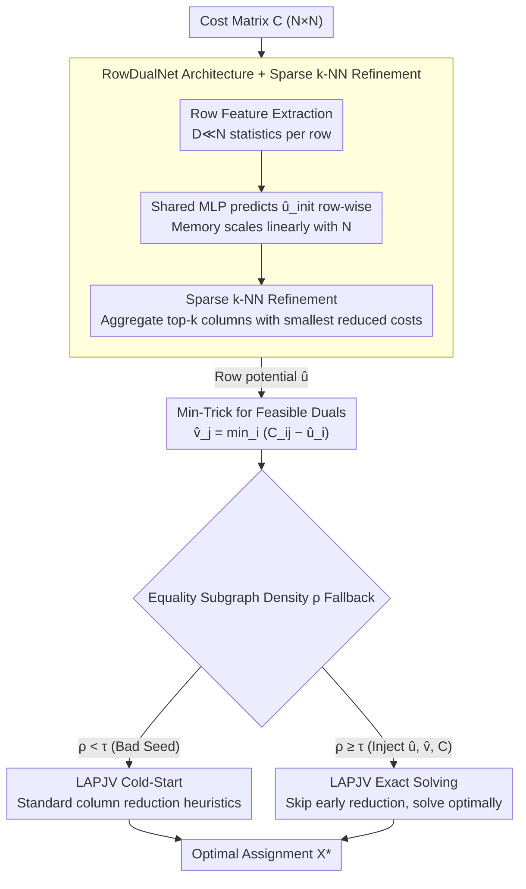

# Learning-Augmented Scalable Linear Assignment Problem Optimization via Neural Dual Warm-Starts

**Conference**: ICML 2026  
**arXiv**: [2605.09382](https://arxiv.org/abs/2605.09382)  
**Code**: None  
**Area**: Combinatorial Optimization / Learning-Augmented Algorithms / Multi-Object Tracking  
**Keywords**: Linear Assignment, Dual Variables, Warm-start, LAPJV, Row-independent Network

## TL;DR
Training a lightweight network to predict the dual variables $\hat{u}$ of the Linear Assignment Problem (LAP) and constructing feasible duals $\hat{v}$ via the Min-Trick provides a warm-start for the LAPJV exact solver. This approach accelerates end-to-end solving of $N=16{,}384$ scale instances by over $2\times$ while maintaining optimality.

## Background & Motivation

**Background**: The Linear Assignment Problem (LAP) is a fundamental matching primitive frequently invoked in scenarios such as Multi-Object Tracking (MOT), scheduling, and transportation. Current mainstream solvers follow either exact or learning-based paths: classical Hungarian / Jonker-Volgenant (LAPJV) provides provably optimal solutions but with a worst-case complexity of $\mathcal{O}(N^3)$, while recent GNN-based neural solvers sacrifice precision for speed.

**Limitations of Prior Work**: When $N \geq 10^3$, the cubic complexity of LAPJV dominates the latency of real-time systems. Conversely, neural alternatives often violate hard assignment constraints and struggle with $N \approx 2{,}000$ scales due to the $\mathcal{O}(N^2 H)$ memory requirements of edge features, making them unsuitable for truly large-scale applications.

**Key Challenge**: A tension exists between precision and scalability. Integrating neural networks into the solving process often either compromises optimality or exhausts GPU memory. Without neural networks, the budget is consumed by the $\mathcal{O}(N^3)$ search space.

**Goal**: To guarantee global optimality for industrial-scale problems where $N$ reaches $16{,}384$, outperforming LAPJV cold-starts in end-to-end wall-clock time, while remaining robust to distribution shifts and enabling zero-shot transfer to real-world data.

**Key Insight**: Leveraging a fact from LP duality theory: providing LAPJV with a set of near-optimal feasible dual variables is equivalent to "resuming" the dual-ascent algorithm from a state near convergence. Thus, the neural network's role is to predict high-quality initial duals rather than replacing the solver.

**Core Idea**: Use a row-independent RowDualNet to predict row potentials $\hat{u}$, then constructively derive column potentials $\hat{v}$ via the Min-Trick $\hat{v}_j = \min_i (C_{ij} - \hat{u}_i)$ to ensure dual feasibility. A lightweight threshold-based fallback is employed so that poor predictions merely revert to a cold-start.

## Method

### Overall Architecture
The input is an $N \times N$ cost matrix $C$, and the output is the exact optimal assignment matrix $X^\ast$. The pipeline consists of four stages: (1) Row feature extraction—compressing $C$ into $F \in \mathbb{R}^{N \times D}$ by retaining $D \ll N$ statistics per row (min, mean, entropy, rank, etc.); (2) RowDualNet independently predicts a scalar $\hat{u}_i$ for each row on the GPU, with an additional sparse k-NN refinement step to capture inter-row competition; (3) Min-Trick calculates $\hat{v}$ in blocks on the GPU and determines whether to fallback based on the equality subgraph density $\rho$; (4) Injecting $(\hat{u}, \hat{v}, C)$ into a modified C++ implementation of LAPJV on the CPU, skipping early reductions to solve for the exact solution.

### Key Designs

**1. RowDualNet Architecture + Sparse k-NN Refinement: Linear Memory for Scalability**
GNN-based neural matching typically fails at $N \approx 2000$ because fully connected edge features require $\mathcal{O}(N^2 H)$ memory. This method compresses $C$ into $D \ll N$ statistics per row. RowDualNet predicts $\hat{u}_{init,i}$ using a shared MLP row-wise, ensuring memory scales linearly with $N$. To compensate for the lack of inter-row competition, a sparse k-NN refinement step calculates "pseudo reduced costs" $C_{ij} - \hat{u}_{init,i}$ and aggregates only the top $k$ columns. This captures critical signals since the optimal assignment usually resides in columns where reduced costs are near zero, allowing training and inference to scale to $N = 16{,}384$.

**2. Min-Trick for Feasible Duals: Feasibility by Definition**
Traditional methods that project infeasible neural outputs back into the feasible region are slow. This method uses a one-step construction: once $\hat{u}$ is obtained, the column potentials are set as:
$$\hat{v}_j = \min_i (C_{ij} - \hat{u}_i)$$
This definition immediately satisfies $\hat{u}_i + \hat{v}_j \leq C_{ij}$, naturally guaranteeing dual feasibility. This $\mathcal{O}(N^2)$ step is fully parallelized on the GPU. Crucially, the optimality of LAPJV no longer depends on the network's accuracy—the network only determines how close the warm-start is to convergence, while the construction preserves correctness.

**3. Equality Subgraph Density Fallback: Safeguarding the Worst Case**
Neural networks may occasionally produce sparse equality subgraphs that slow down LAPJV. The equality subgraph density is defined as:
$$\rho = \frac{1}{N} \sum_{i,j} \mathbb{I} \big(|C_{ij} - \hat{u}_i - \hat{v}_j| < \epsilon \big)$$
If $\rho < \tau$, the prediction is discarded, and LAPJV reverts to a standard cold-start. Since the overhead $T_{\text{overhead}} = \mathcal{O}(N^2 \log N)$ is asymptotically negligible compared to $\mathcal{O}(N^3)$, it is proven that the runtime will not be worse than the baseline in the worst-case scenario.

### Loss & Training
The model uses supervised training with ground truth duals $u^\ast$ from LAPJV. The loss consists of the MAE between $\hat{u}$ and $u^\ast$, plus a Complementary Slackness regularization term. This term forces reduced costs on optimal edges toward zero, guiding predictions to expose the optimal assignment within the equality subgraph. Multi-scale training was conducted on $N \in \{512, 1536, 2048, 3072\}$ using 1700+ matrices, followed by zero-shot evaluation on $N = 16{,}384$.

## Key Experimental Results

### Main Results

| Dataset | Scale | Gain (vs SciPy) | Gain (vs LAP) | Optimality |
|---------|-------|-----------------|----------------|------------|
| Dense Uniform Synthetic | $N=16384$ | $\approx 2.0\times$ | $\approx 2.5\times$ | 0% gap |
| Block-Structured Synthetic | $N=16384$ | $\approx 2.25\times$ | $\approx 4.0\times$ | 0% gap |
| MOT (Real-world) | $N \geq 8000$ | $\approx 2\times$ | $\approx 1.25\times$ | 0% gap |
| OSM 7-Cities | $N=10000$ | $1.4\text{-}1.6\times$ | $1.3\text{-}1.8\times$ | 0% gap |

### Ablation Study

| Configuration | Behavior | Description |
|---------------|----------|-------------|
| RowDualNet (Full) | $\approx 76\%$ solved at greedy stage | $\approx 68\%$ reduction in augmenting paths |
| Cold-start LAPJV | Only $\approx 26\%$ solved at greedy stage | Requires extensive shortest path searches |
| Linear Regression Sub | Slower than baseline at $N>4096$ | Validates need for non-linear feature learning |
| Row Mean / Random | Speedup $<1$ | Simple statistics fail to capture competition |

### Key Findings
- The speedup stems from increased "equality subgraph density": the neural seed places LAPJV near convergence, bypassing expensive "price war" reduction phases.
- Stability of end-to-end runtime is significantly improved—coefficient of variation dropped from $\approx 45\%$ to $\approx 30\%$, suppressing worst-case spikes.
- At $N=16{,}384$, the neural component accounts for $<7\%$ of total time, with 93% spent on the CPU exact solver, confirming algorithmic acceleration rather than just hardware utilization.

## Highlights & Insights
- Formulates neural networks as "solver accelerators" rather than "solver replacements." It implements the theoretical "learned duals" framework (Dinitz et al., 2021) at a system level, using the Min-Trick to bypass slow projection algorithms.
- The "see less to scale more" philosophy (row-independent + sparse k-NN) is effective. While most GNNs suffer from $\mathcal{O}(N^2)$ edge messages, modeling only the top-$k$ critical signals saves orders of magnitude in memory.
- The Fallback mechanism provides rigorous asymptotic safety, making the "learning-augmented + worst-case safety" paradigm highly suitable for industrial systems.

## Limitations & Future Work
- Limited to square dense LAP; extensions to rectangular, sparse LAP, or Quadratic Assignment Problems (QAP) are not discussed.
- Training depends on offline LAPJV runs, which is costly for very large $N$; semi-supervised or self-supervised training could improve scalability.
- For small scales ($N=512$), neural overhead can exceed savings, suggesting a need for adaptive logic to decide when to use neural seeds.
- Gains on MOT ($1.25\times$) are lower than on dense synthetic data due to matrix sparsity; specialized sparse neural predictors remain unexplored.

## Related Work & Insights
- **vs Dinitz et al. 2021 "learned duals"**: Unlike their projection-based feasibility which is slow, this work uses the Min-Trick to scale to $N=16{,}384$.
- **vs GNN Neural Matching**: Unlike direct assignment prediction which abandons optimality and hits memory walls, this work preserves exactness and uses $\mathcal{O}(N)$ memory.
- **vs SciPy / LAP Libraries**: This method acts as a warm-start layer on top of them; its advantages amplify as $N$ increases while maintaining a verified 0% optimality gap.

## Rating
- Novelty: ⭐⭐⭐⭐ (Scaling learned duals to industrial levels via Min-Trick)
- Experimental Thoroughness: ⭐⭐⭐⭐ (Synthetic + MOT + OSM datasets up to $N=16384$)
- Writing Quality: ⭐⭐⭐⭐ (Clear theoretical guarantees and engineering details)
- Value: ⭐⭐⭐⭐ (Significant impact for real-time tracking and large-scale scheduling)

<!-- RELATED:START -->

## Related Papers

- [\[ICLR 2026\] Dual Optimistic Ascent (PI Control) is the Augmented Lagrangian Method in Disguise](../../ICLR2026/optimization/dual_optimistic_ascent_pi_control_is_the_augmented_lagrangian_method_in_disguise.md)
- [\[ICML 2026\] Dynamics and Representation Structure of Local Approximations to Gradient-Based Learning in Linear Recurrent Neural Networks](dynamics_and_representation_structure_of_local_approximations_to_gradient-based_.md)
- [\[ICML 2026\] RMNP: Row-Momentum Normalized Preconditioning for Scalable Matrix-Based Optimization](rmnp_row-momentum_normalized_preconditioning_for_scalable_matrix-based_optimizat.md)
- [\[ICML 2026\] Balancing Learning Rates Across Layers: Exact Two-Step Dynamics and Optimal Scaling in Linear Neural Networks](balancing_learning_rates_across_layers_exact_two-step_dynamics_and_optimal_scali.md)
- [\[ICML 2026\] On the Expressive Power of GNNs to Solve Linear SDPs](on_the_expressive_power_of_gnns_to_solve_linear_sdps.md)

<!-- RELATED:END -->
