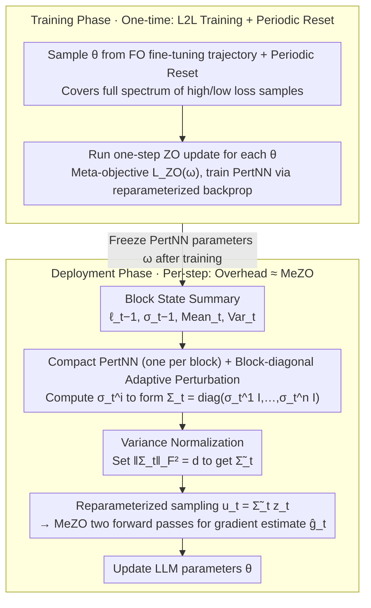

# Learning a Zeroth-Order Optimizer for Fine-Tuning LLMs

**Conference**: ICML 2026  
**arXiv**: [2510.00419](https://arxiv.org/abs/2510.00419)  
**Code**: https://github.com/ASTRAL-Group/ZO_Fine_tuner (Available)  
**Area**: Optimization Algorithms / Efficient LLM Fine-tuning / Learning to Learn  
**Keywords**: Zeroth-Order Optimization, MeZO, L2L, Block-diagonal Perturbation, Memory-efficient Fine-tuning  

## TL;DR
This paper proposes ZO Fine-tuner: using a "per-block lightweight neural network PertNN" to automatically learn perturbation variances for each parameter block of an LLM. It upgrades the fixed $\mathcal{N}(0,I)$ in MeZO to block-adaptive non-uniform perturbations. On OPT-30B, the auxiliary network accounts for <2MB yet outperforms existing zeroth-order baselines in 82.1% of cases across 4 LLMs × 7 datasets (28 pairs), achieving "train once, reuse across tasks/derivative models."

## Background & Motivation

**Background**: As LLM sizes explode, the optimizer states and forward activations of first-order optimizers like Adam consumes approximately 12× the inference memory. Even with PEFT methods like LoRA or Prefix-Tuning, backpropagation still imposes a significant memory burden. MeZO (Malladi et al., 2023) introduced classic ZO-SGD to LLM fine-tuning: it performs only two forward passes per step and estimates gradients using $g\!\approx\!\tfrac{\mathcal{L}(\theta+\epsilon u)-\mathcal{L}(\theta-\epsilon u)}{2\epsilon}u,\ u\!\sim\!\mathcal{N}(0,I)$, reducing training memory to near-inference levels. Subsequent works like HIZOO, LOZO, MeZO-SVRG, ZO-AdamU, and ZO-DAP designed more complex update rules on top of MeZO.

**Limitations of Prior Work**: These improvements rely on manual heuristics or mathematical approximations and still require extensive hyperparameter searches beyond the learning rate. Crucially, they all inherit an *isotropic* $\mathcal{N}(0,I)$ sampling distribution shared across all parameters. However, the quality of zeroth-order gradient estimation depends on the local landscape. For an LLM with vast layer-wise dimensionality differences and highly uneven Hessians, "treating all parameters equally with uniform noise" wastes the perturbation budget on suboptimal directions.

**Key Challenge**: While adapting the perturbation distribution to the optimization state (the L2L approach) is intuitive, L2L faces two major obstacles on LLMs: (i) Backpropagating through a PertNN requires storing massive activations; (ii) Learning an auxiliary network for each parameter results in $O(d^2)$ complexity, which is unsustainable for a 30B model. Furthermore, L2L on small models suffers from poor transferability, where a trained optimizer often serves only one model-task pair.

**Goal**: To scale L2L to LLM dimensions while ensuring (a) memory/speed overhead ≈ MeZO, and (b) "one-time PertNN training on a base LLM that is reusable across diverse tasks and derivative checkpoints."

**Key Insight**: The authors leverage empirical findings from Zhang et al. (2024b) suggesting that the Transformer Hessian roughly exhibits a block-diagonal structure (where Embedding, Q, K, V, and Projection naturally form parameter blocks). This implies that adapting perturbation variances at the "block" granularity is sufficient to match the true curvature. LLaMA-8B contains only 291 parameter blocks, significantly fewer than its 8 billion parameters.

**Core Idea**: Use "one PertNN per block" to learn a **block-diagonal perturbation covariance** $\Sigma_t\!=\!\mathrm{diag}(\sigma_t^{(1)} I_{d_1},\dots,\sigma_t^{(n)} I_{d_n})$, replacing MeZO's $u\!\sim\!\mathcal{N}(0,I)$ with $u\!\sim\!\mathcal{N}(0,\Sigma_t\Sigma_t^\top)$. The PertNN is trained differentiably using first-order fine-tuning trajectories as "meta-supervision."

## Method

### Overall Architecture
During the deployment phase, ZO Fine-tuner follows MeZO's two-forward-pass logic. The only addition is that before sampling perturbations at each step, $n$ lightweight PertNNs calculate the current perturbation standard deviation $\sigma_t^{(i)}$ for each block to form $\Sigma_t$. Reparameterized sampling $u_t=\widetilde\Sigma_t z_t,\ z_t\!\sim\!\mathcal{N}(0,I_d)$ is then performed, followed by updating LLM parameters using the MeZO formula. PertNNs are pre-trained (meta-training) along the first-order fine-tuning trajectory of the LLM and are frozen during deployment.

PertNN inputs consist of model/task-agnostic **state summaries**: previous perturbation variance $\sigma_{t-1}^{(i)}$, current block parameter mean/variance $\mathrm{Mean}_t^{(i)},\mathrm{Var}_t^{(i)}$, and the two losses recorded in the previous step $\boldsymbol{\ell}_{t-1}$. This "task-agnostic" input enables the transferability of PertNN across datasets and derivative checkpoints.

### Key Designs

**1. Block-diagonal Adaptive Perturbation + Compact PertNN: Shifting from "shared variance" to "per-Transformer-block adaptation"**

MeZO uses an isotropic $\mathcal{N}(0,I)$ sampling shared across all parameters, which wastes perturbation budget on dimensions with disparate curvatures. While learning an auxiliary network for every parameter is $O(d^2)$ and impossible for a 30B model, this work leverages the block-diagonal nature of Transformer Hessians. By adapting variances at the block level (e.g., 291 blocks for LLaMA-8B), the method matches the curvature structure with minimal overhead. Specifically, an independent small network $\sigma_t^{(i)}=\mathrm{PertNN}^{(i)}(\boldsymbol{\ell}_{t-1},\sigma_{t-1}^{(i)},\mathrm{Mean}_t^{(i)},\mathrm{Var}_t^{(i)};\omega^{(i)})$ computes the block-diagonal covariance $\Sigma_t$. Reparameterization $u_t=\Sigma_t z_t$ ensures the process is differentiable with respect to $\omega$. Theorem 3.1 proves that block-adaptive variance yields a tighter loss descent upper bound than MeZO. On OPT-30B, all PertNNs combined take less than 2MB (FP16), negligible compared to the 60GB model.

**2. Variance Normalization: Decoupling "perturbation shape" from "effective learning rate"**

Non-uniform variances pose a risk: since $\mathbb{E}[\hat g]\approx\mathbb{E}[u_t u_t^\top]\nabla\mathcal{L}$, they can change the effective learning rate to $\eta\cdot\tfrac{\|u_t\|^2}{d}$. PertNN might then "hide" step-size adjustments within the variance, leading to unstable tuning. Given $u_t=\Sigma_t z_t\Rightarrow\mathbb{E}\|u_t\|^2=\|\Sigma_t\|_F^2$, this work enforces $\|\Sigma_t\|_F^2=\|I_d\|_F^2=d$ (i.e., $\widetilde\Sigma_t=\tfrac{\sqrt{d}}{\|\Sigma_t\|_F}\Sigma_t$). In high dimensions, $\|u_t\|$ concentrates at $\sqrt{d}$, pinning the effective learning rate. $\Sigma_t$ thus only controls relative magnitudes between blocks, while the global step size remains governed by $\eta$. This normalization is the most significant contributor to gains—alone, it reduces LLaMA-8B/SQuAD loss from 0.395 to 0.307.

**3. L2L Training Framework + Periodic Reset: Using "one-step updated loss" as a differentiable meta-objective with overfitting prevention**

Without direct supervision for "optimal perturbations," the "LLM loss after one ZO update step" is used as the differentiable meta-objective. First-order optimizers generate an LLM trajectory $\{\theta_0^k\}$. At each $\theta_0^k$, a one-step ZO update yields $\theta_1^k$, with meta-loss $\mathcal{L}_{\text{ZO}}(\omega)=\mathcal{L}(\theta_0^k-\eta\hat g(\theta_0^k,\omega))$. Reparameterization allows backpropagating gradients from $\theta_1^k$ to $\omega$. Using FO trajectories is efficient as it provides diverse loss-level samples without extra sampling. However, FO paths eventually reach flat minima; if PertNN only sees low-loss inputs, it fails in high-loss regimes. Thus, the LLM is periodically reset to its pre-fine-tuned state to re-cover high-loss regions. The "Reset + Normalize" combination pushed Qwen-14B/SST2 accuracy from 0.800 to 0.935.

### Loss & Training
- LLM Update: $\theta_{t+1}=\theta_t-\eta_1\hat g_t$, where $\hat g_t$ is sampled using the normalized $\widetilde\Sigma_t$.
- PertNN Update: $\omega_{t+1}=\omega_t-\eta_2\partial\mathcal{L}_{\text{ZO}}/\partial\omega_t$, trained cumulatively along the FO trajectory.
- In practice, meta-training is performed only once on COPA (small and smooth loss landscape). All other 27 (model, dataset) pairs reuse the PertNN *zero-shot*, directly testing the "train once, reuse widely" claim.

## Key Experimental Results

### Main Results
Testing on 4 LLMs (LLaMA-3.2-1B / LLaMA-3.1-8B / Qwen2.5-14B / OPT-30B) × 7 datasets (COPA, SST-2, CB, SQuAD, WSC, BoolQ, DROP), comparing against MeZO / MeZO-Adam(U) / HIZOO / LOZO:

| Model | Method | SST-2 Loss/Acc | SQuAD Loss/F1 | BoolQ Loss/Acc | DROP Loss/F1 |
|-------|--------|----------------|---------------|----------------|--------------|
| LLaMA-3.2-1B | MeZO | 0.29 / 0.90 | 0.48 / 0.75 | 0.63 / 0.63 | 1.16 / 0.29 |
| LLaMA-3.2-1B | **ZO FT** | **0.14 / 0.93** | **0.37 / 0.78** | **0.58 / 0.66** | **1.03 / 0.35** |
| LLaMA-3.1-8B | MeZO | 0.29 / 0.92 | 0.32 / 0.89 | 0.42 / 0.78 | 0.69 / 0.64 |
| LLaMA-3.1-8B | **ZO FT** | **0.18 / 0.94** | **0.31 / 0.90** | **0.34 / 0.87** | **0.54 / 0.66** |
| Qwen2.5-14B | MeZO | 0.21 / 0.88 | 0.24 / 0.88 | 0.23 / 0.84 | 0.45 / 0.66 |
| Qwen2.5-14B | **ZO FT** | 0.24 / **0.94** | **0.22 / 0.91** | 0.29 / **0.89** | **0.40 / 0.70** |
| OPT-30B | MeZO | 0.38 / 0.89 | 0.59 / 0.74 | 0.60 / 0.66 | 1.66 / 0.31 |
| OPT-30B | **ZO FT** | **0.35** / 0.87 | **0.56 / 0.77** | 0.61 / **0.67** | **1.59 / 0.31** |

Overall, in 28 (model, dataset) pairs, ZO Fine-tuner achieved the lowest loss in **82.1%** and the highest accuracy in **75.0%** of combinations, with an average accuracy gain of +2.5% over MeZO. All this was achieved via a single meta-training on COPA, representing a strict OOD transfer test.

Transfer across derivative models (Table 4, PertNN trained on LLaMA-3.1-8B, transferred to LLaMA-3.1-8B-Instruct): SST2 MeZO 0.276/0.92 → ZO FT **0.164/0.95**; SQuAD MeZO 0.291/0.90 → ZO FT **0.287/0.92**. Long-sequence reasoning transfer (Table 5, Qwen-14B on MetaMathQA): GSM8K MeZO 81.4 → ZO FT **85.6**; MATH-500 MeZO 53.0 → ZO FT **54.6**.

### Ablation Study
Table 2 (Normalization and Periodic Reset, Loss/Acc):

| Configuration | LLaMA-8B/SST2 | Qwen-14B/SST2 | LLaMA-8B/SQuAD |
|------|---------------|---------------|----------------|
| Base | 0.398 / 0.874 | 0.409 / 0.800 | 0.395 / 0.840 |
| +Reset | 0.389 / 0.881 | 0.404 / 0.810 | 0.368 / 0.856 |
| +Normalize | 0.306 / 0.920 | 0.389 / 0.844 | 0.307 / 0.899 |
| +Reset+Normalize | **0.179 / 0.941** | **0.240 / 0.935** | **0.307 / 0.905** |

Table 3 (Parameter Sharing Granularity): layer-wise vs block-wise shows LLaMA-8B/SST2 0.23/0.92 → **0.18/0.94**, proving block granularity is superior.

### Key Findings
- **Normalization is the primary driver of gain**: Adding it alone reduces loss by 20-25% in most tasks, confirming that non-uniform variance requires normalization to prevent unintended step-size interference.
- Periodic Reset provides small gains alone but is crucial in combination with Normalize, correcting bias toward low-loss regions.
- ZO Fine-tuner is more robust to learning rates (Figure 3), converging deeper even at smaller learning rates, implying an implicit learned block-wise preconditioner.
- Memory cost is effectively zero: <2MB FP16 for OPT-30B, while speed overhead is limited to one PertNN forward pass per step.

## Highlights & Insights
- Scaling L2L to LLMs relies on **reducing the learning target from $d$ dimensions to $n$ blocks**. Linking block granularity to Transformer Hessian structures (291 blocks vs 8B parameters) ensures engineering feasibility.
- Using "FO fine-tuning trajectories" as the training data stream is highly economical, providing a full spectrum of samples from initialization to convergence without specialized meta-dataset construction.
- The Normalization component provides a **crucial sanity check** for L2L/adaptive optimizers: when learning both direction and magnitude, budget normalization ensures the meta-objective targets direction without being polluted by magnitude drift.

## Limitations & Future Work
- Meta-training PertNN still requires a one-time FO "teacher" trajectory, which is a one-time cost for base model providers but difficult for users without FO capabilities to replicate.
- Experiments focus mainly on short-context GLUE/SuperGLUE tasks. While long-sequence math experiments were added, the effectiveness for RLHF or multi-modal LLMs remains an open question.
- Block division currently relies on standard Transformer components; non-standard architectures like MoE or SSM may require re-validating the block-diagonal assumption of Theorem 3.1.
- Direct Pareto comparisons against PEFT methods like LoRA under identical memory budgets were not reported, although FO Adam bounds were provided in the appendix.

## Related Work & Insights
- **vs MeZO (Malladi et al., 2023)**: MeZO uses fixed $\mathcal{N}(0,I)$; this work learns a block-wise adaptive $\Sigma_t$, outperforming it in 82.1% of cases with zero memory overhead.
- **vs HIZOO (Zhao et al., 2025)**: HIZOO uses manual Hessian estimates; this work uses L2L to implicitly fit Hessian-aware variances, providing better transferability.
- **vs LOZO / Low-rank Approximation**: These methods compress ZO estimates via low-rank structures; this work adopts a structural perturbation approach (block-diagonal), which is orthogonal and potentially combinable with low-rank methods.
- **Transferable Design Insight**: The "Hessian block-diagonal → block-wise parameter sharing" pattern can be generalized to other adaptive mechanisms like per-block learning rates or clipping thresholds.

## Rating
- Novelty: ⭐⭐⭐⭐ Successfully scales L2L to LLM-scale zeroth-order fine-tuning with clean theoretical justification.
- Experimental Thoroughness: ⭐⭐⭐⭐ Extensive testing across models and tasks, though lacking direct Pareto curves against LoRA under memory constraints.
- Writing Quality: ⭐⭐⭐⭐ Clear logic from motivation to architecture and experiment.
- Value: ⭐⭐⭐⭐ The "ship a pretrained finetuner with each base model" paradigm has strong product potential for edge-side/memory-constrained fine-tuning.

<!-- RELATED:START -->

- **MeZO**: [Malladi et al., 2023] Fine-Tuning Language Models with Just Forward Passes.
- **HIZOO**: [Zhao et al., 2025] Hessian-Informed Zeroth-Order Optimization for LLMs.

<!-- RELATED:END -->

## Related Papers

- [\[ICCV 2025\] Zeroth-Order Fine-Tuning of LLMs in Random Subspaces](../../ICCV2025/optimization/zeroth-order_fine-tuning_of_llms_in_random_subspaces.md)
- [\[ICML 2026\] Learning Dynamics of Zeroth-Order Optimization: A Kernel Perspective](learning_dynamics_of_zeroth-order_optimization_a_kernel_perspective.md)
- [\[ICML 2026\] Distilling Linearized Behavior into Non-Linear Fine-Tuning for Effective Task Arithmetic](distilling_linearized_behavior_into_non-linear_fine-tuning_for_effective_task_ar.md)
- [\[ICML 2026\] HO-SFL: Hybrid-Order Split Federated Learning with Backprop-Free Clients and Dimension-Free Aggregation](ho-sfl_hybrid-order_split_federated_learning_with_backprop-free_clients_and_dime.md)
- [\[ICML 2026\] Memory-Efficient LLM Pretraining via Minimalist Optimizer Design](memory-efficient_llm_pretraining_via_minimalist_optimizer_design.md)

<!-- RELATED:END -->
