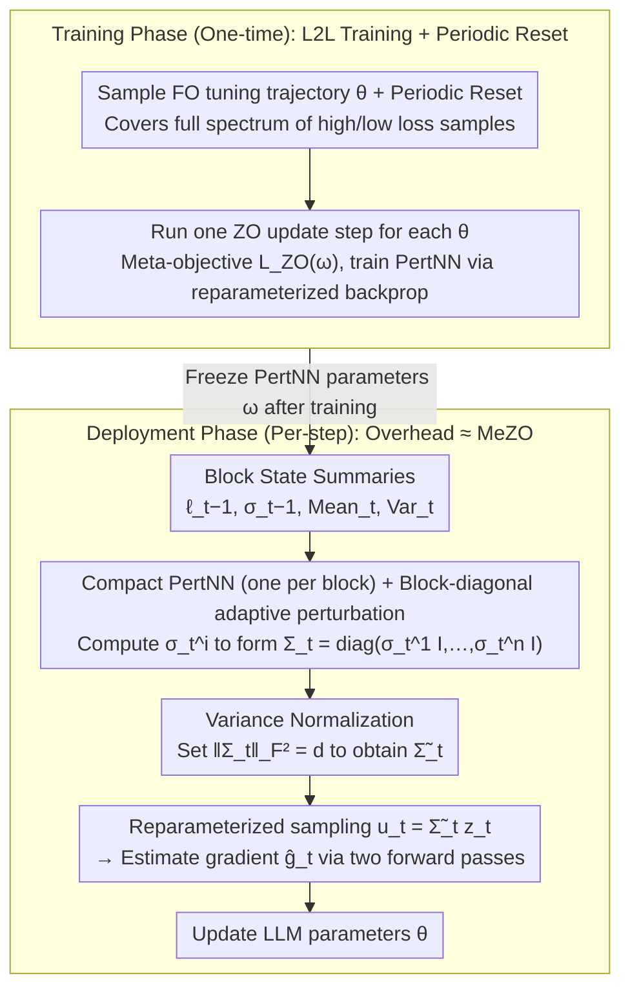

# Learning a Zeroth-Order Optimizer for Fine-Tuning LLMs

**Conference**: ICML 2026  
**arXiv**: [2510.00419](https://arxiv.org/abs/2510.00419)  
**Code**: https://github.com/ASTRAL-Group/ZO_Fine_tuner (Available)  
**Area**: Optimization Algorithms / Efficient Fine-Tuning of LLMs / Learning to Learn  
**Keywords**: Zeroth-Order Optimization, MeZO, L2L, Block-Diagonal Perturbation, Memory-Efficient Fine-Tuning  

## TL;DR
This paper proposes ZO Fine-tuner: using a "per-block lightweight neural network PertNN" to automatically learn the perturbation variance for each parameter block of an LLM. It upgrades the fixed $\mathcal{N}(0,I)$ perturbation in MeZO to a block-adaptive non-uniform distribution. On OPT-30B, the auxiliary network occupies <2MB yet outperforms existing zeroth-order (ZO) baselines in 82.1% of 28 experiment pairs (4 LLMs × 7 datasets), achieving "train once, reuse across tasks and derived models."

## Background & Motivation

**Background**: As LLM sizes explode, the optimizer states and backward activations of first-order (FO) optimizers like Adam consume approximately 12× the memory of inference. Even with PEFT methods like LoRA or Prefix-Tuning, backpropagation still imposes a significant memory burden. MeZO (Malladi et al., 2023) introduced classical ZO-SGD to LLM fine-tuning: it performs only two forward passes per step and estimates the gradient using $g\!\approx\!\tfrac{\mathcal{L}(\theta+\epsilon u)-\mathcal{L}(\theta-\epsilon u)}{2\epsilon}u,\ u\!\sim\!\mathcal{N}(0,I)$, compressing training memory to near-inference levels. Subsequent works like HIZOO, LOZO, MeZO-SVRG, ZO-AdamU, and ZO-DAP designed more complex update rules on top of MeZO manually.

**Limitations of Prior Work**: The aforementioned improvements rely on manual heuristics or mathematical approximations and require extensive hyperparameter searches beyond the learning rate. Crucially, they all use an *isotropic* $\mathcal{N}(0,I)$ sampling distribution shared across all parameters. However, the quality of ZO gradient estimation depends on the local landscape. For an LLM with vastly different layer dimensions and highly non-uniform Hessians, applying the same noise to all parameters wastes the perturbation budget on inefficient directions.

**Key Challenge**: Adopting self-adaptive perturbation distributions (an L2L approach) for LLMs faces two hurdles: (i) backpropagating through the PertNN requires storing massive activations; (ii) learning an auxiliary network for each parameter results in $O(d^2)$ complexity, which is prohibitive for a 30B model. Furthermore, L2L on small models often suffers from poor transferability, where one training run serves only one model-task pair.

**Goal**: Scale L2L to LLMs while ensuring (a) memory/speed overhead is comparable to MeZO, and (b) a PertNN trained once on a base LLM can be reused across different tasks and derived checkpoints.

**Key Insight**: The authors leverage empirical findings from Zhang et al. (2024b) that the Transformer Hessian exhibits an approximate block-diagonal structure (where embedding, Q, K, V, and projection matrices naturally form parameter blocks). This suggests that adapting perturbation variance at the "block" granularity is sufficient to capture the curvature structure. LLaMA-8B has only 291 parameter blocks, far fewer than its 8 billion parameters.

**Core Idea**: Use "one PertNN per block" to learn a **block-diagonal perturbation covariance** $\Sigma_t\!=\!\mathrm{diag}(\sigma_t^{(1)} I_{d_1},\dots,\sigma_t^{(n)} I_{d_n})$, replacing $u\!\sim\!\mathcal{N}(0,I)$ in MeZO with $u\!\sim\!\mathcal{N}(0,\Sigma_t\Sigma_t^\top)$. The PertNN is trained differentiably using FO fine-tuning trajectories as "meta-supervision."

## Method

### Overall Architecture
In the deployment phase, ZO Fine-tuner follows the two-forward-pass structure of MeZO. The only addition is: before sampling perturbations at each step, $n$ lightweight PertNNs compute the current perturbation standard deviation $\sigma_t^{(i)}$ for each block to form $\Sigma_t$. Reparameterized sampling is then used: $u_t=\widetilde\Sigma_t z_t,\ z_t\!\sim\!\mathcal{N}(0,I_d)$, followed by the standard MeZO parameter update. The PertNNs are pre-trained (meta-training) along the FO fine-tuning trajectory of an LLM and are frozen during deployment.

Input to the PertNN consists of task/model-agnostic **state summaries**: previous perturbation variance $\sigma_{t-1}^{(i)}$, current block parameter mean/variance $\mathrm{Mean}_t^{(i)}, \mathrm{Var}_t^{(i)}$, and the two losses recorded in the previous step $\boldsymbol{\ell}_{t-1}$. This "task-agnostic" input enables the PertNN's transferability across datasets and derived checkpoints.

### Key Designs

**1. Block-Diagonal Adaptive Perturbation + Compact PertNN: Adaptive variance per Transformer natural block**
MeZO uses an isotropic $\mathcal{N}(0,I)$ distribution. For LLMs with significant dimensional differences and non-uniform Hessians, this wastes perturbation budget. However, learning an auxiliary network for every parameter is $O(d^2)$. Since the Transformer Hessian is approximately block-diagonal (blocks for embedding/Q/K/V/projection), adapting variance at the block level suffices—LLaMA-8B has only 291 blocks. An independent small network computes $\sigma_t^{(i)}=\mathrm{PertNN}^{(i)}(\boldsymbol{\ell}_{t-1},\sigma_{t-1}^{(i)},\mathrm{Mean}_t^{(i)},\mathrm{Var}_t^{(i)};\omega^{(i)})$, forming $\Sigma_t$. Reparameterization $u_t=\Sigma_t z_t$ ensures the process is differentiable w.r.t. $\omega$. Theorem 3.1 proves that under the block-diagonal Hessian assumption, block-adaptive variance provides a tighter loss descent bound than MeZO, while the memory overhead is negligible (<2MB FP16 for OPT-30B).

**2. Variance Normalization: Decoupling perturbation "shape" and "effective learning rate"**
Non-uniform variance introduces a risk: since $\mathbb{E}[\hat g]\approx\mathbb{E}[u_t u_t^\top]\nabla\mathcal{L}$, the effective learning rate becomes $\eta\cdot\tfrac{\|u_t\|^2}{d}$. PertNN might implicitly "hide" step-size adjustments in the learned variance, leading to unstable tuning. Since $u_t=\Sigma_t z_t\Rightarrow\mathbb{E}\|u_t\|^2=\|\Sigma_t\|_F^2$, the authors enforce $\|\Sigma_t\|_F^2=\|I_d\|_F^2=d$ (setting $\widetilde\Sigma_t=\tfrac{\sqrt{d}}{\|\Sigma_t\|_F}\Sigma_t$). In high dimensions, $\|u_t\|$ concentrates at $\sqrt{d}$, fixing the effective learning rate. Thus, $\Sigma_t$ only dictates the relative scales between blocks, while the global step size remains controlled by $\eta$. This normalization significantly improved performance, reducing LLaMA-8B/SQuAD loss from 0.395 to 0.307.

**3. L2L Training Framework + Periodic Reset: Differentiable meta-objective via one-step updates**
Since "optimal perturbation" cannot be directly supervised, the "loss after one ZO update step" is used as the differentiable meta-objective. An FO optimizer generates an LLM trajectory $\{\theta_0^k\}$. At each $\theta_0^k$, a ZO update produces $\theta_1^k$, with meta-loss $\mathcal{L}_{\text{ZO}}(\omega)=\mathcal{L}(\theta_0^k-\eta\hat g(\theta_0^k,\omega))$. Using FO trajectories provides diverse loss-level samples without extra sampling. However, FO training eventually enters "flat" regions. If the PertNN only sees low-loss inputs, it fails in high-loss regions. Thus, the LLM is periodically reset to its pre-fine-tuned state to re-cover high-loss areas. The "Reset+Normalize" combo boosted Qwen-14B/SST2 accuracy from 0.800 to 0.935.

## Loss & Training
- LLM Update: $\theta_{t+1}=\theta_t-\eta_1\hat g_t$, where $\hat g_t$ is sampled using the normalized $\widetilde\Sigma_t$.
- PertNN Update: $\omega_{t+1}=\omega_t-\eta_2\partial\mathcal{L}_{\text{ZO}}/\partial\omega_t$, trained along the FO trajectory.
- Meta-training is performed only once on COPA (due to its small size and smooth loss). For the remaining 27 (model, dataset) combinations, the PertNN is reused *zero-shot*, directly testing the "train once, reuse widely" claim.

## Key Experimental Results

### Main Results
4 LLMs (LLaMA-3.2-1B / LLaMA-3.1-8B / Qwen2.5-14B / OPT-30B) × 7 datasets (COPA, SST-2, CB, SQuAD, WSC, BoolQ, DROP), compared against MeZO / MeZO-Adam(U) / HIZOO / LOZO:

| Model | Method | SST-2 Loss/Acc | SQuAD Loss/F1 | BoolQ Loss/Acc | DROP Loss/F1 |
|-------|--------|----------------|---------------|----------------|--------------|
| LLaMA-3.2-1B | MeZO | 0.29 / 0.90 | 0.48 / 0.75 | 0.63 / 0.63 | 1.16 / 0.29 |
| LLaMA-3.2-1B | **ZO FT** | **0.14 / 0.93** | **0.37 / 0.78** | **0.58 / 0.66** | **1.03 / 0.35** |
| LLaMA-3.1-8B | MeZO | 0.29 / 0.92 | 0.32 / 0.89 | 0.42 / 0.78 | 0.69 / 0.64 |
| LLaMA-3.1-8B | **ZO FT** | **0.18 / 0.94** | **0.31 / 0.90** | **0.34 / 0.87** | **0.54 / 0.66** |
| Qwen2.5-14B | MeZO | 0.21 / 0.88 | 0.24 / 0.88 | 0.23 / 0.84 | 0.45 / 0.66 |
| Qwen2.5-14B | **ZO FT** | 0.24 / **0.94** | **0.22 / 0.91** | 0.29 / **0.89** | **0.40 / 0.70** |
| OPT-30B | MeZO | 0.38 / 0.89 | 0.59 / 0.74 | 0.60 / 0.66 | 1.66 / 0.31 |
| OPT-30B | **ZO FT** | **0.35** / 0.87 | **0.56 / 0.77** | 0.61 / **0.67** | **1.59 / 0.31** |

Across 28 pairs, ZO Fine-tuner (ZO FT) achieved the lowest loss in **82.1%** and the highest accuracy in **75.0%** of cases, with an average accuracy gain of +2.5% over MeZO.

**Transfer across checkpoints**: PertNN trained on LLaMA-3.1-8B and transferred to LLaMA-3.1-8B-Instruct improved SST2 Acc from 0.92 to 0.95. For **Long-sequence Reasoning** (MetaMathQA), performance improved from 81.4 to 85.6 on GSM8K.

### Ablation Study
Table 2 (Normalization and Periodic Reset, loss / acc):

| Configuration | LLaMA-8B/SST2 | Qwen-14B/SST2 | LLaMA-8B/SQuAD |
|------|---------------|---------------|----------------|
| Base | 0.398 / 0.874 | 0.409 / 0.800 | 0.395 / 0.840 |
| +Reset | 0.389 / 0.881 | 0.404 / 0.810 | 0.368 / 0.856 |
| +Normalize | 0.306 / 0.920 | 0.389 / 0.844 | 0.307 / 0.899 |
| +Reset+Normalize | **0.179 / 0.941** | **0.240 / 0.935** | **0.307 / 0.905** |

### Key Findings
- **Normalization is the primary contributor**: Adding it alone reduced loss by 20-25% across most tasks, confirming that non-uniform variance shifts effective learning rates.
- Reset is secondary but essential for high-loss coverage, significantly improving accuracy when combined with Normalize.
- ZO Fine-tuner is more robust to learning rates (Figure 3), converging deeper even with small rates.
- Memory cost is negligible: < 2MB FP16 for PertNNs on OPT-30B.

## Highlights & Insights
- Scaling L2L to LLMs relies not on "stronger auxiliary networks" but on **reducing the learning target from $d$ dimensions to $n$ blocks**. The block-diagonal Hessian provides the geometric justification.
- Using FO trajectories for meta-training is highly efficient, providing a spectrum of loss levels without extra sampling.
- The Normalization component provides a vital **sanity check** for adaptive optimizers: decouple "direction" from "magnitude" so the meta-network only learns the former.
- Successful zero-shot transfer from a single meta-training (COPA) to 28 pairs suggests a new paradigm: "shipping a pretrained finetuner with each base model."

## Limitations & Future Work
- Meta-training still requires a one-time FO "teacher" trajectory, which is an upfront cost for model providers but potentially inaccessible for downstream users.
- Experiments focus primarily on GLUE/SuperGLUE styles; effectiveness on RLHF or multi-modal LLMs remains an open question.
- Block division currently follows standard Transformer structures; performance on MoE or SSM architectures needs verification.
- Direct Pareto comparisons with PEFT methods like LoRA under identical memory budgets are missing.

## Related Work & Insights
- **vs MeZO**: Upgrades fixed $\mathcal{N}(0,I)$ to learned block-adaptive $\Sigma_t$.
- **vs HIZOO**: Replaces manual/approximate Hessian estimation with L2L indirect fitting, improving transferability.
- **Transferable logic**: (i) "Hessian block-diagonal -> block-wise sharing" can be applied to adaptive learning rates or clipping thresholds; (ii) "Learn direction + Normalize magnitude" is applicable to all meta-optimizers.

## Rating
- Novelty: ⭐⭐⭐⭐ Scaled L2L to LLM-level ZO tuning via block-diagonal parameters.
- Experimental Thoroughness: ⭐⭐⭐⭐ Broad testing across models and tasks, though needs direct LoRA Pareto comparison.
- Writing Quality: ⭐⭐⭐⭐ Clear chain from motivation to theory and architecture.
- Value: ⭐⭐⭐⭐ High potential for memory-constrained edge fine-tuning scenarios.

<!-- RELATED:START -->

[1] Malladi et al. "MeZO: Fine-Tuning Language Models with Just Forward Passes." ICML 2023.
[2] Zhang et al. "Eigen-Structure of the Hessian in Language Models." 2024b.

<!-- RELATED:END -->

## Related Papers

- [\[ICCV 2025\] Zeroth-Order Fine-Tuning of LLMs in Random Subspaces](../../ICCV2025/optimization/zeroth-order_fine-tuning_of_llms_in_random_subspaces.md)
- [\[ICML 2026\] Learning Dynamics of Zeroth-Order Optimization: A Kernel Perspective](learning_dynamics_of_zeroth-order_optimization_a_kernel_perspective.md)
- [\[ICML 2026\] HO-SFL: Hybrid-Order Split Federated Learning with Backprop-Free Clients and Dimension-Free Aggregation](ho-sfl_hybrid-order_split_federated_learning_with_backprop-free_clients_and_dime.md)
- [\[ICML 2026\] Distilling Linearized Behavior into Non-Linear Fine-Tuning for Effective Task Arithmetic](distilling_linearized_behavior_into_non-linear_fine-tuning_for_effective_task_ar.md)
- [\[ICML 2026\] Memory-Efficient LLM Pretraining via Minimalist Optimizer Design](memory-efficient_llm_pretraining_via_minimalist_optimizer_design.md)

<!-- RELATED:END -->
