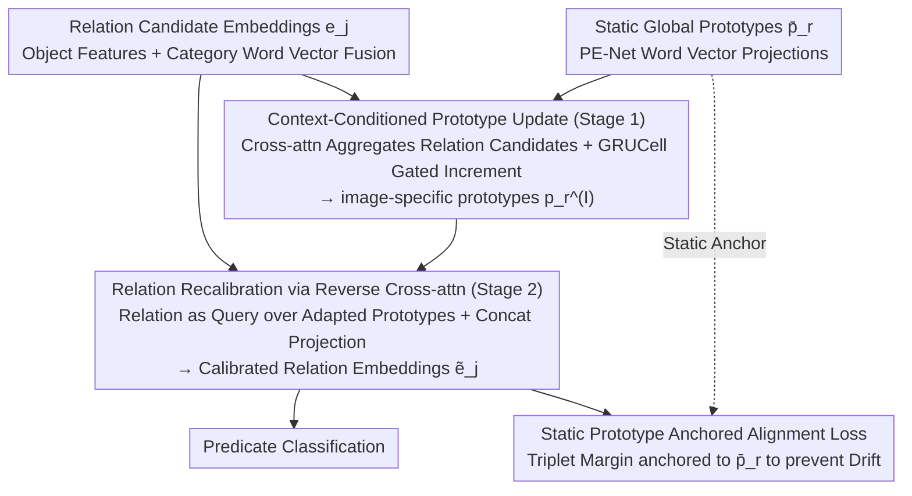

# Learning Context-Conditioned Predicate Semantics via Prototype Feedback

**Conference**: ICML 2026  
**arXiv**: [2605.29610](https://arxiv.org/abs/2605.29610)  
**Code**: https://github.com/Namgyu97/AlignG-SGG.pytorch  
**Area**: Multi-modal VLM / Scene Graph Generation  
**Keywords**: Scene Graph Generation, Relational Reasoning, Prototype Learning, Contextual Conditioning, Predicate Disambiguation  

## TL;DR
AlignG transforms the static predicate prototypes of PE-Net into "image-conditioned" dynamic prototypes: it first performs incremental GRU updates on prototypes using relation candidates to obtain image-specific prototypes, then uses these back to recalibrate relation features, while anchoring the alignment loss to static global prototypes to prevent drift. It achieves F@100 gains of 1.4 and 2.7 on VG-150 and GQA-200 SGDet settings, respectively.

## Background & Motivation

**Background**: Scene Graph Generation (SGG) aims to represent images as graphs of "objects + pairwise predicates," serving as a core task for structured scene understanding. A primary approach is prototype learning: PE-Net assigns a static prototype $\bar{\mathbf{p}}_r = \mathbf{W}_p \mathbf{t}_r$ projected from word vectors to each predicate category, and aligns relation embeddings $\mathbf{e}_j$ to their corresponding prototypes. Subsequent works like C-SGG, UP-Net, and MCL further split a predicate into multiple sub-prototypes to cover semantic diversity, while RA-SGG introduces retrieval-augmented external examples.

**Limitations of Prior Work**: Predicates are inherently polysemous. "On" can denote spatial contact or functional use; "riding" and "standing on" share nearly identical visual features in static images, differing only in action intent. Whether using single, multiple, or retrieved prototypes, **as long as the prototypes remain static after training**, the model cannot re-organize predicate semantics using image-specific evidence, such as the available relation candidates in a given image. This results in systematic confusion in ambiguous scenes and the subsumption of long-tail predicates by high-frequency ones.

**Key Challenge**: Prototypes must maintain **dataset-level semantic stability** (not drifting due to a single image) while possessing **image-level semantic flexibility** (to distinguish skiing vs. standing on a board). These demands are mutually exclusive within "static prototype" frameworks.

**Goal**: To rewrite predicate learning from "image-agnostic static matching" to "image-conditioned adaptation" without destroying the global topology.

**Key Insight**: The author observes that the $N$ relation candidates $\{\mathbf{e}_j\}_{j=1}^N$ in an image are natural contextual evidence that can be "fed back" to the prototypes. Furthermore, gated incremental updates like GRU are inherently suitable for "absorbing new information without losing steady-state stability."

**Core Idea**: Establish a bidirectional interaction between "prototypes ↔ relation candidates." Relation candidates are aggregated into image-conditioned prototypes, which then feedback to recalibrate relation features. The alignment loss is intentionally calculated against **static prototypes** rather than adapted ones, forcing the model to use image evidence to "adjust representation" rather than "collusively modifying both prototypes and relations."

## Method

### Overall Architecture
Input: Object features $\mathbf{x}_s, \mathbf{x}_o$ and category word vectors $\mathbf{t}_s, \mathbf{t}_o$ extracted by Faster R-CNN are fused into relation embeddings $\mathbf{e}_j = F(\mathbf{v}_s, \mathbf{v}_o) \in \mathbb{R}^d$, alongside PE-Net-style global static prototypes $\bar{\mathbf{p}}_r$.

AlignG adds two sequential modules:

1.  **Stage 1: Prototype Contextualization**—Uses cross-attention (query=prototype, key/value=relation candidates) + GRUCell to incrementally update $\bar{\mathbf{p}}_r$ into image-specific prototypes $\mathbf{p}_r^{(I)}$.
2.  **Stage 2: Relation Recalibration**—Uses reverse cross-attention (query=relation, key/value=adapted prototypes) to obtain prototype-informed feedback $\mathbf{u}_j$, which is concatenated with $\mathbf{e}_j$ and passed through a projection network to obtain $\tilde{\mathbf{e}}_j$.

Finally, $\tilde{\mathbf{e}}_j$ is used for predicate classification, but the **alignment loss is calculated against the static $\bar{\mathbf{p}}_r$**, serving as the stability anchor for the framework.

### Key Designs

**1. Context-Conditioned Prototype Update (Stage 1): Injecting "Current Image Relation Candidates" into Prototypes**

Static prototypes cannot re-organize semantics using image-specific evidence. AlignG uses the $N$ relation candidates in an image as context to update prototypes. For each prototype $r$, compatibility-weighted cross-attention (query is prototype, key/value are candidates) aggregates a context vector $\mathbf{u}_r = \sum_j \alpha_{rj} \mathbf{W}_v \mathbf{e}_j$, where $\alpha_{rj} \propto \exp((\mathbf{W}_q \bar{\mathbf{p}}_r)^\top (\mathbf{W}_k \mathbf{e}_j) / \sqrt{d})$. To prevent washing out global semantics, a GRUCell performs gated incremental updates: $\mathbf{p}_r^{(I)} = \mathrm{GRUCell}(\mathbf{u}_r, \mathrm{LayerNorm}(\bar{\mathbf{p}}_r))$. The reset/update gates allow selective absorption—adjusting significantly when scene evidence is strong and remaining stable otherwise.

**2. Relation Recalibration via Reverse Cross-attention (Stage 2): Using Adapted Prototypes to Reshape Relation Features**

After prototypes are updated, they must act back on relation embeddings. For each relation $j$, reverse cross-attention (query is relation, key/value are adapted prototypes) computes prototype-informed feedback $\mathbf{u}_j = \sum_r \beta_{jr} \mathbf{W}_v' \mathbf{p}_r^{(I)}$, where $\beta_{jr} \propto \exp((\mathbf{W}_q' \mathbf{e}_j)^\top (\mathbf{W}_k' \mathbf{p}_r^{(I)}) / \sqrt{d})$. The final embedding is $\tilde{\mathbf{e}}_j = f_{\mathrm{proj}}([\mathrm{LayerNorm}(\mathbf{e}_j); \mathbf{u}_j])$. A single-step concat-projection is used here as relation embeddings are transient and do not require the same steady-state preservation as prototypes. This reduces complexity to $\mathcal{O}(RP)$ compared to standard self-attention $\mathcal{O}(P^2)$.

**3. Static Prototype Anchored Alignment Loss: Preventing Collusion via Steady-State Constraints**

If the alignment target used adapted prototypes $\mathbf{p}_r^{(I)}$, the relations and prototypes would mutually adapt to image-specific local optima, causing the classifier to overfit. AlignG anchors the alignment loss to static global prototypes:

$$\mathcal{L}_{\mathrm{align}} = \max\{0, \|\tilde{\mathbf{e}}_j - \bar{\mathbf{p}}^+\|_2^2 - \|\tilde{\mathbf{e}}_j - \bar{\mathbf{p}}^-\|_2^2 + \gamma\}$$

Both $\bar{\mathbf{p}}^+$ and $\bar{\mathbf{p}}^-$ are static prototypes. Combined with prototype regularization $\mathcal{L}_{\mathrm{reg}}$ and classification loss, the total objective is $\mathcal{L} = \mathcal{L}_{\mathrm{cls}} + \mathcal{L}_{\mathrm{reg}} + \mathcal{L}_{\mathrm{align}}$. This forces image-conditioned adaptation to stay within the "neighborhood" of global prototypes, ensuring dataset-level stability while allowing local shifts.

### Loss & Training
The loss structure inherits from PE-Net without additional frequency or co-occurrence priors. Long-tail weighting is denoted by †. Optimizer: SGD (lr $1\times 10^{-3}$, momentum 0.9, weight decay $1\times 10^{-4}$), batch size 8, 60k iterations on an RTX 4090. Prototype dimension $d=300$ from GloVe, diversity margin $\gamma_{\mathrm{div}}=3.0$, alignment margin $\gamma=20.0$.

## Key Experimental Results

### Main Results (VG-150 + GQA-200)

| Dataset / Setting | Metric | PE-Net (backbone) | MCL† (Prev. SOTA) | RA-SGG† (Prev. SOTA) | AlignG† (Ours) |
|---|---|---|---|---|---|
| VG-150 / SGDet | mR@100 | 14.5 | 17.3 | 17.1 | **19.7** |
| VG-150 / SGDet | F@100 | 20.4 | 22.4 | 21.9 | **23.8 (+1.4)** |
| VG-150 / SGCls | F@100 | 25.8 | 29.9 | 28.6 | **30.2** |
| GQA-200 / SGDet | mR@100 | 11.9 | – | 15.0 | **15.5** |
| GQA-200 / SGDet | F@100 | 15.7 | – | 16.8 | **19.5 (+2.7)** |
| GQA-200 / PredCls | F@100 | 36.5 | – | 42.4 | **43.4 (+1.0)** |

Compared to PE-Net, AlignG† improves mR@100 significantly across all three settings on VG-150, indicating that gains come from the prototype feedback mechanism rather than external retrieval.

### Ablation Study (VG-150)

| Configuration | PredCls F@100 | SGCls F@100 | SGDet F@100 | Description |
|---|---|---|---|---|
| PE-Net baseline | 45.0 | 25.8 | 20.4 | Static Prototypes |
| + Edge update | 46.5 | 25.4 | 21.0 | Relation-level modeling only |
| + Edge + Proto (concat) | 46.7 | 27.0 | 20.8 | Concat-style prototype update |
| + Edge + Proto (GRU) | **47.5** | **27.2** | **21.3** | GRU gated update |
| w/ † Freq. Weighting | 50.3 | 30.2 | 23.8 | Long-tail weighting |

GRU outperforms concat across all settings, verifying that "gated incremental updates" are crucial for variables like prototypes that require steady-state stability.

### Key Findings
- **GRU > concat**: Replacing GRU with concatenation leads to consistent performance drops, confirming that gated increments prevent prototype adaptation from degrading.
- **Static Anchor > Adapted Anchor**: Calculating alignment loss against $\bar{\mathbf{p}}_r$ rather than $\mathbf{p}_r^{(I)}$ is a critical design choice to prevent collusion between relations and prototypes.
- **Large Gain on GQA-200**: The more significant F@100 gain on GQA-200 (+2.7 vs +1.4) suggests that context-conditioning provides higher dividends in scenes with richer semantic structures and compositionality.

## Highlights & Insights
- **Bidirectional Interaction**: Instead of unidirectional "prototype → relation" influence, AlignG models "prototype ← relation candidates," elevating context from an implicit variable to an explicit update signal.
- **Transferable Principles**: The distinction between "gated incremental updates for state variables" and "single-step强 recalibration for transient variables" is valuable for other tasks requiring global/local balance.
- **Static Anchor + Dynamic Offset**: Anchoring alignment to static prototypes serves as a cleverly implemented "anti-collusion" mechanism, similar to the role of an EMA teacher in self-distillation.

## Limitations & Future Work
- **Intent Inference**: Confusion analysis shows that distinguishing "riding" from "standing on" remains difficult as it requires temporal cues that single-frame SGG frameworks lacks.
- **Detector Reliance**: Proposal quality depends on the frozen Faster R-CNN; if objects are missed, the feedback mechanism has no evidence to process.
- **Fixed Prototype Count**: $R$ is fixed by the dataset; open-vocabulary scenarios would require extending the prototype generation mechanism.

## Related Work & Insights
- **vs PE-Net (CVPR'23)**: AlignG serves as a "bidirectional cross-attention + gated update" plugin for PE-Net, maintaining compatibility via static prototype anchoring.
- **vs MCL (TIP'25)**: While MCL uses multiple fixed sub-prototypes for diversity, AlignG proves that "adaptive prototypes" are superior to "multiple static prototypes."
- **vs RA-SGG (AAAI'25)**: Unlike RA-SGG which uses image-agnostic external retrieval, AlignG's signals are entirely internal, avoiding retrieval costs and noise.

## Rating
- Novelty: ⭐⭐⭐⭐ — Shift from static to dynamic prototypes is clear, though components (cross-attn, GRU) are standard.
- Experimental Thoroughness: ⭐⭐⭐⭐ — Covers standard benchmarks and major settings with cost and confusion analyses.
- Writing Quality: ⭐⭐⭐⭐ — Clear motivation and design justifications with helpful visualizations.
- Value: ⭐⭐⭐⭐ — Provides interpretable gains in a mature task like SGG.

<!-- RELATED:START -->

## Related Papers

- [\[ICML 2026\] $α$-PFN: Fast Entropy Search via In-Context Learning](α-pfn_fast_entropy_search_via_in-context_learning.md)
- [\[CVPR 2026\] Enhancing Visual Representation with Textual Semantics: Textual Semantics-Powered Prototypes for Heterogeneous Federated Learning](../../CVPR2026/optimization/enhancing_visual_representation_with_textual_semantics_textual_semantics_powered_p.md)
- [\[ICML 2026\] Test time training enhances in-context learning of nonlinear functions](test_time_training_enhances_in-context_learning_of_nonlinear_functions.md)
- [\[ICLR 2026\] Bayesian Evidence-Driven Prototype Evolution for Federated Domain Adaptation](../../ICLR2026/optimization/bayesian_evidence-driven_prototype_evolution_for_federated_domain_adaptation.md)
- [\[ICLR 2026\] Error Feedback for Muon and Friends](../../ICLR2026/optimization/error_feedback_for_muon_and_friends.md)

<!-- RELATED:END -->
## Related Papers

- [\[CVPR 2026\] Enhancing Visual Representation with Textual Semantics: Textual Semantics-Powered Prototypes for Heterogeneous Federated Learning](../../CVPR2026/optimization/enhancing_visual_representation_with_textual_semantics_textual_semantics_powered_p.md)
- [\[ICML 2026\] Test time training enhances in-context learning of nonlinear functions](test_time_training_enhances_in-context_learning_of_nonlinear_functions.md)
- [\[ICLR 2026\] Conditioned Initialization for Attention](../../ICLR2026/optimization/conditioned_initialization_for_attention.md)
- [\[ICML 2026\] $α$-PFN: Fast Entropy Search via In-Context Learning](α-pfn_fast_entropy_search_via_in-context_learning.md)
- [\[NeurIPS 2025\] Deep Taxonomic Networks for Unsupervised Hierarchical Prototype Discovery](../../NeurIPS2025/optimization/deep_taxonomic_networks_for_unsupervised_hierarchical_prototype_discovery.md)

<!-- RELATED:END -->
