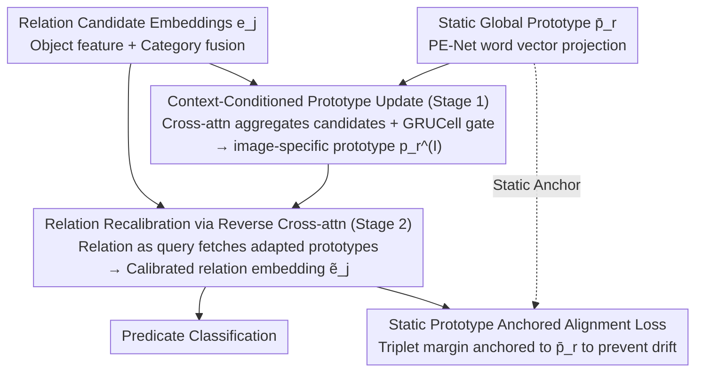

# Learning Context-Conditioned Predicate Semantics via Prototype Feedback

**Conference**: ICML 2026  
**arXiv**: [2605.29610](https://arxiv.org/abs/2605.29610)  
**Code**: https://github.com/Namgyu97/AlignG-SGG.pytorch  
**Area**: Multimodal VLM / Scene Graph Generation  
**Keywords**: Scene Graph Generation, Relational Reasoning, Prototype Learning, Contextualization, Predicate Disambiguation  

## TL;DR
AlignG transforms the static predicate prototypes of PE-Net into "image-conditioned" dynamic prototypes. It first uses relation candidates to incrementally update prototypes via GRU to obtain image-specific prototypes, then inversely uses these to recalibrate relation features, anchoring the alignment loss to static global prototypes to prevent drift. This achieves gains of 1.4 and 2.7 in F@100 on the SGDet setting of VG-150 and GQA-200, respectively.

## Background & Motivation

**Background**: Scene Graph Generation (SGG) aims to represent an image as a graph of "objects + pairwise predicates," serving as a core task for structured scene understanding. A mainstream approach is prototype learning: PE-Net assigns a static prototype $\bar{\mathbf{p}}_r = \mathbf{W}_p \mathbf{t}_r$ projected from word embeddings to each predicate category, aligning relation embeddings $\mathbf{e}_j$ to their corresponding prototypes. Subsequent works like C-SGG, UP-Net, and MCL further decompose a predicate into multiple sub-prototypes to cover semantic diversity, while RA-SGG introduces retrieval-augmented external exemplars.

**Limitations of Prior Work**: Predicates are inherently polysemous. "On" can denote both spatial contact and functional use; "riding" and "standing on" often share nearly identical visual features in static images, differing only in action intent. Whether using single, multiple, or retrieved prototypes, **as long as the prototypes remain fixed after training**, the model cannot utilize image-specific evidence—such as "which relation candidates actually exist in this image"—to reorganize predicate semantics. This results in systematic confusion in ambiguous scenes and the suppression of long-tail predicates by high-frequency ones.

**Key Challenge**: Prototypes must simultaneously maintain **dataset-level semantic stability** (avoiding drift due to a single image) and possess **image-level semantic flexibility** (to distinguish skiing vs. standing on a snowboard). These two requirements are mutually exclusive within a "static prototype" framework.

**Goal**: To rewrite predicate learning from "image-agnostic static matching" to "image-conditioned adaptation," while providing an update mechanism that does not disrupt global topology.

**Key Insight**: The authors observe that the $N$ relation candidates $\{\mathbf{e}_j\}_{j=1}^N$ in an image are natural contextual evidence that can be fed back into the prototypes. Furthermore, incremental gated updates like GRU are inherently suited for "absorbing new information without losing steady-state properties."

**Core Idea**: Establish bidirectional interaction between "prototypes ↔ relation candidates"—first aggregating relation candidates into image-conditioned prototypes, then allowing the prototypes to provide feedback to recalibrate relation features. The alignment loss is deliberately calculated against **static prototypes** rather than adapted ones, forcing the model to use image evidence to "adjust representation" rather than "colluding to modify both prototype and relation."

## Method

### Overall Architecture
Input: Object features $\mathbf{x}_s, \mathbf{x}_o$ and category embeddings $\mathbf{t}_s, \mathbf{t}_o$ extracted by Faster R-CNN are fused into relation embeddings $\mathbf{e}_j = F(\mathbf{v}_s, \mathbf{v}_o) \in \mathbb{R}^d$; along with global static prototypes $\bar{\mathbf{p}}_r$ in the style of PE-Net.

AlignG adds two sequential modules on top of this:

1.  **Stage 1: Prototype Contextualization**—Uses cross-attention (query=prototype, key/value=relation candidates) + GRUCell to incrementally update $\bar{\mathbf{p}}_r$ into image-specific prototypes $\mathbf{p}_r^{(I)}$.
2.  **Stage 2: Relation Recalibration**—Reverse cross-attention (query=relation, key/value=adapted prototypes) obtains prototype-informed feedback $\mathbf{u}_j$, which is concatenated with $\mathbf{e}_j$ and passed through a projection network to yield $\tilde{\mathbf{e}}_j$.

Finally, $\tilde{\mathbf{e}}_j$ is used for predicate classification, while the **alignment loss is calculated against the static $\bar{\mathbf{p}}_r$**, serving as the stability anchor for the entire framework.

### Key Designs

**1. Context-Conditioned Prototype Update (Stage 1): Injecting "active relation candidates" into prototypes**

The pain point is that once prototypes are frozen after training, the model cannot utilize image-specific evidence to reorganize predicate semantics. AlignG notes that the $N$ relation candidates in an image are natural contexts and uses them to update the prototypes. For each prototype $r$, compatibility-weighted cross-attention (query is prototype, key/value is relation candidates) aggregates a context vector $\mathbf{u}_r = \sum_j \alpha_{rj} \mathbf{W}_v \mathbf{e}_j$, where attention weights are $\alpha_{rj} \propto \exp((\mathbf{W}_q \bar{\mathbf{p}}_r)^\top (\mathbf{W}_k \mathbf{e}_j) / \sqrt{d})$. However, simply overwriting $\bar{\mathbf{p}}_r$ with $\mathbf{u}_r$ would destroy the global semantic topology. Instead, a GRUCell is used for gated incremental updates: $\mathbf{p}_r^{(I)} = \mathrm{GRUCell}(\mathbf{u}_r, \mathrm{LayerNorm}(\bar{\mathbf{p}}_r))$. The reset/update gates provide "selective absorption"—adjusting significantly when scene evidence is strongly consistent and remaining stable when evidence is weak. This step essentially transforms prototypes from "frozen constants" into "per-image variables" while keeping drift constrained by gating.

**2. Relation Recalibration via Reverse Cross-attention (Stage 2): Feeding adapted prototypes back to reshape relation features**

Once prototypes are dynamic, they must act back on the relation embeddings; otherwise, classification would still rely on old features lacking global semantic integration. For each relation $j$, reverse cross-attention (query is relation, key/value is adapted prototypes) calculates prototype-informed feedback $\mathbf{u}_j = \sum_r \beta_{jr} \mathbf{W}_v' \mathbf{p}_r^{(I)}$, where $\beta_{jr} \propto \exp((\mathbf{W}_q' \mathbf{e}_j)^\top (\mathbf{W}_k' \mathbf{p}_r^{(I)}) / \sqrt{d})$. The final output is $\tilde{\mathbf{e}}_j = f_{\mathrm{proj}}([\mathrm{LayerNorm}(\mathbf{e}_j); \mathbf{u}_j])$. A single-step concat-projection is deliberately used rather than iterative updates because relation embeddings are transient and do not persist across samples, making them suitable for strong "one-shot" calibration. Complexity remains efficient: cross-attention between $R$ prototypes and $P$ candidates results in an $R \times P$ attention map, reducing the $\mathcal{O}(P^2)$ of traditional self-attention to $\mathcal{O}(RP)$, which is particularly beneficial in dense scenes.

**3. Static Prototype Anchored Alignment Loss: A stability constraint for "dynamic prototypes"**

Making prototypes dynamic introduces a new risk—if the alignment target also uses the adapted prototype $\mathbf{p}_r^{(I)}$, the relation and prototype might accommodate each other within the same image, converging to an image-specific local solution and causing the classifier to overfit to image bias. AlignG’s key design is anchoring the alignment loss back to the static global prototype:

$$\mathcal{L}_{\mathrm{align}} = \max\{0, \|\tilde{\mathbf{e}}_j - \bar{\mathbf{p}}^+\|_2^2 - \|\tilde{\mathbf{e}}_j - \bar{\mathbf{p}}^-\|_2^2 + \gamma\}$$

The triplets $\bar{\mathbf{p}}^+, \bar{\mathbf{p}}^-$ use static rather than adapted prototypes. Combined with prototype regularization $\mathcal{L}_{\mathrm{reg}}$ (similarity penalty + diversity margin $\gamma_{\mathrm{div}}$) and classification loss, the objective is $\mathcal{L} = \mathcal{L}_{\mathrm{cls}} + \mathcal{L}_{\mathrm{reg}} + \mathcal{L}_{\mathrm{align}}$. This forces image-conditioned adaptation to remain within the "neighborhood" of global prototypes—preserving dataset-level stability while allowing per-image local offsets. Gradients still propagate back to the adaptation module via $\tilde{\mathbf{e}}_j$. This functions similarly to an EMA teacher in self-distillation but applied to prototypes.

### Loss & Training
The framework inherits the loss structure of PE-Net without adding extra frequency/co-occurrence priors; optional long-tail weighting is denoted by †. Optimizer is SGD (lr $1\times 10^{-3}$, momentum 0.9, weight decay $1\times 10^{-4}$), batch size 8, 60k iterations on an RTX 4090. Prototype dimension $d$ comes from a 300-d GloVe projection, diversity margin $\gamma_{\mathrm{div}}=3.0$, and alignment margin $\gamma=20.0$.

## Key Experimental Results

### Main Results (VG-150 + GQA-200, Three Settings)

| Dataset / Setting | Metric | PE-Net (backbone) | MCL† (Prev. SOTA) | RA-SGG† (Prev. SOTA) | AlignG† (Ours) |
|---|---|---|---|---|---|
| VG-150 / SGDet | mR@100 | 14.5 | 17.3 | 17.1 | **19.7** |
| VG-150 / SGDet | F@100 | 20.4 | 22.4 | 21.9 | **23.8 (+1.4)** |
| VG-150 / SGCls | F@100 | 25.8 | 29.9 | 28.6 | **30.2** |
| GQA-200 / SGDet | mR@100 | 11.9 | – | 15.0 | **15.5** |
| GQA-200 / SGDet | F@100 | 15.7 | – | 16.8 | **19.5 (+2.7)** |
| GQA-200 / PredCls | F@100 | 36.5 | – | 42.4 | **43.4 (+1.0)** |

Compared to PE-Net, AlignG† improves mR@100 by +8.8 / +7.2 / +5.2 across the three VG-150 settings, indicating that gains stem from the prototype feedback mechanism rather than conceptual expansion or external retrieval.

### Ablation Study (VG-150, Incremental Components)

| Configuration | PredCls F@100 | SGCls F@100 | SGDet F@100 | Description |
|---|---|---|---|---|
| PE-Net baseline | 45.0 | 25.8 | 20.4 | Static Prototype |
| + Edge update | 46.5 | 25.4 | 21.0 | Relation-level modeling only |
| + Edge + Proto (concat) | 46.7 | 27.0 | 20.8 | Concat-based prototype update |
| + Edge + Proto (GRU) | **47.5** | **27.2** | **21.3** | GRU gated update |
| + † Freq Weighting | 50.3 | 30.2 | 23.8 | Long-tail weighting |

GRU consistently outperforms concat across all settings (+0.8/+0.2/+0.5 F@100), confirming that "gated incremental updates" are critical for prototypes that require steady-state maintenance.

### Key Findings
- **GRU > Concat**: Replacing GRU with concat in the ablation led to consistent performance drops, proving that "gated increments" are core to preventing degradation in prototype adaptation.
- **Static Anchoring > Adapted Anchoring**: Calculating the alignment loss against $\bar{\mathbf{p}}_r$ instead of $\mathbf{p}_r^{(I)}$ is a crucial design choice to prevent "collusion" between relations and prototypes within the same image.
- **Larger Gains on GQA-200**: The F@100 improvement is more significant on the fine-grained and more compositional GQA-200 (+2.7 vs +1.4), suggesting that context-conditioning yields higher returns in scenarios with richer semantic structures.

## Highlights & Insights
- **Bidirectional Interaction** instead of unidirectional "prototype → relation": AlignG models "prototype ← relation candidates," elevating context from an implicit variable inside the classifier to an explicit update signal.
- **Transferable Design Principle**: "Gated incremental updates for state variables, single-step strong calibration for transient variables"—this distinction is valuable for other tasks requiring a balance between global and local information (e.g., prompt learning, retrieval-augmented embedding).
- **Static Anchor + Dynamic Offset Paradigm**: Anchoring alignment loss to static prototypes is a clever anti-collusion mechanism, similar to the role of an EMA teacher in self-distillation but applied to prototypes. This can be generalized to any dual-layer structure involving "base semantics + instance adaptation."

## Limitations & Future Work
- **Ambiguity in Static Images**: Confusion analysis shows that semantic distinctions like "riding ↔ standing on" require temporal or motion cues. Single-frame SGG frameworks cannot fundamentally solve this; AlignG can only optimize based on existing visual evidence.
- **Dependency on Pre-trained Detectors**: Faster R-CNN is used in a frozen state, making object proposal quality the performance ceiling. If the detector misses key objects, prototype feedback has no data to process.
- **Fixed Number of Prototypes**: $R$ is pre-defined by the dataset categories (50 for VG-150, 100 for GQA-200). Extending the prototype generation mechanism is necessary for open-vocabulary scenarios.
- **Future Directions**: Converting Stage 1 into a multi-step iterative EM-like optimization, introducing video temporal evidence to resolve action intent, or replacing prototypes with dynamic concept libraries generated by LLMs.

## Related Work & Insights
- **vs PE-Net (CVPR'23)**: Directly serves as the backbone; AlignG upgrades the "single static prototype" to "global static prototype + per-image GRU updates," maintaining compatibility by using static prototypes for alignment loss. It essentially adds a "bidirectional cross-attention + gated update" plugin to PE-Net.
- **vs MCL (TIP'25)**: MCL uses multi-concept prototypes to cover semantic diversity; AlignG pursues a "lean but flexible" approach—keeping prototype counts constant but allowing per-image reorganization, proving that "adaptation > static diversity."
- **vs RA-SGG (AAAI'25)**: RA-SGG uses externally retrieved samples for augmentation, which is largely image-agnostic. AlignG’s augmentation signals come entirely from the image's own relation candidates, saving retrieval costs and avoiding external noise.
- **Related Insight**: The "bidirectional cross-attention + static anchor" design can be transferred to question/answer prototypes in VQA, class prompts in open-set detection, or demonstration adaptation in retrieval-augmented LLMs.

## Rating
- Novelty: ⭐⭐⭐⭐ — The shift from "static" to "dynamic" prototypes in SGG is a clear paradigm change, though the underlying components (cross-attn + GRU) are standard.
- Experimental Thoroughness: ⭐⭐⭐⭐ — Comprehensive coverage of two standard benchmarks and three settings; includes ablation, computational overhead, and confusion analysis. Lacks a quantitative analysis of prototype drift magnitude.
- Writing Quality: ⭐⭐⭐⭐ — Motivation and design choices are well-explained; includes prototype similarity visualizations; formulas and flowcharts are well-coordinated.
- Value: ⭐⭐⭐⭐ — Provides interpretable improvements in the relatively mature SGG task. The "bidirectional + static anchor + gating" combination is transferable to other prototype-based methods.

<!-- RELATED:START -->

## Related Papers

- [\[CVPR 2026\] Enhancing Visual Representation with Textual Semantics: Textual Semantics-Powered Prototypes for Heterogeneous Federated Learning](../../CVPR2026/optimization/enhancing_visual_representation_with_textual_semantics_textual_semantics_powered_p.md)
- [\[ICML 2026\] Test time training enhances in-context learning of nonlinear functions](test_time_training_enhances_in-context_learning_of_nonlinear_functions.md)
- [\[NeurIPS 2025\] Deep Taxonomic Networks for Unsupervised Hierarchical Prototype Discovery](../../NeurIPS2025/optimization/deep_taxonomic_networks_for_unsupervised_hierarchical_prototype_discovery.md)
- [\[ICML 2025\] Training Dynamics of In-Context Learning in Linear Attention](../../ICML2025/optimization/training_dynamics_of_in-context_learning_in_linear_attention.md)
- [\[ICML 2025\] On Understanding Attention-Based In-Context Learning for Categorical Data](../../ICML2025/optimization/on_understanding_attention-based_in-context_learning_for_categorical_data.md)

<!-- RELATED:END -->
