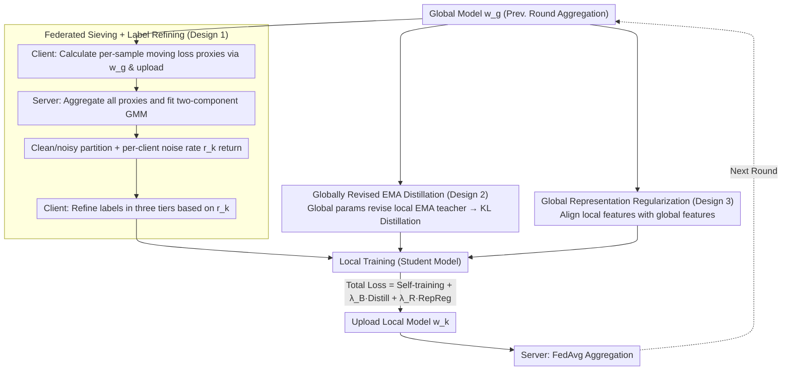

# Learning Locally, Revising Globally: Global Reviser for Federated Learning with Noisy Labels

**Conference**: ICML 2026  
**arXiv**: [2412.00452](https://arxiv.org/abs/2412.00452)  
**Code**: https://github.com/cs-yuxintian/FedGR-ICML26 (Available)  
**Area**: Federated Learning / Learning with Noisy Labels / Optimization  
**Keywords**: Federated Learning, Label Noise, EMA Distillation, GMM Sample Selection, Privacy Protection  

## TL;DR
This paper observes a "delayed memory" phenomenon in the global models of FL regarding noisy labels (memory rate $\le 30\%$ on CIFAR-10, significantly lower than centralized training). Based on this, FedGR is proposed, which utilizes a server-side GMM to jointly filter samples and estimate noise ratios for each client using aggregated loss proxies. It further periodically "revises" local EMA teachers with global parameters for distillation and incorporates a global-local representation consistency regularization. These three modules collaborate to achieve stable and significant gains across CIFAR-10/100 and Clothing1M under dual heterogeneity (label noise $\times$ non-IID) settings compared to 8 SOTA baselines.

## Background & Motivation

**Background**: Federated Learning (FL) enables model training by combining "model aggregation" and "data locality." FedAvg has become the de facto standard for privacy-sensitive scenarios such as medical imaging, recommendations, and graph learning. Simultaneously, the community has developed mature centralized Learning with Noisy Labels (C-LNL) solutions like Co-teaching and DivideMix. The mainstream approach leverages the "memorization effect"—where networks learn clean samples before overfitting to noisy labels—to perform sample selection.

**Limitations of Prior Work**: Directly applying C-LNL methods to FL encounters two types of heterogeneity: (1) significant differences in noise **types** (symmetric/asymmetric/mixed) and **ratios** across different clients; (2) label imbalance caused by non-IID data distributions. The superposition of these factors causes client-independent sample selection or dual-network mechanisms (Co-teaching / DivideMix) to frequently fail in "clean-rate estimation," while consensus methods relying on shared statistical features violate privacy boundaries.

**Key Challenge**: Independent client filtering leads to insufficient samples and jitter in noise estimation; sharing statistical information between clients leaks distribution information. Furthermore, local models are easily corrupted by high-noise clients. While the global model is robust, it cannot fit local distributions well, making it difficult to utilize both simultaneously.

**Goal**: Solve both "noise estimation" and "local training regularization" without leaking any information related to the joint distribution of $(\mathbf{x}, \mathbf{y})$.

**Key Insight**: The authors empirically discover that the global model in FL memorizes noisy labels much slower than in centralized training (under CIFAR-10 Sym noise, centralized models eventually memorize $\ge 80\%$ of noisy labels, while FL global models memorize $\le 30\%$). Moreover, its test accuracy does not collapse after the "noisy peak" as centralized training does. They term this phenomenon "intrinsic label noise robustness of FL" and treat the global model as a trustworthy "reviser."

**Core Idea**: Treat the "intrinsic delayed memory of the global model" as a free lunch for privacy protection. The server performs GMM filtering using only per-sample loss proxies (independent of data distribution) and sends the results back to clients. Meanwhile, local EMA teachers on the client side are periodically "revised" by global parameters to prevent noise accumulation.

## Method

### Overall Architecture
FedGR adds three modules outside the standard FedAvg loop, designed for local training of client $k$ at round $t$. The total loss is $\mathcal{L}_k = \mathcal{L}_k^{SR} + \lambda_{\mathcal{B}} \mathcal{B}_k + \lambda_{\mathcal{R}} \mathcal{R}_k$. Process: (1) Clients use the global model $\mathbf{w}_g^{t-1}$ to calculate moving average loss proxies $\bar{\ell}_i^t$ for each sample and upload them to the server; (2) The server fits a two-component GMM to all aggregated proxies, partitioning clean/noisy subsets according to the "clean posterior probability" $q_{i,k}$ and estimating the noise rate $r_k$ for each client, then returns the results; (3) Clients refine labels based on $r_k$ tiers (low noise & clean subset $\to$ keep; low noise & noisy subset $\to$ $q_{i,k}\hat{y}_i + (1-q_{i,k})y^{pse}_i$ soft labels; high noise $r_k \ge \beta$ $\to$ use pseudo-labels $y^{pse}_i$ directly, generated by FixMatch weak augmentation on the global model); (4) Maintain a local EMA teacher, revised at the start of each round using global parameters $\mathbf{w}_{k,ema}^{t,0} = \gamma_g \mathbf{w}_{k,ema}^{t-1,m_k} + (1-\gamma_g)\mathbf{w}_g^{t-1}$; distillation is performed during local steps; (5) Global-local representation consistency regularization $\mathcal{R}_k$ further constrains the local backbone from deviating too far from global representations.

### Key Designs

**1. Federated Sieving + Label Refining: Moving noise determination to the server using distribution-independent loss statistics**

**Mechanism**: A single client with only 10–50 samples cannot fit the "clean vs. noisy" bimodal distribution, leading to jitter in independent noise estimation. Sharing class frequencies or prototypes would leak distribution information. FedGR breaks this by transmitting only a privacy-agnostic quantity—the per-sample moving average loss proxy. Client $k$ maintains a set of loss observations $L_i^t=\{\ell_{i,p}\}_{p=1}^{T_k}$ for each sample, where $\ell_{i,T_k}=\mathcal{H}(\mathbf{p}_i^g,\hat{y}_i)$ is the cross-entropy calculated using the global model $\mathbf{w}_g^{t-1}$. The mean $\bar{\ell}_i^t=\frac{1}{T_k}\sum_p\ell_{i,p}$ is uploaded. The server aggregates proxies from all selected clients to fit a two-component GMM. The clean posterior $q_{i,k}$ provides both clean/noisy partitioning and the per-client noise rate $r_k$. Upon receiving results, the client refines labels $\tilde{y}_i$ in three tiers: if $r_k<\beta$ and clean, keep the original label; if $r_k<\beta$ but noisy, use $q_{i,k}\hat{y}_i+(1-q_{i,k})y^{pse}_i$ soft fusion; if $r_k\ge\beta$, use pseudo-labels $y^{pse}_i$ (weakly augmented FixMatch via global model) directly. This design leverages population data to stabilize bimodal modeling without leaking joint $(\mathbf{x}, \mathbf{y})$ distributions, avoiding risks associated with transmitting class frequencies as in FedCorr or FedNoRo.

**2. Globally Revised EMA Distillation: Periodically "washing" the local EMA teacher with global parameters**

**Design Motivation**: Online EMA accumulates error signals with local steps in high-noise clients, making independent local teachers unreliable. FedGR sets a two-stage update for each client's EMA model $\mathbf{w}_{k,ema}^{t,m_k}$: at the start of each round ($m_k=0$), it is first "revised" using global parameters:
$$\mathbf{w}_{k,ema}^{t,0}=\gamma_g\,\mathbf{w}_{k,ema}^{t-1,m_k}+(1-\gamma_g)\,\mathbf{w}_g^{t-1},$$
Then, during local training steps ($m_k\ge1$), it follows standard EMA: $\mathbf{w}_{k,ema}^{t,m_k}=\gamma_l\mathbf{w}_{k,ema}^{t,m_k-1}+(1-\gamma_l)\mathbf{w}_k^{t,m_k}$. Distillation uses the weakly augmented logits $\mathbf{p}_i^{le,w}$ from the "revised" EMA at the start of the round as the teacher, targeting $\mathcal{B}_k=\mathbb{E}_{\hat{\mathcal{D}}_k}[KL(\mathbf{p}_i^{le,w}/\tau,\ \mathbf{p}_i^{l,s}/\tau)]$. This explicitly overlays "EMA temporal smoothing" and "global aggregation population robustness." Since the forward pass is locked at $m_k=0$, distillation cost drops from $O(\text{steps})$ to $O(1)$. Ablation studies confirm its necessity: removing this module drops Non-IID Sym 1.0 accuracy from 63.64 to 51.07 (−12.6 points), much higher than the loss in IID settings, addressing the "local model corruption under high noise + imbalance" pain point.

**3. Global Representation Regularization: A label-independent fallback constraint from feature space**

**Function**: Distillation alone carries the risk that teachers might be misled by incorrectly refined labels. Representation regularization serves as a fallback: it constrains the local backbone $f(\cdot;\mathbf{w}_{k,f}^t)$ under weak augmentation to align with the features of the global backbone $f(\cdot;\mathbf{w}_{g,f}^{t-1})$ (cosine/L2 consistency, weighted by $\lambda_{\mathcal{R}}$). Its primary benefit is that it is completely label-agnostic—constraining the local model in feature space from deviating from the global model, thereby forming a "feature + logits" dual constraint alongside distillation. Ablation shows that removing it drops Non-IID Sym 1.0 from 63.64 to 58.23 (−5.4 points), indicating it provides independent reinforcement when the EMA teacher begins to accumulate errors.

### Loss & Training
Total loss: $\mathcal{L}_k = \mathcal{L}_k^{SR} + \lambda_{\mathcal{B}} \mathcal{B}_k + \lambda_{\mathcal{R}} \mathcal{R}_k$; $\lambda_{\mathcal{B}}=1.0$, $\lambda_{\mathcal{R}}=0.1$ (CIFAR-10) or $0.2$ (others); SGD + constant learning rate, local epoch $=10$ (CIFAR-10/100), $2$ (Clothing1M); Backbones are ResNet-18/34/pretrained ResNet-50 respectively; CIFAR split into 100 clients, Clothing1M into 500 clients, Non-IID using Dirichlet $\alpha=0.3$. Within warmup $\alpha$ rounds, the server samples randomly without replacement to ensure all clients are trained, then switches to standard FL sampling. Strong augmentation via RandAugment, weak augmentation follows FedCorr. Evaluation uses the mean accuracy of the final 10 rounds.

## Key Experimental Results

### Main Results
On CIFAR-10, controlling the proportion of noisy clients $\phi$ and the noise rate interval $\mathcal{U}(\rho_{\min}, \rho_{\max})$. Shown here are two extreme settings: "Sym 1.0/$\mathcal{U}(0.5,1.0)$" and "Mixed 1.0/$\mathcal{U}(0.2,0.4)$".

| Method | IID Sym $\phi=1.0$ | IID Mixed $\phi=1.0$ | Non-IID Sym $\phi=1.0$ | Non-IID Mixed $\phi=1.0$ |
|------|--------------------|----------------------|------------------------|--------------------------|
| FedAvg | 23.89 | 70.66 | 17.32 | 51.92 |
| FedProx | 23.02 | 64.44 | 16.69 | 49.77 |
| FL-Coteaching | 47.28 | 83.99 | 33.49 | 72.42 |
| FL-DivideMix | 68.47 | 85.19 | 38.35 | 68.86 |
| FedCorr (CVPR22) | 55.12 | 84.15 | 29.42 | 83.33 |
| FedNoRo (IJCAI23) | 33.98 | 71.07 | 18.60 | 57.09 |
| **FedGR (Ours)** | **83.91** | **93.13** | **63.64** | **86.50** |

CIFAR-10 Avg column: FedGR reaches 91.07, vs. runner-up FL-DivideMix at 81.11. Clothing1M (Table 3) also shows leadership. In the most extreme Non-IID Sym $\phi=1.0$/$\mathcal{U}(0.5,1.0)$ setting, it achieves a +34.2 point Gain over FedCorr.

### Ablation Study (CIFAR-10, Table 4)

| Configuration | IID Sym 1.0 | IID Mixed 1.0 | Non-IID Sym 1.0 | Non-IID Mixed 1.0 | Description |
|------|-------------|---------------|-----------------|-------------------|------|
| Full FedGR | 83.91 | 92.27 | 63.64 | 84.65 | Full Method |
| w/o FS | 54.59 | 91.71 | 45.48 | 84.01 | No FedSieving $\to$ IID Sym drops 29.3, Non-IID Sym drops 18.2 |
| w/o LR | 75.23 | 90.46 | 59.48 | 83.21 | No Refining $\to$ Drops 1–8 pts across settings |
| w/o $\mathcal{R}_k$ | 81.49 | 91.84 | 58.23 | 82.70 | No RepReg $\to$ Non-IID Sym drops 5.4 |
| w/o $\mathcal{B}_k$ | 78.14 | 91.24 | 51.07 | 79.44 | No EMA Distill $\to$ Non-IID Sym drops 12.6 |

### Key Findings
- **Federated Sieving (FS) is vital**: Removing FS leads to a 29.3 point drop in high-noise IID Sym, far exceeding other modules. This proves that aggregating data proxies at the server is qualitatively superior to independent client estimation, validating the core value of the "FL Global Perspective."
- **EMA Distillation (B_k) is most effective under dual heterogeneity**: Removing it drops Non-IID Sym 1.0 by 12.6 points, significantly higher than the 5.8 points in IID. This confirms it specifically addresses local model pollution under high noise and class imbalance.
- **Anomalous performance exceeding clean baseline**: In Mixed $\phi=0.6$/$\mathcal{U}(0.2,0.4)$, FedGR even outperforms FedAvg trained on clean data. The authors attribute this to the side effects of extra regularization, though they acknowledge the gap is small and the primary value remains noise robustness.
- **Sieving Accuracy**: Figure 3 reports that estimated client noise rates $\{r_k\}$ in FedGR have a Pearson correlation $>0.9$ with true values, significantly higher than FedCorr/FedFixer, showing that aggregated proxies + GMM are much more accurate.

## Highlights & Insights
- **Systematically monetizing global model robustness**: While previous FL papers often treat the global model as a "final output," this paper treats it as an "online implicit regularizer and trusted proxy." This perspective can be extended to Federated Domain Adaptation or Federated Continual Learning where global signals outperform local ones.
- **Privacy-friendly loss proxies**: Replacing prototypes/class frequencies with "per-sample moving loss" as the client-to-server signal is a clean, reusable trick. It is applicable to any scenario where the statistical objective concerns relative sample difficulty rather than semantic content.
- **EMA Revision Mechanism**: Explicitly combining EMA "temporal smoothing" with global aggregation "population smoothing," while locking distillation to the $m_k=0$ step, provides both theoretical grounding and engineering efficiency.

## Limitations & Future Work
- Assumes loss proxies can separate into a bimodal distribution at the population level within $\alpha$ rounds. If almost all clients have high, identical noise types, GMM may collapse to unimodal, potentially causing FS to fail.
- Introduces 4 new hyperparameters $\alpha, \beta, \gamma_g, \lambda_{\mathcal{R}}$. Sensitivity analysis shows $\gamma_g$ is sensitive (too high a value hurts accuracy); practical deployment requires tuning per dataset without an adaptive mechanism.
- Server-side GMM fitting and per-sample loss observation storage/bandwidth are claimed to be "moderate," but still represent a significant increase over vanilla FedAvg, with scalability to ultra-large scales (>10k clients) not yet tested.
- Privacy guarantees are intuitive ("loss is independent of distribution") but lack formal analysis like Differential Privacy. Immunity to membership inference attacks remains to be verified.

## Related Work & Insights
- **vs. FedCorr (CVPR22)**: FedCorr also uses "server-side noise correction" but requires more signals (model parameters + ratio statistics) and is weaker against dual heterogeneity. FedGR outperforms it by +34 points on Non-IID Sym 1.0 using only loss proxies.
- **vs. FedNoRo / FedDiv / FedFixer**: These focus on independent filtering or noisy client detection, failing under dual heterogeneity. FedGR's combination of server-side filtering and global-local representation alignment proves that the "centralized view + privacy-sensitive statistics" route is more robust.
- **vs. DivideMix (Centralized)**: DivideMix uses dual networks to stabilize clean-rate estimation. This work adapts the GMM posterior idea but replaces dual networks with a "Global-Local" + EMA distillation architecture, making it suitable for communication-constrained and distribution-heterogeneous FL environments.

## Rating
- Novelty: ⭐⭐⭐⭐ The combination of "Global model delayed memory" and server-side GMM joint filtering is systematically introduced for the first time in F-LNL.
- Experimental Thoroughness: ⭐⭐⭐⭐ 3 datasets × 8 baselines × multiple noise/distribution combinations × full ablation + hyperparameter analysis, though lacking extreme scenarios like 100% noise or >10k clients.
- Writing Quality: ⭐⭐⭐⭐ Clear motivation, explicit mapping between formulas and processes, and an appendix covering theoretical convergence and privacy.
- Value: ⭐⭐⭐⭐ A strong, reproducible baseline with significant gains for privacy-sensitive F-LNL deployment.

<!-- RELATED:START -->

## Related Papers

- [\[CVPR 2026\] Revisiting Learning with Noisy Labels: Active Forgetting and Noise Suppression](../../CVPR2026/optimization/revisiting_learning_with_noisy_labels_active_forgetting_and_noise_suppression.md)
- [\[AAAI 2026\] Data Heterogeneity and Forgotten Labels in Split Federated Learning](../../AAAI2026/optimization/data_heterogeneity_and_forgotten_labels_in_split_federated_learning.md)
- [\[CVPR 2026\] FedRG: Unleashing the Representation Geometry for Federated Learning with Noisy Clients](../../CVPR2026/optimization/fedrg_unleashing_the_representation_geometry_for_federated_learning_with_noisy_c.md)
- [\[ICML 2026\] Delayed Momentum Aggregation: Communication-efficient Byzantine-robust Federated Learning with Partial Participation](delayed_momentum_aggregation_communication-efficient_byzantine-robust_federated_.md)
- [\[ICLR 2026\] FedDAG: Clustered Federated Learning via Global Data and Gradient Integration for Heterogeneous Environments](../../ICLR2026/optimization/feddag_clustered_federated_learning_via_global_data_and_gradient_integration_for.md)

<!-- RELATED:END -->
