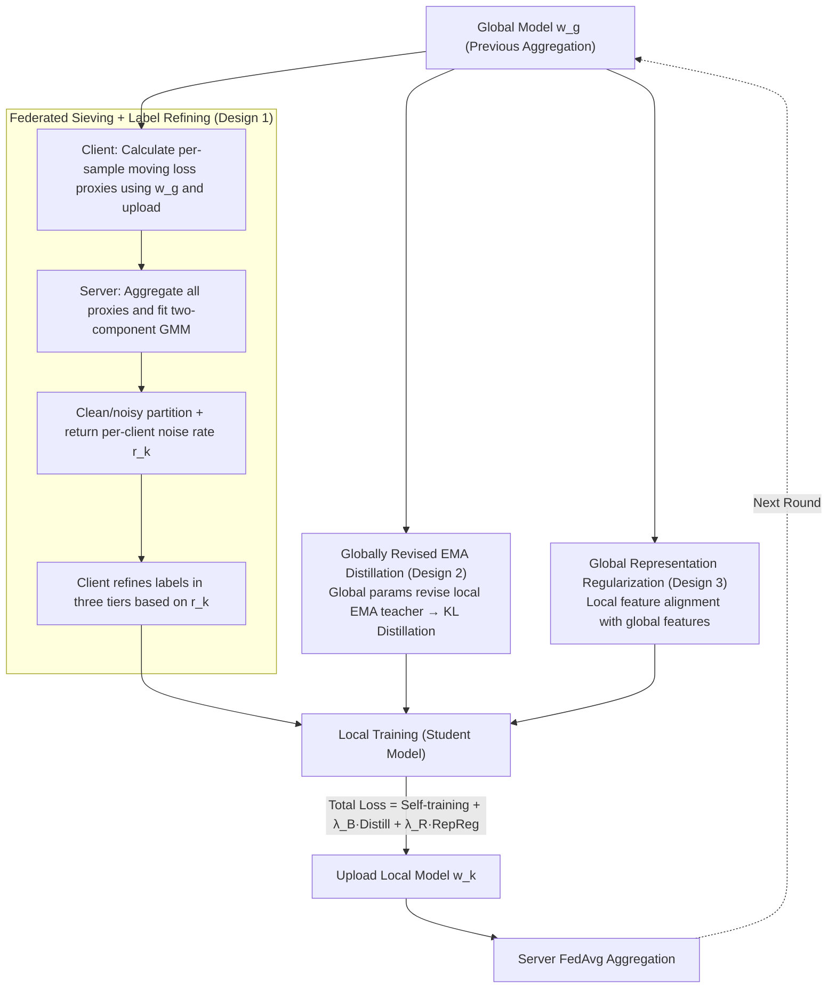

# Learning Locally, Revising Globally: Global Reviser for Federated Learning with Noisy Labels

**Conference**: ICML 2026  
**arXiv**: [2412.00452](https://arxiv.org/abs/2412.00452)  
**Code**: https://github.com/cs-yuxintian/FedGR-ICML26 (Available)  
**Area**: Federated Learning / Learning with Noisy Labels / Optimization  
**Keywords**: Federated Learning, Label Noise, EMA Distillation, GMM Sample Sieving, Privacy Protection  

## TL;DR
This paper observes a "delayed memory" phenomenon in the global model of FL regarding noisy labels (memory rate $\le 30\%$ on CIFAR-10, significantly lower than centralized training). Based on this, FedGR is proposed: using server-side GMM to jointly sieve samples and estimate per-client noise ratios based on aggregated loss proxies, periodically "revising" local EMA teachers with global parameters for distillation, and adding global-local representation consistency regularization. These three modules work synergistically to achieve significant gains over 8 SOTA baselines on CIFAR-10/100 and Clothing1M under dual heterogeneity (label noise $\times$ non-IID).

## Background & Motivation

**Background**: Federated Learning (FL) combines "model aggregation" and "data staying local" for training. FedAvg has become the de facto standard for privacy-sensitive scenarios such as medical imaging, recommendation systems, and graph learning. Meanwhile, the community has developed mature Centralized Learning with Noisy Labels (C-LNL) solutions like Co-teaching and DivideMix, which primarily leverage the "memory effect"—where networks learn clean samples before overfitting to noisy labels—for sample sieving.

**Limitations of Prior Work**: Directly applying C-LNL methods to FL encounters two types of heterogeneity: (1) significant differences in noise **types** (symmetric/asymmetric/mixed) and **ratios** across clients; (2) label imbalance caused by Non-IID data distributions. The superposition of these factors causes independent client-side sample sieving or dual-network mechanisms (e.g., Co-teaching / DivideMix) to fail in "clean-rate estimation," while consensus methods relying on shared statistical features violate privacy boundaries.

**Key Challenge**: Independent client sieving leads to insufficient samples and jittery noise estimation, while sharing statistics between clients leaks distribution information. Furthermore, local models are easily corrupted by high-noise clients, and while global models are robust, they fail to fit local distributions well, making it difficult to utilize both simultaneously.

**Goal**: To simultaneously solve "noise estimation" and "local training regularization" without leaking any information related to the joint distribution $(\mathbf{x}, \mathbf{y})$.

**Key Insight**: The authors empirically found that the global model in FL remembers noisy labels much slower than in centralized training (under CIFAR-10 Sym noise, the centralized model eventually remembers $\ge 80\%$ of noisy labels, while the FL global model remembers $\le 30\%$), and its test accuracy does not collapse after the "noisy peak" as it does in centralized settings. This phenomenon is termed "Intrinsic Label Noise Robustness of FL," and the global model is utilized as a trusted "reviser."

**Core Idea**: Treat the "intrinsic delayed memory of the global model" as a free lunch for privacy protection. The server uses only per-sample loss proxies (independent of data distribution) for GMM sieving and sends results back to clients. Simultaneously, local EMA teachers are periodically "revised" by global parameters to prevent noise accumulation.

## Method

### Overall Architecture
FedGR adds three modules to the standard FedAvg loop, all designed for local training of client $k$ at round $t$. The total loss is $\mathcal{L}_k = \mathcal{L}_k^{SR} + \lambda_{\mathcal{B}} \mathcal{B}_k + \lambda_{\mathcal{R}} \mathcal{R}_k$. The workflow is: (1) The client uses the global model $\mathbf{w}_g^{t-1}$ to calculate a moving average loss proxy $\bar{\ell}_i^t$ for each sample and uploads it to the server. (2) The server fits a two-component GMM to proxies from all clients, partitions samples into clean/noisy subsets based on the "clean posterior probability" $q_{i,k}$, estimates the noise rate $r_k$ for each client, and returns the results. (3) Clients refine labels based on $r_k$: for low noise, the clean subset is kept; the noisy subset uses soft labels $q_{i,k}\hat{y}_i + (1-q_{i,k})y^{pse}_i$; for high noise ($r_k \ge \beta$), pseudo-labels $y^{pse}_i$ (from FixMatch weak-augmentation predictions by the global model) are used directly. (4) A local EMA teacher is maintained and "revised" at the start of each round with global parameters $\mathbf{w}_{k,ema}^{t,0} = \gamma_g \mathbf{w}_{k,ema}^{t-1,m_k} + (1-\gamma_g)\mathbf{w}_g^{t-1}$, followed by standard EMA updates during local steps to distill to the student. (5) Global-local representation consistency $\mathcal{R}_k$ further constrains the local backbone from deviating too far from global representations.

### Key Designs

**1. Federated Sieving + Label Refining: Moving noise determination to the server using distribution-agnostic loss statistics**

Individual clients with only 10–50 samples cannot fit the "clean vs. noisy" bimodal distribution, leading to jittery noise estimation. Sharing category frequencies or prototypes leaks distribution information. FedGR breaks this by transmitting only one privacy-neutral value: the moving average loss proxy per sample. Client $k$ maintains a set of loss observations $L_i^t=\{\ell_{i,p}\}_{p=1}^{T_k}$ for each sample, where $\ell_{i,T_k}=\mathcal{H}(\mathbf{p}_i^g,\hat{y}_i)$ is the cross-entropy calculated using the global model $\mathbf{w}_g^{t-1}$. The mean $\bar{\ell}_i^t=\frac{1}{T_k}\sum_p\ell_{i,p}$ is uploaded. The server aggregates proxies from all selected clients to fit a two-component GMM. The clean posterior $q_{i,k}$ provides both the clean/noisy partition and the per-client noise rate $r_k$. Clients then refine labels $\tilde{y}_i$ in three tiers: if $r_k<\beta$ and the sample is clean, the original label is kept; if $r_k<\beta$ but noisy, a soft fusion $q_{i,k}\hat{y}_i+(1-q_{i,k})y^{pse}_i$ is used; if $r_k\ge\beta$, the pseudo-label $y^{pse}_i$ (generated by the global model under weak augmentation via FixMatch) is used directly. This design models the noise peaks stably using population data while avoiding privacy leaks by transmitting only loss values (independent of the joint distribution of $\mathbf{x},\mathbf{y}$), bypassing risks inherent in methods like FedCorr or FedNoRo that share category frequencies/prototypes.

**2. Globally Revised EMA Distillation: Periodically "cleaning" the local EMA teacher with global parameters for student distillation**

Online EMA accumulates error signals during local steps on high-noise clients, making local teachers unreliable. FedGR implements a two-stage update for each client's EMA model $\mathbf{w}_{k,ema}^{t,m_k}$: at the start of each round ($m_k=0$), it is "revised" using global parameters:

$$\mathbf{w}_{k,ema}^{t,0}=\gamma_g\,\mathbf{w}_{k,ema}^{t-1,m_k}+(1-\gamma_g)\,\mathbf{w}_g^{t-1},$$

During local training steps ($m_k\ge1$), it follows standard EMA: $\mathbf{w}_{k,ema}^{t,m_k}=\gamma_l\mathbf{w}_{k,ema}^{t,m_k-1}+(1-\gamma_l)\mathbf{w}_k^{t,m_k}$. Distillation uses the weak-augmented logits $\mathbf{p}_i^{le,w}$ from this "revised" EMA at the start of the round as the teacher target: $\mathcal{B}_k=\mathbb{E}_{\hat{\mathcal{D}}_k}[KL(\mathbf{p}_i^{le,w}/\tau,\ \mathbf{p}_i^{l,s}/\tau)]$. This explicitly stacks the temporal smoothing of EMA with the population robustness of global aggregation. Since the forward pass is locked at $m_k=0$, distillation cost is reduced from $O(\text{steps})$ to $O(1)$. Ablations confirm its specificity: removing this module drops Non-IID Sym 1.0 accuracy from 63.64 to 51.07 (−12.6 points), a loss far greater than in the IID setting, addressing the pain point of local models being corrupted by high noise and category imbalance.

**3. Global Representation Regularization: A label-independent fallback constraint in feature space**

Relying solely on EMA distillation carries the risk that the teacher itself may be misled by refined but incorrect labels. Representation regularization serves as a fallback: it constrains the local backbone $f(\cdot;\mathbf{w}_{k,f}^t)$ to align its weak-augmented features with the global backbone $f(\cdot;\mathbf{w}_{g,f}^{t-1})$ (via cosine/L2 consistency, weighted by $\lambda_{\mathcal{R}}$, set to 0.1 for CIFAR-10 and 0.2 for CIFAR-100/Clothing1M). A key benefit is that it is completely label-independent—constraining the local model in feature space—forming a "feature + logits" double constraint alongside the distillation in Design 2. Ablations show its removal drops Non-IID Sym 1.0 from 63.64 to 58.23 (−5.4 points), indicating it provides independent reinforcement when the EMA teacher begins to accumulate errors.

### Loss & Training
Total loss $\mathcal{L}_k = \mathcal{L}_k^{SR} + \lambda_{\mathcal{B}} \mathcal{B}_k + \lambda_{\mathcal{R}} \mathcal{R}_k$; $\lambda_{\mathcal{B}}=1.0$, $\lambda_{\mathcal{R}}=0.1$ (CIFAR-10) or $0.2$ (others); SGD + constant learning rate, local epochs $=10$ (CIFAR-10/100), $2$ (Clothing1M); backbones are ResNet-18/34/pretrained ResNet-50; CIFAR partitioned into 100 clients, Clothing1M into 500 clients, Non-IID using Dirichlet $\alpha=0.3$; during $\alpha$ warmup rounds, the server uses random sampling without replacement to ensure all clients are sampled, then switches to standard FL sampling; strong augmentation via RandAugment, weak augmentation following FedCorr; evaluation uses the mean accuracy of the last 10 rounds.

## Key Experimental Results

### Main Results
On CIFAR-10, the ratio of noisy clients $\phi$ and the noise rate interval $\mathcal{U}(\rho_{\min}, \rho_{\max})$ are controlled. Results for "Sym 1.0/$\mathcal{U}(0.5,1.0)$" and "Mixed 1.0/$\mathcal{U}(0.2,0.4)$" extreme settings are shown below.

| Method | IID Sym $\phi=1.0$ | IID Mixed $\phi=1.0$ | Non-IID Sym $\phi=1.0$ | Non-IID Mixed $\phi=1.0$ |
|------|--------------------|----------------------|------------------------|--------------------------|
| FedAvg | 23.89 | 70.66 | 17.32 | 51.92 |
| FedProx | 23.02 | 64.44 | 16.69 | 49.77 |
| FL-Coteaching | 47.28 | 83.99 | 33.49 | 72.42 |
| FL-DivideMix | 68.47 | 85.19 | 38.35 | 68.86 |
| FedCorr (CVPR22) | 55.12 | 84.15 | 29.42 | 83.33 |
| FedNoRo (IJCAI23) | 33.98 | 71.07 | 18.60 | 57.09 |
| **FedGR (Ours)** | **83.91** | **93.13** | **63.64** | **86.50** |

On the CIFAR-10 Avg column: FedGR reaches 91.07, while the second best, FL-DivideMix, reaches 81.11; Clothing1M (Table 3) also shows a lead; in the most extreme Non-IID Sym $\phi=1.0$/$\mathcal{U}(0.5,1.0)$ setting, Gain is +34.2 points relative to FedCorr.

### Ablation Study (CIFAR-10, Table 4)

| Configuration | IID Sym 1.0 | IID Mixed 1.0 | Non-IID Sym 1.0 | Non-IID Mixed 1.0 | Description |
|------|-------------|---------------|-----------------|-------------------|------|
| Full FedGR | 83.91 | 92.27 | 63.64 | 84.65 | Full Model |
| w/o FS | 54.59 | 91.71 | 45.48 | 84.01 | Remove Fed Sieving → IID Sym drops 29.3, Non-IID Sym drops 18.2 |
| w/o LR | 75.23 | 90.46 | 59.48 | 83.21 | Remove Label Refining → All settings drop 1–8 points |
| w/o $\mathcal{R}_k$ | 81.49 | 91.84 | 58.23 | 82.70 | Remove RepReg → Non-IID Sym drops 5.4 |
| w/o $\mathcal{B}_k$ | 78.14 | 91.24 | 51.07 | 79.44 | Remove EMA Distillation → Non-IID Sym drops 12.6 |

### Key Findings
- **Federated Sieving (FS) is crucial**: Removing FS causes IID Sym accuracy to plummet by 29.3 points, exceeding the drop from any other module. This demonstrates that server-side aggregation of loss proxies is qualitatively different and superior to independent client estimation, validating the value of the "FL global perspective."
- **EMA Distillation (B_k) is most effective under dual heterogeneity**: Removing it drops Non-IID Sym 1.0 by 12.6 points, significantly higher than the 5.8-point drop in the IID setting. This confirms its design motivation of targeting local models corrupted by high noise and category imbalance.
- **Anomalous performance exceeding clean baseline**: In Mixed $\phi=0.6$/$\mathcal{U}(0.2,0.4)$, FedGR slightly outperforms FedAvg trained on clean data. The authors attribute this to the side effect of additional regularization, though the main value remains noise robustness.
- **Sieving Accuracy**: Figure 3 reports that FedGR's estimated per-client noise rates $\{r_k\}$ have a Pearson correlation $>0.9$ with ground truth, significantly higher than FedCorr/FedFixer, proving the superior accuracy of the aggregated proxy + GMM approach.

## Highlights & Insights
- **Systematically leveraging global model robustness**: While previous FL literature often treats the global model as the final output, this paper views it as an online implicit regularizer and trusted proxy. This perspective can be extended to Federated Domain Adaptation, Federated Continual Learning, etc.
- **Privacy-friendly loss proxies**: Using per-sample moving average loss instead of prototypes or category frequencies is a clean, reusable trick for any statistical goal focused on relative sample difficulty rather than semantic content (e.g., Federated Imbalanced Learning).
- **EMA Revision Mechanism**: Explicitly combining the "temporal smoothing" of EMA with the "population smoothing" of global aggregation, while locking the forward pass at $m_k=0$ for efficiency, is both theoretically grounded and computationally efficient.

## Limitations & Future Work
- Assumes that loss proxies can differentiate clean/noisy bimodal distributions within $\alpha$ warmup rounds. If nearly all clients have extremely high noise of the same type, GMM might fail (no fallback for 100% noise scenarios provided).
- Introduces 4 new hyperparameters $\alpha, \beta, \gamma_g, \lambda_{\mathcal{R}}$. Sensitivity analysis shows $\gamma_g$ is critical (too large values hurt accuracy), requiring manual tuning per dataset without an adaptive mechanism.
- While claimed to be "moderate" (Appendix A.8), the overhead of GMM fitting and per-sample loss storage/bandwidth is a significant increment over vanilla FedAvg, with scalability to ultra-large scales (>10k clients) not yet tested.
- Privacy guarantees are intuitive ("loss is independent of distribution"). Formal analysis (e.g., Differential Privacy) is missing to verify immunity against membership inference attacks.

## Related Work & Insights
- **vs. FedCorr (CVPR22)**: FedCorr also uses server-side correction but requires transmitting model parameters and ratio statistics, and is weaker against dual heterogeneity. FedGR only transmits loss proxies and outperforms it by +34 points on Non-IID Sym 1.0.
- **vs. FedNoRo / FedDiv / FedFixer**: These perform screening independently or detect noisy clients, failing under dual heterogeneity. FedGR moves sieving to the server and adds representation alignment, proving the "centralized perspective + privacy-sensitive statistics" route is more robust.
- **vs. DivideMix (Centralized)**: DivideMix uses dual networks to stabilize clean-rate estimation. Ours adapts GMM posterior logic to FL by replacing dual networks with a "global-local" + EMA distillation structure, fitting communication and distribution constraints.

## Rating
- Novelty: ⭐⭐⭐⭐ "Global model delayed memory" phenomenon + server-side joint GMM sieving is a first in F-LNL literature.
- Experimental Thoroughness: ⭐⭐⭐⭐ Three datasets × 8 baselines × multiple noise/distribution combinations × comprehensive ablation + hyperparameter analysis. (Lacks 100% noise or >10k client scenarios).
- Writing Quality: ⭐⭐⭐⭐ Clear motivation, explicit mapping between formulas and workflow, and comprehensive appendices for convergence and privacy.
- Value: ⭐⭐⭐⭐ A strong, reproducible baseline with significant gains for privacy-sensitive F-LNL deployment.

<!-- RELATED:START -->

## Related Papers

- [\[ICLR 2026\] Enhancing Learning with Noisy Labels via Rockafellian Relaxation](../../ICLR2026/optimization/enhancing_learning_with_noisy_labels_via_rockafellian_relaxation.md)
- [\[ICML 2026\] Delayed Momentum Aggregation: Communication-efficient Byzantine-robust Federated Learning with Partial Participation](delayed_momentum_aggregation_communication-efficient_byzantine-robust_federated_.md)
- [\[AAAI 2026\] Data Heterogeneity and Forgotten Labels in Split Federated Learning](../../AAAI2026/optimization/data_heterogeneity_and_forgotten_labels_in_split_federated_learning.md)
- [\[ICML 2026\] CLoVE: Personalized Federated Learning through Clustering of Loss Vector Embeddings](clove_personalized_federated_learning_through_clustering_of_loss_vector_embeddin.md)
- [\[ICML 2026\] Depth over Fidelity in Fixed-Budget Noisy Evolution Strategies](depth_over_fidelity_in_fixed-budget_noisy_evolution_strategies.md)

<!-- RELATED:END -->
