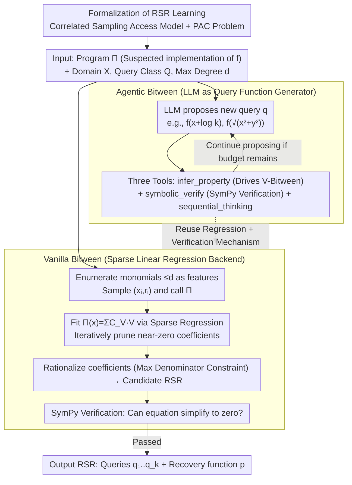

# Learning Randomized Reductions

**Conference**: ICML 2026 Spotlight  
**arXiv**: [2412.18134](https://arxiv.org/abs/2412.18134)  
**Code**: https://github.com/ferhaterata/learning-randomized-reductions (Available)  
**Area**: Optimization / Neuro-symbolic Learning / Symbolic Regression  
**Keywords**: Randomized Self-Reduction, Self-correcting programs, Neuro-symbolic, Symbolic Regression, LLM Agents  

## TL;DR
This paper formalizes the manual task of "discovering a Randomized Self-Reduction (RSR) for a function $f$," which has been stagnant for forty years, into a learning problem based on correlated sampling. The authors construct the Bitween framework: it first utilizes sparse linear regression to mine RSRs within a fixed query set $\{x+r, x-r, x \cdot r, x, r\}$, and then employs an LLM agent to search in a larger query function space. Ultimately, it pushes RSR coverage from 54% to 80% on the RSR-Bench consisting of 80 mathematical/ML functions and provides the first known RSR expression for the sigmoid function.

## Background & Motivation

**Background**: Randomized Self-Reduction (RSR), since its introduction by Goldwasser & Micali in 1984, is a technique to recover the function value $f(x)$ on a hard input $x$ using a linear combination of values of $f$ at several random but related points $u_i = q_i(x, r)$. It has been widely used in self-correcting programs, instance hiding, average-case to worst-case complexity reductions, and interactive proofs.

**Limitations of Prior Work**: For over forty years, discovering an RSR for a specific function has relied almost entirely on manual mathematical derivation. Furthermore, the academic community has long restricted "query functions" to five fixed forms: $\{x+r, x-r, x \cdot r, x, r\}$. Consequently, many functions (such as sigmoid, Gudermannian, and various special functions) have lacked known RSRs.

**Key Challenge**: The formal space of RSR explodes in two dimensions simultaneously—the choice of the query function family $Q$ and the algebraic structure of the recovery function $p$. Purely symbolic methods cannot freely explore the query function family, while purely neural methods tend to hallucinate "pseudo-RSRs" that cannot be symbolically verified.

**Goal**: To decompose RSR discovery into two sub-problems: (1) Given a query function family $Q$, how to efficiently infer the recovery function $p$ from sample data in $Q$; (2) How to dynamically propose new query functions outside of $Q$ that are meaningful for the current function $f$.

**Key Insight**: The authors note that Lipton (1989) proved that for a polynomial of degree $d$ over a finite field, an RSR can be constructed using only $d+1$ **linear** query functions and one **linear** recovery function. This implies that in many scenarios, RSR is essentially a sparse linear regression problem, and "heavier" methods like symbolic regression, MILP, or genetic programming may not be optimal.

**Core Idea**: First, maximize the potential of the regression backend on a fixed query set (Vanilla Bitween), and then use an LLM as a "query function generator" to schedule the same verification tools to explore new queries (Agentic Bitween), allowing neural creativity and symbolic verifiability to complement each other.

## Method

### Overall Architecture
The input to Bitween is a program $\Pi$ suspected of implementing an unknown function $f$ (potentially containing floating-point errors), an input domain $X$, a query function class $Q$, and an upper bound $d$ for the degree of the recovery function. The methodology is built on the theoretical foundation of "Formalizing RSR Learning" (Correlated Sampling Access Model + PAC Problem). It is implemented by two sequential systems: The Vanilla Bitween workflow involves (1) introducing a symbolic variable $v_q$ for each candidate query $q \in Q$ representing $\Pi(q(x,r))$; (2) enumerating all monomials $V$ of degree $\le d$ in $v_q$ as linear features; (3) randomly sampling $m$ pairs of $(x_i, r_i)$ to obtain $\Pi(x_i)$ and all $\Pi(q(x_i, r_i))$ via calls to $\Pi$; (4) fitting $\Pi(x_i) = \sum_V C_V \cdot V(x_i, r_i)$ using sparse linear regression and removing monomials with coefficients near zero; (5) converting remaining floating-point coefficients to rational numbers using a maximum denominator constraint to obtain a candidate RSR; (6) formally verifying the candidate by simplifying it to zero using SymPy. Agentic Bitween adds an LLM agent to the outer loop, which can repeatedly invoke `infer_property_tool` (driving the Vanilla backend but allowing proposals of new queries like $f(x+\log k)$, $f(\sqrt{x^2+y^2})$), `symbolic_verify_tool` (SymPy verification), and `sequential_thinking_tool` (Chain-of-Thought bookkeeping), thereby reusing the entire verification mechanism to explore new queries beyond the fixed set.

### Key Designs

**1. Formalization of RSR Learning and "Correlated Sampling" Access Model: Defining a forty-year manual task as a falsifiable PAC problem**

Before building the system, the authors explicitly define "discovering RSR" as a PAC-style learning problem: given a function class $F\subseteq\mathrm{RSR}_k(Q,P)$ and $m$ samples, output a $(\rho,\xi)$-approximate RSR with probability $\ge1-\delta$. The most critical design is the access model: they introduce a third category between "IID samples" and "arbitrary oracle queries"—correlated random samples, where the marginal distribution of each $x_j$ is uniform, but they can be correlated with each other. This matches the natural sampling pattern of RSR (where $x$ and $x+r$ are both marginally uniform but their joint distribution is correlated). This framework is necessary because traditional PAC learning requires approximating $f$ itself, while RSR learning only requires outputting an equality constraint $p(x,r,f(u_1),\dots,f(u_k))$; these two objectives have fundamental differences in sample complexity (compared in Claim A.1/A.2), providing the basis for Bitween's sample complexity upper bounds.

**2. Vanilla Bitween: Reducing RSR search to controlled sparse linear regression**

Lipton (1989) proved that a polynomial of degree $d$ over a finite field needs only $d+1$ linear queries and one linear recovery function, suggesting RSR is often a sparse linear regression problem rather than a combinatorial search. Vanilla Bitween decomposes the problem into regression sub-tasks: for each candidate target variable $v_q$, it constructs a task with a loss:

$$L_q(C)=\frac{1}{m}\sum_i\Big(\Pi_i-\sum_V C_V V_i\Big)^2+\lambda R(C),$$

where the regularization term $R(C)$ toggles between Lasso and Ridge, and $\lambda$ is searched via a 5-fold CV grid. After regression, coefficients below a threshold are pruned iteratively until convergence. Finally, floating-point coefficients are converted to readable fractions using rational approximation (similar to Stern–Brocot)—a crucial step for rigorous SymPy verification. To prove that "using the right model class is more important than using a powerful algorithm," the authors plugged PySR (Genetic Programming), GPLearn, and Gurobi (MILP) into the same framework. These "stronger" backends often timed out or produced approximate expressions that could not be verified by SymPy, whereas simple sparse linear regression (V-Bitween-LR) dominated in coverage, runtime, and the number of RSRs (54% vs $\le32\%$).

**3. Agentic Bitween: Using LLM as a query generator with symbolic verification**

The fixed query set $\{x+r, x-r, x\cdot r, x, r\}$ acts as a ceiling for coverage, but pure neural methods hallucinate unverifiable "pseudo-RSRs." Agentic Bitween solves this by assigning the LLM a strict role: proposing new query functions (e.g., $f(x+\log k)$, $f(\sqrt{x^2+y^2})$, $f(x^{1/n})$) without providing final answers. The agent is called once per function but can invoke three tools multiple times: `infer_property_tool` sends the proposed query to the Vanilla regression backend to infer the recovery function, `symbolic_verify_tool` uses SymPy to give a hard "Pass/Fail" judgment, and `sequential_thinking_tool` allows the model to log its Chain-of-Thought (empirical evidence shows this significantly improves the quality of tool calls). The value of this design is evident in the data: the pure neural baseline N-Research (on Opus-4.1) yielded 250 RSRs but with 172 unverified properties, while A-Bitween suppressed unverified properties to a minimum (793 RSRs with only 26 unverified), closing the loop between "neural creativity" and "symbolic verifiability."

### Loss & Training
During the regression phase, Lasso/Ridge with regularization $\lambda$ (selected via 5-fold CV) is used with iterative pruning of coefficients to zero. Sampling is done from a uniform distribution over $[-10, 10]$ with an error tolerance $\delta = 10^{-3}$. Each experiment is repeated 5 times with a 1800s budget per run. Degree 3 is used for trigonometric, hyperbolic, and exponential functions, while degree 2 is used for others. The environment is 32GB / Apple M1 Pro 10-core.

## Key Experimental Results

### Main Results
RSR-Bench contains 80 functions across 8 categories (Basic, Exponential, Logarithmic, Trigonometric, Hyperbolic, Inverse Trig, ML Activation, Special). The table below summarizes 5 symbolic backends, 3 neural baselines, and 3 A-Bitween configurations (Format: RSR Count / Verified | Unverified).

| Method | RSR / Verified | Unverified | RSR Coverage | Avg Runtime |
|------|-----------|--------|-----------|-------------|
| V-Bitween-PySR | 61 / 61 | 60 | 38% | 335 s |
| V-Bitween-GPLearn | 48 / 48 | 54 | 32% | 140 s |
| V-Bitween-MILP | 74 / 74 | 29 | 51% | 11 s |
| **V-Bitween-LR** | **87 / 87** | 46 | **54%** | **5 s** |
| N-Research-Opus-4.1 | 250 / 539 | 172 | 64% | 286 s |
| A-Bitween-Sonnet-4 | 293 / 729 | 14 | 66% | 160 s |
| **A-Bitween-Opus-4.1** | **793 / 1628** | **26** | **80%** | 378 s |

The linear regression backend achieved the highest RSR count, highest coverage, and shortest average runtime among symbolic methods. Agentic Bitween pushed the coverage to 80% and provided the first RSR for sigmoid: $\sigma(x) = \frac{\sigma(x+r)(\sigma(r) - 1)}{2\sigma(x+r)\sigma(r) - \sigma(x+r) - \sigma(r)}$.

### Ablation Study
Based on the number of RSRs by category (comparing A-Bitween and N-Research with the same model to reflect the gain from tool calls).

| Category | V-Bitween-LR | N-Research (Opus) | A-Bitween (Opus) | Tool Gain |
|------|-------------|-------------------|------------------|---------|
| Basic | 1.2 | 11.0 | 23.5 | +12.5 |
| Exponential | 1.2 | 12.3 | 29.6 | +17.3 |
| Trigonometric | 1.8 | 9.1 | 19.4 | +10.3 |
| Hyperbolic | 0.7 | 7.0 | 20.0 | +13.0 |
| ML Functions | 1.0 | 4.1 | 18.7 | +14.6 |
| Special | 0.7 | 4.9 | 20.2 | +15.3 |

### Key Findings
- In symbolic methods, "model class matching" outweighs "algorithmic complexity"—sparse linear regression achieves 1.4–1.7x the coverage of PySR/GPLearn while being 28–67x faster, indicating that RSR is intrinsically a sparse linear problem rather than a combinatorial search problem.
- The core benefit of A-Bitween over N-Research is not just "finding more RSRs" but "significantly reducing pseudo-RSRs": unverified properties on Opus-4.1 dropped from 172 to 26 (−85%), proving that the `symbolic_verify_tool` is the key switch turning LLMs from "hallucination machines" into "reliable discovery tools."
- Stronger models yield higher gains: growth from GPT-OSS-120B (157 RSRs) → Sonnet-4 (293) → Opus-4.1 (793) is nearly exponential (1:2:5). A-Bitween produces 3.2x more RSRs than N-Research on Opus, showing stronger models utilize tool feedback more effectively.
- The framework generalizes naturally to non-scalar domains: the authors produced RSRs for matrices, quaternions, octonions, and Clifford/Lie algebras without modifications (by flattening them to scalars), showing Bitween’s extensibility stems from the learning problem itself.

## Highlights & Insights
- **Dual drive of Formalization + Engineering**: This work first defines the "intuitive" discovery of RSR as a falsifiable learning problem (including correlated sampling definitions) and then implements the simplest viable backend (linear regression). This path of "getting the problem definition right before selecting the simplest tool" is worth replicating in many ML for Science tasks.
- **LLM as a "Query Function Generator"**: Restricting the LLM to "proposing" rather than "answering," combined with symbolic verification, is one of the cleanest paradigms for neuro-symbolic integration. It can be migrated to any "creative proposal + rigorous verification" tasks like invariant discovery, Lyapunov function search, or quantum circuit simplification.
- **The first sigmoid RSR** is a significant scientific byproduct—it means sigmoid can be self-corrected via two sigmoid calls ($\sigma(x+r)$, $\sigma(r)$) plus one rational operation, which is a valuable tool for private inference (instance-hiding) on edge devices.

## Limitations & Future Work
- The current theoretical framework requires $F \subseteq \mathrm{RSR}_k(Q, P)$, i.e., the "realizability" assumption. The agnostic setting (where $f$ might not have an RSR) is left for future work, which is closer to real-world "automated discovery."
- The maximum degree $d$ is limited to 3, as the number of monomials grows exponentially with $d$; RSRs for high-degree polynomials or complex transcendental functions remain manually out of reach.
- The "Fundamental Theorem of RSR Learning"—linking sample complexity to the VC dimension of $Q$ and $P$—is explicitly left as an open problem; the authors did not provide lower bounds as tight as those in standard PAC learning.
- The Agentic Bitween component is highly sensitive to model size (a 5x difference between GPT-OSS-120B and Claude-Opus-4.1), and the token cost and latency are non-negligible (up to 900 seconds per function).

## Related Work & Insights
- **vs PySR / GPLearn / General Symbolic Regression**: While those discover the expression of the function itself from data, this work fixes the known function and seeks the RSR equality; by using general symbolic regression as a pluggable backend, the authors prove that sparse linear regression is the more appropriate tool for this specific task.
- **vs Daikon / DIG / Program Invariant Mining**: These focus on dynamic program-level invariants (divisibility, inequalities, etc.). This work focuses on randomized self-reduction of mathematical functions and approaches it from a PAC-style learning perspective for the first time.
- **vs Pure LLM Mathematical Reasoning (GPT-4, Llemma)**: These works rely on LLMs to write final answers, which are prone to hallucinations. A-Bitween integrates neural openness and symbolic rigor more thoroughly by limiting the LLM to the sub-task of "proposing query functions" within a SymPy verification loop.

## Rating
- Novelty: ⭐⭐⭐⭐⭐ Formally defines a forty-year manual task as a PAC-style learning problem and delivers a working system.
- Experimental Thoroughness: ⭐⭐⭐⭐ Extensive comparison across 80 functions, 8 categories, 5 symbolic backends, and 3 LLMs, though individual experiments only have 5 repetitions.
- Writing Quality: ⭐⭐⭐⭐ Clear parallel development of theory and system; appendix provides full pseudocode and per-function tables.
- Value: ⭐⭐⭐⭐⭐ Provides both scientific byproducts (sigmoid RSR) and a reusable paradigm for "neural creativity + symbolic verification."

<!-- RELATED:START -->

## Related Papers

- [\[ICML 2026\] Learning Locally, Revising Globally: Global Reviser for Federated Learning with Noisy Labels](learning_locally_revising_globally_global_reviser_for_federated_learning_with_no.md)
- [\[ICLR 2026\] Convex Dominance in Deep Learning I: A Scaling Law of Loss and Learning Rate](../../ICLR2026/optimization/convex_dominance_in_deep_learning_i_a_scaling_law_of_loss_and_learning_rate.md)
- [\[ICML 2026\] Interpretability and Generalization Bounds for Learning Spatial Physics](interpretability_and_generalization_bounds_for_learning_spatial_physics.md)
- [\[ICML 2026\] Ubiquity of Emergent Hebbian Dynamics in Regularized Learning](ubiquity_of_emergent_hebbian_dynamics_in_regularized_learning.md)
- [\[ICML 2026\] Bayesian Gated Non-Negative Contrastive Learning](bayesian_gated_non-negative_contrastive_learning.md)

<!-- RELATED:END -->
