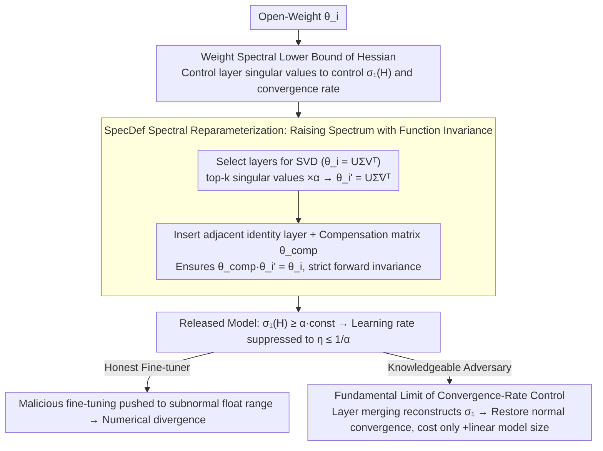

# Limits of Convergence-Rate Control for Open-Weight Safety

**Conference**: ICML 2026  
**arXiv**: [2602.18868](https://arxiv.org/abs/2602.18868)  
**Code**: Not yet released  
**Area**: AI Safety / Optimization Theory / Governance of Open-Weight Models  
**Keywords**: open-weight safety, convergence rate, Hessian spectrum, spectral reparameterization, tamper resistance

## TL;DR
The authors formalize "open-weight safety" as "how to delay the convergence of malicious fine-tuning," proving that the maximum singular value of the Hessian is lower-bounded by the weight spectrum. They design the SpecDef algorithm to strictly decelerate first/second-order optimization but simultaneously prove that any such convergence-rate control method can be bypassed by an adversary at the cost of a "linear increase in model size."

## Background & Motivation

**Background**: Open-weight foundation models currently lack theoretically guaranteed resistance to training after release; users can freely fine-tune weights for malicious purposes such as deepfakes or biological/chemical weapons. Open-weight governance primarily follows policy routes like "licensing/throttled release." Technical training-time resistance (e.g., TAR, RepNoise, RMU, ELM) is fragmented and lacks a unified theoretical explanation.

**Limitations of Prior Work**: (1) Existing unlearning/anti-tuning methods fail under systematic evaluation—simply adjusting the learning rate allows "wiped" capabilities to be restored within dozens of fine-tuning steps; (2) These methods are ad hoc, with no clear explanation of why they sometimes work or when they must fail; (3) The industry has long conflated inference-time safety with training-time safety, lacking a unified definition.

**Key Challenge**: To "retain functionality while making re-training difficult" essentially requires increasing the second-order (Hessian) spectrum while maintaining zeroth-order behavior. The convergence rate of first-order optimization is determined by the maximum singular value of the Hessian. Can a transformation be mathematically constructed to keep functionality constant while causing the Hessian spectrum to explode? Conversely, can it be proven that all such transformations have an upper limit?

**Goal**: (a) Formalize training-time safety as an "iteration complexity / convergence-rate control" problem; (b) Provide a lower bound where the weight spectrum directly controls the Hessian spectrum; (c) Construct a provable algorithm, SpecDef, based on this; (d) Prove that any such method has a structural upper limit that an adversary can break with linear extra cost.

**Key Insight**: First-order optimization must choose a learning rate $\eta \leq 1/L$, where $L$ is lower-bounded by the maximum singular value of the Hessian $\sigma_1(H^{\mathcal{L}}_{\theta})$. If $\sigma_1$ can be pushed to astronomical figures without altering function output, the attacker is forced to use $\eta\to 0$, leading to a "numerically unlearnable" state.

**Core Idea**: Use SVD to perform "symmetric reparameterization" on several weight layers—multiplying the top-$k$ singular values of selected layers by $\alpha$ and inserting compensation layers in adjacent positions that exactly cancel out the change. Functionality remains identical, but the maximum singular value of the Hessian is forced to increase by at least $\alpha$ times, pushing the feasible learning rate below subnormal floating-point precision.

## Method

### Overall Architecture
The methodology consists of three interlocking components: first, a **spectral lower bound theorem** links the "unmeasurable and uncontrollable" maximum Hessian spectrum to the "directly manipulated" singular values of a weight layer; second, the **SpecDef algorithm** is constructed to arbitrarily raise the spectrum while keeping functionality invariant; finally, it is proven that this "convergence-rate control" path has a **fundamental limit** against a knowledgeable adversary.

SpecDef runs once before model release: (1) Select several layers $\theta_i$; (2) Insert identity linear layers as placeholders adjacently; (3) Perform SVD on $\theta_i$ to get $U \Sigma V^\top$; (4) Multiply top-$k$ singular values by $\alpha$ to get new weights $\theta_i' = U \tilde\Sigma V^\top$; (5) Write the "compensation matrix" $\theta_i^{comp} = U \Sigma \tilde\Sigma^{-1} U^\top$ into the identity layer position such that $\theta_i^{comp} \theta_i'$ is functionally equivalent to the original $\theta_i$. On GPT-OSS-20b, operating on 10 layers takes only 15 seconds. Post-release: The spectral lower bound forces the feasible learning rate to $\eta\le 1/\alpha$, driving honest fine-tuners into numerical divergence; however, a knowledgeable adversary can perform "layer merging" to re-absorb the compensation layers, restoring normal convergence at a linear cost—the source of "Limits" in the title.

### Key Designs

**1. Hessian Spectral Lower Bound on Weight Spectrum (Theorem 3): Linking the "unmeasurable maximum Hessian eigenvalue" to "directly manipulatable weight singular values"**

First-order optimization learning rates must satisfy $\eta\le 1/L$, where $L$ is lower-bounded by the maximum singular value of the Hessian $\sigma_1(\nabla^2_\theta\mathcal{L})$. However, the Hessian is hard to measure and control. Theorem 3 bridges this by replacing it with a controllable quantity:

$$\sigma_1(\nabla^2_\theta \mathcal{L}) \;\ge\; \sup_{r_1, r_2} \sigma_{r_1}(A)\,\sigma_1(B)\,\sigma_{r_2}(C)\,\cos\theta_1\cos\theta_2.$$

The derivation has two steps: first, use the Poincaré Separation Theorem to lower-bound the maximum Hessian singular value by the maximum singular value of a $p\times q$ sub-block $\nabla^2_{\theta_i,\theta_j}\mathcal{L}$; then, note that this sub-block for standard MLP/CNN/Transformers has an $ABC$-form decomposition (e.g., for a three-layer MLP, $\partial^2 f/\partial\theta_3\partial\theta_1=(x^\top\otimes I_m)^\top D_{z_1}\cdot\theta_2^\top\cdot D_{z_2}$, with $\theta_2$ sandwiched in the middle), and finally close the bound with classical singular value inequalities. This is the theoretical pivot: if the maximum singular value of the middle matrix $B=\theta_k$ is scaled by $\alpha$, the maximum Hessian singular value is scaled by at least the same proportion, suppressing the learning rate upper bound to $\eta\le (1/\alpha)\cdot\text{constant}$. Notably, this bound remains non-vacuous in rank-deficient cases, being tighter than the classical Horn–Johnson bound.

**2. Lower-Max Spectral Reparameterization + SpecDef: Strict function invariance while pushing the Hessian spectrum to astronomical levels**

With the bridge established, the goal is to construct a mapping $\mathcal{T}_c: f_\theta\mapsto f_{\theta'}$ satisfying $\sigma_1(H^{\mathcal{L}}_{\theta'})\ge c$ and functional distance $d(\mathcal{T}_c[f],f)\le\epsilon$. SpecDef implements this. It performs SVD on a selected layer $\theta_i = U\Sigma V^\top$, multiplies singular values by $T=\mathrm{diag}(\alpha,\dots,\alpha,1,\dots,1)$ (scaling the top $k$ by $\alpha$) to get $\tilde\Sigma=T\Sigma$, and replaces the original weight with $U\tilde\Sigma V^\top$. Crucially, it inserts an identity placeholder layer adjacently and writes a compensation matrix $\theta_i^{comp}=U\Sigma\tilde\Sigma^{-1}U^\top$. Since $\theta_i^{comp}\theta_i'=U\Sigma V^\top=\theta_i$, the forward output is strictly unchanged. Compensation is necessary because simple weight rescaling changes output; inserting identity layers bypasses complications from non-1-homogeneous activations like ReLU—cross-layer compensation between identity layers is always valid. $\alpha$ is chosen to push adversaries below the "minimum effective learning rate": since most LMs fail to converge at $\eta<10^{-6}$, choosing $\alpha\ge 10^6$ pushes the feasible learning rate into the subnormal floating-point range. The cost is only a linear increase in parameter count.

**3. Fundamental Limit of Convergence-Rate Control (Layer Injection Attack): Proving this path is inherently limited against a knowledgeable adversary**

The paper's most significant contribution is its self-negation. The authors abstract SpecDef and all "symmetric spectral reparameterization" methods into a class of mappings, proving that for any such $\mathcal{T}$, there exists an inverse mapping $\mathcal{T}^{-1}$ that pulls the spectrum back to normal. An adversary aware of the layer structure can merge the compensation matrix with the original layer ("layer collapse") to reconstruct the original Hessian spectrum and restore normal convergence. The cost is a linear increase in model size rather than exponential. Furthermore, curvature-aware optimizers like Sophia, Muon, and AdaHessian can only locally improve but cannot break this upper limit. This conclusion shatters optimism regarding "actual resistance" from open-weight safety: it is not that SpecDef is ineffective, but that the entire "convergence-rate control" path has a structural limit when facing an adversary with full model access. Future training-time safety research must move beyond the convergence-rate control framework. This is the origin of the "Limits" in the title.

### Loss & Training
SpecDef itself requires no training and is a one-time algebraic operation. The paper suggests a "certification process" before release: performing a hyperparameter sweep over $\alpha, k$, and layer selection to confirm non-convergence under common fine-tuning recipes. The attack experiments evaluate relearning using SGD/Adam with multiple learning rates ($10^{-6}$ to $3\times 10^{-5}$) and curvature-aware optimizers (Sophia/Muon/AdaHessian).

## Key Experimental Results

### Main Results (WMDP-bio relearning attack on Llama-3.1-8B-Instruct)

| Method | Start Acc | LR=$10^{-6}$ (Steps / Acc) | LR=$10^{-5}$ | LR=$3\times 10^{-5}$ |
|------|----------|----------------------------|--------------|----------------------|
| ELM | 0.204 | 120 / 0.607 | 23 / 0.621 | 20 / 0.671 |
| RepNoise | 0.325 | 510 / 0.468 | 30 / 0.627 | 33 / 0.650 |
| TAR | 0.290 | 510 / 0.307 | 66 / 0.638 | 66 / 0.618 |
| Llama-3.1-8B Original | 0.482 | 93 / 0.607 | 20 / 0.629 | 10 / 0.609 |
| **SpecDef ($\alpha=10\mathrm{k}$)** | 0.204 | **10 / 0.195†** | **10 / 0.191†** | **10 / 0.195†** |

(† indicates perplexity increase > 100%, signifying immediate fine-tuning divergence)

| Model Utility Benchmark (Smaller change with larger $\alpha$ is better) | WMDP | PPL | MMLU | Winogrande | ARC | HellaSwag |
|---------------------------------------------|------|-----|------|------------|-----|-----------|
| α = 1k | $\Delta = -0.1$ | -0.01 | +0.1 | 0 | +1.0 | +0.3 |
| α = 100k | $-0.1$ | $-0.01$ | +0.6 | +0.3 | +0.3 | 0 |
| α = 1B | 0 | $-0.02$ | — | — | — | — |

### Ablation Study

| Configuration | Effect |
|------|------|
| Scale $\sigma_1$ only (No compensation) | Serious degradation of functionality and accuracy |
| SpecDef Full Suite | Near-invariant functionality, immediate fine-tuning divergence |
| Attack: Curvature-aware optimizers | Cannot bypass SpecDef |
| Attack: Layer-injection attack | Restores normal convergence at +linear model size cost |
| Attack: Vanilla spectral attack | Reversing SpecDef-type transformations can negate prior defenses |

### Key Findings
- **All prior defenses are breached by simple LR sweeps**: Table 1 shows ELM, RepNoise, RMU, TAR, and NPO are breached within dozens of steps at $\eta = 10^{-5}$ to 0.6+ accuracy, proving their "defense" only works at a fixed LR.
- **SpecDef causes immediate divergence across all LRs**: Even if an attacker sweeps five orders of magnitude of LR, $\alpha = 10^4$ pushes them into the subnormal float range, causing PPL to grow by 100%+.
- **Near-zero loss in model utility**: MMLU/Winogrande/ARC/HellaSwag fluctuate within $\pm 0.3$, proving strict forward mathematical identity is achievable at the cost of "parameter increase + slightly slower inference."
- **Bypassable at linear cost**: The authors provide the layer-injection attack construction, meaning any adversary with full model access can undo SpecDef—the most important pessimistic conclusion of the paper.

## Highlights & Insights
- **Translating safety into optimization theory**: Unlike previous unlearning papers that manually define loss terms, this work uses classical iteration complexity analysis to quantify "difficulty of training" as "requirement for extremely small LR."
- **Weight spectrum $\rightarrow$ Hessian spectrum bridge**: Theorem 3 elegantly utilizes random matrix theory tools, and the bound remains non-vacuous for rank-deficient matrices, being tighter than classical bounds.
- **Symmetric reparameterization + Identity injection**: Keeping zeroth-order behavior while arbitrarily pushing the spectrum is a clever technique aligned with Dinh et al.'s analysis of sharpness symmetry, extensible to generalization and sharpness-aware training.
- **Duality of contribution**: A paper that simultaneously presents a best-known algorithm (SpecDef) and proves its fundamental limit is rare. It warns researchers that training-time safety requires paths beyond convergence-rate control.

## Limitations & Future Work
- SpecDef assumes attackers use first/second-order smooth optimizers, not considering randomized methods (e.g., stochastic Langevin dynamics) or gradient-free/zeroth-order attacks.
- Linear increase in parameter count is significant for LLM deployment—adding 10 compensation layers to a 20B model costs several GBs of VRAM.
- The "smallest effective learning rate" is determined empirically; different hardware and precisions (FP16/BF16/FP8) have different truncation points, requiring $\alpha$ recalibration.
- While the layer-injection attack is proven, its practical complexity (information requirements, hyperparameter tuning) is not quantitatively evaluated.
- No cryptographic-level security proof is provided, only "numerical non-convergence"—resembling the lessons from "obfuscated gradients" failure, stronger models will be needed.

## Related Work & Insights
- **vs TAR / RepNoise / RMU / ELM**: These use empirical unlearning + regularization. Evaluation shows they collapse under LR sweeps; SpecDef provides the first provable guarantee of non-convergence across all LRs.
- **vs SAM (Foret 2020) / Dinh 2017**: This paper uses symmetry to push sharpness to infinity, the inverse of typical sharpness-aware goals.
- **vs Obfuscated Gradients (Athalye 2018)**: Similar to how that work broke "gradient obfuscation," this paper provides an equivalent warning for "convergence-rate obfuscation": defenses relying on optimization geometry can be dismantled by corresponding inverse operations.

## Rating
- Novelty: ⭐⭐⭐⭐⭐ Establishes a convergence rate theoretical framework for open-weight safety, providing both a provable algorithm and a fundamental limit.
- Experimental Thoroughness: ⭐⭐⭐⭐ Covers LM, ViT, and Stable Diffusion with 10+ defense baselines and curvature-aware attacks, though attacker modeling is somewhat idealized.
- Writing Quality: ⭐⭐⭐⭐ Clear definitions and theorems with smooth theory-to-experiment transitions, though high density requires an optimization background.
- Value: ⭐⭐⭐⭐⭐ Provides a clear directional calibration for the community—proving that training-time safety must transcend convergence-rate control.

<!-- RELATED:START -->

## Related Papers

- [\[ICML 2026\] On the Convergence Rate of LoRA Gradient Descent](on_the_convergence_rate_of_lora_gradient_descent.md)
- [\[ICML 2026\] Sign Lock-In: Randomly Initialized Weight Signs Persist and Bottleneck Sub-Bit Model Compression](sign_lock-in_randomly_initialized_weight_signs_persist_and_bottleneck_sub-bit_mo.md)
- [\[ICML 2026\] Towards Understanding Adam Convergence on Highly Degenerate Polynomials](towards_understanding_adam_convergence_on_highly_degenerate_polynomials.md)
- [\[CVPR 2026\] Learning to Learn Weight Generation via Local Consistency Diffusion](../../CVPR2026/optimization/learning_to_learn_weight_generation_via_local_consistency_diffusion.md)
- [\[ICML 2026\] Balanced LoRA: Removing Parameter Invariance to Accelerate Convergence](balanced_lora_removing_parameter_invariance_to_accelerate_convergence.md)

<!-- RELATED:END -->
