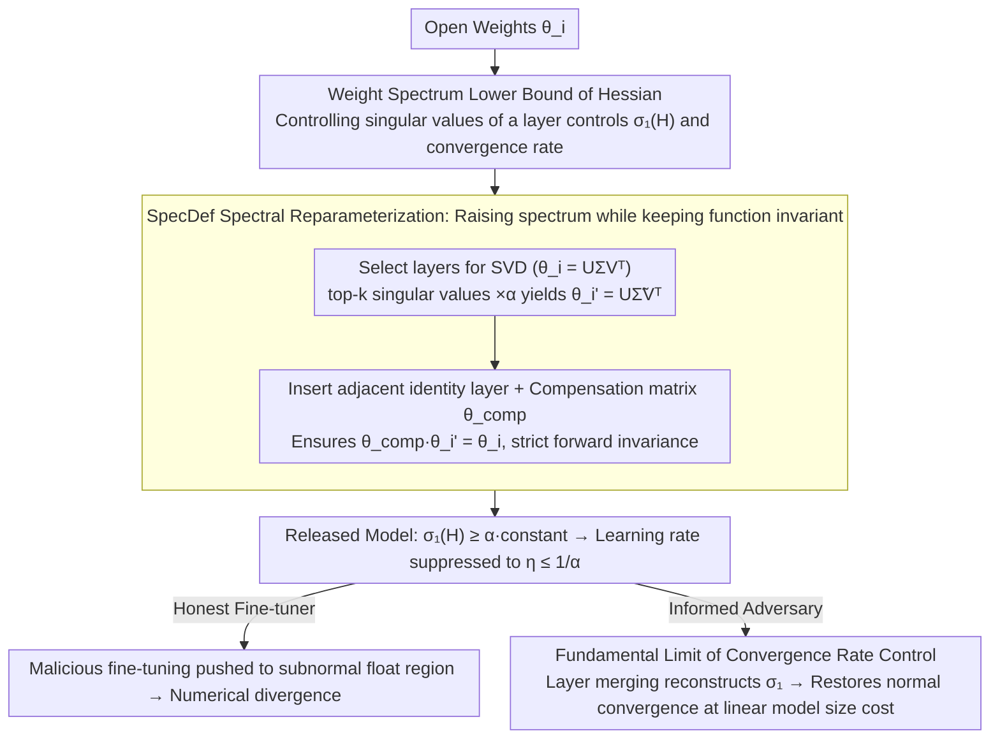

# Limits of Convergence-Rate Control for Open-Weight Safety

**Conference**: ICML 2026  
**arXiv**: [2602.18868](https://arxiv.org/abs/2602.18868)  
**Code**: Not yet released  
**Area**: AI Safety / Optimization Theory / Open-Weight Model Governance  
**Keywords**: open-weight safety, convergence rate, Hessian spectrum, spectral reparameterization, tamper resistance

## TL;DR
The authors formalize "open-weight safety" as the problem of "how to delay the convergence speed of malicious fine-tuning." They prove that the maximum singular value of the Hessian spectrum is lower-bounded by the spectral properties of weight layers. Based on this, they design the SpecDef algorithm to strictly slow down first-order and second-order optimization, while simultaneously proving that any such convergence-rate control method can be bypassed by an attacker at the cost of a "linear increase in model size."

## Background & Motivation

**Background**: Open-source foundation models lack theoretically guaranteed training resistance after release—users are free to fine-tune weights for malicious purposes such as deepfakes or chemical weapons. Open-weight governance mostly follows policy paths like "licenses/staged releases." Technical training-time resistance methods (e.g., TAR, RepNoise, RMU, ELM) are fragmented and lack a unified theoretical explanation.

**Limitations of Prior Work**: (1) Existing unlearning or re-training resistance methods fail under systematic evaluation—simply adjusting the learning rate can restore "erased" capabilities within dozens of fine-tuning steps; (2) These methods are ad hoc, with no clear explanation of "why they work sometimes and why they must fail"; (3) The industry has long conflated inference-time safety with training-time safety, lacking a unified definition.

**Key Challenge**: To "preserve functionality while making re-training difficult" essentially requires increasing the second-order (Hessian) spectrum while maintaining zeroth-order behavior—yet the convergence speed of first-order optimization is precisely determined by the maximum singular value of the Hessian. Is it mathematically possible to construct a transformation that keeps "functionality invariant but causes the Hessian spectrum to explode"? Conversely, can it be proven that all such transformations have an upper bound?

**Goal**: (a) Formalize training-time safety as an "iteration complexity / convergence rate control" problem; (b) Provide a lower bound where the weight spectrum directly manipulates the Hessian spectrum; (c) Construct a provable algorithm, SpecDef, based on this; (d) Prove that any such method has structural limits that an attacker can breach with linear extra cost.

**Key Insight**: First-order optimization must select a learning rate $\eta \leq 1/L$, where $L$ is lower-bounded by the maximum singular value of the Hessian $\sigma_1(H^{\mathcal{L}}_{\theta})$. If $\sigma_1$ can be pushed to astronomical numbers without changing function output, the attacker is forced to use $\eta\to 0$, falling into a "numerical inability to learn" dilemma.

**Core Idea**: Use SVD to perform "symmetric reparameterization" on several weight layers—multiplying the top-$k$ singular values of selected layers by $\alpha$ and inserting perfectly canceling compensation layers in adjacent positions. The functionality remains strictly unchanged, but the maximum singular value of the Hessian is forced to increase by at least $\alpha$ times, pushing the feasible learning rate below subnormal floating-point precision.

## Method

### Overall Architecture
The implementation follows a three-part interlocking structure: first, a **spectral lower bound theorem** links the "unmeasurable and uncontrollable maximum Hessian spectrum" to the "directly manipulable singular values of a specific weight layer"; based on this, the **SpecDef algorithm** is constructed to arbitrarily raise the spectrum while keeping functionality invariant; finally, it is proven that this "convergence rate control" path has a **fundamental limit** against an informed adversary.

SpecDef runs once before the model release: (1) Select several layers $\theta_i$; (2) Insert identity linear layers at adjacent positions as placeholders; (3) Perform SVD on $\theta_i$ to get $U \Sigma V^\top$; (4) Multiply top-$k$ singular values by $\alpha$ to get new weights $\theta_i' = U \tilde\Sigma V^\top$; (5) Write the "compensation matrix" $\theta_i^{comp} = U \Sigma \tilde\Sigma^{-1} U^\top$ into the identity layer position such that $\theta_i^{comp} \theta_i'$ is functionally equivalent to the original $\theta_i$. On GPT-OSS-20b, operating on 10 layers takes only 15 seconds. After release: The spectral lower bound compresses the feasible learning rate to $\eta\le 1/\alpha$, forcing honest fine-tuners into numerical divergence; however, an informed adversary can use "layer collapse" to re-absorb the compensation layer into the original layer, restoring normal convergence at a linear cost—this is the source of the "Limits" in the title.

### Key Designs

**1. Weight Spectrum Lower Bound of Hessian (Theorem 3): Linking the "unmeasurable maximum eigenvalue of Hessian" to "directly manipulable singular values of a layer"**

The learning rate of first-order optimization must satisfy $\eta\le 1/L$, and $L$ is lower-bounded by the maximum singular value of the Hessian $\sigma_1(\nabla^2_\theta\mathcal{L})$. The problem is that the Hessian is neither precisely measurable nor directly controllable. Theorem 3 builds a bridge by replacing it with a controllable quantity:

$$\sigma_1(\nabla^2_\theta \mathcal{L}) \;\ge\; \sup_{r_1, r_2} \sigma_{r_1}(A)\,\sigma_1(B)\,\sigma_{r_2}(C)\,\cos\theta_1\cos\theta_2.$$

The derivation follows two steps: first, use Poincaré separation theorem to lower-bound the maximum singular value of the Hessian by the maximum singular value of some $p\times q$ sub-block $\nabla^2_{\theta_i,\theta_j}\mathcal{L}$; then, observe that this sub-block has an $ABC$-type decomposition for standard MLP/CNN/Transformer architectures (e.g., for a three-layer MLP, $\partial^2 f/\partial\theta_3\partial\theta_1=(x^\top\otimes I_m)^\top D_{z_1}\cdot\theta_2^\top\cdot D_{z_2}$, where $\theta_2$ is sandwiched in the middle), finally closing with classical singular value inequalities. This is the theoretical pivot: if the maximum singular value of the middle matrix $B=\theta_k$ is amplified by $\alpha$ times, the maximum singular value of the Hessian is amplified by at least the same proportion, compressing the learning rate upper bound to $\eta\le (1/\alpha)\cdot\text{constant}$. Notably, this bound remains non-vacuous in rank-deficient cases and is tighter than the classical Horn–Johnson bound.

**2. Lower-Max Spectral Reparameterization + SpecDef: Function strictly invariant while Hessian spectrum reaches astronomical figures**

With the bridge established, the remaining task is to construct a class of mappings $\mathcal{T}_c: f_\theta\mapsto f_{\theta'}$ that satisfies both $\sigma_1(H^{\mathcal{L}}_{\theta'})\ge c$ and a functional distance $d(\mathcal{T}_c[f],f)\le\epsilon$. SpecDef is its specific implementation. The algorithm performs SVD on a selected layer $\theta_i$ to get $U\Sigma V^\top$, multiplies singular values by $T=\mathrm{diag}(\alpha,\dots,\alpha,1,\dots,1)$ (scaling the top $k$ by $\alpha$) to get $\tilde\Sigma=T\Sigma$, and replaces the original weights with $U\tilde\Sigma V^\top$. Crucially, it simultaneously inserts an identity placeholder layer in an adjacent position and writes the compensation matrix $\theta_i^{comp}=U\Sigma\tilde\Sigma^{-1}U^\top$. Since $\theta_i^{comp}\theta_i'=U\Sigma V^\top=\theta_i$, the forward output is strictly unchanged. Pure weight rescaling would change the output, so compensation is mandatory; the identity layer cleverly avoids complications with non-1-homogeneous activations like ReLU—cross-layer compensation between identity layers is always valid. $\alpha$ is chosen to "push the adversary below the smallest effective learning rate": since most LMs fail to converge when $\eta<10^{-6}$, setting $\alpha\ge 10^6$ pushes the feasible learning rate into the subnormal floating-point region. The cost is merely a linear increase in parameter count.

**3. Fundamental Limit of Convergence-Rate Control (Layer Injection Attack): Proving the inherent limitation against informed adversaries**

The most significant part of the paper is its self-negation. The authors abstract SpecDef and all "symmetric spectral reparameterization" methods into a class of mappings, proving that for any such $\mathcal{T}$, there exists an inverse mapping $\mathcal{T}^{-1}$ that pulls the spectrum back to normal. An attacker who knows the layer structure can merge the compensation matrix with the original layer ("layer collapse") to reconstruct the original Hessian spectrum and restore normal convergence. The cost is a linear increase in model size rather than exponential; furthermore, curvature-aware optimizers like Sophia, Muon, or AdaHessian can only provide local improvements and cannot break this upper limit. This conclusion is highlighted to shatter optimism regarding "open-weight safety providing actual resistance": it is not that SpecDef is ineffective, but that the entire "convergence rate control" path has a structural limit when facing an adversary with full model access. Future training-time safety must seek paths beyond this framework. This is the origin of the "Limits" in the paper title.

### Loss & Training
SpecDef itself requires no training; it is a one-time algebraic operation. The paper suggests a "certification process": performing a hyperparameter sweep over $\alpha, k,$ and layer selection before release to confirm lack of convergence under common fine-tuning recipes. The attack experiments utilize SGD/Adam with multiple learning rates ($10^{-6}$ to $3\times 10^{-5}$) and curvature-aware optimizers (Sophia/Muon/AdaHessian) for relearning evaluation.

## Key Experimental Results

### Main Results (WMDP-bio relearning attack on Llama-3.1-8B-Instruct)

| Method | Initial Acc | LR=$10^{-6}$ (Steps / Acc) | LR=$10^{-5}$ | LR=$3\times 10^{-5}$ |
|------|----------|----------------------------|--------------|----------------------|
| ELM | 0.204 | 120 / 0.607 | 23 / 0.621 | 20 / 0.671 |
| RepNoise | 0.325 | 510 / 0.468 | 30 / 0.627 | 33 / 0.650 |
| TAR | 0.290 | 510 / 0.307 | 66 / 0.638 | 66 / 0.618 |
| Llama-3.1-8B Original | 0.482 | 93 / 0.607 | 20 / 0.629 | 10 / 0.609 |
| **SpecDef ($\alpha=10\mathrm{k}$)** | 0.204 | **10 / 0.195†** | **10 / 0.191†** | **10 / 0.195†** |

(† indicates perplexity increase exceeding 100%, indicating immediate fine-tuning divergence)

| Model Utility Preservation (Smaller changes for larger α are better) | WMDP | PPL | MMLU | Winogrande | ARC | HellaSwag |
|---------------------------------------------|------|-----|------|------------|-----|-----------|
| α = 1k | $\Delta = -0.1$ | -0.01 | +0.1 | 0 | +1.0 | +0.3 |
| α = 100k | $-0.1$ | $-0.01$ | +0.6 | +0.3 | +0.3 | 0 |
| α = 1B | 0 | $-0.02$ | — | — | — | — |

### Ablation Study

| Configuration | Effect |
|------|------|
| Scaling $\sigma_1$ only (No compensation) | Serious degradation in model functionality and accuracy |
| SpecDef full suite | Near-invariant functionality, fine-tuning diverges immediately |
| Attack: Curvature-aware optimizers (Sophia/Muon/AdaHessian) | Fails to bypass SpecDef |
| Attack: Layer collapse (layer-injection attack) | Restores normal convergence, cost is +linear model size |
| Attack: Vanilla spectral attack | Reusing SpecDef-type transformations can reverse some prior defenses |

### Key Findings
- **All prior defenses are breached by simple LR sweeps**: Table 1 shows ELM, RepNoise, RMU, TAR, and NPO are compromised to 0.6+ accuracy within dozens of steps at $\eta = 10^{-5}$, indicating their "defense" is only valid at a fixed LR.
- **SpecDef causes immediate divergence at all LRs**: Even if an attacker sweeps five orders of magnitude for LR, $\alpha = 10^4$ pushes the optimization into the subnormal float region, causing PPL to grow by 100%+.
- **Near-zero loss in model utility**: MMLU/Winogrande/ARC/HellaSwag results mostly fluctuate within $\pm 0.3$, proving that forward mathematical identity is achievable at the cost of "parameter increase + slightly slower inference."
- **Bypassable at linear cost**: The authors construct the layer-injection attack themselves, implying any adversary with full model access can undo SpecDef—this is the core pessimistic conclusion and the reason for the title.

## Highlights & Insights
- **Translating safety into optimization theory**: Unlike previous unlearning papers that manually define loss terms, this work uses classical iteration complexity analysis to quantify "difficulty of training" as "requirement of extremely small LR."
- **Educational bridge from weight spectrum to Hessian spectrum**: Theorem 3 uses random matrix theory tools elegantly, and the bound remains non-vacuous for rank-deficient matrices, providing a tighter result than classical bounds.
- **Symmetric reparameterization + identity injection**: The trick of "maintaining zeroth-order while arbitrarily scaling the spectrum" is ingenious, aligning with Dinh et al.'s analysis of sharpness symmetry, and could extend to generalization or sharpness-aware training.
- **Duality of contribution**: It is rare for a paper to propose the best-known algorithm (SpecDef) and prove its fundamental limit simultaneously, reminding researchers that training-time safety requires paradigms beyond convergence-rate control.

## Limitations & Future Work
- SpecDef assumes attackers use first/second-order smooth optimizers, not seriously considering randomized methods (e.g., stochastic Langevin dynamics) or gradient-free/zeroth-order attacks.
- Linear increase in parameter count is not trivial for large models—adding 10 compensation layers to a 20B model requires several extra GBs of VRAM.
- The "smallest effective learning rate" is empirically determined; different hardware and precisions (FP16/BF16/FP8) have different truncation points, requiring recalibration of $\alpha$.
- The layer-injection attack is proven possible, but the quantitative assessment of actual attack complexity (required information, hyperparameter tuning) is left for future work.
- It provides numerical non-convergence rather than a cryptographic safety proof—similar to the lessons from "obfuscated gradients," stronger models may be needed.

## Related Work & Insights
- **vs TAR / RepNoise / RMU / ELM**: These methods rely on empirical unlearning and extra regularization. The unified evaluation shows they collapse under LR sweeps; SpecDef provides the first provable guarantee across all LRs.
- **vs Sharpness-Aware Minimization (Foret 2020) / Dinh 2017**: This work uses symmetry to push sharpness to infinity, an inverse application of these works' insights.
- **vs Obfuscated Gradients (Athalye 2018)**: Just as Athalye proved "gradient obfuscation" is bypassable, this work warns that "convergence rate obfuscation" can be dismantled by inverse operations.
- **vs Bresler et al. on PAC-learning Hardness**: The limit here is not computational complexity hardness, but limits in the sense of algebraic invertibility.

## Rating
- Novelty: ⭐⭐⭐⭐⭐ Establishes a convergence rate framework for open-weight safety with a provable algorithm and fundamental limit.
- Experimental Thoroughness: ⭐⭐⭐⭐ Covers LM, ViT, and Stable Diffusion with 10+ defense baselines and curvature-aware optimizer attacks; the adversary modeling is somewhat idealized.
- Writing Quality: ⭐⭐⭐⭐ Clear definitions and theorems with smooth transitions; high density requires optimization background.
- Value: ⭐⭐⭐⭐⭐ Provides a crucial direction calibration for the community—true training-time safety must transcend the convergence-rate control framework.

<!-- RELATED:START -->

## Related Papers

- [\[ICML 2026\] On the Convergence Rate of LoRA Gradient Descent](on_the_convergence_rate_of_lora_gradient_descent.md)
- [\[ICML 2026\] Sign Lock-In: Randomly Initialized Weight Signs Persist and Bottleneck Sub-Bit Model Compression](sign_lock-in_randomly_initialized_weight_signs_persist_and_bottleneck_sub-bit_mo.md)
- [\[ICML 2026\] Towards Understanding Adam Convergence on Highly Degenerate Polynomials](towards_understanding_adam_convergence_on_highly_degenerate_polynomials.md)
- [\[ICLR 2026\] Dual Optimistic Ascent (PI Control) is the Augmented Lagrangian Method in Disguise](../../ICLR2026/optimization/dual_optimistic_ascent_pi_control_is_the_augmented_lagrangian_method_in_disguise.md)
- [\[CVPR 2026\] Learning to Learn Weight Generation via Local Consistency Diffusion](../../CVPR2026/optimization/learning_to_learn_weight_generation_via_local_consistency_diffusion.md)

<!-- RELATED:END -->
