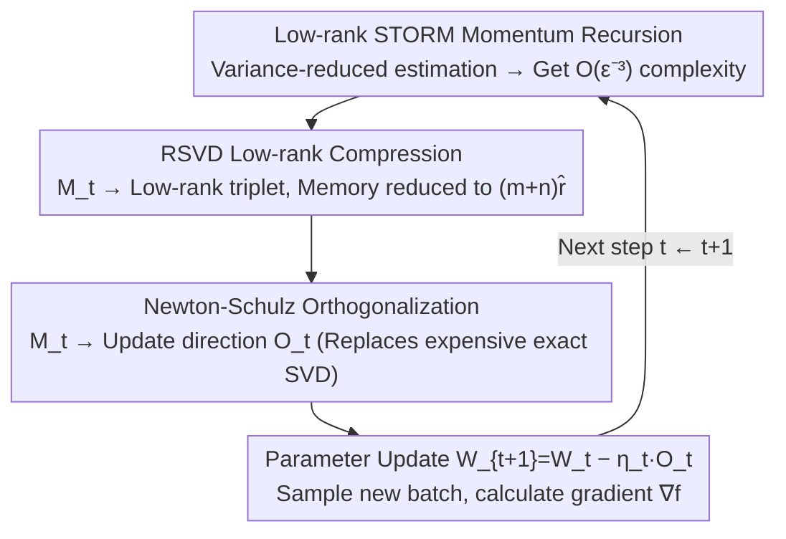

# LiMuon: Light and Fast Muon Optimizer for Large Models

**Conference**: ICML 2026  
**arXiv**: [2509.14562](https://arxiv.org/abs/2509.14562)  
**Code**: To be confirmed  
**Area**: LLM Optimizers / Variance Reduction / Randomized SVD  
**Keywords**: Muon, STORM Variance Reduction, Randomized SVD, Low-rank Momentum, Generalized Smoothness, Newton-Schulz

## TL;DR
LiMuon integrates STORM-style momentum variance reduction with Randomized SVD (RSVD) into the Muon optimizer. It compresses matrix parameter momentum from $m \times n$ to $(m+n)\hat{r}$ while reducing the SFO complexity for finding $\epsilon$-stationary points from $\mathcal{O}(\epsilon^{-4})$ to $\mathcal{O}(\epsilon^{-3})$. It simultaneously achieves lower perplexity/higher accuracy and reduced GPU memory on Mamba-130M / Qwen2.5-0.5B / ViT.

## Background & Motivation

**Background**: Adam/AdamW remain the mainstream for large models, but recently, optimizers exploiting the "parameter as matrix/tensor" structure (e.g., Shampoo, Muon) have shown potential for higher sample efficiency. Muon (Jordan et al., 2024) orthogonalizes momentum $B_t = \mu B_{t-1} + G_t$ before taking a descent step—equivalent to performing SVD $B_t = U \Sigma V^\top$ and using $O_t = U V^\top$ as the update direction. In practice, Newton-Schulz polynomial iterations are used for approximation, demonstrating competitiveness across various LLMs.

**Limitations of Prior Work**: Existing Muon-based works (Shen 2025, SCG, Gluon, GGNC, Muon++, SUMO, etc.) share a common drawback—either the **sample complexity remains $\mathcal{O}(\epsilon^{-4})$** (SCG, Gluon, GGNC, SUMO) or the **state memory remains full-rank $mn$** (Shen, Muon++). Only Muon++ (Sfyraki & Wang 2025) reduces complexity to $\mathcal{O}(\epsilon^{-3})$ via STORM, but at the cost of storing an additional $mn$ variance-reduced momentum and relying on gradient clipping. In modern LLM layers where $m, n$ are in the thousands, $mn$ optimizer states constitute a major portion of memory usage.

**Key Challenge**: Reducing sample complexity relies on recursive variance estimation like STORM based on $M_{t-1}$, which structurally requires retaining full gradient information from the previous step—creating a natural conflict with memory reduction. SUMO reduces memory via subspace projection but requires strong assumptions like bounded objective functions, and its complexity remains $\mathcal{O}(\epsilon^{-4})$.

**Goal**: To find a Muon variant that **simultaneously** compresses state memory to $(m+n)\hat{r}$ and reduces SFO complexity to $\mathcal{O}(\epsilon^{-3})$, while remaining valid under the weaker $(L_0, L_1)$ generalized smoothness condition and Newton-Schulz approximation versions.

**Key Insight**: The authors observe that the $M_t$ stored in STORM estimation is itself a noisy momentum; theoretically, its "important directions" are far fewer than $\min(m,n)$. Thus, one can recursively update only its low-rank approximation $\hat{M}_t = \hat{U}_t \hat{S}_t \hat{V}_t^\top$ (using Halko et al.'s randomized SVD to project onto $\hat{r} + s$ columns + QR), storing only three small matrices.

**Core Idea**: Replace Muon's original momentum with a combination of **"STORM recursion + RSVD low-rank compression."** It is theoretically proven that the bias introduced by low-rank approximation does not degrade the convergence order, while practically saving memory and improving performance metrics.

## Method

### Overall Architecture
LiMuon follows the two-stage Muon framework: each step first (approximately) orthogonalizes a momentum proxy $M_t$ to obtain direction $O_t$, then updates parameters via $W_{t+1} = W_t - \eta_t O_t$. The difference lies entirely in the momentum proxy—Muon uses EMA momentum, Muon++ uses full-rank STORM estimation, and LiMuon uses **low-rank STORM** estimation. The paper provides two options: Option#1 stores full-rank $M_t$ (no memory saving, for theoretical comparison), and Option#2 stores the low-rank triplet of $\hat{M}_t$ (recommended for practice). Both Exact-SVD and Newton-Schulz versions are provided. The diagram below illustrates the three tasks within a LiMuon iteration:

### Key Designs

**1. STORM Variance-Reduced Momentum: Reducing $\epsilon$-stationary point complexity from $\mathcal{O}(\epsilon^{-4})$ to $\mathcal{O}(\epsilon^{-3})$**

The original Muon uses EMA momentum $B_t=\mu B_{t-1}+G_t$. Taking only one stochastic gradient per step leads to high variance and slow convergence ($\mathcal{O}(\epsilon^{-4})$). LiMuon replaces the momentum proxy with a STORM-style recursive variance-reduced estimate (Algorithm 1, Line 7):

$$M_{t+1} = \nabla f(W_{t+1}; \xi_{t+1}) + (1 - \beta_{t+1})\big(M_t - \nabla f(W_t; \xi_{t+1})\big)$$

The term $M_t-\nabla f(W_t;\xi_{t+1})$ uses the gradient difference of the same batch $\xi_{t+1}$ across two steps to "correct" the previous momentum, suppressing estimation variance over iterations. This is the source of the complexity improvement to $\mathcal{O}(\epsilon^{-3})$, requiring only a batch size of 1. The cost is that this recursive structure must retain the previous momentum $M_t$. If stored as full-rank $M_t\in\mathbb{R}^{m\times n}$ (as in Option#1), complexity is reduced but memory is not (the shortfall of Muon++). This conflict is resolved by Design 2.

**2. RSVD Low-Rank Compression: Reducing momentum state from full-rank $mn$ to $(m+n)\hat{r}$**

The key observation is that the stored $M_t$ is a noisy momentum with an "effective rank" much lower than $\min(m,n)$. Option#2 (Algorithm 1, Lines 8–9) uses Randomized SVD (RSVD, Algorithm 2) to compress $M_t$ into a triplet: draw a Gaussian random matrix $\Omega\in\mathbb{R}^{n\times(\hat{r}+s)}$, calculate $Y=M_t\Omega$, perform QR decomposition $Y=QR$, and execute exact SVD on the small matrix $B=Q^\top M_t$ to get $(\tilde{U},\Sigma,V)$, then reconstruct $U=Q\tilde{U}$. Here $s\ge 2$ is oversampling for accuracy. After obtaining $\hat{M}_t=\hat{U}_t\hat{S}_t\hat{V}_t^\top$, **only** $\hat{U}_t\in\mathbb{R}^{m\times\hat{r}}$, $\hat{S}_t\in\mathbb{R}^{\hat{r}\times\hat{r}}$, and $\hat{V}_t\in\mathbb{R}^{n\times\hat{r}}$ are stored across steps, where $m\hat{r}+n\hat{r}+\hat{r}^2\ll mn$. This low-rank approximation is then substituted back into the STORM recursion:

$$M_{t+1} = \nabla f(W_{t+1}; \xi_{t+1}) + (1 - \beta_{t+1})\big(\hat{M}_t - \nabla f(W_t; \xi_{t+1})\big)$$

This pushes state memory to the $(m+n)\hat{r}$ range (equivalent to SUMO) while preserving STORM’s $\mathcal{O}(\epsilon^{-3})$. Crucially, RSVD is used specifically for **compressing the momentum state** (not for orthogonalization—which is handled by Design 3), bypassing the memory bottleneck of variance reduction. The paper proves that this bias does not affect the convergence rate.

**3. Newton-Schulz Orthogonalization + Generalized Smoothness: Theoretical guarantees for practical deployment**

After obtaining momentum $M_t$, it must be orthogonalized into the update direction $O_t$. Algorithm 1 uses exact SVD ($O_t=U_tV_t^\top$) for theoretical comparison, but exact SVD is prohibitively expensive for large matrices. In practice, Newton-Schulz (NS) iterations are standard. Algorithm 3 replaces orthogonalization with NS iterations $X_j = p_\kappa(X_{j-1}X_{j-1}^\top)X_{j-1}$ (default $p_2(z)=3.4445-4.7750z+2.0315z^2$ for $q$ iterations). It proves that under polar approximation error $\varepsilon_q\in(0,1)$ and $\chi_q=1/(1-\varepsilon_q)$, LiMuon-NS complexity is $\mathcal{O}(\chi_q^3\epsilon^{-3})$, strictly superior to Muon-NS's $\mathcal{O}(\chi_q^4\epsilon^{-4})$ (Kim & Oh, 2026). All convergence proofs are established under $(L_0, L_1)$ generalized smoothness, which is more realistic for LLM training than Lipschitz smoothness, and LiMuon does not require gradient clipping.

### Loss & Training
The objective is non-convex stochastic optimization $\min_{W \in \mathbb{R}^{m \times n}} \mathbb{E}_{\xi \sim \mathcal{D}}[f(W; \xi)]$. The stopping criterion is an $\epsilon$-Frobenius / nuclear norm stationary point. Hyperparameters include step size $\eta_t$, momentum coefficient $\beta_t$, target rank $\hat{r}$, RSVD oversampling $s \ge 2$, and NS iterations $q$. Theorem 4.7 shows that with $\eta = \mathcal{O}(T^{-2/3})$ and $\beta = \mathcal{O}(T^{-2/3})$, the average gradient nuclear norm is $\le \mathcal{O}(T^{-1/3})$, implying $T = \mathcal{O}(\epsilon^{-3})$. LiMuon **does not rely on gradient clipping**, reducing the number of tunable parameters compared to Muon++.

## Key Experimental Results

### Main Results
All experiments were conducted on NVIDIA A100-SXM4-80GB, with baselines including Adam / AdamW / Lion / SUMO / Muon / Muon++.

| Model / Dataset | Optimizer | Memory (GB) | Key Metric | Remarks |
|---------------|--------|-----------|----------|------|
| Mamba-130M / WikiText-103 | AdamW | 22.92 | val ppl 266.43 | baseline |
| (5k steps, bs=64, seq=256) | Muon | 22.20 | val ppl 71.27 | Matrix orthogonalization helps |
|  | Muon++ | 22.35 | val ppl 56.79 | STORM variance reduction |
|  | **LiMuon (rank=8)** | **20.25** | val ppl 62.23 | 2 GB less memory, beats Muon++ range |
|  | **LiMuon (full)** | 22.80 | **val ppl 47.78** | Lowest ppl for same memory |
| Qwen2.5-0.5B / MiniPile | Muon | 54.14 | val ppl 67.60 | – |
| (2k steps, bs=16, seq=1024) | Muon++ | 54.30 | val ppl 82.26 | STORM performs worse on large model |
|  | **LiMuon (rank=16)** | 54.21 | val ppl **46.77** | Same memory, ppl halved |
|  | **LiMuon (full)** | 55.15 | val ppl **40.83** | Best across scales |
| ViT / Tiny-ImageNet | Muon | 5.50 | val top-1 47.87% | – |
| (10k steps, bs=128) | SUMO | 5.31 | val top-1 44.23% | Subspace method |
|  | **LiMuon (rank=8)** | 5.28 | val top-1 46.75% | More efficient and accurate than SUMO |
|  | **LiMuon (full)** | 5.53 | val top-1 **48.04%** | Highest in class |

### Ablation Study

| Algorithm | SFO Complexity | State Memory | Gen. Smoothness | NS Compatible |
|------|-----------|----------|----------|---------|
| Muon (Shen 2025) | $\mathcal{O}(\epsilon^{-4})$ | $mn$ | ✗ | – |
| Muon++ | $\mathcal{O}(\epsilon^{-3})$ | $mn$ | ✗ | – |
| SUMO | $\mathcal{O}(\epsilon^{-4})$ | $(m+n)\hat{r}$ | ✗ | – |
| Gluon / GGNC | $\mathcal{O}(\epsilon^{-4})$ | $mn$ | ✓ | – |
| Muon-NS (Kim & Oh 2026) | $\mathcal{O}(\chi_q^4 \epsilon^{-4})$ | $mn$ | – | ✓ |
| **LiMuon (Exact SVD)** | $\mathcal{O}(\epsilon^{-3})$ | $(m+n)\hat{r}$ | ✓ | – |
| **LiMuon (NS)** | $\mathcal{O}(\chi_q^3 \epsilon^{-3})$ | $(m+n)\hat{r}$ | ✓ | ✓ |

### Key Findings
- **Muon++ performed worse than Muon on Qwen2.5-0.5B** (val ppl 82.26 vs 67.60), suggesting that Muon++'s full-rank STORM might be unstable as models scale; LiMuon's low-rank momentum remains superior, illustrating that "compression improves stability."
- **rank=8 / 16 usually approaches full rank performance**: On Mamba and ViT, rank=8 matches Muon++, and rank=16 surpasses it. This implies $\hat{r}$ does not need to be large to capture major gains.
- **No gradient clipping required**: Provides an advantage over Muon++ by having one fewer hyperparameter to tune.

## Highlights & Insights
- **Simultaneous "Lower Complexity $\times$ Lower Memory"**: Unlike Muon++ (complexity-focused) or SUMO (memory-focused), LiMuon utilizes RSVD to merge both advantages without requiring "bounded objective" assumptions.
- **Formalizing Newton-Schulz**: Incorporating the NS error $\chi_q$ into the complexity bound elevates NS iterations from an "engineering hack" to a provable component, providing theoretical grounding for practitioners.
- **Performance of Low-rank Momentum**: Empirical tests on LLMs show that rank=8/16 matches or exceeds full-rank performance, providing evidence that optimizer momentum is naturally a low-effective-rank object.

## Limitations & Future Work
- Experimental scales remain moderate (Mamba-130M, Qwen2.5-0.5B, ViT-22M); real savings on 100B+ model scales require further verification.
- Performing RSVD at every step (even if cheap) adds wall-clock overhead; the paper provides ViT step-time baselines but lacks full end-to-end time comparisons for larger models.
- The target rank $\hat{r}$ is manually set; adaptive ranks (adjusting by training phase or layer spectrum) are a clear next step.
- Current theory assumes unbiased stochastic gradients and bounded variance; analysis of coupling with noisy LR schedules, warmup, and weight decay is not yet covered.

## Related Work & Insights
- **vs Muon++ (Sfyraki & Wang 2025)**: Both use STORM for $\mathcal{O}(\epsilon^{-3})$, but Muon++ requires full-rank memory and clipping; LiMuon solves both via low-rank momentum.
- **vs SUMO (Refael et al. 2025)**: Both achieve $(m+n)\hat{r}$ memory, but SUMO is $\mathcal{O}(\epsilon^{-4})$ and requires bounded $F$; LiMuon has better complexity and weaker assumptions.
- **vs Gluon / GGNC**: These focus on Muon analysis under $(L_0, L_1)$ smoothness; LiMuon adopts this framework while adding variance reduction and low-rank upgrades.
- **vs Shampoo / KFAC (Second-order methods)**: Different approaches—second-order methods compress preconditioned matrix rank, while LiMuon compresses momentum rank; the two may be orthogonal and combinable.

## Rating
- Novelty: ⭐⭐⭐⭐ Combining STORM + RSVD within Muon is a clear innovation; "low-rank momentum" is a correct and systematic insight for the Muon family.
- Experimental Thoroughness: ⭐⭐⭐ Architecture coverage (Mamba/Qwen/ViT) and rank ablations are solid; however, larger scales and detailed training time profiling are missing. 
- Writing Quality: ⭐⭐⭐⭐ Clear distinction between algorithms, theorems, and tables. Defined assumptions and limitations make it exceptionally rigorous for the field.
- Value: ⭐⭐⭐⭐ Reducing optimizer state memory while improving complexity and removing clipping provides tangible benefits for large-scale deployment.

<!-- RELATED:START -->

## Related Papers

- [\[ICML 2026\] The Implicit Bias of Adam and Muon on Smooth Homogeneous Neural Networks](the_implicit_bias_of_adam_and_muon_on_smooth_homogeneous_neural_networks.md)
- [\[AAAI 2026\] Pareto-Grid-Guided Large Language Models for Fast and High-Quality Heuristics Design in Multi-Objective Combinatorial Optimization](../../AAAI2026/optimization/pareto-grid-guided_large_language_models_for_fast_and_high-quality_heuristics_de.md)
- [\[ICLR 2026\] Convergence of Muon with Newton-Schulz](../../ICLR2026/optimization/convergence_of_muon_with_newton-schulz.md)
- [\[ICML 2026\] Memory-Efficient LLM Pretraining via Minimalist Optimizer Design](memory-efficient_llm_pretraining_via_minimalist_optimizer_design.md)
- [\[ICML 2026\] Learning a Zeroth-Order Optimizer for Fine-Tuning LLMs](learning_a_zeroth-order_optimizer_for_fine-tuning_llms.md)

<!-- RELATED:END -->
