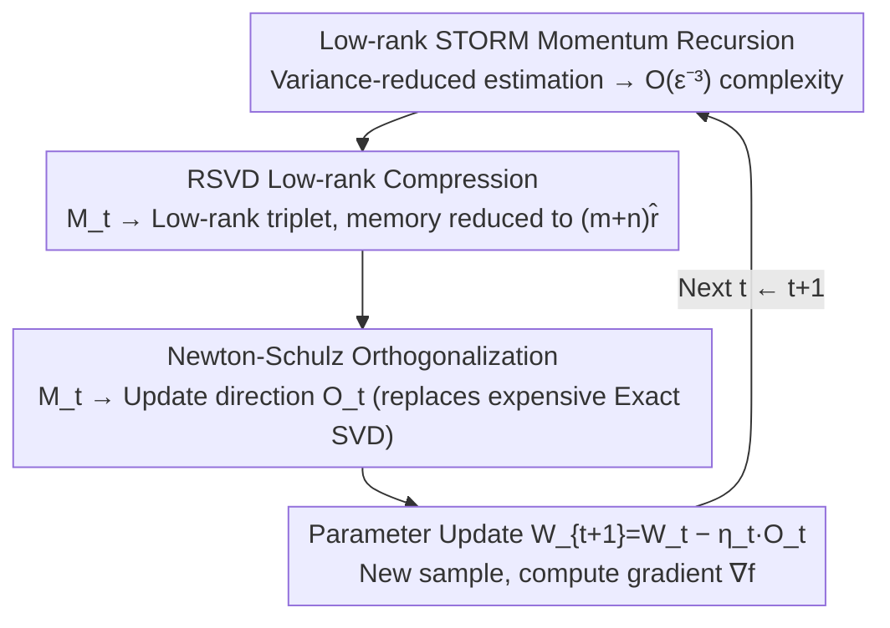

# LiMuon: Light and Fast Muon Optimizer for Large Models

**Conference**: ICML 2026  
**arXiv**: [2509.14562](https://arxiv.org/abs/2509.14562)  
**Code**: TBD  
**Area**: Large Model Optimizers / Variance Reduction / Randomized SVD  
**Keywords**: Muon, STORM Variance Reduction, Randomized SVD, Low-rank Momentum, Generalized Smoothness, Newton-Schulz

## TL;DR
LiMuon integrates STORM-style momentum variance reduction and Randomized SVD (RSVD) into the Muon optimizer. It compresses the momentum of matrix parameters from $m \times n$ to $(m+n)\hat{r}$ while reducing the SFO complexity for finding $\epsilon$-stationary points from $\mathcal{O}(\epsilon^{-4})$ to $\mathcal{O}(\epsilon^{-3})$. It achieves lower perplexity/higher accuracy and reduced memory consumption simultaneously on Mamba-130M, Qwen2.5-0.5B, and ViT.

## Background & Motivation

**Background**: While Adam/AdamW remain dominant for large models, recent optimizers leveraging "parameter-as-matrix/tensor" structures (e.g., Shampoo, Muon) have shown higher sample efficiency. Muon (Jordan et al., 2024) orthogonalizes the momentum $B_t = \mu B_{t-1} + G_t$ before the descent step—equivalent to performing SVD $B_t = U \Sigma V^\top$ and using $O_t = U V^\top$ as the update direction. Practical implementations often use Newton-Schulz iteration for approximation and have shown competitive performance on several LLMs.

**Limitations of Prior Work**: Existing Muon-based works (Shen 2025, SCG, Gluon, GGNC, Muon++, SUMO, etc.) share a common bottleneck: they either **maintain a sample complexity of $\mathcal{O}(\epsilon^{-4})$** (SCG, Gluon, GGNC, SUMO) or **require full-rank $mn$ state memory** (Shen, Muon++). Only Muon++ (Sfyraki & Wang 2025) reduces complexity to $\mathcal{O}(\epsilon^{-3})$ via STORM, but at the cost of storing an additional $mn$ variance-reduced momentum and depending on gradient clipping. In modern LLM layers where $m, n$ are in the thousands, $mn$ optimizer states represent a significant portion of VRAM.

**Key Challenge**: Reducing sample complexity relies on recursive variance estimation like STORM (based on $M_{t-1}$), which structurally requires preserving previous full gradient information—naturally conflicting with memory reduction. SUMO utilizes subspace projection for memory efficiency but requires strong assumptions (like bounded objective functions) and maintains $\mathcal{O}(\epsilon^{-4})$ complexity.

**Goal**: To find a Muon variant that **simultaneously** compresses state memory to $(m+n)\hat{r}$ and reduces SFO complexity to $\mathcal{O}(\epsilon^{-3})$, while remaining valid under weaker $(L_0, L_1)$ generalized smoothness conditions and compatible with Newton-Schulz approximations.

**Key Insight**: The authors notice that the stored $M_t$ in STORM estimation is itself a noisy momentum; theoretically, its "significant directions" are far fewer than $\min(m,n)$. Thus, it is possible to use only its low-rank approximation $\hat{M}_t = \hat{U}_t \hat{S}_t \hat{V}_t^\top$ (calculated via Randomized SVD projecting onto $\hat{r} + s$ columns + QR) for recursion, storing only three small matrices.

**Core Idea**: Replace the original Muon momentum with a combination of **"STORM recursion + RSVD low-rank compression."** It is theoretically proven that the bias introduced by low-rank approximation does not degrade the convergence rate, while practically saving memory and improving performance metrics.

## Method

### Overall Architecture
LiMuon follows Muon's two-stage process: first, an (approximate) orthogonalization of a momentum proxy $M_t$ yields the direction $O_t$; second, parameters are updated via $W_{t+1} = W_t - \eta_t O_t$. The divergence lies in the momentum proxy itself—Muon uses EMA momentum, Muon++ uses full-rank STORM estimation, and LiMuon uses **low-rank STORM** estimation. the paper provides two options: Option #1 stores full-rank $M_t$ (theoretical baseline), and Option #2 stores the low-rank triplet of $\hat{M}_t$ (recommended for practice). Both Exact-SVD and Newton-Schulz versions are provided. The following diagram illustrates the three steps within a LiMuon iteration:

### Key Designs

**1. STORM Variance Reduction: Reducing SFO complexity from $\mathcal{O}(\epsilon^{-4})$ to $\mathcal{O}(\epsilon^{-3})$**

The original Muon uses EMA momentum $B_t=\mu B_{t-1}+G_t$, which consumes one stochastic gradient per step, leading to high variance and slow convergence ($\mathcal{O}(\epsilon^{-4})$). LiMuon replaces this with a STORM-style recursive variance-reduced estimate (Algorithm 1, Line 7):

$$M_{t+1} = \nabla f(W_{t+1}; \xi_{t+1}) + (1 - \beta_{t+1})\big(M_t - \nabla f(W_t; \xi_{t+1})\big)$$

The term $M_t-\nabla f(W_t;\xi_{t+1})$ uses the gradient difference of the same sample batch $\xi_{t+1}$ across two steps to "correct" the previous momentum, suppressing estimation variance over iterations. This is the source of the $\mathcal{O}(\epsilon^{-3})$ complexity, requiring only a batch size of 1. The cost is the requirement to retain $M_t$: if stored in full rank as in Option #1 ($M_t\in\mathbb{R}^{m\times n}$), the complexity decreases but memory does not (the weakness of Muon++).

**2. RSVD Low-rank Compression: Reducing momentum state from $mn$ to $(m+n)\hat{r}$**

The key observation is that $M_t$ is a noisy momentum with an "important dimension" significantly smaller than $\min(m,n)$. Storage of the full rank is unnecessary. Option #2 (Algorithm 1, Lines 8–9) uses Randomized SVD (RSVD, Algorithm 2) to compress $M_t$ into a triplet: sample a Gaussian random matrix $\Omega\in\mathbb{R}^{n\times(\hat{r}+s)}$, compute $Y=M_t\Omega$ with QR decomposition $Y=QR$, perform exact SVD on the small matrix $B=Q^\top M_t$ to get $(\tilde{U},\Sigma,V)$, and reconstruct $U=Q\tilde{U}$, where $s\ge 2$ is the oversampling parameter. After obtaining $\hat{M}_t=\hat{U}_t\hat{S}_t\hat{V}_t^\top$, **only** $\hat{U}_t\in\mathbb{R}^{m\times\hat{r}}$, $\hat{S}_t\in\mathbb{R}^{\hat{r}\times\hat{r}}$, and $\hat{V}_t\in\mathbb{R}^{n\times\hat{r}}$ are stored across steps, ensuring $m\hat{r}+n\hat{r}+\hat{r}^2\ll mn$. This low-rank approximation is then fed back into the STORM recursion (Line 9 replaces $M_t$ in Line 7 with $\hat{M}_t$):

$$M_{t+1} = \nabla f(W_{t+1}; \xi_{t+1}) + (1 - \beta_{t+1})\big(\hat{M}_t - \nabla f(W_t; \xi_{t+1})\big)$$

This design achieves $(m+n)\hat{r}$ memory—comparable to SUMO—while maintaining STORM's $\mathcal{O}(\epsilon^{-3})$. RSVD here specifically **compresses the momentum state** (it does not perform orthogonalization, which is handled in Design 3); this sidesteps the memory bloat typical of variance reduction.

**3. Newton-Schulz Orthogonalization + Generalized Smoothness Convergence**

After obtaining $M_t$, it must be orthogonalized into the update direction $O_t$. Algorithm 1 uses exact SVD ($O_t=U_tV_t^\top$) for theoretical comparison, but exact SVD is computationally expensive on high-dimensional layers. Industry practice typically uses Newton-Schulz iteration as an approximation. Algorithm 3 replaces orthogonalization with NS iteration $X_j = p_\kappa(X_{j-1}X_{j-1}^\top)X_{j-1}$ (defaulting to the polynomial $p_2(z)=3.4445-4.7750z+2.0315z^2$ for $q$ iterations). The authors prove that under polar approximation error $\varepsilon_q\in(0,1)$ and $\chi_q=1/(1-\varepsilon_q)$, LiMuon-NS complexity is $\mathcal{O}(\chi_q^3\epsilon^{-3})$, which is strictly better than the $\mathcal{O}(\chi_q^4\epsilon^{-4})$ of Muon-NS (Kim & Oh, 2026). Furthermore, all convergence proofs are established under $(L_0, L_1)$ generalized smoothness $\|\nabla F(W)-\nabla F(W')\|_F^2\le(L_0^2+L_1^2\|\nabla F(W)\|_F^2)\|W-W'\|_F^2$, which is more realistic for LLM training and upgrades NS approximation from an "engineering hack" to a provable object without relying on gradient clipping.

### Loss & Training
The objective is non-convex stochastic optimization $\min_{W \in \mathbb{R}^{m \times n}} \mathbb{E}_{\xi \sim \mathcal{D}}[f(W; \xi)]$, with the stopping criterion being an $\epsilon$-Frobenius/nuclear norm stationary point. Hyperparameters include step size $\eta_t$, momentum coefficient $\beta_t$, target rank $\hat{r}$, RSVD oversampling $s \ge 2$, and NS iterations $q$. Theorem 4.7 demonstrates that with $\eta = \mathcal{O}(T^{-2/3})$ and $\beta = \mathcal{O}(T^{-2/3})$, the average gradient nuclear norm is $\le \mathcal{O}(T^{-1/3})$, leading to $T = \mathcal{O}(\epsilon^{-3})$. Notably, LiMuon **does not rely on gradient clipping**.

## Key Experimental Results

### Main Results
All experiments were conducted on NVIDIA A100-SXM4-80GB, with baselines including Adam, AdamW, Lion, SUMO, Muon, and Muon++.

| Model / Dataset | Optimizer | VRAM (GB) | Key Metric | Note |
|-----------------|-----------|-----------|------------|------|
| Mamba-130M / WikiText-103 | AdamW | 22.92 | val ppl 266.43 | Baseline |
| (5k steps, bs=64, seq=256) | Muon | 22.20 | val ppl 71.27 | Matrix orthogonalization improves performance |
|  | Muon++ | 22.35 | val ppl 56.79 | STORM variance reduction |
|  | **LiMuon (rank=8)** | **20.25** | val ppl 62.23 | 2 GB less VRAM, matches Muon++ |
|  | **LiMuon (full)** | 22.80 | **val ppl 47.78** | Lowest ppl at same VRAM tier |
| Qwen2.5-0.5B / MiniPile | Muon | 54.14 | val ppl 67.60 | – |
| (2k steps, bs=16, seq=1024) | Muon++ | 54.30 | val ppl 82.26 | STORM struggles as model scales |
|  | **LiMuon (rank=16)** | 54.21 | val ppl **46.77** | Equal VRAM, halved ppl |
|  | **LiMuon (full)** | 55.15 | val ppl **40.83** | Best overall |
| ViT / Tiny-ImageNet | Muon | 5.50 | val top-1 47.87% | – |
| (10k steps, bs=128) | SUMO | 5.31 | val top-1 44.23% | Subspace method |
|  | **LiMuon (rank=8)** | 5.28 | val top-1 46.75% | More efficient and accurate than SUMO |
|  | **LiMuon (full)** | 5.53 | val top-1 **48.04%** | Highest in tier |

### Ablation Study / Complexity Comparison

| Algorithm | SFO Complexity | State Memory | Generalized Smoothness | NS Compatible |
|-----------|----------------|--------------|-----------------------|---------------|
| Muon (Shen 2025) | $\mathcal{O}(\epsilon^{-4})$ | $mn$ | ✗ | – |
| Muon++ | $\mathcal{O}(\epsilon^{-3})$ | $mn$ | ✗ | – |
| SUMO | $\mathcal{O}(\epsilon^{-4})$ | $(m+n)\hat{r}$ | ✗ | – |
| Gluon / GGNC | $\mathcal{O}(\epsilon^{-4})$ | $mn$ | ✓ | – |
| Muon-NS (Kim & Oh 2026) | $\mathcal{O}(\chi_q^4 \epsilon^{-4})$ | $mn$ | – | ✓ |
| **LiMuon (Exact SVD)** | $\mathcal{O}(\epsilon^{-3})$ | $(m+n)\hat{r}$ | ✓ | – |
| **LiMuon (NS)** | $\mathcal{O}(\chi_q^3 \epsilon^{-3})$ | $(m+n)\hat{r}$ | ✓ | ✓ |

### Key Findings
- **Muon++ performed worse than Muon on Qwen2.5-0.5B** (val ppl 82.26 vs 67.60), suggesting that Muon++'s full-rank STORM is unstable as models scale; LiMuon's low-rank momentum remained stable and superior, implying that "compression aids stability."
- **rank=8 / 16 is typically sufficient to approximate full rank**: On Mamba and ViT, rank=8 matched Muon++, and rank=16 outperformed it. This suggests $\hat{r}$ does not need to be large for significant gains.
- **No gradient clipping required**: LiMuon eliminates one hyperparameter compared to Muon++, making it more engineering-friendly.

## Highlights & Insights
- **First to achieve "Lower Complexity $\times$ Lower Memory" simultaneously**: Previous work either focused on complexity (Muon++) or memory (SUMO). LiMuon uses RSVD to couple these benefits without requiring bounded objective assumptions.
- **Explicit inclusion of Newton-Schulz error $\chi_q$ in complexity**: This provides a theoretical bridge for practical deployment where developers rely on NS approximations.
- **Low-rank momentum does not "hurt" performance**: Evidence from LLM tests shows rank=8/16 matches or exceeds full-rank performance, suggesting optimizer momentum is inherently a low effective-rank object.

## Limitations & Future Work
- Experimental scales are moderate (Mamba-130M, Qwen2.5-0.5B, ViT-22M); savings on 100B+ LLMs require further verification, particularly given the stability issues observed in Muon++ baselines.
- Running RSVD every step (though low cost) increases wall-clock time; Table 5 compares step time for ViT, but a full breakdown for LiMuon-NS vs NS-only on larger models is missing.
- The target rank $\hat{r}$ is manually set; adaptive ranking (based on training phase or layer spectrum) is an obvious next step.
- Theory still assumes unbiased stochastic gradients and bounded variance; analysis for coupling with noisy LR schedules, warmups, or weight decay is not yet covered.

## Related Work & Insights
- **vs Muon++ (Sfyraki & Wang 2025)**: Both use STORM for $\mathcal{O}(\epsilon^{-3})$, but Muon++ requires full-rank memory and clipping; LiMuon solves both via low-rank momentum.
- **vs SUMO (Refael et al. 2025)**: Both reduce memory to $(m+n)\hat{r}$, but SUMO remains at $\mathcal{O}(\epsilon^{-4})$ and depends on bounded functions; LiMuon offers better complexity and weaker assumptions.
- **vs Gluon / GGNC**: These works analyze Muon under generalized smoothness; LiMuon inherits this framework while adding variance reduction and low-rank upgrades.
- **vs Second-order methods (Shampoo / KFAC)**: Different approach; second-order methods compress the preconditioner matrix, whereas LiMuon compresses momentum. These may be orthogonal and stackable.

## Rating
- Novelty: ⭐⭐⭐⭐ Combining STORM + RSVD within Muon is a clear composite innovation. Systematic exploration of "low-rank momentum" for Muon is technically sound and insightful.
- Experimental Thoroughness: ⭐⭐⭐ Architecture coverage (Mamba/Qwen/ViT) and rank ablations are solid, but lacks 100B+ scale and detailed wall-clock end-to-end timing.
- Writing Quality: ⭐⭐⭐⭐ Clear algorithms, theorems, and tables. Assumptions and limitations are explicitly stated; the complexity comparison table is a standout summary.
- Value: ⭐⭐⭐⭐ In LLM training, optimizer states are a major VRAM cost. "Better complexity + lower state + no clipping" provides tangible benefits for large-scale deployment.

<!-- RELATED:START -->

## Related Papers

- [\[CVPR 2026\] DP-FedAdamW: An Efficient Optimizer for Differentially Private Federated Large Models](../../CVPR2026/optimization/dp-fedadamw_an_efficient_optimizer_for_differentially_private_federated_large_mo.md)
- [\[ICML 2026\] The Implicit Bias of Adam and Muon on Smooth Homogeneous Neural Networks](the_implicit_bias_of_adam_and_muon_on_smooth_homogeneous_neural_networks.md)
- [\[AAAI 2026\] Pareto-Grid-Guided Large Language Models for Fast and High-Quality Heuristics Design in Multi-Objective Combinatorial Optimization](../../AAAI2026/optimization/pareto-grid-guided_large_language_models_for_fast_and_high-quality_heuristics_de.md)
- [\[ICML 2026\] Memory-Efficient LLM Pretraining via Minimalist Optimizer Design](memory-efficient_llm_pretraining_via_minimalist_optimizer_design.md)
- [\[ICML 2026\] Learning a Zeroth-Order Optimizer for Fine-Tuning LLMs](learning_a_zeroth-order_optimizer_for_fine-tuning_llms.md)

<!-- RELATED:END -->
