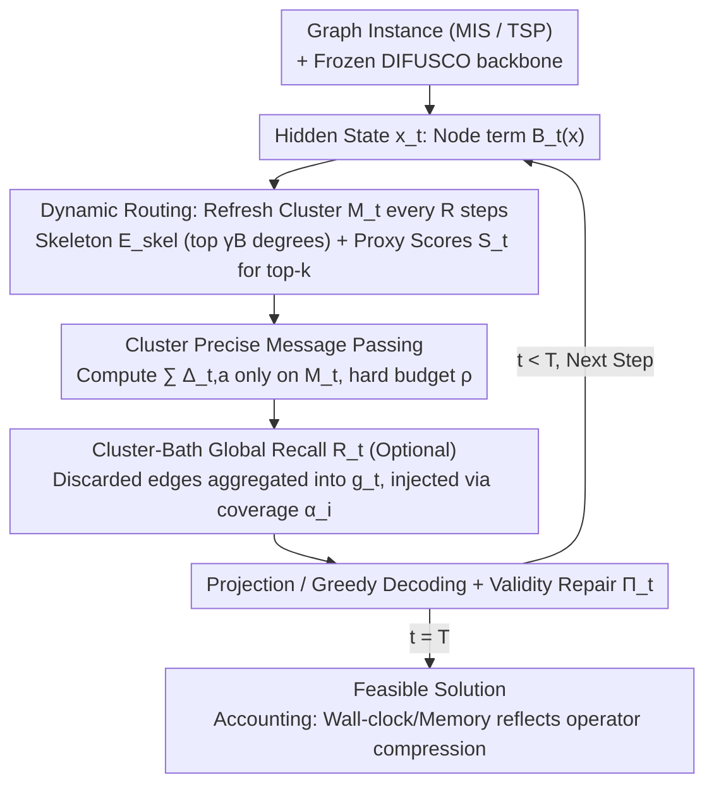

# LoRe: Adaptive Interaction-Evaluation Routing with Per-Step Interaction Budgets for Iterative Graph Solvers

**Conference**: ICML 2026  
**arXiv**: [2605.29005](https://arxiv.org/abs/2605.29005)  
**Code**: TBD  
**Area**: Combinatorial Optimization / Diffusion Neural Solvers / Inference Acceleration  
**Keywords**: Per-step interaction budget, dynamic routing, Cluster-Bath decomposition, training-free, MIS/TSP

## TL;DR
LoRe adapts the "Cluster + Bath" decomposition from condensed matter physics into a training-free inference-time wrapper for diffusion-based graph combinatorial optimization solvers. By evaluating only a fixed proportion of high-conflict edges per step and compensating for the discarded components with an $\mathcal{O}(N)$ global recall term, it enables MIS solvers to exceed the baseline OOM limit by $3\times$ (executing $n=50\mathrm{k}$ instances on a single GPU) and achieves $\sim 15\times$ speedup with $44\times$ memory compression on TSP $n=1000$.

## Background & Motivation

**Background**: Diffusion and GNN-based neural solvers, such as DIFUSCO, DiffUCO, T2TCO, and COExpander, treat combinatorial optimization (CO) problems like Maximum Independent Set (MIS) or TSP as iterative denoising processes on graphs. These solvers resolve conflicts by repeatedly performing message passing over a dense interaction set $\mathcal{A}$ (e.g., all edges for MIS or candidate moves for TSP), which is the dominant approach for learnable CO solvers.

**Limitations of Prior Work**: The computational cost of these solvers is $\mathcal{O}(T|\mathcal{A}|)$, and the **peak memory per step scales linearly with $|\mathcal{A}|$**. On industrial-scale instances ($n \ge 20\mathrm{k}$ for ER graphs or $n \ge 500$ for dense TSP), single-step dense message passing often hits GPU limits, causing OOM or unacceptable latency. Competitive "anytime" scenarios, such as scheduling or network allocation, require feasible solutions within strict latency and memory budgets.

**Key Challenge**: Reducing the number of steps $T$ (e.g., via distillation or Fast-T2T) **does not lower the single-step peak memory**. Static spatial sparsification (e.g., fixed kNN candidate graphs or fixed masks) can reduce single-step overhead, but "conflict hotspots" in CO solving drift along the trajectory. If a critical edge for the current step is permanently pruned, truncation errors accumulate, causing the trajectory to deviate significantly. Consequently, **single-step budget constraints** and **drifting support sets** must be addressed simultaneously.

**Goal**: Incorporate a hard constraint of "evaluating only a fixed proportion $\rho$ of $|\mathcal{A}|$ per step" into the solver loop while ensuring: (a) no backbone retraining, (b) no loss in solution quality, and (c) end-to-end wall-clock auditability throughout the pipeline.

**Key Insight**: This dilemma is structurally isomorphic to multi-body problems in strongly correlated condensed matter physics. Cluster Dynamical Mean-Field Theory (C-DMFT) decomposes infinite lattice interactions into an "exactly solved local cluster" and an "approximately compensated mean-field bath." CO solving naturally exhibits clusters (high-conflict neighborhoods) and baths (stable background relationships), allowing for the adoption of this algorithmic blueprint.

**Core Idea**: A time-varying subset $M_t \subseteq \mathcal{A}$ is used as the cluster for precise edge message passing, while an $\mathcal{O}(N)$ coverage-weighted global signal serves as the bath to compensate for discarded edges. **Hotspots are dynamically tracked using proxy scores refreshed every $R$ steps.**

## Method

### Overall Architecture
The iterative solver is formalized as a discrete dynamical system $x^{t+1} = \Pi_t\big(\mathcal{T}_t(x^t; \mathcal{A})\big)$, where $x^t \in \mathbb{R}^{n \times d}$ represents the hidden state of $n$ variables, $\Pi_t$ is a lightweight projection/repair/decoding operator, and $\mathcal{T}_t$ is the main message passing operator. $\mathcal{T}_t$ can be decomposed into a node term $\mathcal{B}_t(x)$ and an edge interaction term $\sum_{a \in \mathcal{A}} \Delta_{t,a}(x)$. LoRe keeps the backbone parameters and total steps $T$ unchanged, replacing the second term with a budget-constrained version $\tilde{\mathcal{T}}_t(x; M_t, g_t) = \mathcal{B}_t(x) + \sum_{a \in M_t} \Delta_{t,a}(x) + \mathcal{R}_t(x; g_t)$, subject to $|M_t| \le B = \lfloor \rho |\mathcal{A}| \rfloor$. The pipeline consists of three components: dynamic routing to select $M_t$, an optional global recall $\mathcal{R}_t$, and a shared projection/greedy decoding $\Pi_t$.

### Key Designs

**1. Dynamic Routing (Cluster Selection): Tracking Drifting Hotspots via Periodic Proxy Scores**

Static kNN or fixed masks fail because they lock the support set, while CO conflict hotspots drift along the diffusion trajectory. LoRe selects the cluster $M_t$ in two parts: a fixed small skeleton $E_{\mathrm{skel}}$ consisting of the top $\lfloor\gamma B\rfloor$ edges by degree $\deg(i)+\deg(j)$ to ensure structurally critical edges are always included; the remaining budget is allocated via a proxy score $S_t$ on $E\setminus E_{\mathrm{skel}}$. For MIS, the score combines node uncertainty and temporal instability:

$$S_t\big((i,j); x^t, x_{\text{prev}}\big)=u_i u_j+\lambda_{\mathrm{stab}}\big(|x^t_i-x_{\text{prev},i}|+|x^t_j-x_{\text{prev},j}|\big),$$

where node uncertainty $u_i=1-|2x^t_i-1|$ peaks at $x^t_i=1/2$ and approaches 0 for decided nodes. To amortize overhead, $M_t$ is only reselected every $R$ steps. This mechanism focuses the hard budget $B=\lfloor\rho|\mathcal{A}|\rfloor$ on "unresolved trouble spots" while bypassing stable edges.

**2. Cluster-Bath Global Recall (Optional): Compensating Discarded Edges with an $\mathcal{O}(N)$ Background Field**

Pure routing may lose context under ultra-low budgets. LoRe borrows the "bath" concept from C-DMFT to add a cheap compensation term. It aggregates a global signal $g_t=\text{Pool}_t(x^t;\mathcal{A}\setminus M_t)$ from excluded interactions and injects it back via coverage interpolation: $U_t([x^t,g_t])_i=\alpha_i x^t_i+(1-\alpha_i)g_{t,i}$, where $\alpha_i=d_i(M_t)/d_i(\mathcal{A})$ is the ratio of precisely evaluated neighbors for node $i$. This requires no training and merely caches one extra tensor.

**3. Auditable End-to-End Accounting: Isolating Efficiency Gains to Interaction Compression**

Acceleration papers often "inflate" gains by ignoring post-processing overhead. LoRe uses a strict accounting protocol: all variants (baseline, static, LoRe) share the same DIFUSCO implementation, greedy decoding, and validity repairs (e.g., standard 2-opt for TSP). LoRe only modifies the active interaction set $M_t$, so the wall-clock and memory ratios reflect the efficiency gains of operator compression directly and exclusively.

### Loss & Training
LoRe is an inference-time wrapper and **requires no changes to the training process**. It uses pre-trained weights from DIFUSCO or COExpander. The hyperparameters include the budget ratio $\rho$, skeleton ratio $\gamma$, refresh interval $R$, and stability coefficient $\lambda_{\mathrm{stab}}$.

## Key Experimental Results

### Main Results
Hardware: NVIDIA RTX PRO 6000 (96 GB). All timings include decoding and repair. MIS on ER graphs ($p=0.05$):

| Task | Scale $n$ | Time LoRe/Base (s) | Memory LoRe/Base (GB) | Mem. Compression | Speedup $\times$ | Quality Retention |
|------|--------|--------------------|---------------------|----------|---------------|------------|
| MIS  | 1k     | 7.9 / 17.3         | 0.07 / 0.42         | 5.7$\times$ | 2.19±0.03    | 0.815±0.048 |
| MIS  | 3k     | 18.6 / 149         | 0.35 / 3.51         | 10.0$\times$ | 8.03±0.03   | 0.835±0.017 |
| MIS  | 8k     | 124 / 1030         | 2.15 / 24.7         | 11.5$\times$ | 8.28±0.12   | 1.019±0.014 |
| MIS  | 15k    | 442 / 3604         | 7.32 / 86.7         | 11.9$\times$ | 8.16±0.04   | 1.010±0.013 |
| MIS  | 20k    | 767 / **OOM**      | 12.9 / **OOM**      | –           | –             | – |
| MIS  | 50k    | 4949 / **OOM**     | 79.5 / **OOM**      | –           | –             | – |
| TSP  | 500    | 0.72 / 3.61        | 0.05 / 1.23         | 24.6$\times$ | 5.10±0.39   | 0.953±0.014 |

The baseline hits OOM at $n=20\mathrm{k}$, while LoRe scales to $n=50\mathrm{k}$ with only 79.5 GB peak memory, extending the inference boundary by $\ge 3\times$. For $n \ge 5\mathrm{k}$, the quality ratio exceeds 1, suggesting dynamic budgets stabilize large-scale trajectories.

### Ablation Study

| Config | Key Observation | Explanation |
|------|---------|------|
| LoRe vs static kNN (same budget $\rho$) | LoRe is strictly better across all $n$ | Static support misses drifting hotspots, accumulating error. |
| LoRe vs static + greedy refresh | LoRe remains superior | Greedy refresh without uncertainty scores is insufficient. |
| Without global recall | Performance remains stable | Pure routing is often sufficient; recall is an insurance for ultra-low $\rho$. |
| TSP Topology Transfer | Transfer quality matches baseline | State-based edge selection is naturally robust to distribution shifts. |

### Key Findings
- **Dynamic > Static** is strictly validated under matched budgets, explaining why neural CO solvers cannot simply adopt static candidate strategies like those in LK.
- **Quality Improvement at large $n$**: Likely because dense evaluation at high scales overfits to noise; LoRe's budget constraint acts as an implicit regularizer.

## Highlights & Insights
- **Physics Analogy to Engineering Blueprint**: The authors leverage the C-DMFT pattern of "local precision + global approximation" directly into a three-part algorithm.
- **Auditable end-to-end accounting** enables apples-to-apples comparisons, a necessary standard for CO acceleration research.
- **Engineering Value**: As a drop-in wrapper, it extends OOM boundaries by 3 times without retraining or modifying checkpoints, offering a "free lunch" for deployment.

## Limitations & Future Work
- The acceleration results are primarily validated under the DIFUSCO framework; broader evidence for non-diffusion GNN solvers is needed.
- Proxy scores $S_t$ are task-oriented (manually designed for MIS/TSP); other problems (e.g., MaxCut, SAT) would requires re-tuning.
- Error bounds rely on informal local Lipschitz assumptions rather than formal theorems for specific graph families.

## Related Work & Insights
- **vs DIFUSCO / DiffUCO**: LoRe acts as a wrapper for these backbones, advocating for "smarter inference" over retraining.
- **vs Fast-T2T / Distillation**: These methods reduce steps $T$, while LoRe reduces per-step operators. They are orthogonal and stackable.
- **vs Static Sparsification**: The core difference is **time-varying vs permanent** decisions. LoRe defers pruning decisions to runtime via budgets.

## Rating
- Novelty: ⭐⭐⭐⭐ 
- Experimental Thoroughness: ⭐⭐⭐⭐ 
- Writing Quality: ⭐⭐⭐⭐ 
- Value: ⭐⭐⭐⭐

<!-- RELATED:START -->

## Related Papers

- [\[ICML 2026\] On the Interaction of Batch Noise, Adaptivity, and Compression, under $(L_0,L_1)$-Smoothness: An SDE Approach](on_the_interaction_of_batch_noise_adaptivity_and_compression_under_l_0l_1-smooth.md)
- [\[ICLR 2026\] Beyond the Heatmap: A Rigorous Evaluation of Component Impact in MCTS-Based TSP Solvers](../../ICLR2026/optimization/beyond_the_heatmap_a_rigorous_evaluation_of_component_impact_in_mcts-based_tsp_s.md)
- [\[ICML 2026\] Adaptive Sharpness-Aware Minimization with a Polyak-type Step size: A Theory-Grounded Scheduler](adaptive_sharpness-aware_minimization_with_a_polyak-type_step_size_a_theory-grou.md)
- [\[ICLR 2026\] FrontierCO: Real-World and Large-Scale Evaluation of Machine Learning Solvers for Combinatorial Optimization](../../ICLR2026/optimization/frontierco_real-world_and_large-scale_evaluation_of_machine_learning_solvers_for.md)
- [\[ICML 2026\] URS: Unified Neural Routing Solver](urs_a_unified_neural_routing_solver_for_cross-problem_zero-shot_generalization.md)

<!-- RELATED:END -->
## Related Papers

- [\[ICML 2026\] On the Interaction of Batch Noise, Adaptivity, and Compression, under $(L_0,L_1)$-Smoothness: An SDE Approach](on_the_interaction_of_batch_noise_adaptivity_and_compression_under_l_0l_1-smooth.md)
- [\[ICML 2026\] Adaptive Sharpness-Aware Minimization with a Polyak-type Step size: A Theory-Grounded Scheduler](adaptive_sharpness-aware_minimization_with_a_polyak-type_step_size_a_theory-grou.md)
- [\[ICLR 2026\] FrontierCO: Real-World and Large-Scale Evaluation of Machine Learning Solvers for Combinatorial Optimization](../../ICLR2026/optimization/frontierco_real-world_and_large-scale_evaluation_of_machine_learning_solvers_for.md)
- [\[ICLR 2026\] Beyond the Heatmap: A Rigorous Evaluation of Component Impact in MCTS-Based TSP Solvers](../../ICLR2026/optimization/beyond_the_heatmap_a_rigorous_evaluation_of_component_impact_in_mcts-based_tsp_s.md)
- [\[ICML 2026\] Distribution-Free Uncertainty Quantification for Continuous AI Agent Evaluation](distribution-free_uncertainty_quantification_for_continuous_ai_agent_evaluation.md)

<!-- RELATED:END -->
