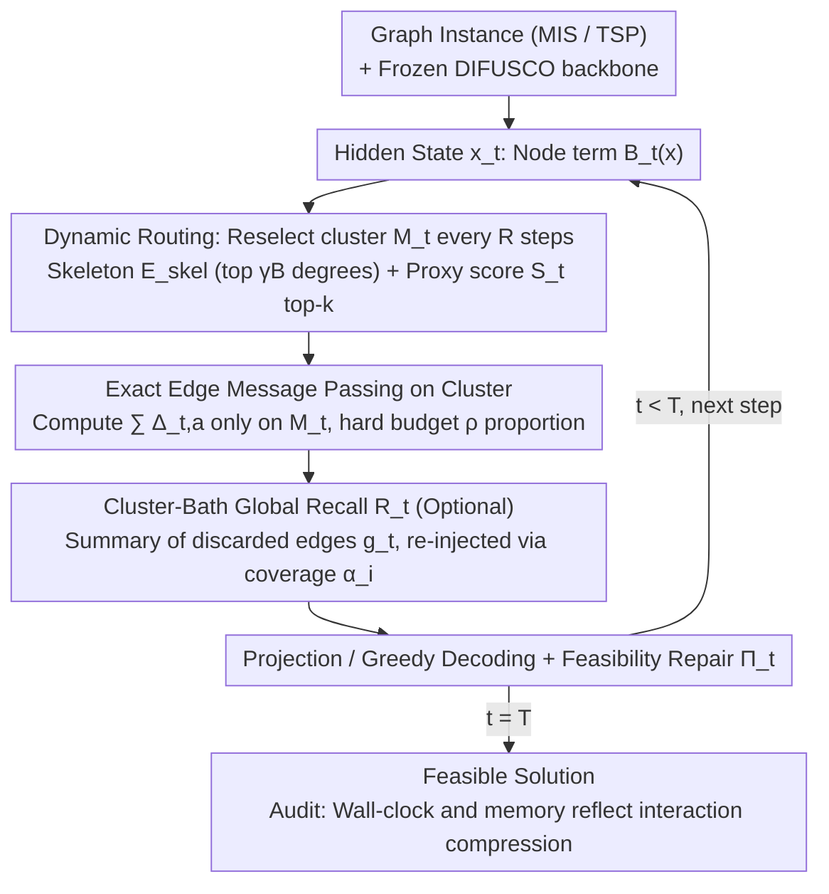

# LoRe: Adaptive Interaction-Evaluation Routing with Per-Step Interaction Budgets for Iterative Graph Solvers

**Conference**: ICML 2026  
**arXiv**: [2605.29005](https://arxiv.org/abs/2605.29005)  
**Code**: To be confirmed  
**Area**: Combinatorial Optimization / Diffusion Neural Solvers / Inference Acceleration  
**Keywords**: Per-step Interaction Budget, Dynamic Routing, Cluster-Bath Decomposition, Training-free, MIS/TSP

## TL;DR
LoRe applies the "Cluster + Bath" decomposition from condensed matter physics to diffusion-based graph combinatorial optimization solvers as a training-free inference wrapper. By evaluating a fixed proportion of high-conflict edges per step and compensating for the discarded parts with an $\mathcal{O}(N)$ global recall term, it enables MIS solvers to exceed baseline OOM limits by $3\times$ (running $n=50\mathrm{k}$ instances on a single card) and achieves $\sim 15\times$ speedup with $44\times$ memory compression on TSP $n=1000$.

## Background & Motivation

**Background**: Diffusion and GNN-based solvers like DIFUSCO, DiffUCO, T2TCO, and COExpander treat Combinatorial Optimization (CO) problems (e.g., Maximum Independent Set, TSP) as iterative denoising processes on graphs. They repeatedly perform message passing over dense interaction sets $\mathcal{A}$ (all edges for MIS, candidate moves for TSP) to resolve conflicts, which is the mainstream approach for learnable CO solvers.

**Limitations of Prior Work**: The cost of these solvers is $\mathcal{O}(T|\mathcal{A}|)$, and the **peak memory per step is linearly related to $|\mathcal{A}|$**. On industrial-scale instances ($n \ge 20\mathrm{k}$ for ER graphs, or $n \ge 500$ for dense TSP), single-step dense message passing hits GPU limits, causing either OOM or unacceptable latency. "Anytime" scenarios like scheduling and network allocation require feasible solutions within fixed latency and memory budgets.

**Key Challenge**: Reducing the number of steps (e.g., distillation, Fast-T2T) only modifies $T$ and **fails to reduce peak memory per step**. Static spatial sparsification (fixed kNN candidate graphs, fixed masks) can compress single-step overhead, but "conflict hotspots" in CO solving drift along the trajectory. If a critical edge for the current step is permanently pruned, truncation errors accumulate, leading to trajectory deviation. In other words, **per-step budget constraints** and **support set drifting** must be addressed simultaneously.

**Goal**: Integrate "evaluating only a fixed proportion $\rho$ of $|\mathcal{A}|$ per step" as a hard constraint into the solver loop while ensuring: (a) no retraining of the backbone, (b) no loss in solution quality, and (c) fully auditable end-to-end wall-clock time.

**Key Insight**: The authors observe that this dilemma is structurally isomorphic to multi-body problems in strongly correlated systems. Cluster Dynamical Mean-Field Theory (C-DMFT) decomposes infinite lattice interactions into an "exactly solved local cluster" and an "approximate mean-field bath." CO solving naturally possesses clusters (high-conflict neighborhoods) and baths (stable background relationships), allowing for the adoption of this algorithmic blueprint.

**Core Idea**: A time-varying subset $M_t \subseteq \mathcal{A}$ is used as the cluster for exact edge message passing, while a coverage-weighted global signal of $\mathcal{O}(N)$ serves as the bath to compensate for discarded edges. **Drifting hotspots are dynamically tracked via proxy scores refreshed every $R$ steps.**

## Method

### Overall Architecture
The iterative solver is formalized as a discrete dynamical system $x^{t+1} = \Pi_t\big(\mathcal{T}_t(x^t; \mathcal{A})\big)$, where $x^t \in \mathbb{R}^{n \times d}$ is the hidden state of $n$ variables, $\Pi_t$ represents lightweight projection/repair/decoding, and $\mathcal{T}_t$ is the main message passing operator. $\mathcal{T}_t$ can be decomposed into node terms $\mathcal{B}_t(x)$ and edge interaction terms $\sum_{a \in \mathcal{A}} \Delta_{t,a}(x)$. LoRe keeps the backbone parameters and total steps $T$ unchanged, replacing the interaction term with a budget-constrained version $\tilde{\mathcal{T}}_t(x; M_t, g_t) = \mathcal{B}_t(x) + \sum_{a \in M_t} \Delta_{t,a}(x) + \mathcal{R}_t(x; g_t)$, subject to $|M_t| \le B = \lfloor \rho |\mathcal{A}| \rfloor$. The pipeline consists of three components: dynamic routing for selecting $M_t$, optional global recall $\mathcal{R}_t$, and shared projection/greedy decoding $\Pi_t$. Since all variants use the same DIFUSCO checkpoint and $\Pi_t$, the reported end-to-end acceleration stems entirely from the compression of the interaction operator.

### Key Designs

**1. Dynamic Routing (Cluster Selection): Tracking drifting hotspots with proxy scores refreshed every $R$ steps**

The fatal flaw of static kNN or fixed masks is that they freeze the support set. Since conflict hotspots in CO solutions drift along the diffusion trajectory, permanently pruning a currently critical edge leads to accumulated truncation error. LoRe selects the cluster $M_t$ from two parts: a fixed small skeleton $E_{\mathrm{skel}}$ consisting of the top $\lfloor\gamma B\rfloor$ edges by degree $\deg(i)+\deg(j)$ for structural stability, and the remaining budget allocated to edges in $E\setminus E_{\mathrm{skel}}$ based on the top-$(B-|E_{\mathrm{skel}}|)$ proxy scores $S_t$. The scoring for MIS combines "node uncertainty" and "temporal instability":

$$S_t\big((i,j); x^t, x_{\text{prev}}\big)=u_i u_j+\lambda_{\mathrm{stab}}\big(|x^t_i-x_{\text{prev},i}|+|x^t_j-x_{\text{prev},j}|\big),$$

where node uncertainty $u_i=1-|2x^t_i-1|$ peaks at $x^t_i=1/2$ (most undecided) and approaches 0 for decided nodes. To amortize scoring overhead, $M_t$ is reselected only every $R$ steps. This locks onto "unstable troublesome regions" while releasing stable edges, focusing the hard budget $B=\lfloor\rho|\mathcal{A}|\rfloor$ where it matters most—a key mechanism for the "dynamic > static" advantage.

**2. Cluster-Bath Global Recall (Optional Stabilizer): Compensating discarded edges with an $\mathcal{O}(N)$ background field**

Pure routing under ultra-low budgets can lose context; interactions in $\mathcal{A}\setminus M_t$ are ignored, isolating the cluster subgraph and causing trajectory drift. LoRe borrows the "bath" concept from C-DMFT by adding a cheap compensation term: global signals are aggregated from discarded interactions $g_t=\text{Pool}_t(x^t;\mathcal{A}\setminus M_t)$ and re-injected into each node via coverage-based interpolation: $U_t([x^t,g_t])_i=\alpha_i x^t_i+(1-\alpha_i)g_{t,i}$. Here, $\alpha_i=d_i(M_t)/d_i(\mathcal{A})$ is the proportion of incident edges for node $i$ that were exactly evaluated. Higher precision coverage leads to higher confidence in the local state, while lower coverage relies more on the background field. This requires no training and minimal extra memory, effectively suppressing the bath residual $\|r_t\|$ in the error bound at low $\rho$.

**3. Auditable End-to-End Accounting Protocol: Isolating speedup to interaction operator compression**

Acceleration papers often hide overhead in post-processing. LoRe treats the accounting protocol as a design element: all variants (baseline, static sparse, LoRe) share the same DIFUSCO implementation and the same greedy decoding + feasibility repair (including standard 2-opt for TSP). LoRe only modifies the per-step active interaction set $M_t$. Consequently, wall-clock and memory ratios (base/LoRe) directly and exclusively reflect the gains from interaction compression. An informal error bound $e_{t+1}\le L_t e_t+\|\delta_t\|$ is provided, where $\|\delta_t\|\le\epsilon_t(\rho)+\|r_t\|$. Since high-impact edges are prioritized, routing ensures $\epsilon_t(\rho)$ remains small, preventing exploded cumulative error. Standardized accounting makes comparisons apples-to-apples.

### Loss & Training
LoRe is an inference-time wrapper and **does not modify the training process**. It uses pre-trained weights from original DIFUSCO/COExpander models. Hyperparameters include budget ratio $\rho$, skeleton ratio $\gamma$, refresh interval $R$, and stability coefficient $\lambda_{\mathrm{stab}}$. All experiments used a single set of default, untuned configurations.

## Key Experimental Results

### Main Results
Hardware: NVIDIA RTX PRO 6000 (96 GB). All timings include decoding and repair. Scale expansion for MIS on ER graphs ($p=0.05$):

| Task | Scale $n$ | Time LoRe/base (s) | Memory LoRe/base (GB) | Mem. Comp. | Speedup $\times$ | Quality Retention |
|------|--------|--------------------|---------------------|----------|---------------|------------|
| MIS  | 1k     | 7.9 / 17.3         | 0.07 / 0.42         | 5.7$\times$ | 2.19±0.03    | 0.815±0.048 |
| MIS  | 3k     | 18.6 / 149         | 0.35 / 3.51         | 10.0$\times$ | 8.03±0.03   | 0.835±0.017 |
| MIS  | 8k     | 124 / 1030         | 2.15 / 24.7         | 11.5$\times$ | 8.28±0.12   | 1.019±0.014 |
| MIS  | 15k    | 442 / 3604         | 7.32 / 86.7         | 11.9$\times$ | 8.16±0.04   | 1.010±0.013 |
| MIS  | 20k    | 767 / **OOM**      | 12.9 / **OOM**      | –           | –             | – |
| MIS  | 50k    | 4949 / **OOM**     | 79.5 / **OOM**      | –           | –             | – |
| TSP  | 500    | 0.72 / 3.61        | 0.05 / 1.23         | 24.6$\times$ | 5.10±0.39   | 0.953±0.014 |

The baseline OOMs at $n=20\mathrm{k}$, while LoRe scales to $n=50\mathrm{k}$ with a peak memory of only 79.5 GB, extending the feasible inference boundary by $\ge 3\times$. For $n \ge 5\mathrm{k}$, quality retention exceeds 1, suggesting that dynamic budgets stabilize trajectories at large scales.

### Ablation Study

| Configuration | Key Observation | Mechanism |
|------|---------|------|
| LoRe vs static kNN (same budget $\rho$) | LoRe is strictly better across all $n$ | Static support misses drifting hotspots; truncation error accumulates |
| LoRe vs static + greedy refresh | LoRe still outperforms | Greedy refresh without uncertainty/instability scoring is insufficient |
| Disable Global Recall (Default) | Main performance stable | Routing alone is often sufficient; recall is an insurance for ultra-low $\rho$ |
| TSP Topology Transfer (Zero-shot) | Tour quality comparable to baseline | Routing selects edges based on state, naturally robust to distribution shift |

### Key Findings
- **Dynamic > Static** is strictly verified under matched budgets. This is the paper's core message, explaining why neural CO cannot simply copy LK's fixed candidate edge approach.
- **Quality ratio exceeds 1 for large $n$**: Likely because dense evaluation overfits to noise on large graphs; LoRe's budget constraint acts as an implicit regularizer.
- **Hyperparameter robustness**: A single untuned configuration handles both MIS and TSP, making the approach deployment-friendly.

## Highlights & Insights
- **Physics analogy as an engineering blueprint**: The authors state LoRe is not mathematically equivalent to quantum systems but borrows the "local exact + global approx" decision pattern of C-DMFT. The analogy directly maps to the algorithm's three components.
- **Auditable end-to-end accounting** is a best-practice contribution. All CO acceleration works should report data this way; otherwise, speedup ratios are not comparable.
- **Engineering value of a drop-in wrapper**: Extending the OOM boundary by 3x without changing checkpoints or horizons is almost a "free lunch" for deployed CO services (e.g., real-time scheduling).

## Limitations & Future Work
- Acceleration results were primarily verified on DIFUSCO-like systems; although transfer to T2TCO/COExpander was shown, broader verification on RL-based or non-diffusion GNN solvers is needed.
- Proxy scores $S_t$ are task-specific (manually designed for MIS/TSP). Other problems with different constraint structures (e.g., MaxCut, SAT) would require re-tuning.
- Error bounds are informal and based on local Lipschitz assumptions; formal theorems for specific graph families where $\epsilon_t(\rho)$ is controllable are noted for future work.
- The actual gain of the Global Recall term $\mathcal{R}_t$ at ultra-low $\rho$ is only briefly mentioned in the appendix and not fully highlighted in the main tables.

## Related Work & Insights
- **vs DIFUSCO / DiffUCO / Sanokowski et al.**: This work serves as a runtime routing layer atop these backbones rather than a replacement.
- **vs Fast-T2T / Distillation**: Those methods compress total steps $T$, while LoRe compresses the per-step operator. The approaches are orthogonal and stackable.
- **vs Static Sparsification (Candidate graphs / Fixed masks / LK-edges)**: The core difference is **time-varying vs. permanent**. Permanent pruning loses drifting hotspots; LoRe postpones the decision to runtime via dynamic scoring.
- **vs LNS / Destroy-repair cycles**: LNS treats "re-optimizing neighborhoods" as an outer procedure, whereas LoRe embeds budget constraints deeper into every step of the solver's inner loop.

## Rating
- Novelty: ⭐⭐⭐⭐ Systematizing C-DMFT concepts for neural CO solvers is novel. Technical components (top-k + coverage interpolation) are not radical but the combination is fresh.
- Experimental Thoroughness: ⭐⭐⭐⭐ MIS scale tested to OOM limits, TSP cross-scale/topology transfer, and thorough static/greedy ablations. Lacks transfer evidence for more diverse backbones.
- Writing Quality: ⭐⭐⭐⭐ Clear distinction between claims and intuition across error bounds and physics analogies. Highly rigorous for a CO paper.
- Value: ⭐⭐⭐⭐ Provides significant engineering benefits for deployed neural CO. Formally establishes the concept of "budget constraints at the solver operator level."

<!-- RELATED:START -->

## Related Papers

- [\[ICML 2026\] On the Interaction of Batch Noise, Adaptivity, and Compression, under $(L_0,L_1)$-Smoothness: An SDE Approach](on_the_interaction_of_batch_noise_adaptivity_and_compression_under_l_0l_1-smooth.md)
- [\[ICML 2026\] Adaptive Sharpness-Aware Minimization with a Polyak-type Step size: A Theory-Grounded Scheduler](adaptive_sharpness-aware_minimization_with_a_polyak-type_step_size_a_theory-grou.md)
- [\[ICLR 2026\] FrontierCO: Real-World and Large-Scale Evaluation of Machine Learning Solvers for Combinatorial Optimization](../../ICLR2026/optimization/frontierco_real-world_and_large-scale_evaluation_of_machine_learning_solvers_for.md)
- [\[ICML 2026\] Distribution-Free Uncertainty Quantification for Continuous AI Agent Evaluation](distribution-free_uncertainty_quantification_for_continuous_ai_agent_evaluation.md)
- [\[ICML 2026\] SPSsafe: Safeguarded Stochastic Polyak Step Sizes for Non-smooth Optimization](safeguarded_stochastic_polyak_step_sizes_for_non-smooth_optimization_robust_perf.md)

<!-- RELATED:END -->
