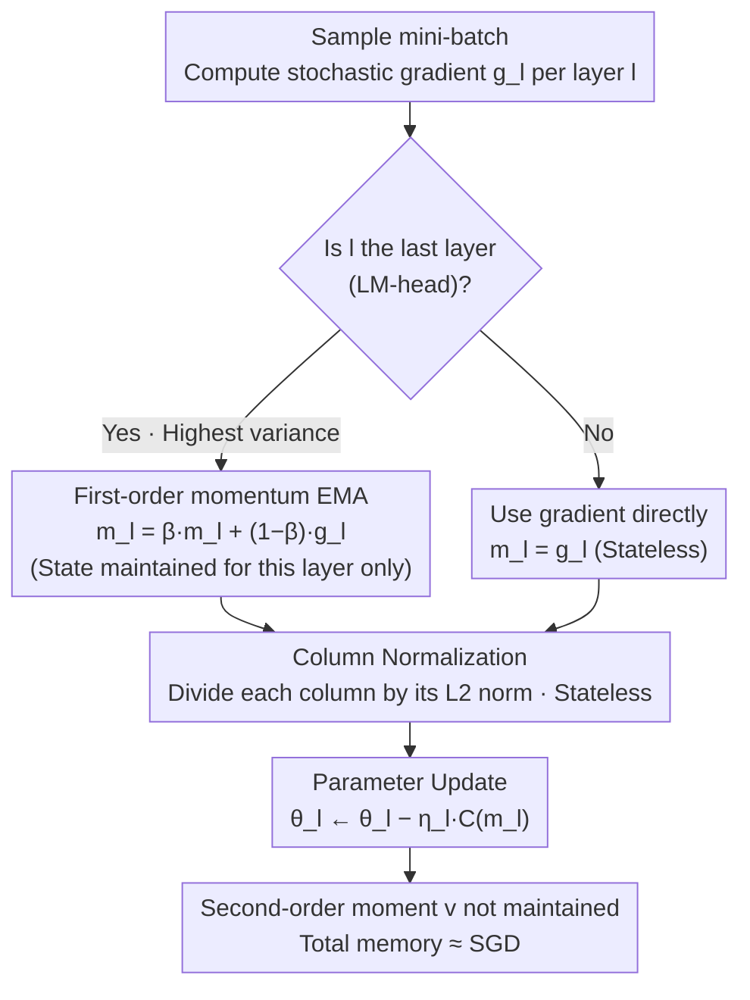

# Memory-Efficient LLM Pretraining via Minimalist Optimizer Design

**Conference**: ICML 2026  
**arXiv**: [2506.16659](https://arxiv.org/abs/2506.16659)  
**Code**: Available (See "Code is available at this link" at the end of the paper)  
**Area**: LLM Optimizers / Memory-Efficient Pretraining / Adam Alternative  
**Keywords**: Column Normalization, Last-layer Momentum, SCALE, Memory-Efficient, SGD vs Adam  

## TL;DR
By "deconstructing Adam from the bottom up," this paper identifies the only two essential components—per-column gradient normalization and first-order momentum restricted to the last layer—and combines them into the SCALE optimizer. SCALE achieves Adam-level or even superior pretraining perplexity (outperforming Muon/APOLLO) while using memory close to SGD (13.74 GB on LLaMA 7B).

## Background & Motivation

**Background**: Adam is the de facto default optimizer for LLM pretraining, but it maintains two states for every parameter: the first-order moment $m^t$ and the second-order moment $v^t$. This results in roughly triple the memory consumption of SGD—on a 7B model, Adam states occupy 40 GB. Three main routes have emerged to save this memory: (i) compressing states—Adafactor, SM3, CAME, GaLore (low-rank projection), Fira, APOLLO, APOLLO-Mini (rank-1); (ii) removing certain states entirely—Muon (only first-order momentum + Newton-Schulz orthogonalization), Scion, SWAN, SGD-SaI; (iii) block-level processing. These methods introduce various normalization schemes, momentum variants, and low-rank approximations, yet they lack a systematic deconstruction of which components are truly critical.

**Limitations of Prior Work**: (1) Vanilla SGD fails to converge on LLMs—Figure 2 verifies that SGD perplexity does not decrease on LLaMA 130M; (2) To maintain stability, many memory-efficient methods run Adam separately for the first layer (embedding) and last layer (LM-head). For 60M models, these two layers account for 50% of parameters, making "memory savings" negligible for small-to-medium models; (3) Various normalizations and momentum types are mixed arbitrarily without clarifying which is indispensable.

**Key Challenge**: There is a fundamental tension between "state compression to preserve all Adam behaviors" and "memory saving to retain only necessary components." The former inherently faces compression loss or extra computation, while the latter requires knowing which components can be discarded.

**Goal**: Systematically answer: what are the minimum modifications needed to elevate vanilla SGD to Adam-level performance using a "bottom-up minimalist" approach? The objective is to determine (a) the optimal gradient normalization (singular value / column / row / sign), (b) whether first-order momentum is necessary for every layer, and (c) if second-order momentum is necessary at all.

**Key Insight**: Adam is decomposed into two orthogonal components—the "normalization factor $v^t$" and "Exponential Moving Average (EMA)." Normalization requires no state, while EMA necessitates storing momentum. Therefore, the strategy is to first boost SGD using normalization and then add as little EMA as possible.

**Core Idea**: An optimizer sufficient for LLM pretraining only needs two things: column-wise gradient normalization according to the "output dimension" (stateless, near-constant time) and first-order momentum applied only to the last layer (which exhibits the highest gradient variance). Other layers run pure SGD, as second-order moments are entirely unnecessary.

## Method

### Overall Architecture

The design of SCALE (Stochastic Column-normalized Last-layer momEntum) stems from a three-step empirical chain. Step 1: Running SGD with various normalizations (Singular Value/NS, Column, Row, Sign) on LLaMA 60M/130M/350M revealed that Singular Value and Column normalization bring SGD close to Adam, while Row and Sign normalization perform poorly; analysis of LM-head gradient distribution showed that row normalization produces extremes as high as 150, destabilizing training. Step 2: Comparing which layer benefits most from momentum showed that the last layer (LM-head) has the highest gradient variance. A convergence theorem for multi-layer SGD-M proves that momentum should be applied to high-variance layers. Step 3: Synthesis. Column normalization (per-layer, stateless, constant time) + last-layer first-order momentum (minimal parameter ratio) consistently outperformed GaLore / Fira / APOLLO / APOLLO-Mini and matched Muon / Adam across LLaMA 60M-7B.

Mechanism: After each forward/backward pass, for each layer $l$: compute the mini-batch gradient $g_l^t$; if $l$ is the last layer, $m_l^t=\beta\,m_l^{t-1}+(1-\beta)g_l^t$, otherwise $m_l^t=g_l^t$ (stateless); update $\theta_l^{t+1}=\theta_l^t-\eta_l\,\mathcal{C}(m_l^t)$, where $\mathcal{C}$ is the column normalization operator.

### Key Designs

**1. Column Normalization as the Sole Normalization: Effective and Computationally Free**

Four normalizations (Singular Value, Column, Row, Sign) derived from steepest descent under different matrix norms were tested on LLaMA 60M/130M/350M. Sign (54.36/40.42/27.95) and Row normalization (79.27/37.67/21.63) were significantly worse than Adam (30.05/23.13/18.77). Column normalization (39.89/28.85/20.38) and Singular Value NS (34.15/25.25/18.73) both approached Adam. Regarding cost ($d=4096$), SVD takes 1958.66 ms and Newton-Schulz 14.41 ms, بينما Column normalization takes only 0.17 ms. The superiority of Column over Row is explained by the LM-head gradient: Row normalization magnifies token frequency differences (since $d_\text{model} \ll |V|$), causing divergence. Column normalization yields a smooth distribution and stable training. Column normalization divides each column of the weight matrix $G \in \mathbb{R}^{d_{in} \times d_{out}}$ by its $\ell_2$ norm without states. It is the optimal starting point for minimalist design.

**2. Last-layer First-order Momentum: Applying Momentum where Variance is Highest**

Since momentum is the only source of memory overhead (normalization is stateless), the question is where to store it. Using large batches (512) to approximate true gradients, measurements showed that the last layer's gradient variance is consistently the highest (Figure 4a), followed by the first embedding layer, while other layers are low. Theorem 2.1 provides the convergence rate for multi-layer SGD-M, where the variance term is:

$$\sum_l\left(\frac{1-\beta_l}{1+\beta_l}\cdot\frac{L\sqrt\gamma}{4\sqrt T}+\dots+\frac{1-\beta_l}{\beta_l^3}\cdot\frac{\gamma^2}{4LT}\right)\frac{\sigma_l^2}{\delta^2}$$

With per-layer $\beta_l$ and variance $\sigma_l^2$, the corollary is that applying large $\beta$ only to high-variance layers while setting $\beta=0$ elsewhere restores convergence and saves memory. Thus, only the LM-head maintains $m_L^t = \beta m_L^{t-1} + (1-\beta)g_L^t$. This layer accounts for only ~2% of parameters in LLaMA 7B. Experiments (Table 3) show perplexities of 30.81/22.57/16.32 for 60M/130M/350M, matching Adam and even surpassing it by 2.45 points at 350M. Figure 4b shows that stabilizing the noisiest source (LM-head) also reduces variance in the first layer.

**3. SCALE Minimalist Combination: Column Normalization + Last-layer Momentum**

The final optimizer combines these two: the last layer undergoes EMA then column normalization; all other layers use direct column normalization of gradients. No second-order moment $v^t$ or intermediate first-order moments are kept. Compared to Adam, it requires only a few lines of code and adds negligible memory (2% on 7B). Unlike SWAN (which uses two normalizations and Adam on LM-head), SCALE proves a single column normalization is sufficient. Unlike Scion (momentum for all layers), SCALE demonstrates that only the last layer is binary. On LLaMA 7B, SCALE uses 13.74 GB memory (vs Adam 40.43, Muon 26.95, APOLLO 16.14). Its perplexity (12.59) also beats Muon (12.72) and APOLLO (13.02).

### Loss & Training

LLaMA 60M-1B models were pretrained on C4 to Chinchilla-optimal token counts (1.4B-20B tokens). The 7B model was trained for 19.7B tokens (150K steps) and 100B tokens for stability testing on 8 NVIDIA H200 (141G) GPUs. Hyperparameters followed GaLore (Zhao et al., 2024).

## Key Experimental Results

### Main Results

| Model | Adam PPL / Memory | Muon | GaLore | APOLLO-Mini | **Ours (SCALE)** |
|------|-------------------|------|--------|-------------|-----------------|
| 60M  | 30.05 / 0.35G | 28.86 / 0.23G | 34.58 / 0.28G | 31.85 / 0.25G | **30.81 / 0.15G** |
| 130M | 23.13 / 0.81G | 22.20 / 0.54G | 25.31 / 0.61G | 23.63 / 0.46G | **22.57 / 0.32G** |
| 350M | 18.77 / 2.21G | 16.70 / 1.47G | 19.37 / 1.59G | 17.11 / 1.00G | **16.32 / 0.80G** |
| 1B   | 15.79 / 8.04G | 13.67 / 5.36G | 15.05 / 4.76G | 13.48 / 3.20G | **13.49 / 2.81G** |
| 7B   | -      | 12.72 / 26.95G | -     | 13.09 / 14.53G  | **12.59 / 13.74G** |

SCALE either achieves SOTA (350M/7B) or matches the strongest baselines with 35-65% less memory across all scales.

### Ablation Study

| Configuration | 60M / 130M / 350M PPL | Description |
|------|-----------------------|-------------|
| SGD + Sign Norm | 54.36 / 40.42 / 27.95 | Too coarse, inferior to Adam |
| SGD + Row Norm | 79.27 / 37.67 / 21.63 | LM-head gradients magnified to ~150, divergent |
| SGD + Singular Val (NS) | 34.15 / 25.25 / 18.73 | Good performance, but slower (14.41 ms) |
| SGD + **Column Norm** | 39.89 / 28.85 / 20.38 | Best trade-off of performance and speed |
| + Last-layer Mom (SCALE) | 30.81 / 22.57 / 16.32 | Matches or exceeds Adam |
| Adam (Baseline) | 30.05 / 23.13 / 18.77 | Full-state Adam |

### Key Findings
- The last layer is the optimization "choke point": The LM-head ($d_\text{model} \times |V|$) has high-frequency token columns with large gradient norms. This dictates the choice of normalization (Column > Row) and momentum allocation.
- Column normalization is "free" for all layers: Unlike SWAN's complex scheme, column normalization is universal and removes extra Adam overhead.
- Second-order moments are unnecessary for LLM pretraining: Scaling SCALE without $v^t$ matches Adam, validating that second-order moments are not vital and that even first-order moments only need to be per-layer.
- Column normalization reduces first-layer variance (Figure 4b), showing that stabilizing the noise source prevents error propagation downstream.

## Highlights & Insights
- **The "bottom-up" methodology is the primary contribution**: Instead of inventing a complex optimizer, the paper strips Adam to its Minimum Viable Product (MVP). This proves that much of the standard complexity is redundant.
- **Visual diagnosis of LM-head gradient distribution** is highly persuasive. Using histograms to explain why Row normalization fails transforms empirical observation into mechanistic understanding.
- **Theorem 2.1 provides theoretical backing for layered momentum**: It demonstrates that optimizer hyperparameters should be tuned per layer based on variance rather than using a global $\beta$.

## Limitations & Future Work
- Model scale is limited to 7B and tokens to 100B. Stability on larger scales (70B+) is unverified.
- Statistical significance is slightly weakened by lack of multi-seed runs on the 7B model.
- Direct comparison with the latest Muon variants (e.g., Muon-Clip) is missing.
- Column normalization assumes weight matrices are input × output; applicability to non-attention architectures (Mamba, MoE experts) needs further discussion.
- Whether post-training (SFT/RL) requires similar last-layer momentum is an open question.

## Related Work & Insights
- **vs GaLore/Fira/APOLLO**: These are "Adam compression" routes. SCALE is a "redesign" route that removes second-order moments and most momentum states, outperforming them in both memory and perplexity.
- **vs Muon**: Muon uses global first-order momentum and NS orthogonalization (expensive). SCALE uses column normalization (free) and last-layer momentum, using 51% of Muon's memory with better perplexity.
- **vs SWAN**: SWAN combines Row and Singular Value normalization with Adam on the first and last layers. SCALE shows this is redundant—Column normalization alone suffices.
- **vs Scion**: Scion uses layer-wise normalization with global momentum. SCALE suggests that restricting momentum based on variance is more efficient.
- **Impact**: SCALE provides a strong baseline for the community, proving that Adam-level performance is achievable with SGD-level memory.

## Rating
- Novelty: ⭐⭐⭐⭐ Refined application of existing components with a sharp "bottom-up" logic.
- Experimental Thoroughness: ⭐⭐⭐⭐ Broad scale (60M-7B), various normalizations, and 100B token stability.
- Writing Quality: ⭐⭐⭐⭐⭐ Extremely clear logical chain from motivation to theory.
- Value: ⭐⭐⭐⭐⭐ Establishes a new efficiency benchmark for LLM optimizers.

<!-- RELATED:START -->

## Related Papers

- [\[ICCV 2025\] Memory-Efficient 4-bit Preconditioned Stochastic Optimization](../../ICCV2025/optimization/memory-efficient_4-bit_preconditioned_stochastic_optimization.md)
- [\[ICML 2026\] Learning a Zeroth-Order Optimizer for Fine-Tuning LLMs](learning_a_zeroth-order_optimizer_for_fine-tuning_llms.md)
- [\[ICML 2026\] LiMuon: Light and Fast Muon Optimizer for Large Models](limuon_light_and_fast_muon_optimizer_for_large_models.md)
- [\[ICML 2026\] Enhancing LLM Training via Spectral Clipping](enhancing_llm_training_via_spectral_clipping.md)
- [\[CVPR 2026\] DP-FedAdamW: An Efficient Optimizer for Differentially Private Federated Large Models](../../CVPR2026/optimization/dp-fedadamw_an_efficient_optimizer_for_differentially_private_federated_large_mo.md)

<!-- RELATED:END -->
