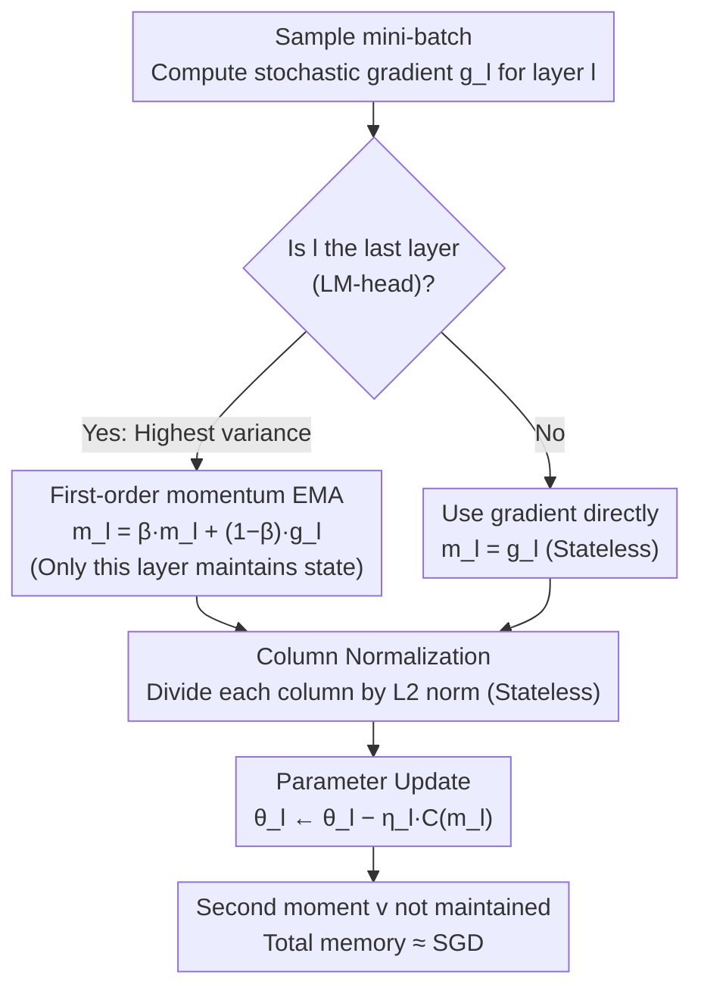

# Memory-Efficient LLM Pretraining via Minimalist Optimizer Design

**Conference**: ICML 2026  
**arXiv**: [2506.16659](https://arxiv.org/abs/2506.16659)  
**Code**: Available (See "Code is available at this link" at the end of the paper)  
**Area**: LLM Optimizer / Memory-Efficient Pretraining / Adam Alternatives  
**Keywords**: Column-normalization, last-layer momentum, SCALE, memory-efficient, SGD vs Adam  

## TL;DR
By "deconstructing Adam bottom-up," this paper identifies two truly essential components—per-column gradient normalization and first-order momentum restricted to the last layer—to compose the SCALE optimizer. SCALE achieves near-SGD memory (13.74 GB on LLaMA 7B) while matching Adam-level or even surpassing Muon/APOLLO in pretraining perplexity.

## Background & Motivation

**Background**: Adam is the de facto default optimizer for LLM pretraining, but it maintains two states for every parameter ($m^t$ and $v^t$), consuming approximately 3x the memory of SGD—on a 7B model, Adam states occupy 40 GB. To save memory, three directions have emerged: (i) State compression—Adafactor, SM3, CAME, GaLore (low-rank projection), Fira, APOLLO, APOLLO-Mini (rank-1); (ii) Complete removal of certain states—Muon (only first-order momentum + Newton-Schulz orthogonalization), Scion, SWAN, SGD-SaI; (iii) Block-wise processing. These methods introduce various normalization schemes, momentum variants, and low-rank approximations, but lack a systematic decomposition of which components are actually critical.

**Limitations of Prior Work**: (1) Vanilla SGD fails to converge on LLMs—Figure 2 verifies that SGD perplexity does not decrease on LLaMA 130M; (2) For stability, many memory-efficient methods run separate Adam optimizers for the embedding and LM-head layers. For a 60M model, these layers account for 50% of the parameters, nearly negating memory savings in small-to-midscale models; (3) Various normalizations and momentum types are mixed arbitrarily without clarifying which ones are indispensable.

**Key Challenge**: There is a fundamental tension between "state compression seeking to preserve all Adam behaviors" and "memory savings seeking to retain only necessary components." The former inherently carries compression loss or extra compute, while the latter requires knowing which components can be discarded.

**Goal**: Use a "bottom-up minimalist" approach to systematically answer: what are the minimum modifications needed to elevate vanilla SGD to Adam-level performance? The goal is to determine (a) which gradient normalization to use (singular value / column / row / sign), (b) whether first-order momentum is needed for every layer, and (c) if the second moment is actually necessary.

**Key Insight**: Adam can be split into two orthogonal components—the "normalization factor $v^t$" and the "Exponential Moving Average (EMA)." Since normalization requires no state but EMA requires storing momentum, the strategy is to first lift SGD performance via normalization and then add as little EMA as possible.

**Core Idea**: An optimizer sufficient for LLM pretraining only needs two things: column-wise gradient normalization according to the "output dimension" (stateless, near-constant time) and first-order momentum applied only to the last layer (where gradient variance is highest). Other layers run base SGD; the second moment is redundant.

## Method

### Overall Architecture

The SCALE (Stochastic Column-normalized Last-layer momEntum) design stems from a three-step empirical chain. First, testing SGD with various normalizations (singular value NS, column, row, sign) on LLaMA 60M/130M/350M revealed that singular value and column normalization bring SGD close to Adam, while row and sign normalization fail significantly. Analysis of LM-head gradient distributions showed row normalization creates extreme values (up to 150), destabilizing training. Second, comparing "where momentum yields the highest gain" empirically showed that the last layer (LM-head) has the highest gradient variance. A convergence theorem for multi-layer SGD-M proves that momentum should be applied to layers with high variance. Third, the combination: column normalization (all layers, stateless, fast) + last-layer first-order momentum (minimal parameter ratio) stably outperforms GaLore / Fira / APOLLO / APOLLO-Mini and matches Muon / Adam across LLaMA 60M-7B.

Pseudo-workflow: After each forward/backward pass for each layer $l$: compute mini-batch gradient $g_l^t$; if $l$ is the last layer, calculate $m_l^t=\beta\,m_l^{t-1}+(1-\beta)g_l^t$, otherwise $m_l^t=g_l^t$ (stateless); update $\theta_l^{t+1}=\theta_l^t-\eta_l\,\mathcal{C}(m_l^t)$, where $\mathcal{C}$ is the column-normalization operator.

### Key Designs

**1. Column Normalization as the Sole Normalization: Effective and Computationally Free**

Four normalizations (singular value, column, row, sign) were tested on LLaMA 60M/130M/350M. Sign (54.36/40.42/27.95) and Row (79.27/37.67/21.63) underperformed compared to Adam (30.05/23.13/18.77), while Column (39.89/28.85/20.38) and Singular Value NS (34.15/25.25/18.73) were close to Adam. Regarding cost at $d=4096$: SVD takes 1958.66 ms, Newton-Schulz takes 14.41 ms, and Column normalization takes only 0.17 ms. Column normalization outperforms row normalization because row operations amplify token frequency differences in the LM-head (where $d_\text{model} \ll |V|$), leading to divergence. Column normalization yields a smooth distribution and stable training by dividing each column of $G\in\mathbb{R}^{d_{in}\times d_{out}}$ by its $\ell_2$ norm without any state.

**2. Last-Layer Momentum Only: Stabilizing the Most Volatile Layer**

Momentum is the primary memory overhead (normalization is stateless). The authors measured gradient variance using large (512) and small (32) batches, finding that the last layer consistently maintains the highest variance throughout training (Figure 4a). Theorem 2.1 provides a convergence rate for multi-layer SGD-M, where the variance term is:

$$\sum_l\left(\frac{1-\beta_l}{1+\beta_l}\cdot\frac{L\sqrt\gamma}{4\sqrt T}+\dots+\frac{1-\beta_l}{\beta_l^3}\cdot\frac{\gamma^2}{4LT}\right)\frac{\sigma_l^2}{\delta^2}$$

The corollary suggests that applying high $\beta$ only to high-variance layers and $\beta=0$ elsewhere restores convergence while saving memory. Thus, only the LM-head maintains $m_L^t=\beta m_L^{t-1}+(1-\beta)g_L^t$. On LLaMA 7B, this layer is only ~2% of parameters. Experiments (Table 3) show this matches Adam and even outperforms it by 2.45 perplexity points on 350M models.

**3. Minimalist Combination SCALE: Column Norm + Last-Layer Momentum**

SCALE processes each layer independently: the last layer uses EMA then column normalization, while other layers use direct column normalization of gradients. It discards the second moment $v^t$ and intermediate first moments. Compared to Adam, memory is significantly reduced (7B model uses only 2% more memory than SGD). SCALE proves that redundant designs like multi-normalization (SWAN) or all-layer momentum (Scion) are unnecessary. On LLaMA 7B, SCALE memory is 13.74 GB (vs Adam 40.43, Muon 26.95), with 12.59 perplexity (vs Muon 12.72, APOLLO 13.02).

### Loss & Training

LLaMA 60M-1B models were pretrained on C4 to Chinchilla-optimal tokens (1.4B-20B). The 7B model was trained for 19.7B tokens (150K steps) and a 100B token stability test on 8x NVIDIA H200 141G. Hyperparameters followed GaLore (Zhao et al., 2024).

## Key Experimental Results

### Main Results

| Model | Adam (Ppl / Memory) | Muon | GaLore | APOLLO-Mini | **SCALE (Ours)** |
|------|------------------|------|--------|-------------|-----------------|
| 60M  | 30.05 / 0.35G | 28.86 / 0.23G | 34.58 / 0.28G | 31.85 / 0.25G | **30.81 / 0.15G** |
| 130M | 23.13 / 0.81G | 22.20 / 0.54G | 25.31 / 0.61G | 23.63 / 0.46G | **22.57 / 0.32G** |
| 350M | 18.77 / 2.21G | 16.70 / 1.47G | 19.37 / 1.59G | 17.11 / 1.00G | **16.32 / 0.80G** |
| 1B   | 15.79 / 8.04G | 13.67 / 5.36G | 15.05 / 4.76G | 13.48 / 3.20G | **13.49 / 2.81G** |
| 7B   | -      | 12.72 / 26.95G | -     | 13.09 / 14.53G  | **12.59 / 13.74G** |

SCALE either achieves SOTA or matches the strongest baselines with 35-65% less memory across all scales.

### Ablation Study

| Configuration | 60M / 130M / 350M Ppl | Description |
|------|--------------------------|------|
| SGD + sign normalization | 54.36 / 40.42 / 27.95 | Too coarse, significantly worse than Adam |
| SGD + row normalization | 79.27 / 37.67 / 21.63 | LM-head gradients amplified to 150; training diverges |
| SGD + singular value (NS) | 34.15 / 25.25 / 18.73 | Good performance but slow (14.41 ms vs 0.17 ms) |
| SGD + **column normalization** | 39.89 / 28.85 / 20.38 | Best trade-off between performance and speed |
| + Last-layer momentum (SCALE) | 30.81 / 22.57 / 16.32 | Matches or exceeds Adam |
| Adam (Baseline) | 30.05 / 23.13 / 18.77 | Full-state Adam |

### Key Findings
- The last layer is the optimization "bottleneck": The LM-head dimensions ($d_\text{model}\times |V|$) and high-frequency tokens dictate normalization choice (Column > Row) and momentum allocation.
- Column normalization is "free" for all layers: It generalizes across the network and eliminates Adam overhead in head/embedding layers.
- Second moments are unnecessary for LLM pretraining: SCALE matches Adam without $v^t$, validating Muon's direction while showing first-order moments are only needed for one layer.
- Stabilizing the noisy source (last layer) reduces variance in downstream layers (Figure 4b).

## Highlights & Insights
- **Methodology**: The "bottom-up deconstruction" is a major contribution, showing that much of Adam's complexity is redundant.
- **Diagnostic Visualization**: Visualizing LM-head gradient histograms explains why row normalization fails and column normalization succeeds, moving from empirical choice to mechanistic understanding.
- **Theoretical Grounding**: Theorem 2.1 justifies per-layer momentum based on variance rather than using a global $\beta$ for the entire network.

## Limitations & Future Work
- Model scale is capped at 7B and 100B tokens; stability at 70B+ scales remains unverified.
- Statistical significance is limited as 7B runs lacked multiple seeds; margin over Muon is small (0.13 ppl).
- Comparisons with the latest Muon-Clip or Scion full recipes are missing.
- Column normalization assumes weight matrices are input $\times$ output; applicability to non-attention architectures (Mamba, MoE) requires further discussion.
- Effectiveness in post-training (SFT/RL) is unexplored.

## Related Work & Insights
- **vs GaLore/Fira/APOLLO**: These "compress Adam" by projecting states. SCALE "redesigns" by removing states, outperforming them in both memory and perplexity.
- **vs Muon**: Muon uses global first-order momentum and expensive Newton-Schulz orthogonalization. SCALE uses column norm and last-layer momentum, using 51% of Muon's memory with better perplexity.
- **vs SWAN**: SCALE shows that SWAN's mixed normalization and separate Adam for head/embedding are redundant.
- **Future Impact**: SCALE sets a strong baseline demonstrating that Adam-level performance is achievable with SGD-level memory.

## Rating
- Novelty: ⭐⭐⭐⭐ Systematic deconstruction and LM-head diagnostics are highly insightful.
- Experimental Thoroughness: ⭐⭐⭐⭐ Broad scale coverage and variance analysis, though lacking multiple seeds for the largest model.
- Writing Quality: ⭐⭐⭐⭐⭐ Extremely clear logic from motivation to theory and algorithm.
- Value: ⭐⭐⭐⭐⭐ Provides a powerful baseline that will likely become the default comparison for LLM optimizers.

<!-- RELATED:START -->

## Related Papers

- [\[ICLR 2026\] Arbitrary-Order Block SignSGD for Memory-Efficient LLM Fine-Tuning](../../ICLR2026/optimization/arbitrary-order_block_signsgd_for_memory-efficient_llm_fine-tuning.md)
- [\[ICML 2026\] AdaGC: Enhancing LLM Pretraining Stability via Adaptive Gradient Clipping](adagc_enhancing_llm_pretraining_stability_via_adaptive_gradient_clipping.md)
- [\[ICML 2026\] Learning a Zeroth-Order Optimizer for Fine-Tuning LLMs](learning_a_zeroth-order_optimizer_for_fine-tuning_llms.md)
- [\[ICML 2026\] LiMuon: Light and Fast Muon Optimizer for Large Models](limuon_light_and_fast_muon_optimizer_for_large_models.md)
- [\[ICML 2026\] Enhancing LLM Training via Spectral Clipping](enhancing_llm_training_via_spectral_clipping.md)

<!-- RELATED:END -->
