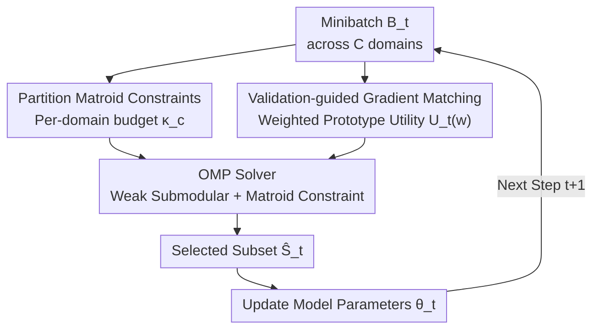

# Minibatch Selection via Partition Matroid Constrained Gradient Matching

**Conference**: ICML2026  
**arXiv**: [2606.07954](https://arxiv.org/abs/2606.07954)  
**Code**: Open sourced (as per the paper "Code is available here", link as per the original)  
**Area**: Optimization / Data Selection  
**Keywords**: minibatch selection, partition matroid, gradient matching, weak submodularity, data mixing

## TL;DR
PartitionSel models "cross-domain minibatch selection" as maximizing a **validation-guided weighted gradient matching utility** under **partition matroid constraints** (per-domain budgets). The authors prove that this objective is monotone and weak submodular, allowing it to be solved via Orthogonal Matching Pursuit (OMP) with approximation guarantees. This induces implicit data mixing at the batch level during every training step without training any proxy models, thereby reducing cross-domain redundancy and gradient conflicts.

## Background & Motivation
**Background**: Training LLMs with larger minibatches can accelerate convergence and improve performance, but it incurs significant memory overhead. Consequently, selecting a small subset of valuable samples within each minibatch has become popular for saving memory. Sample selection typically relies on influence functions, gradient matching (CRAIG, GradMatch, GREATS), or distribution matching.

**Limitations of Prior Work**: The problem becomes more difficult when training data spans multiple heterogeneous domains (e.g., mathematics + molecular instructions). Existing approaches follow two suboptimal paths: 1) **Independent per-domain selection**, which selects samples within each domain separately, ignoring redundancy across domains; 2) **Continuous domain weighting** (DoReMi, RegMix, CLIMB), which learns a set of continuous domain mixing weights, often requiring the **training of expensive proxy models** to predict downstream performance and ensuring the proxy faithfully mirrors the main model's optimization trajectory—a process that is both costly and unreliable in practice.

**Key Challenge**: "Independent selection" is simple but results in cross-domain redundancy and intra-batch gradient conflicts; "continuous mixing weights" are expressive but require extra proxy models and optimization loops. A middle-ground solution that enables **cross-domain coupling without proxy models** is missing.

**Goal**: To perform domain-aware sample selection at the batch level from a discrete combinatorial perspective—encoding domain-specific capacities directly as constraints and allowing samples from different domains to compete under a **unified utility**, rewarding both "alignment with domain signals" and "non-redundancy with other selected samples."

**Key Insight**: The authors observe that while the selection rule of GREATS is greedy, its objective is **non-monotone** (adding an element might decrease the objective value), and the original authors only conjectured its "possible" weak submodularity, lacking approximation guarantees. Assigning a **non-negative importance weight** to each sample can bridge this gap.

**Core Idea**: By encoding per-domain budgets using **partition matroid constraints** and adopting a **weighted prototype gradient matching utility**, the problem is transformed into a **monotone, weak submodular** maximization problem. This can be efficiently solved using OMP with approximation guarantees; GREATS is a special case where weights are restricted to binary values.

## Method

### Overall Architecture
In standard training, at each step $t$, the model receives a minibatch $B_t \subseteq D_{tr}$ and has access to a small validation set $D_{val}$. Data is distributed across $C$ domains, $B_t = \biguplus_{c=1}^{C} B_t^c$. Instead of learning global domain weights, PartitionSel locally optimizes the data mix at the batch level: at each step, it selects a subset $S_t$ from $B_t$ to maximize a time-varying utility $U_t(S)$ under **per-domain budgets** $\{\kappa_t^c\}$ (where $\sum_c \kappa_t^c = \kappa$):

$$\max_{S \subseteq B_t} U_t(S) \quad \text{s.t.} \quad |S \cap B_t^c| \le \kappa_t^c \;\; \forall c$$

This constraint **is exactly a partition matroid**—partitioning the ground set into disjoint blocks by domain, each with a capacity. The pipeline is a per-step loop: receive minibatch → set budgets per domain and construct the partition matroid → form the aggregate utility → solve for the support set using OMP under matroid constraints → update model parameters using the selected subset.

### Key Designs

**1. Partition Matroid Constraint: Turning per-domain budgets into natural combinatorial constraints to enable cross-domain competition under a single utility**

This directly addresses the issue where "independent per-domain selection leads to cross-domain redundancy." The authors encode the capacity of each domain $\kappa_t^c$ into a partition matroid $M_t = (B_t, I_t)$ over the ground set $B_t$, where the independent sets are $\{S : |S \cap B_t^c| \le \kappa_t^c \,\forall c\}$. The advantage is that the **budget is strictly enforced by matroid independence**, removing the need for explicit sparsity constraints on the weights $w$—since $S \in I(M_t)$ combined with $\text{supp}(w) \subseteq \bar{A}$ already forces $\|w_{B_t^c}\|_0 \le \kappa_t^c$. Thus, the combinatorial structure remains in the outer matroid selection, while the inner weight optimization is a clean convex problem. Budgets can be allocated proportionally to domain sizes $\kappa_t^c = \lfloor \kappa |B_t^c| / |B_t| \rceil$, inducing a data mix at the batch level without proxy models.

**2. Validation-guided Weighted Prototype Utility: Assigning non-negative weights to fix the objective from "non-monotone" to "monotone weak submodular"**

This is the theoretical anchor of the paper, addressing GREATS' "non-monotonicity and lack of guarantees." The utility measures "how much the validation loss decreases after one SGD step using the selected subset." For a single validation sample, the marginal gain is approximated via two first-order Taylor expansions:

$$\Delta U_t(z_i | S) \approx \eta_t \langle g_{\theta_t}(z_i), g_{\theta_t}(z_{val})\rangle - \eta_t^2 \langle g_{\theta_t}(z_i), H_{z_{val}}(\theta_t)\textstyle\sum_{z\in S} g_{\theta_t}(z)\rangle$$

The first term is the "importance score" (alignment with the validation signal); the second term is the Hessian-weighted similarity to already selected samples (subtracted to promote diversity). GREATS uses this marginal gain for greedy selection, but it **can be negative** (when a candidate gradient is near-orthogonal to the validation gradient but highly correlated with the selected set), leading to non-monotonicity. PartitionSel's key modification is introducing non-negative weights $w$ and expressing the utility in a weighted prototype form:

$$U_t(w) = \langle w, \mu_{\theta_t}\rangle - \tfrac{\eta_t}{2}\langle w, K_{\theta_t} w\rangle, \quad K_{\theta_t} = G_{\theta_t} G_{\theta_t}^\top$$

Where $G_{\theta_t}$ is the per-sample gradient matrix and $\mu_{\theta_t}$ includes the validation gradient term. The set utility $f(S)$ is defined as the maximum over $w \ge 0$ with $\text{supp}(w)\subseteq S$. Since LLM gradient dimensions are far higher than batch size ($d \gg |B_t|$), the Gram matrix $K_{\theta_t} \succ 0$, making the inner problem strictly concave with a unique solution. The authors prove that $f_M(\cdot)$ is **monotone** (Lemma 5.1) and **$\gamma$-weak submodular** (Lemma 5.4, where $\gamma>0$ derives from the restricted strong concavity of $K_{\theta_t} \succ 0$). GREATS is a special case where $w\in\{0,1\}$ (Remark 4.1).

**3. OMP Solver under Matroid Constraints: Provable approximation guarantees for weak submodularity + matroids**

With a monotone weak submodular objective and partition matroid constraints, the problem can be efficiently solved using Orthogonal Matching Pursuit (OMP, Algorithm 2). Starting from an empty support set, each round involves: calculating the current gradient $g=\nabla_w U_t$, finding a maximal independent set $M_i$ in the **contracted matroid** $M_t/\Re_{i-1}$ that maximizes positive gradient mass $\sum_{x\in M_i}\max(0,[g]_x)$, uniformly sampling an element to add to the support, and then re-solving for weights $w_{\Re_i}=\arg\max_{w\ge0}U_t(w)$ using Accelerated Projected Gradient Ascent (APGA). After $\kappa$ rounds, the total cost is $O(\kappa(N+\tau M))$. Theoretical guarantee (Theorem 5.5):

$$\mathbb{E}[f_M(\hat{S}_t)] \ge (1+\widetilde{C}_1/c_{2\kappa})^{-2} f_M(S^*)$$

Where $c_{2\kappa}$ is the restricted strong concavity constant and $\widetilde{C}_1$ is the restricted smoothness constant. The approximation factor is invariant to the learning rate $\eta_t$ (as both constants scale linearly with $\eta_t$ and cancel out). This provides the provable lower bound missing in GREATS.

**4. Bridge between Discrete Selection and Continuous Data Mixing: PartitionSel as a discrete proxy for DoReMi**

The authors further point out that the subset $\hat{S}_t$ selected by PartitionSel induces an **implicit domain mix**: defining $\alpha^{\text{DOMW}}_{c,t} = |\hat{S}_t \cap V_c| / |\hat{S}_t|$ as the empirical proportion of each domain in the selected samples. While DoReMi uses a group-DRO proxy model to adjust weights for domains with high excess loss, PartitionSel approximates this using purely discrete sample-level selection without proxy models. This builds a principled bridge between "discrete subset selection" and "continuous reweighting," unifying two disparate technical routes at the batch level.

## Key Experimental Results

### Main Results
Fine-tuning on Qwen2.5-3B (MetaMathQA subset accounts for 50%), comparing average accuracy (Avg) across mathematical reasoning benchmarks:

| Method | NumGLUE | MMLU-Math | GSM8K | SimulEq | AQuA | SAT | Avg |
|------|---------|-----------|-------|---------|------|-----|-----|
| Random | 0.5704 | 0.5332 | 0.7771 | 0.5027 | 0.6086 | 0.6594 | 0.6014 |
| COLM | 0.5988 | 0.5503 | 0.7627 | 0.5156 | 0.5827 | 0.6864 | 0.6119 |
| GREATS | 0.5873 | 0.6109 | 0.7892 | 0.5000 | 0.6142 | 0.6727 | 0.6240 |
| ID (Independent) | 0.5960 | 0.5965 | 0.7771 | 0.5117 | 0.5866 | 0.7182 | 0.6263 |
| IWD (Indep. Soft) | 0.6115 | 0.5795 | 0.7699 | 0.5218 | 0.5980 | 0.6818 | 0.6225 |
| **PartitionSel** | 0.5998 | 0.6099 | 0.7665 | **0.5467** | **0.6220** | **0.7545** | **0.6363** |

Ours (0.6363) outperforms strong baselines like GREATS (0.6240), ID (0.6263), and COLM (0.6119), showing significant leads in subtasks requiring cross-domain synergy like SimulEq, AQuA, and SAT.

### Domain-specific tasks (Mol-Instructions) and Gradient Conflict Analysis
On Mol-Instructions ($|\hat{S}_t|=128$, BLEU↑ / Edit-distance↓), PartitionSel also leads in most subtasks and the average performance:

| Method | Subset 12.5% Avg (BLEU/Edit) | Subset 25% Avg (BLEU/Edit) | Description |
|------|---------------------------|--------------------------|------|
| GREATS | 0.61 / 31.63 | 0.62 / 30.84 | Single utility, non-monotone |
| ID | 0.62 / 31.04 | 0.61 / 30.95 | Indep. per-domain hard selection |
| IWD | 0.62 / 31.32 | 0.63 / 31.07 | Indep. per-domain soft weights |
| **PartitionSel** | **0.63 / 31.02** | **0.66 / 29.71** | Cross-domain coupling + Matroid |

### Key Findings
- **Cross-domain Coupling > Independent Selection**: PartitionSel consistently outperforms ID / IWD (two independent per-domain baselines), proving that allowing samples from different domains to compete under a single utility while penalizing cross-domain redundancy is superior.
- **Reducing Intra-batch Gradient Conflicts**: The authors define conflict pairs via negative cosine similarity ($\langle g_i, g_j\rangle < 0$). PartitionSel reduces the number of conflicting gradient pairs per batch, indicating that cross-domain coupling translates into **more compatible training updates**.
- **Discrete Selection Approximates Continuous Mixing**: The domain proportions $\alpha^{\text{DOMW}}$ induced by PartitionSel behave similarly to the continuous mix $\bar\alpha$ in DoReMi; log-perplexity curves show it achieves comparable effects without a proxy model.
- **GREATS as a Binary Case**: Restricting weights to 0/1 reverts to GREATS' selection rule but sacrifices monotonicity and guarantees; introducing non-negative weights restores both.

## Highlights & Insights
- **Partition Matroids as the Ideal Framework for Budgets**: Matroid independence naturally encapsulates per-domain capacity constraints, avoiding explicit sparsity constraints on weights and shifting combinatorial complexity to the outer layer while keeping the inner problem convex.
- **The "Weighted Prototype" approach solves two problems at once**: Non-negative weights fix the non-monotonicity of GREATS' objective (providing guarantees) and relax hard subset selection into soft weighting (improving expressiveness).
- **Gradient conflict counting as mechanistic evidence**: Beyond final scores, the authors quantify whether cross-domain coupling actually makes updates more compatible, anchoring "why it works" in observable gradient geometry.
- **Bridging discrete selection and continuous mixing**: Unifying GREATS (discrete) and DoReMi (continuous) at the batch level provides a proxy-free compromise in the long-standing trade-off of whether to train proxy models.

## Limitations & Future Work
- **Utility based on First-order Taylor Approximation**: The derivation of marginal gain uses two first-order expansions and approximates the Hessian as identity (following GREATS). Approximation errors might amplify near high learning rates or strong non-linearities.
- **Computing per-sample gradients and solving inner convex problems at every step**: despite memory-efficient constructions, OMP still requires running APGA each round. The cost of $O(\kappa(N+\tau M))$ remains higher than naive random sampling, making throughput costs at massive batch sizes a concern.
- **Pre-defined Domain Partitions**: The method assumes data is already partitioned into $C$ domains with budgets assigned proportionally. Fixed ratios might not be optimal for scenarios with "blurry domain boundaries" or where the optimal mix deviates significantly from size ratios.
- **Limited Experimental Scale**: Primarily verified on Qwen2.5-3B / Llama-3 with MetaMathQA / Mol-Instructions. Performance on larger models, more domains, or in pre-training (rather than fine-tuning) remains to be tested.

## Related Work & Insights
- **vs. GREATS**: GREATS uses a unified utility for greedy selection but is non-monotone and lacks guarantees; PartitionSel introduces non-negative weights to prove monotonicity and submodularity with bounds.
- **vs. ID / IWD (Independent Selection)**: These select within each domain independently, ignoring cross-domain redundancy; PartitionSel uses a single utility for coupling, reducing redundancy and conflicts.
- **vs. DoReMi / RegMix / CLIMB (Continuous Mixing)**: These learn weights but require proxy models; PartitionSel induces implicit mixtures at the batch level without extra proxy models.
- **vs. CoLM / GradMatch / CRAIG (Gradient Matching Coreset)**: Sharing a gradient matching philosophy, PartitionSel applies this to the "cross-domain batch level" through partition matroid constraints and adds theoretical guarantees.

## Rating
- Novelty: ⭐⭐⭐⭐ Partition matroids for budgets and weighted prototypes to fix monotonicity is a clean, theoretically grounded approach.
- Experimental Thoroughness: ⭐⭐⭐⭐ Two models, two datasets, comparison with multiple strong baselines, and mechanistic proof via gradient conflicts; however, scale is relatively small and pre-training is not covered.
- Writing Quality: ⭐⭐⭐⭐ Rigorous formalization and complete lemma-theorem chains; notation is dense, and engineering details are mostly in the appendix.
- Value: ⭐⭐⭐⭐ Provides a practical, guaranteed solution for "proxy-free domain-aware data selection," directly applicable to LLM fine-tuning on heterogeneous data.

<!-- RELATED:START -->

## Related Papers

- [\[ICLR 2026\] Convergence of Regret Matching in Potential Games and Constrained Optimization](../../ICLR2026/optimization/convergence_of_regret_matching_in_potential_games_and_constrained_optimization.md)
- [\[ICML 2026\] Automatic Unsupervised Ensemble Outlier Model Selection–Extended Version](automatic_unsupervised_ensemble_outlier_model_selection--extended_version.md)
- [\[ICML 2026\] Utility-Diversity Aware Online Batch Selection for LLM Supervised Fine-tuning](utility-diversity_aware_online_batch_selection_for_llm_supervised_fine-tuning.md)
- [\[ICLR 2026\] Efficient Algorithms for Incremental Metric Bipartite Matching](../../ICLR2026/optimization/efficient_algorithms_for_incremental_metric_bipartite_matching.md)
- [\[ICLR 2026\] High-dimensional Mean-Field Games by Particle-based Flow Matching](../../ICLR2026/optimization/high-dimensional_mean-field_games_by_particle-based_flow_matching.md)

<!-- RELATED:END -->
