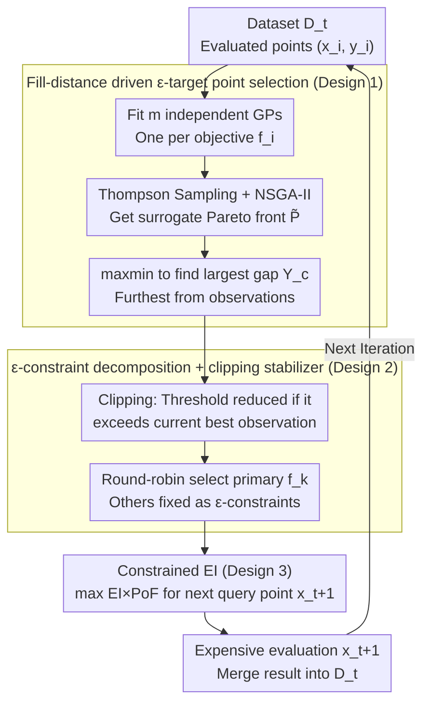

# Multi-Objective Bayesian Optimization via Adaptive $\epsilon$-Constraints Decomposition

**Conference**: ICML 2026  
**arXiv**: [2604.15959](https://arxiv.org/abs/2604.15959)  
**Code**: https://github.com/YangYaohong1/STAGE-BO  
**Area**: Bayesian Optimization / Multi-Objective Optimization  
**Keywords**: Multi-Objective Bayesian Optimization, $\epsilon$-constraint method, Pareto coverage, fill distance, Thompson sampling

## TL;DR
STAGE-BO reformulates MOBO into a sequence of $\epsilon$-constraint single-objective Bayesian subproblems where thresholds are adaptively selected via fill distance. By solving these with cEI, the method achieves uniform Pareto front coverage without hypervolume calculations while naturally accommodating hard constraints and user preferences.

## Background & Motivation

**Background**: The standard approach for Multi-Objective Bayesian Optimization (MOBO) involves fitting a GP for each objective and using an acquisition function to guide expensive black-box evaluations. Most acquisition functions are designed around hypervolume (HV) improvement, such as qEHVI, JESMO, and TSEMO.

**Limitations of Prior Work**: Relying solely on HV entails two significant costs. First, the exact calculation of HV grows exponentially with the number of objectives $m$, becoming computationally intractable for $m \ge 4$. Second, theoretical analysis by Auger et al. indicates that the asymptotic point density of HV maximization is proportional to the square root of the negative Pareto front slope $\propto\sqrt{-F'(\mathbf{x})}$. This causes solutions to cluster in "knee" regions while sparsely covering flat areas, resulting in IGD (Inverted Generational Distance) that is an order of magnitude worse than optimal methods.

**Key Challenge**: Existing schemes for accelerating coverage either still depend on HV (DGEMO, PDBO, MOBO-OSD) or follow scalarization routes (ParEGO, TS-TCH). In scalarization, a uniform distribution of weights does not equate to a uniform distribution of points on the Pareto front, often leading to clusters and geometric holes. The fundamental contradiction is the lack of explicit sampling targeted at geometric gaps on the front.

**Goal**: To develop a MOBO algorithm that (i) avoids HV calculation, (ii) achieves uniform front coverage, and (iii) supports hard constraints and preferences within a single framework.

**Key Insight**: The authors revisit a classic observation of the $\epsilon$-constraint method: any Pareto optimal point can be recovered by optimizing a single objective while subjecting the others to inequality constraints $\ge \epsilon$ (Haimes, 1971). The challenge lies in selecting $\epsilon$. If $\epsilon$ is chosen to "fill the largest hole on the front," the coverage problem is solved automatically.

**Core Idea**: In each iteration, Thompson sampling is used to estimate a surrogate Pareto front $\widetilde{\mathcal{P}}_{f}^{t}$. The point $\mathbf{Y}_c$ on this surrogate front with the maximum max-min distance from current observations is identified. Its coordinates are then used as $\epsilon$-constraints to construct a constrained BO subproblem solved by cEI—entirely bypassing HV calculations.

## Method

### Overall Architecture
Each iteration of STAGE-BO consists of four steps, taking the existing dataset $\mathcal{D}_t=\{(\mathbf{x}_i,\mathbf{y}_i)\}$ as input and outputting the next evaluation point $\mathbf{x}_{t+1}$:

1. Fit $m$ independent GPs to $\mathcal{D}_t$, one for each objective $f_i$.
2. Generate a joint sample path $\tilde{F}^t(\mathbf{x})$ via Thompson sampling, then find the Pareto front $\widetilde{\mathcal{P}}_{f}^{t}$ on this sample path using NSGA-II.
3. Select the target point $\mathbf{Y}_c$ on the surrogate front that is furthest from existing observations and determine the primary objective for this round using a round-robin strategy $k=t\bmod m+1$.
4. Use all coordinates of $\mathbf{Y}_c$ excluding the $k$-th dimension as $\epsilon$-constraint thresholds to construct a constrained BO subproblem, optimized via cEI to obtain the next query point.

The process involves no HV calculations; the primary computational cost is the NSGA-II search on cheap surrogate functions.

### Key Designs

**1. Fill-distance driven $\epsilon$-target point selection: Using the "largest gap" to decide where to fill next**

While the $\epsilon$-constraint method traditionally leaves threshold selection as an open question, STAGE-BO selects the position on the surrogate front with the poorest coverage. The authors adapt the fill distance metric from Zhang et al. (2024), $\text{FD}(\mathbf{Y}_t)=\max_{\mathbf{y}\in\mathcal{P}_f}\min_{\mathbf{y}'\in\mathbf{Y}_t}\|\mathbf{y}-\mathbf{y}'\|$, replacing the true Pareto front with the Thompson-sampled surrogate front. Thus, the target point is:

$$\mathbf{Y}_c=\arg\max_{\mathbf{y}'\in\widetilde{\mathcal{P}}_f^t}\min_{\mathbf{y}\in\mathbf{Y}_t}\|\mathbf{y}-\mathbf{y}'\|,$$

representing the geometrically furthest location from current observations. A theorem in the paper establishes $\text{IGD}(\mathbf{Y}^{\text{FD}})\le \text{FD}(\mathbf{Y}^{\text{FD}})$, anchoring FD as an upper bound for IGD. Minimizing FD thus provides IGD guarantees. This approach succeeds by converting the implicit geometric bias of HV methods into an explicit objective: sampling where coverage is poorest. Using Thompson sampling paths instead of posterior means preserves GP uncertainty, preventing the algorithm from becoming overly greedy.

**2. $\epsilon$-constraint decomposition + clipping stabilizer: Decomposing MOBO into constrained single-objective subproblems**

With $\mathbf{Y}_c$ determined, the multi-objective problem is split into $T$ single-objective subproblems. Each round optimizes one primary objective $f_k$, with others constrained by thresholds $\varepsilon_j=\widehat{\mathbf{Y}}_{c,j}$:

$$\max_{\mathbf{x}\in\mathcal{X}} \; f_k(\mathbf{x})+s\sum_j f_j(\mathbf{x}) \quad \text{s.t.}\quad f_j(\mathbf{x})\ge \varepsilon_j,\; j\ne k,$$

where a scalarization coefficient $s\approx 10^{-3}$ eliminates weak Pareto solutions. Round-robin rotation ensures every objective is promoted. To prevent divergence when data is sparse—where surrogate fronts might suggest thresholds more aggressive than any observed value, leading to empty feasible regions—a clipping mechanism is used. If $\mathbf{Y}_{c,j}\ge \max_t \mathbf{Y}_{t,j}$, $\widehat{\mathbf{Y}}_{c,j}$ is clipped to the current maximum observation.

**3. Constrained EI (cEI) acquisition + natural extension to constraints/preferences**

Each subproblem is solved via cEI, where $\alpha(\mathbf{x})=\text{EI}(\mathbf{x})\times\text{PoF}(\mathbf{x})$ balances improvement and feasibility. The improvement is $\text{EI}=\mathbb{E}[\max(0, f_k(\mathbf{x})+s\sum_{j\ne k} f_j(\mathbf{x})-f_k^*-s\sum_{j\ne k}f_j^*)]$, and the Probability of Feasibility is $\text{PoF}(\mathbf{x})=\prod_{j\ne k}\Pr(f_j(\mathbf{x})\ge \widehat{\mathbf{Y}}_{c,j})$, computable in closed form under independent GP assumptions. This framework handles other settings easily: hard constraints $g_l(\mathbf{x})\ge 0$ are multiplied into the PoF, and user preferences (ROI $[a_i, b_i]$) are treated as candidate constraint sets using an OR formulation.

### Loss & Training
STAGE-BO does not involve neural network training. Key hyperparameters include the internal NSGA-II settings on cheap sampled paths and the scalarization coefficient $s\approx 10^{-3}$. Query points are determined solely by cEI optimization.

## Key Experimental Results

### Main Results
The authors compared STAGE-BO against 8 SOTAs across 6 unconstrained, 4 constrained, and 4 preference benchmarks, along with a DP-SGD hyperparameter optimization task.

| Benchmark Type | Representative Task | Metric | STAGE-BO vs Strongest Baseline |
|---|---|---|---|
| Unconstrained (Synth) | ZDT1 ($d=10,m=2$) | IGD | ~1 order of magnitude lower than qEHVI; HV comparable |
| Unconstrained (High-dim) | DTLZ7 ($d=6,m=5$) | IGD / HV | Significant lead in IGD; HV comparable to JESMO; qEHVI computationally non-viable |
| Unconstrained (Eng) | Water resource ($m=6$) | IGD | Stable convergence at $m=6$; HV-only methods explode in cost |
| Constrained | MW7 / Disc brake | IGD | Consistently outperforms qEHVI, qParEGO, qPOTS, COMBOO |
| Preference ROI | ZDT3, DTLZ2 | HV & IGD | Superior to TS-TCH within the ROI |
| Real-world | DP-SGD on Dutch | HV | Highest HV throughout, demonstrating utility in privacy-utility trade-offs |

### Ablation Study

| Configuration | Key Observation | Description |
|---|---|---|
| Full STAGE-BO | Best IGD/HV | Complete version with Thompson sampling + FD objective + cEI |
| Posterior mean instead of TS | Significant performance drop | Posterior mean is too greedy, suppressing necessary exploration |
| Disable clipping | Minimal impact on most tasks | Primarily serves as a numerical stabilizer for specific cases |
| Change primary objective strategy | Almost no impact | Framework is insensitive to the round-robin selection |

### Key Findings
- The IGD improvement stems from "explicit hole-filling" rather than stronger surrogate models, aligning with the theoretical analysis of HV bias.
- For $m \ge 4$, HV-based methods (especially qEHVI) lose usability due to computational overhead, while STAGE-BO's complexity remains nearly linear with $m$.
- The "OR constraint" design for preferences is critical: when the ROI is too aggressive, the lower bound acts as a safety net; when too conservative, the upper bound drives the search toward better regions.

## Highlights & Insights
- Reintroduces the $\epsilon$-constraint method to MOBO and solves the 50-year-old problem of $\epsilon$ selection using fill distance; an elegant combination of classic ideas and modern uncertainty quantification.
- Bypassing HV calculation provides two advantages: avoiding the curse of dimensionality in high-objective spaces and eliminating geometric bias.
- A unified framework for unconstrained, constrained, and preference-based MOBO by simply adjusting the PoF factors or subproblem constraints.

## Limitations & Future Work
- Heavy reliance on surrogate Pareto front quality: if the GP is poorly fit, $\mathbf{Y}_c$ may select impossible regions. NSGA-II may also fail for $m > 6$, requiring NSGA-III.
- Gap detection is based on current observations and is sensitive to noise; noise-robust geometric metrics are a logical next step.
- The scalarization coefficient $s$ is not fully discussed—too small may allow weak Pareto solutions, while too large may bias cEI toward a simple sum-of-objectives.

## Related Work & Insights
- **vs qEHVI / TSEMO (HV-based)**: These maximize HV improvement, suffering from asymptotic geometric bias and computational collapse at $m \ge 4$; STAGE-BO is computationally scalable and provides uniform coverage.
- **vs ParEGO / TS-TCH (scalarization)**: Scalarization uses random weights where weight uniformity $\ne$ solution uniformity; STAGE-BO targets geometric holes in the objective space directly.
- **vs DGEMO / MOBO-OSD / PDBO (Diversity)**: These still use HV as a final signal or measure diversity in input space; STAGE-BO measures diversity via fill distance in output space, aligning with front coverage goals.

## Rating
- Novelty: ⭐⭐⭐⭐ Combines classic $\epsilon$-constraints with fill distance for a unified multi-setting framework.
- Experimental Thoroughness: ⭐⭐⭐⭐ 14 benchmarks + real-world task + ablations, covering $m=2$ to $6$.
- Writing Quality: ⭐⭐⭐⭐ Clear structure with theoretical grounding (Theorem 4.2).
- Value: ⭐⭐⭐⭐ Highly practical for engineering optimization (materials, robotics, ML tuning) with open-source support.

<!-- RELATED:START -->

## Related Papers

- [\[ICML 2026\] Accelerated Multiple Wasserstein Gradient Flows for Multi-objective Distributional Optimization](accelerated_multiple_wasserstein_gradient_flows_for_multi-objective_distribution.md)
- [\[NeurIPS 2025\] MOBO-OSD: Batch Multi-Objective Bayesian Optimization via Orthogonal Search Directions](../../NeurIPS2025/optimization/mobo-osd_batch_multi-objective_bayesian_optimization_via_orthogonal_search_direc.md)
- [\[ICML 2026\] Cost-Aware Stopping for Bayesian Optimization](cost-aware_stopping_for_bayesian_optimization.md)
- [\[ICML 2026\] Bayesian Gated Non-Negative Contrastive Learning](bayesian_gated_non-negative_contrastive_learning.md)
- [\[ICML 2026\] Adaptive Preconditioners Trigger Loss Spikes in Adam](adaptive_preconditioners_trigger_loss_spikes_in_adam.md)

<!-- RELATED:END -->
