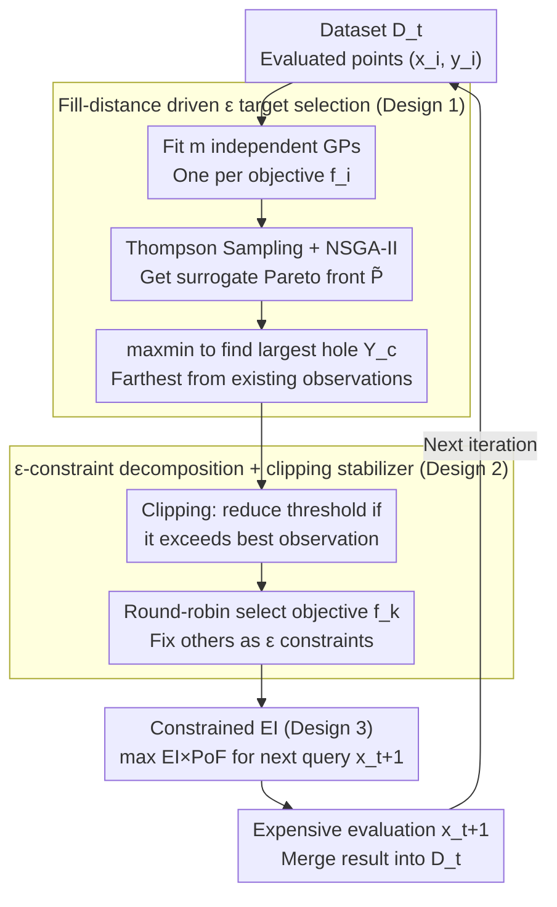

# Multi-Objective Bayesian Optimization via Adaptive ε-Constraints Decomposition

**Conference**: ICML 2026  
**arXiv**: [2604.15959](https://arxiv.org/abs/2604.15959)  
**Code**: https://github.com/YangYaohong1/STAGE-BO  
**Area**: Bayesian Optimization / Multi-Objective Optimization  
**Keywords**: Multi-Objective Bayesian Optimization, ε-constraint method, Pareto coverage, fill distance, Thompson sampling

## TL;DR
STAGE-BO reformulates MOBO as a sequence of ε-constrained single-objective Bayesian sub-problems with "thresholds adaptively selected via fill distance," solved using cEI. This achieves uniform Pareto front coverage without calculating hypervolume and is naturally compatible with hard constraints and user preferences.

## Background & Motivation

**Background**: The mainstream approach for Multi-Objective Bayesian Optimization (MOBO) involves fitting a Gaussian Process (GP) for each objective and using an acquisition function to guide the next expensive black-box evaluation. Most acquisition functions are designed around Hypervolume (HV) improvement, such as qEHVI, JESMO, and TSEMO.

**Limitations of Prior Work**: Relying solely on HV comes with two significant costs. First, the exact calculation of HV grows exponentially with the number of objectives $m$, becoming computationally infeasible for $m \ge 4$. Second, theoretical work by Auger et al. indicates that the asymptotic point density of HV maximization is proportional to the square root of the negative slope of the Pareto front $\propto \sqrt{-F'(\mathbf{x})}$, causing solutions to cluster in "knee" regions and sparsely cover flat areas, with IGD often an order of magnitude worse than optimal methods.

**Key Challenge**: existing "accelerated coverage" schemes either still rely on HV (DGEMO, PDBO, MOBO-OSD) or follow scalarization routes (ParEGO, TS-TCH). In scalarization, a uniform distribution of weights does not equate to a uniform distribution of points on the Pareto front, often resulting in clusters and geometric holes. The fundamental contradiction lies in the "lack of explicit sampling directed at geometric gaps in the front."

**Goal**: To develop a MOBO algorithm that (i) does not require HV calculation, (ii) provides uniform front coverage, and (iii) is compatible with hard constraints and preferences within a single framework.

**Key Insight**: The authors revisit a classic observation of the ε-constraint method: any Pareto optimal point can be recovered by "optimizing only one objective while imposing $\ge \varepsilon$ inequality constraints on the others" (Haimes, 1971). The real difficulty lies in choosing $\varepsilon$. If $\varepsilon$ is selected to "exactly fill the largest hole on the front," the coverage problem is automatically solved.

**Core Idea**: In each step, Thompson sampling is used to estimate a surrogate Pareto front $\widetilde{\mathcal{P}}_{f}^{t}$. The point $\mathbf{Y}_c$ on the surrogate front with the largest max-min distance from current observations is identified. Its coordinates are used as $\varepsilon$ constraints, and the constrained sub-problem is solved using cEI—bypassing HV calculation entirely.

## Method

### Overall Architecture
An iteration of STAGE-BO consists of four steps, taking the existing dataset $\mathcal{D}_t = \{(\mathbf{x}_i, \mathbf{y}_i)\}$ as input and outputting the next evaluation point $\mathbf{x}_{t+1}$:

1. Fit $m$ independent GPs using $\mathcal{D}_t$, one for each objective $f_i$;
2. Obtain a joint sample path $\tilde{F}^t(\mathbf{x})$ via Thompson sampling, then find the Pareto front $\widetilde{\mathcal{P}}_{f}^{t}$ on this path using NSGA-II;
3. Select the target point $\mathbf{Y}_c$ on the surrogate front that is "farthest from existing observations," and determine the main objective for this round using a round-robin strategy $k = t \bmod m + 1$;
4. Use all coordinates of $\mathbf{Y}_c$ except for the $k$-th dimension as ε-constraint thresholds to construct a constrained BO sub-problem, optimized via cEI to obtain the next query point.

The entire process involves no HV calculation; the primary computational cost is the NSGA-II search on cheap surrogate functions.

### Key Designs

**1. Fill-distance driven ε target selection: Deciding where to fill based on the "largest hole"**

The ε-constraint method left "how to choose thresholds" as an open question for 50 years. STAGE-BO's answer is: choose the location on the surrogate front with the worst coverage. The authors adopt the fill distance metric from Zhang et al. (2024), $\text{FD}(\mathbf{Y}_t) = \max_{\mathbf{y} \in \mathcal{P}_f} \min_{\mathbf{y}' \in \mathbf{Y}_t} \|\mathbf{y} - \mathbf{y}'\|$, but replace the true Pareto front with the surrogate front obtained via Thompson sampling. Thus, the target point most in need of filling is:

$$\mathbf{Y}_c = \arg\max_{\mathbf{y}' \in \widetilde{\mathcal{P}}_f^t} \min_{\mathbf{y} \in \mathbf{Y}_t} \|\mathbf{y} - \mathbf{y}'\|,$$

geometrically representing the position farthest from existing observations. A theorem in the paper further shows $\text{IGD}(\mathbf{Y}^{\text{FD}}) \le \text{FD}(\mathbf{Y}^{\text{FD}})$, anchoring FD as an upper bound for IGD. Consequently, "minimizing FD" directly yields IGD guarantees. This works because it replaces the implicit geometric bias of HV methods (clustering at knees) with an explicit objective—sample where coverage is poor. Thompson sampling paths are used instead of posterior means to preserve GP uncertainty and avoid premature convergence.

**2. ε-constraint decomposition + clipping stabilizer: Decomposing into single-objective sub-problems and preventing feasible region depletion**

With $\mathbf{Y}_c$, the multi-objective problem is decomposed into $T$ single-objective sub-problems. In each round, only one primary objective $f_k$ is optimized, while others are fixed by thresholds $\varepsilon_j = \widehat{\mathbf{Y}}_{c,j}$:

$$\max_{\mathbf{x} \in \mathcal{X}} \; f_k(\mathbf{x}) + s \sum_j f_j(\mathbf{x}) \quad \text{s.t.} \quad f_j(\mathbf{x}) \ge \varepsilon_j, \; j \ne k,$$

where the scalarization coefficient $s \approx 10^{-3}$ is used only to exclude weak Pareto solutions. Classic ε-constraint theory ensures the optimal solution to this sub-problem lies on the Pareto front. The primary objective $k$ rotates via round-robin to ensure every objective is pushed. To address the risk of an empty feasible region due to aggressive thresholds in early stages, a "clipping" mechanism is used: if $\mathbf{Y}_{c,j} \ge \max_t \mathbf{Y}_{t,j}$, $\widehat{\mathbf{Y}}_{c,j}$ is reduced to the current maximum observation. Ablations show this primarily serves as a numerical stabilizer.

**3. Constrained EI (cEI) acquisition function + natural extension to constraints/preferences: A unified framework for three settings**

Each sub-problem is solved using constrained EI, where the acquisition function $\alpha(\mathbf{x}) = \text{EI}(\mathbf{x}) \times \text{PoF}(\mathbf{x})$ balances improvement and feasibility. Improvement is $\text{EI} = \mathbb{E}[\max(0, f_k(\mathbf{x}) + s \sum_{j \ne k} f_j(\mathbf{x}) - f_k^* - s \sum_{j \ne k} f_j^*)]$, and the Probability of Feasibility $\text{PoF}(\mathbf{x}) = \prod_{j \ne k} \Pr(f_j(\mathbf{x}) \ge \widehat{\mathbf{Y}}_{c,j})$ is analytically computable under the independent GP assumption. This framework easily handles other settings: hard constraints $g_l(\mathbf{x}) \ge 0$ are multiplied into the PoF; user preference ROIs $[a_i, b_i]$ are treated as candidate constraint sets written in OR form—lower bounds provide a safety net when the ROI is too aggressive, and upper bounds drive the search when the ROI is conservative.

### Loss & Training
STAGE-BO does not involve neural network training. Key hyperparameters include the internal NSGA-II settings (default) and the scalarization coefficient $s \approx 10^{-3}$. Query points are determined by cEI optimization without HV computation.

## Key Experimental Results

### Main Results
The authors compared 8 SOTAs across 6 unconstrained, 4 constrained, and 4 preference benchmarks, along with a real-world hyperparameter optimization task for DP-SGD (privacy-utility).

| Benchmark Type | Representative Task | Metric | STAGE-BO vs Strongest Baseline |
|---|---|---|---|
| Unconstrained (Synthetic) | ZDT1 ($d=10, m=2$) | IGD | ~1 order of magnitude lower than qEHVI; HV comparable to qEHVI |
| Unconstrained (High-dim) | DTLZ7 ($d=6, m=5$, disc. front) | IGD / HV | Significant lead in IGD; HV comparable to JESMO/MOBO-OSD; qEHVI failed to scale |
| Unconstrained (Eng.) | Water resource planning ($d=3, m=6$) | IGD | Stable convergence at $m=6$; HV-only methods computation exploded |
| Constrained | MW7 / Disc brake / CONSTR | IGD | Consistently outperforms qEHVI, qParEGO, qPOTS, COMBOO |
| Preference ROI | ZDT3, DTLZ2, VehicleSafety | HV & IGD | HV and IGD within ROI superior to TS-TCH |
| Real-world | DP-SGD on Dutch ($d=5, m=2$) | HV | Highest HV throughout, demonstrating utility in privacy-utility trade-offs |

### Ablation Study

| Configuration | Key Observation | Description |
|---|---|---|
| Full STAGE-BO | Best IGD/HV | Complete version: Thompson Sampling + FD + cEI |
| Posterior mean instead of TS | Significant performance drop | Posterior mean is over-greedy, suppressing exploration |
| Disabling clipping | Comparable on most tasks | Primarily serves as a numerical stabilizer |
| Changing main objective strategy | Almost no impact | Framework is insensitive to the exact round-robin strategy |
| Different constrained BO AF | Still effective | Decomposition framework is not strictly dependent on cEI |

### Key Findings
- IGD improvements stem from "explicitly finding holes" rather than stronger surrogate models—aligning with theoretical analysis of HV bias where HV-based methods under-sample flat regions.
- For $m \ge 4$, HV-based methods (especially qEHVI) become impractical due to computation; STAGE-BO scales nearly linearly with $m$.
- In preference settings, the "upper/lower bound OR constraint" design is critical: lower bounds provide a fallback if the ROI is outside the true front, while upper bounds drive search if the ROI is too conservative.

## Highlights & Insights
- Successfully brings the ε-constraint method from classical MOO textbooks back to MOBO, solving the 50-year-old problem of "how to choose $\varepsilon$" using fill distance. This is an elegant combination of a "classic theoretical idea" and "modern uncertainty metrics."
- Avoiding HV calculation becomes a dual advantage: it circumvents the curse of dimensionality for high $m$ and bypasses geometric bias. The perspective of "doing less to gain more" is valuable for future algorithm design.
- The unified framework for unconstrained, constrained, and preference settings is highly efficient, allowing for easy reuse across any cEI-compatible constrained BO framework.

## Limitations & Future Work
- The algorithm heavily relies on the quality of the surrogate Pareto front; inaccurate GPs in early stages can lead to wasted iterations in impossible regions. NSGA-II may also struggle in many-objective ($m > 6$) scenarios.
- Gap detection is based on current observations and is sensitive to noise; noise-robust geometric metrics are a logical next step.
- The scalarization coefficient $s$ is an under-discussed hyperparameter—too small may allow weak Pareto solutions, while too large may bias cEI towards a sum-of-objectives.

## Related Work & Insights
- **vs qEHVI / TSEMO (HV-based)**: These maximize HV improvement, suffering from geometric bias and computational collapse at $m \ge 4$; STAGE-BO is scalable and provides uniform coverage.
- **vs ParEGO / TS-TCH (Scalarization)**: Scalarization uses random weights where weight uniformity does not guarantee solution uniformity; STAGE-BO solves clustering by identifying geometric holes in objective space.
- **vs DGEMO / MOBO-OSD / PDBO (Diversity)**: These still use HV as a selection signal or measure diversity in input space; STAGE-BO measures diversity via fill distance in output space, aligning with the goal of front coverage.

## Rating
- Novelty: ⭐⭐⭐⭐ Combines classic ε-constraint with fill distance in a unified framework.
- Experimental Thoroughness: ⭐⭐⭐⭐ 14 benchmarks + real-world task + thorough ablations up to $m=6$.
- Writing Quality: ⭐⭐⭐⭐ Clear structure with theoretical grounding (Theorem 4.2).
- Value: ⭐⭐⭐⭐ High practical utility for engineering optimization and privacy ML.

<!-- RELATED:START -->

## Related Papers

- [\[ICML 2026\] Accelerated Multiple Wasserstein Gradient Flows for Multi-objective Distributional Optimization](accelerated_multiple_wasserstein_gradient_flows_for_multi-objective_distribution.md)
- [\[NeurIPS 2025\] MOBO-OSD: Batch Multi-Objective Bayesian Optimization via Orthogonal Search Directions](../../NeurIPS2025/optimization/mobo-osd_batch_multi-objective_bayesian_optimization_via_orthogonal_search_direc.md)
- [\[ICML 2026\] Cost-Aware Stopping for Bayesian Optimization](cost-aware_stopping_for_bayesian_optimization.md)
- [\[ICML 2026\] Diversity-Driven Offline Multi-Objective Optimization via Nested Pareto Set Learning](diversity-driven_offline_multi-objective_optimization_via_nested_pareto_set_lear.md)
- [\[ICML 2026\] Bayesian Gated Non-Negative Contrastive Learning](bayesian_gated_non-negative_contrastive_learning.md)

<!-- RELATED:END -->
