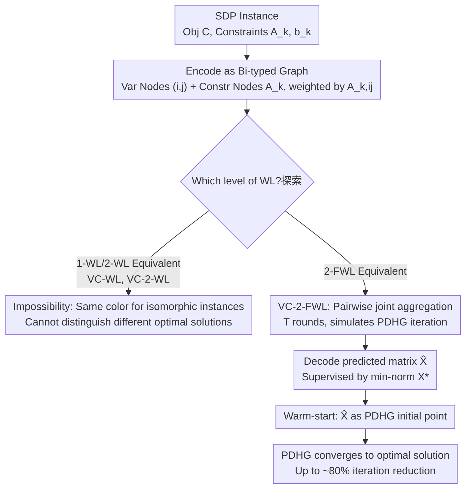

# On the Expressive Power of GNNs to Solve Linear SDPs

**Conference**: ICML 2026  
**arXiv**: [2604.27786](https://arxiv.org/abs/2604.27786)  
**Code**: Not available  
**Area**: Optimization / Graph Neural Networks / Learning to Optimize  
**Keywords**: Semidefinite Programming, GNN Expressive Power, Weisfeiler-Leman, PDHG, warm-start

## TL;DR
This paper characterizes for the first time the minimum GNN expressive power required to learn solutions for linear SDPs from the perspective of the Weisfeiler–Leman (WL) hierarchy. It proves that standard variable-constraint bipartite message passing (VC-WL) and higher-order VC-2-WL are insufficient. In contrast, the VC-2-FWL architecture, equivalent to 2-FWL, is shown to be sufficient for simulating the update steps of the PDHG solver. Using high-quality predictions as a warm-start on synthetic data and SDPLIB benchmarks results in speedups of up to approximately 80%.

## Background & Motivation

**Background**: Applying GNNs to learn solutions (learning-to-optimize, L2O) for Linear Programming (LP) and Mixed-Integer Linear Programming (MILP) is relatively mature. The dominant approach constructs a bipartite graph of constraints and variables and employs message passing equivalent to 1-WL (e.g., GNNs aligned with IPM/PDHG by Gasse et al.). This approach can approximate optimal solutions or significantly accelerate IPM for small-to-medium-scale problems.

**Limitations of Prior Work**: Directly applying the same logic to **Semidefinite Programming (SDP)** fails. The core variable in SDP is not a vector of components but an entire symmetric positive semidefinite matrix $X \in S^n_+$, where entries $X_{ij}$ are equivariant under simultaneous row and column permutations. Traditional Variable-Constraint (V-C) bipartite graphs cannot represent this second-order symmetry, preventing GNNs from fitting the optimal solution regardless of training duration.

**Key Challenge**: While existing L2O literature defines the expressive power thresholds for LP/QP/SOCP (where 1-WL is mostly sufficient), the "Constraint-Variable-Entry" structure of SDP involves a third-order tensor structure. The question of **which level of WL is sufficient to recover the optimal solution** remains unanswered, which has stalled the development of "Neural SDP Solvers."

**Goal**: 1) Formalize the minimum expressive power required for the mapping from an SDP instance to the optimal matrix solution $X^*$; 2) Prove the impossibility of standard GNN-like architectures; 3) Propose a sufficient architecture and validate it experimentally; 4) Utilize predictions as a warm-start for classical solvers.

**Key Insight**: The authors represent the SDP as a "hypergraph" composed of constraint matrices $A_k$, the objective matrix $C$, and the variable matrix $X$. By applying 1-WL/2-WL/2-FWL hash updates to this tensor graph, they construct VC-WL, VC-2-WL, and VC-2-FWL respectively. Sufficiency is proven by simulating the First-Order Solver PDHG—if a GNN can simulate a single iteration of the solver, it can necessarily approximate the converged solution.

**Core Idea**: By replacing standard message passing with "Pairwise Node Joint Aggregation" (equivalent to 2-FWL), the GNN's stable coloring becomes finer than the partition of trajectories under PDHG iterations, thereby satisfying the sufficient conditions for expressive power.

## Method

### Overall Architecture
The input is an SDP instance $(C, \{A_k\}_{k=1}^m, \{b_k\}_{k=1}^m)$. The authors encode this into a **graph with two types of nodes**: variable nodes corresponding to the entries $(i,j) \in [n]\times[n]$ of the matrix $X$, and constraint nodes corresponding to each $A_k$. Interactions between variable nodes are weighted by $A_{k,ij}$. After $T$ rounds of permutation-equivariant message passing, the variable embeddings are decoded into a predicted matrix $\hat X$, which is supervised against the unique minimum Frobenius norm optimal solution $X^*$ (uniqueness proven in Proposition 1.1). Finally, $\hat X$ is used as the initial point for the PDHG solver to accelerate convergence.

### Key Designs

**1. Impossibility Results: Defining Which GNNs Cannot Learn SDP**

To determine "how strong a GNN needs to be," the simplest starting point is excluding architectures that are insufficiently powerful. The authors construct a family of SDP instances that are structurally isomorphic but have different optimal solutions. They prove that VC-WL (1-WL equivalent) assigns identical node representations to isomorphic instances after stable coloring; thus, any GNN based on it must output the same results, failing to distinguish between different optima. The same conclusion holds for VC-2-WL (a variant of standard 2-WL). This argument follows the classic "WL same color $\Rightarrow$ GNN same output" template but is applied to the SDP setting for the first time, establishing a clear lower bound—effectively warning researchers not to waste compute on 1-WL/2-WL architectures.

**2. Sufficient Architecture VC-2-FWL: Simulating PDHG via Pairwise Aggregation**

Having excluded weak architectures, the authors provide one that is demonstrably capable. VC-2-FWL assigns colors to node pairs $(u,v)\in V^2$ and updates them via folklore 2-FWL:

$$c^t_{uv} := \text{hash}\big(c^{t-1}_{uv},\ \{\!\{(c^{t-1}_{wv},\, c^{t-1}_{uw}) \mid w\in V\}\!\}\big)$$

The key to proving sufficiency is not approximating the optimal solution directly, but proving that "the GNN can simulate a solver known to converge to the optimal solution"—a standard L2O technique. Specifically, one iteration of PDHG (matrix-matrix products, structural information of eigenvalue decomposition in PSD projection) is explicitly mapped to several hash steps of VC-2-FWL. Provided the embedding dimension is large enough, updates for both primal and dual variables can be replicated exactly. This implies the stable coloring of VC-2-FWL is finer than the state partition of PDHG convergence trajectories, granting it the capability to fit the optimal solution. This makes it the weakest known GNN architecture capable of solving linear SDPs.

**3. Warm-start Integration: Translating Expressive Power into Wall-clock Time**

Pure neural solvers are often unsuitable for high-precision scientific computing because GNN outputs may not be strictly feasible. This work treats the trained prediction $\hat X$ as the initial point $X^{(0)}$ for PDHG. By starting the classical solver closer to the optimum, feasibility and optimality are still guaranteed by PDHG, while the GNN provides a superior starting point. This avoids the deployment difficulty of "infeasible outputs" and converts the theoretical $\hat X \approx X^*$ into a practical reduction in iteration count, representing a robust paradigm for combining ML with traditional optimization.

### Loss & Training
The supervision objective is the Frobenius error between the predicted matrix and the minimum Frobenius norm optimal solution $\|\hat X - X^*\|_F$, supplemented by the objective gap $|\langle C, \hat X\rangle - \langle C, X^*\rangle|$ as an auxiliary metric. Training data consists of synthetic SDP instances (covering families of randomly generated symmetric matrices) and various SDP types from SDPLIB (e.g., max-cut relaxations, $\theta$-functions).

## Key Experimental Results

### Main Results
Across synthetic SDPs and multiple SDPLIB benchmarks, the VC-2-FWL architecture **consistently outperforms** theoretically weaker baselines like VC-WL and VC-2-WL in both prediction error and objective gap.

| Setting | Metric | VC-WL | VC-2-WL | VC-2-FWL |
|------|------|------|------|------|
| Synthetic SDP | $\|\hat X - X^*\|_F$ | Highest | Medium | Lowest |
| SDPLIB | Objective Gap | Largest | Medium | Smallest |
| Warm-start PDHG | Convergence Time Reduction | Minimal | Average | **Up to 80%** |

### Ablation Study

| Configuration | Key Phenomenon | Explanation |
|------|---------|------|
| VC-WL (1-WL eq.) | Highest fitting error; completely fails to distinguish some instances | Validates Impossibility Theorem |
| VC-2-WL (2-WL eq.) | Better than VC-WL, but still deviates from optimum | Standard 2-WL is insufficient |
| VC-2-FWL (2-FWL eq.) | Lowest error, smallest objective gap | Satisfies sufficiency |
| Cold-start PDHG only | Baseline convergence time | Control group |
| VC-2-FWL warm-start | Max convergence time reduction ~80% | Expressive power → Practical speedup |

### Key Findings
- Expressive power levels strictly align with "fitting quality": the theoretical hierarchy VC-WL $\sqsubset$ VC-2-WL $\sqsubset$ VC-2-FWL translates to a strict decrease in prediction error across both synthetic and real benchmarks.
- There is a significant leverage effect when converting "GNN error reduction" into "solver iteration reduction"—as long as the prediction falls within the basin of attraction of the optimal solution, the remaining PDHG iterations decrease sharply.
- Error pattern analysis shows that VC-WL primarily fails on "highly symmetric families of constraint matrices," which is exactly the classic blind spot of 1-WL's discriminative power, consistent with theoretical predictions.

## Highlights & Insights
- **First characterization of SDP-GNN expressive power**: The work extends the mature framework of "WL hierarchy as GNN expressive power" from LP/QP to SDP, filling a significant gap in L2O theory. This analysis template can be directly migrated to broader conic programming beyond SOCP.
- **Elegant "Simulation-based Sufficiency" paradigm**: Rather than proving convergence of $\hat X$ directly, the authors prove the GNN can simulate one step of PDHG. This transforms the "approximation of optimal solution" problem into a "simulation of a discrete dynamical system" problem, which is more tractable.
- **Typical case of theory-guided architecture**: Future researchers aiming to train neural SDP solvers can bypass the failure mode of 1-WL/2-WL architectures and start directly with 2-FWL equivalent designs.
- **Upper bound on finite threshold**: While proving VC-2-FWL is "sufficient" does not mean it is "necessary," the impossibility results imply 1-WL/2-WL are not enough, leaving an interesting gap (3-WL? 3-FWL?) for future exploration.

## Limitations & Future Work
- Experiments focused on synthetic data and medium-scale SDPLIB. **In large-scale SDPs (e.g., $n>10^4$ in combinatorial relaxations), the memory cost of VC-2-FWL ($O(n^2)$ node pairs) explodes**, and scalable implementations are not yet provided.
- Sufficiency proofs are restricted to "linear SDPs with a unique minimum-norm optimal solution," leaving non-unique solution sets, degenerate solutions, and semi-infinite SDPs unaddressed.
- Warm-start gains are dependent on PDHG as the downstream solver; compatibility with more precise solvers like IPM or ADMM remains to be verified.
- Future directions: Sparsification or subgraph sampling to make VC-2-FWL scalable; extending analysis to second-order cone or mixed-integer SDPs; integration with modern low-rank SDP algorithms.

## Related Work & Insights
- **vs. Qian et al. (PDHG-GNN for LP)**: While they proved 1-WL GNNs are sufficient to simulate PDHG for LP, this work proves SDP requires a shift to 2-FWL, revealing a correspondence between "cone dimension" and "WL hierarchy."
- **vs. Yau et al. (GNN for low-rank SDP relaxation of Max-CSP)**: While they analyzed GNNs as approximation algorithms for CSP, this work targets general linear SDPs directly to study whether GNNs can recover the optimal matrix solution.
- **vs. Chen et al. (GNN for QP / SOCP Expressiveness)**: This work continues the research line of "WL Hierarchy $\leftrightarrow$ Convex Optimization Solution Recovery," placing SDP precisely on the expressive power map.

## Rating
- Novelty: ⭐⭐⭐⭐⭐ First to link SDP solution recovery to the WL hierarchy.
- Experimental Thoroughness: ⭐⭐⭐⭐ Covered synthetic and SDPLIB, though lacking ultra-large-scale and multi-solver comparisons.
- Writing Quality: ⭐⭐⭐⭐ Theory is clear; warm-start engineering details could be more substantial.
- Value: ⭐⭐⭐⭐ A landmark for the "Neural Convex Optimization" theoretical community; industrial deployment requires scaling.

<!-- RELATED:START -->

## Related Papers

- [\[ICML 2026\] Learning-Augmented Scalable Linear Assignment Problem Optimization via Neural Dual Warm-Starts](learning-augmented_scalable_linear_assignment_problem_optimization_via_neural_du.md)
- [\[ICLR 2026\] Learning to Solve Orienteering Problem with Time Windows and Variable Profits](../../ICLR2026/optimization/learning_to_solve_orienteering_problem_with_time_windows_and_variable_profits.md)
- [\[ICLR 2026\] Learning from Algorithm Feedback: One-Shot SAT Solver Guidance with GNNs](../../ICLR2026/optimization/learning_from_algorithm_feedback_one-shot_sat_solver_guidance_with_gnns.md)
- [\[ICLR 2026\] LMask: Learn to Solve Constrained Routing Problems with Lazy Masking](../../ICLR2026/optimization/lmask_learn_to_solve_constrained_routing_problems_with_lazy_masking.md)
- [\[ICML 2026\] Provably Data-Driven Lagrangian Relaxation for Mixed Integer Linear Programming](provably_data-driven_lagrangian_relaxation_for_mixed_integer_linear_programming.md)

<!-- RELATED:END -->
