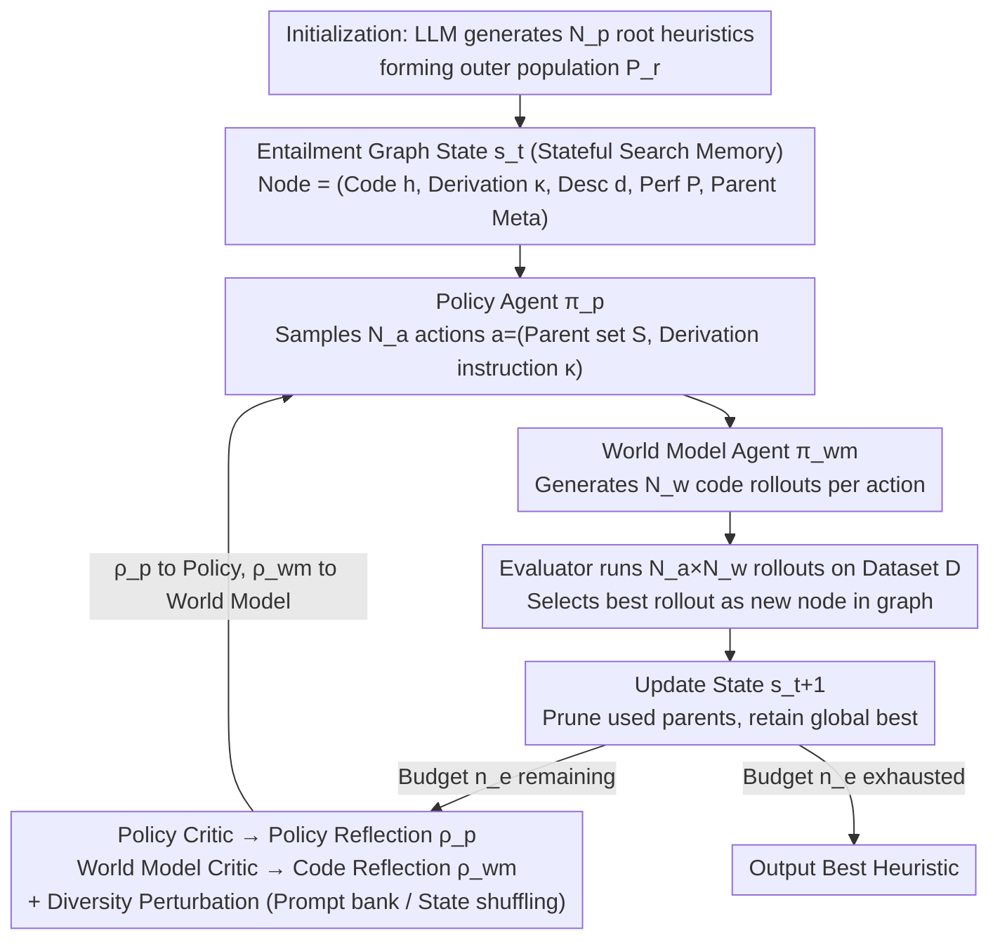

# PathWise: Planning through World Model for Automated Heuristic Design via Self-Evolving LLMs

**Conference**: ICML 2026  
**arXiv**: [2601.20539](https://arxiv.org/abs/2601.20539)  
**Code**: TBD  
**Area**: Optimization / LLM for Combinatorial Optimization / Automated Heuristic Design  
**Keywords**: Automated Heuristic Design, Multi-agent LLM, Entailment Graph, World Model, Combinatorial Optimization

## TL;DR
PathWise reformulates LLM-based Automated Heuristic Design (AHD) as a sequential decision process on an "entailment graph." Four LLM agents—Policy, World Model, and Dual-Critics—collaborate to replace gradient updates with natural language reflections. On problems such as TSP, CVRP, KP, and Bin Packing, it outperforms mainstream baselines like FunSearch, EoH, ReEvo, HSEvo, and MCTS-AHD with only 50% of the evaluation budget.

## Background & Motivation

**Background**: Automated Heuristic Design (AHD) aims to automatically discover high-quality heuristic programs $h:\mathcal{X}\to\mathcal{S}$ for combinatorial optimization problems (COPs). Traditional methods rely on Genetic Programming (GP) with manual operators. Recent works like FunSearch, EoH, ReEvo, and HSEvo use LLMs as "high-level operators" within evolutionary loops, while MCTS-AHD organizes the generation as a Monte Carlo Tree.

**Limitations of Prior Work**: Population-based methods use fixed selection/replacement rules, often prematurely discarding promising solutions and converging too early. While tree-based methods are hierarchical, node selection and expansion rely on pure performance statistics like UCT, failing to understand the semantic relationships between different heuristics. Both routes treat each generation step as independent or weakly coupled sampling with static prompt templates, leading to redundant "rediscovery," repeated sampling of similar heuristics, and significant waste of LLM calling budgets.

**Key Challenge**: Search is inherently a reasoning process with memory—information regarding the semantics of heuristic quality, how it evolved from parents, and which edit patterns are effective should be explicitly modeled and reused. Existing frameworks lack such state representations, fail to separate high-level strategy from low-level code synthesis, and do not route critic feedback to specific roles.

**Goal**: (1) Design a structured state representation for LLM-AHD to compress derivation history into search states; (2) Decouple and coordinate roles for strategic planning, code synthesis, and reflective evaluation; (3) Introduce diversity at the prompt level to allow critics to analyze contrastive samples.

**Key Insight**: Borrowing from text entailment graphs, each candidate heuristic is treated as a node, and the "derivation from a set of parents via natural language reasoning" is treated as a labeled directed edge. Such a graph serves as both a compact memory of search trajectories and a readable context for LLMs. Combined with the "LLM as a World Model" perspective, PathWise implements an RL-like interface (Policy/World Model/Critic) that iterates purely through natural language reflection without parameter updates.

**Core Idea**: Replace populations or MCTS trees with an entailment graph as the "State." A Policy LLM samples high-level evolutionary actions (parent selection + derivation rationale), a World Model LLM translates actions into specific code, and two Critic LLMs route step-wise feedback back to the respective roles for "gradient-free" self-evolution.

## Method

PathWise frames heuristic discovery as an MDP $(\mathbb{S},\mathbb{A},\mathbb{T},\mathbb{R})$: the state $s_t$ is the current entailment graph plus the frontier; the action $a_t=(S,\kappa)$ consists of selected parent nodes $S\subseteq s_t$ and a natural language derivation instruction $\kappa$; the transition $\mathbb{T}$ involves the world model compiling $(S,\kappa)$ into a new heuristic and updating the graph; the reward $\mathbb{R}$ is the negative cost of the heuristic on dataset $\mathcal{D}$: $P(h;\mathcal{D})=\mathbb{E}_{x\sim\mathcal{D}}[-f(h(x))]$.

### Overall Architecture

PathWise operates on two timescales: an outer iteration $r$ maintaining a root population $\mathcal{P}_r$ of size $\mathcal{N}_p$, and an inner iteration $t$ expanding a local entailment graph $G_t=(V_t,E_t)$ rooted at $\mathcal{P}_r$. An inner step involves four LLM roles: the Policy Agent $\boldsymbol{\pi}_p$ samples $N_a$ candidate actions; the World Model Agent $\boldsymbol{\pi}_{wm}$ generates $N_w$ code rollouts for each action; the Evaluator runs all $N_a\cdot N_w$ rollouts to select $(i_\star,j_\star)=\arg\max_{i,j}P(\hat{h}^{(i,j)};\mathcal{D})$ as the new node $v_\star$; then the Policy Critic $\boldsymbol{\pi}_{p\_critic}$ and World Model Critic $\boldsymbol{\pi}_{wm\_critic}$ produce routed reflections for the next step. The state update rule $s_{t+1}=(s_t\cup\{v_\star\})\setminus(S^{(i_\star)}\setminus\{v^\star\})$ prunes used parents while permanently retaining the global best $v^\star$ to encourage exploration without losing the historical optimum.

Each node is a pentad $(h,\kappa,d,P(h;\mathcal{D}),\mathrm{PM})$: code $h$, derivation text $\kappa$, algorithm description $d$, performance $P$, and parent metadata $\mathrm{PM}=\{(d_k,P(h_k;\mathcal{D}))\mid v_k\in S\}$. Parent metadata includes only descriptions and scores to manage prompt context length.

### Key Designs

**1. Entailment Graph as Stateful Search Memory**  
Population-based methods discard intermediates, while MCTS-AHD keeps them but relies on non-semantic stats (UCT). PathWise uses entailment graphs to capture both compression and semantics. Each edge $S\xRightarrow{\kappa}v_\star$ encodes the logic of evolution. Pruning rules prevent the frontier from exploding while retaining the global best $v^\star$, ensuring subsequent decisions are based on which "derivation paths" are effective rather than simple visitation counts.

**2. Policy / World Model Bi-level Action Decomposition**  
To prevent long contexts from degrading implementation quality, actions are decoupled. The Policy Agent focuses on semantic edits $\kappa$ (e.g., "replace greedy with simulated annealing"), while the World Model Agent focuses on implementation $h$ given the rationale. This separation allows critics to diagnose failure modes separately (strategic error vs. coding error).

**3. Routed Reflection + Diversity Perturbation**  
Reflections are routed to specific roles to avoid cross-interference. The Policy Critic aggregates average rewards of rollouts, while the World Model Critic compares the best and worst rollouts. Two diversity mechanisms are introduced: (1) A prompt perturbation library $\Phi$ with a decaying injection rate $\varepsilon(\ell)$ to guide exploration, and (2) State shuffling to eliminate the LLM's inherent position bias.

### Loss & Training

PathWise is a training-free framework. It utilizes an outer iteration limit $\mathcal{N}_r$ and an explicit evaluation budget $n_e$. The paper reports that PathWise achieves better results on TSP/CVRP with $n_e=500$ than baselines with $n_e=1000$.

## Key Experimental Results

### Main Results

Evaluated on 7 COPs (TSP, CVRP, KP, BPP, JSSP, etc.) using GPT-4o-mini and GPT-5-nano. PathWise used $n_e=500$ while baselines used $n_e=1000$.

| Task / Test Set | Metric | LKH-3 / Optimal | MCTS-AHD ($n_e=1000$) | HSEvo ($n_e=1000$) | **PathWise ($n_e=500$, GPT-4o-mini)** |
|:---|:---:|:---:|:---:|:---:|:---:|
| TSP $N=50$ | Obj↓ / Gap | 5.687 / – | 6.358 / 11.80% | 6.429 / 13.05% | **6.245 / 9.81%** |
| TSP $N=100$ | Obj↓ / Gap | 7.767 / – | 8.839 / 13.80% | 8.903 / 14.63% | **8.758 / 12.76%** |
| TSP $N=200$ | Obj↓ / Gap | 10.709 / – | 12.403 / 15.82% | 12.359 / 15.41% | **12.276 / 14.63%** |
| KP $N=200,W=25$ | Obj↑ / Gap | 57.132 / – | 57.020 / 0.20% | – | **57.082 / 0.09%** |
| KP $N=500,W=25$ | Obj↑ / Gap | 90.763 / – | 89.061 / 1.88% | – | **90.719 / 0.05%** |

### Ablation Study

| Configuration | Observation | Explanation |
|:---|:---|:---|
| Full PathWise | Fastest convergence, lowest variance | Integrated roles + routed reflection + perturbations |
| w/o Routed Reflection | Significant jitter, gap increases | Feedback confusion between strategy and implementation |
| w/o Diversity Perturbation | Mode collapse into same parent pairs | Reflection degrades without contrastive samples |
| w/o State Shuffling | Position bias toward earlier nodes | Confirming the "lost in the middle" or position bias in LLMs |

### Key Findings
- Under the same backbone, PathWise exceeds MCTS-AHD/HSEvo/ReEvo with half the budget, proving the efficiency of memory-based search via entailment graphs.
- Lower variance suggests that role division and routed reflection reduce dependence on initialization and sampling randomness.
- Performance gains are most significant on large-scale instances (TSP $N=200$, KP $N=500$), supporting the value of compact stateful memory in long-sequence search.

## Highlights & Insights
- **Entailment Graphs for AHD**: Adapts a tool from NLP reasoning for evolutionary search, providing an interpretable, semantic search trajectory that facilitates meaningful reflection.
- **Training-free Actor-Critic**: Provides a template for "black-box models" by replacing RL components with LLMs and natural language, applicable to code synthesis and agent workflows.
- **Addressing LLM Biases**: Engineering solutions like perturbation decay and state shuffling effectively solve "mode collapse" and "position bias" with near-zero computational cost.

## Limitations & Future Work
- Entailment graphs grow linearly, posing challenges for LLM context limits, though mitigated by pruning and population constraints.
- Evaluation costs remain high for tasks where single-step assessment is expensive (e.g., complex agent benchmarks).
- Reflection quality depends heavily on the backbone's reasoning capability; performance gains narrow when using weaker LLMs.

## Related Work & Insights
- **vs FunSearch / EoH**: Replaces fixed mutation templates with natural language derivation rationales $\kappa$ and explicit entailment graph memory.
- **vs ReEvo**: Improves upon global reflections by routing feedback specifically to the Policy and World Model roles.
- **vs MCTS-AHD**: Offers a bounded, semantic graph instead of an unbounded, statistics-driven tree, leading to faster convergence and lower per-step costs.

## Rating
- Novelty: ⭐⭐⭐⭐ Structural innovation by combining entailment graphs and world models in AHD.
- Experimental Thoroughness: ⭐⭐⭐⭐ Multi-backbone, multi-COP evaluation with detailed ablations.
- Writing Quality: ⭐⭐⭐⭐ Clear correspondence between MDP theory and implementation.
- Value: ⭐⭐⭐⭐ Provides a reusable template for stateful search in training-free LLM tasks.

<!-- RELATED:START -->

## Related Papers

- [\[ICLR 2026\] CALM: Co-evolution of Algorithms and Language Model for Automatic Heuristic Design](../../ICLR2026/optimization/calm_co-evolution_of_algorithms_and_language_model_for_automatic_heuristic_desig.md)
- [\[NeurIPS 2025\] Automated Algorithm Design via Nevanlinna-Pick Interpolation](../../NeurIPS2025/optimization/automated_algorithm_design_via_nevanlinna-pick_interpolation.md)
- [\[ICML 2026\] Memory-Efficient LLM Pretraining via Minimalist Optimizer Design](memory-efficient_llm_pretraining_via_minimalist_optimizer_design.md)
- [\[ICML 2026\] Learning a Zeroth-Order Optimizer for Fine-Tuning LLMs](learning_a_zeroth-order_optimizer_for_fine-tuning_llms.md)
- [\[ICML 2026\] TPV: Parameter Perturbations Through the Lens of Test Prediction Variance](tpv_parameter_perturbations_through_the_lens_of_test_prediction_variance.md)

<!-- RELATED:END -->
