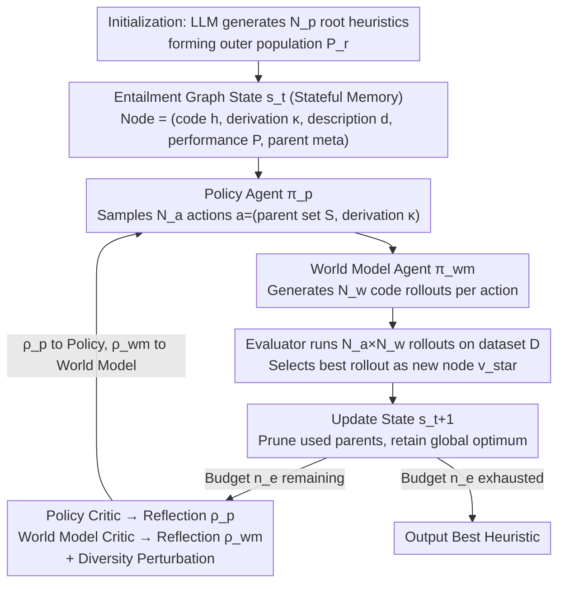

# PathWise: Planning through World Model for Automated Heuristic Design via Self-Evolving LLMs

**Conference**: ICML 2026  
**arXiv**: [2601.20539](https://arxiv.org/abs/2601.20539)  
**Code**: To be confirmed  
**Area**: Optimization / LLM for Combinatorial Optimization / Automated Heuristic Design  
**Keywords**: Automated Heuristic Design, Multi-agent LLM, Entailment Graph, World Model, Combinatorial Optimization

## TL;DR
PathWise reformulates Automated Heuristic Design (AHD) as a sequential decision-making process on an "Entailment Graph." Collaboratively driven by Policy, World Model, and Dual Critic LLM agents, it utilizes natural language reflection instead of gradient updates. PathWise surpasses major baselines like FunSearch, EoH, ReEvo, HSEvo, and MCTS-AHD across TSP, CVRP, KP, and Bin Packing problems while using only 50% of the evaluation budget.

## Background & Motivation

**Background**: Automated Heuristic Design (AHD) aims to automatically discover high-quality heuristic programs $h:\mathcal{X}\to\mathcal{S}$ for combinatorial optimization problems (COPs). Traditional approaches rely on Genetic Programming (GP) using manual operators on syntax trees. Recent methods like FunSearch, EoH, ReEvo, and HSEvo integrate LLMs as "high-level operators" within evolutionary loops, while MCTS-AHD organizes the generation as a Monte Carlo Tree Search.

**Limitations of Prior Work**: Population-based methods use fixed selection/replacement rules, often prematurely discarding promising solutions and converging too early. Tree-based methods, while hierarchical, rely on pure performance statistics like UCT for node selection and expansion, failing to capture semantic relationships between heuristics. Both paradigms treat generation steps as independent or weakly coupled samplings with static prompt templates, leading to "rediscovery" of similar heuristics and significant waste of LLM budgets.

**Key Challenge**: Search is inherently a memory-based reasoning process—the semantics of a heuristic's quality, its evolutionary path from parents, and effective edit patterns should be explicitly modeled and reused across steps. Current frameworks lack such state representations, fail to decouple high-level strategy from low-level code synthesis, and do not route critic feedback to specific roles.

**Goal**: (1) Design a structured state representation for LLM-AHD that compresses derivation history into a search state; (2) Decouple policy planning, code synthesis, and reflection into distinct collaborative roles; (3) Introduce diversity at the prompt level to allow critics to provide comparative feedback.

**Key Insight**: Borrowing from text entailment graphs, each candidate heuristic is treated as a node, and the "derivation of a child from parents via natural language reasoning" is treated as a labeled directed edge. This graph serves as both a compact memory of the search trajectory and a readable context for LLMs. By adopting the "LLM as a World Model" perspective (Hao et al., 2023), the framework implements an RL-like interface (Policy/World Model/Critic) that iterates purely through natural language reflection without parameter updates.

**Core Idea**: Replace populations or MCTS trees with an Entailment Graph as the "state." A Policy LLM samples high-level evolutionary actions (parent selection + derivation rationale), a World Model LLM implements these actions into specific code, and two Critic LLMs route step-specific feedback back to their respective roles for "gradient-free" self-evolution.

## Method

PathWise models heuristic discovery as an MDP $(\mathbb{S},\mathbb{A},\mathbb{T},\mathbb{R})$: the state $s_t$ is the current entailment graph plus the frontier; the action $a_t=(S,\kappa)$ consists of a set of selected parent nodes $S\subseteq s_t$ and a natural language derivation instruction $\kappa$; the transition $\mathbb{T}$ involves the World Model compiling $(S,\kappa)$ into a new heuristic and updating the graph; the reward $\mathbb{R}$ is the negative cost of the new heuristic on dataset $\mathcal{D}$: $P(h;\mathcal{D})=\mathbb{E}_{x\sim\mathcal{D}}[-f(h(x))]$. This MDP serves as a structural backbone where reinforcement is achieved through natural language reflections from critics.

### Overall Architecture

PathWise operates on two timescales: an outer iteration $r$ maintains a root population $\mathcal{P}_r$ of size $\mathcal{N}_p$, and an inner iteration $t$ expands a local entailment graph $G_t=(V_t,E_t)$ rooted at $\mathcal{P}_r$. Each inner step involves four LLM roles: the Policy Agent $\boldsymbol{\pi}_p$ samples $N_a$ candidate actions; the World Model Agent $\boldsymbol{\pi}_{wm}$ generates $N_w$ code rollouts for each action; the Evaluator runs all $N_a\cdot N_w$ rollouts to select $(i_\star,j_\star)=\arg\max_{i,j}P(\hat{h}^{(i,j)};\mathcal{D})$ as the newly added node $v_\star$. Subsequently, the Policy Critic $\boldsymbol{\pi}_{p\_critic}$ and World Model Critic $\boldsymbol{\pi}_{wm\_critic}$ generate routed reflections fed into the next step. The state update rule $s_{t+1}=(s_t\cup\{v_\star\})\setminus(S^{(i_\star)}\setminus\{v^\star\})$ prunes used parent nodes while permanently retaining the global optimum $v^\star$, encouraging exploration without losing history.

Each node is a 5-tuple $(h,\kappa,d,P(h;\mathcal{D}),\mathrm{PM})$: code $h$, derivation text $\kappa$, algorithm description $d$, performance $P$, and parent meta-information $\mathrm{PM}=\{(d_k,P(h_k;\mathcal{D}))\mid v_k\in S\}$. PM excludes code to manage prompt context length.

### Key Designs

**1. Entailment Graph as Stateful Search Memory**  
Population-based methods discard intermediates, while MCTS-AHD retains nodes but relies on pure statistics (UCT) without semantic awareness. Both suffer from rediscovery and budget waste. PathWise borrows Entailment Graphs from NLP to achieve both compression and semantics: each edge $S\xRightarrow{\kappa}v_\star$ encodes the parent set and a natural language rationale $\kappa$. Evolutionary actions become logic-like entailment steps, allowing LLMs to compare scores and evolution paths. Pruning rules prevent the frontier from exploding while preventing the loss of historical optima, enabling decisions based on reasoning paths rather than visit counts.

**2. Policy / World Model Decoupling**  
Combining semantic design and code synthesis in a single prompt often degrades code quality as context grows. PathWise decouples actions into two layers: the Policy Agent samples $N_a$ actions $a_t^{(i)}=(S^{(i)},\kappa^{(i)})$ (where $\kappa$ is free-form text, e.g., "replace greedy rules with simulated annealing"), and the World Model Agent generates $N_w$ rollouts per action. This separation allows the Policy to focus on semantic editing and the World Model to focus on implementation, enabling dual critics to diagnose failures (strategic vs. implementation) independently.

**3. Routed Reflection + Diversity Perturbation**  
Standard critics provide mixed feedback, causing role interference. PathWise routes reflections specifically: the Policy Critic aggregates mean rewards $R_p(a_t^{(i)})$ to generate $\rho_p$, while the World Model Critic compares the best/worst rollouts to generate $\rho_{wm}$. To prevent mode collapse, it uses: (1) Prompt perturbation banks with an epsilon-decay rate $\varepsilon(\ell)$ to inject noise into exploration directions; and (2) State shuffling to eliminate LLM positional bias by randomizing node order in $s_t$.

### Loss & Training

PathWise is a training-free framework. It utilizes an outer iteration limit $\mathcal{N}_r$ and an evaluation budget $n_e$. PathWise achieves results superior to many baselines at $n_e=1000$ using only $n_e=500$ evaluations. While each step consumes $N_a\cdot N_w$ evaluations, the structured memory and routed reflection lead to faster convergence and lower variance.

## Key Experimental Results

### Main Results

Evaluated on 7 COPs including TSP (Constructive), CVRP (ACO/Neural), KP, BPP, and JSSP. Comparison against FunSearch, EoH, ReEvo, HSEvo, and MCTS-AHD using GPT-4o-mini and GPT-5-nano. PathWise uses $n_e=500$, while baselines use $n_e=1000$.

| Task / Test Set | Metric | LKH-3 / Optimal | MCTS-AHD ($n_e=1000$) | HSEvo ($n_e=1000$) | **PathWise ($n_e=500$, GPT-4o-mini)** |
|--------|------|------|------|------|------|
| TSP $N=50$ | Obj↓ / Gap | 5.687 / – | 6.358 / 11.80% | 6.429 / 13.05% | **6.245 / 9.81%** |
| TSP $N=100$ | Obj↓ / Gap | 7.767 / – | 8.839 / 13.80% | 8.903 / 14.63% | **8.758 / 12.76%** |
| TSP $N=200$ | Obj↓ / Gap | 10.709 / – | 12.403 / 15.82% | 12.359 / 15.41% | **12.276 / 14.63%** |
| KP $N=200,W=25$ | Obj↑ / Gap | 57.132 / – | 57.020 / 0.20% | – | **57.082 / 0.09%** |
| KP $N=500,W=25$ | Obj↑ / Gap | 90.763 / – | 89.061 / 1.88% | – | **90.719 / 0.05%** |

Under GPT-5-nano (medium), PathWise achieves the lowest gaps across all TSP scales and reaches a 0.04% gap on KP $N=500$, approaching OR-Tools' performance.

### Ablation Study

| Configuration | Observation | Mechanism |
|------|---------|------|
| Full PathWise | Fastest convergence, lowest variance | Four roles + routed reflection + diversity |
| w/o Routed Reflection | Significant curve jitter, gap increases | Feedback confusion between strategy and code |
| w/o Diversity ($\varepsilon=0$) | Policy repeats parents, rollouts lack variety | Reflection degrades into repetitive comments |
| w/o State Shuffling | Positional bias towards early nodes | Confirms positional bias in LLMs |
| Single Critic | Reflection quality drops, result is mediocre | Inability to balance semantic and code quality |

### Key Findings
- **Efficiency**: PathWise consistently outperforms MCTS-AHD and HSEvo using half the evaluation budget, proving that "stateful search" via entailment graphs is more efficient than UCT statistics.
- **Stability**: Lower variance compared to baselines indicates that role decoupling and routed reflection reduce dependence on initialization and sampling randomness.
- **Scalability**: Gains are most significant on large instances (TSP $N=200$, KP $N=500$), supporting the claim that compact stateful memory is valuable for long-sequence search.

## Highlights & Insights
- **Entailment Graphs for AHD**: Adapts NLP reasoning tools for evolutionary search, providing an interpretable search trajectory that facilitates content-rich critic reflections.
- **Training-free Actor-Critic**: Provides a transferable template for iterative search in black-box models by replacing RL components with LLMs and natural language.
- **Engineering Nuance**: Simple mechanisms like prompt perturbation decay and state shuffling solve significant "mode collapse" and "positional bias" issues with near-zero cost.

## Limitations & Future Work
- **Context Limits**: Entailment graphs grow linearly; although meta-information compression and pruning are used, long contexts may remain a bottleneck for extremely complex problems.
- **Evaluation Cost**: Efficiency is measured in terms of evaluations ($n_e$). This is viable for COPs but might be expensive for tasks where single-step evaluation is costly (e.g., complex agents).
- **Backbone Dependency**: The "understanding" in reflections depends on the LLM's reasoning capability; weaker backbones might yield superficial reflections.

## Related Work & Insights
- **vs FunSearch / EoH**: Replaces fixed mutation templates with natural language rationales $\kappa$ and explicitly encodes derivation history via graphs.
- **vs ReEvo**: Improves upon ReEvo's global reflection by routing feedback specifically to Policy vs. World Model roles.
- **vs MCTS-AHD**: Replaces unbounded UCT-based trees with semantic, bounded entailment graphs, achieving lower per-step costs and faster convergence.

## Rating
- **Novelty**: ⭐⭐⭐⭐ Structural innovation by combining entailment graphs and world models in AHD.
- **Experimental Thoroughness**: ⭐⭐⭐⭐ Broad coverage of tasks and LLM backbones with comprehensive ablations.
- **Writing Quality**: ⭐⭐⭐⭐ Clear alignment between MDP formulations and implementation details.
- **Value**: ⭐⭐⭐⭐ Provides a reusable template for stateful, multi-agent search in training-free LLM tasks.

<!-- RELATED:START -->

## Related Papers

- [\[NeurIPS 2025\] Automated Algorithm Design via Nevanlinna-Pick Interpolation](../../NeurIPS2025/optimization/automated_algorithm_design_via_nevanlinna-pick_interpolation.md)
- [\[ICML 2026\] Memory-Efficient LLM Pretraining via Minimalist Optimizer Design](memory-efficient_llm_pretraining_via_minimalist_optimizer_design.md)
- [\[ICML 2026\] Learning a Zeroth-Order Optimizer for Fine-Tuning LLMs](learning_a_zeroth-order_optimizer_for_fine-tuning_llms.md)
- [\[ICML 2026\] TPV: Parameter Perturbations Through the Lens of Test Prediction Variance](tpv_parameter_perturbations_through_the_lens_of_test_prediction_variance.md)
- [\[ICLR 2026\] Test-Time Meta-Adaptation with Self-Synthesis](../../ICLR2026/optimization/test-time_meta-adaptation_with_self-synthesis.md)

<!-- RELATED:END -->
