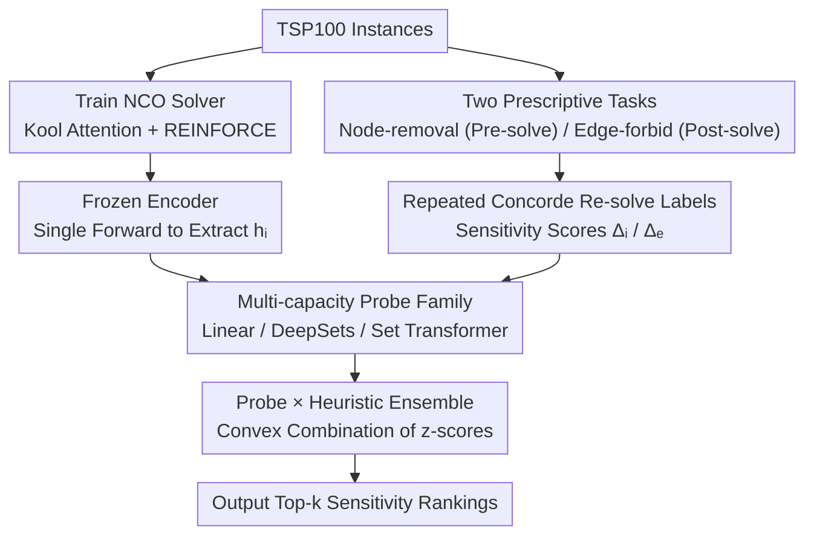

# Probing Neural TSP Representations for Prescriptive Decision Support

**Conference**: ICML 2026  
**arXiv**: [2602.07216](https://arxiv.org/abs/2602.07216)  
**Code**: https://github.com/ReubenNarad/tsp_prescriptive_probe  
**Area**: Neural Combinatorial Optimization / Representation Probing / Decision Support  
**Keywords**: TSP, neural CO, probing, sensitivity analysis, transfer learning

## TL;DR
The authors treat trained TSP neural solvers as "transferable encoders," using frozen representations and lightweight probes to predict two types of expensive operational sensitivity queries (node removal and edge forbidding). They systematically demonstrate that probe accuracy improves monotonically with solver quality and achieves Prev. SOTA through integration with traditional heuristics.

## Background & Motivation

**Background**: Neural Combinatorial Optimization (NCO) has successfully utilized attention strategies and Reinforcement Learning (RL) to train end-to-end solvers for problems like TSP/VRP (e.g., Pointer Network, Kool 2018, POMO). While fast and flexible, they remain less robust than classic exact or heuristic solvers (Concorde/LKH) and are typically positioned as "alternative solvers."

**Limitations of Prior Work**: Almost all NCO evaluations focus exclusively on tour cost or optimality gaps, discarding model representations as "byproducts." This means valuable internal structures learned by the solver (e.g., identifying node bottlenecks or indispensable edges) remain unexploited for logistics decision-making.

**Key Challenge**: Real-world logistics decisions go beyond constructing a single tour to "what-if" queries: Which warehouse removal impacts the total length most? Which road closure is most fatal? Answering these via repeated re-solving is prohibitively expensive, yet NCO solvers may potentially encode these answers in a single forward pass.

**Goal**: Formalize two "prescriptive" downstream tasks (node-removal sensitivity and edge-forbid sensitivity) and systematically examine: (1) whether frozen NCO encoders can predict these sensitivities; (2) whether encoders become more useful as training progresses; and (3) whether simple probe-heuristic ensembles can beat strong baselines.

**Key Insight**: Borrow the "probing" paradigm from NLP—fix pre-trained representations and train a lightweight classifier or regressor to recover target attributes. This determines whether information is explicitly encoded while naturally decoupling representation quality from probe capacity.

**Core Idea**: Treat TSP solvers as foundation encoders. Train DeepSets or Set Transformer probes on node embeddings to directly predict sensitivity scores for candidate nodes/edges. Use ensembling to combine probe scores with geometric heuristics via convex combinations for a solution that is both fast and powerful.

## Method

### Overall Architecture
The pipeline consists of three steps: (i) Training the NCO solver—based on the Kool 2018 attention model with REINFORCE rollout baseline, scanning three residual dimensions (64/128/256) and saving checkpoints every 2000 steps; (ii) Offline label generation—solving 100-node instances with Concorde to optimality, then re-solving for each candidate (node or tour edge) to record optimal length changes $\Delta_i$ or $\Delta_e$; (iii) Training probes—freezing the encoder, extracting the final layer node embeddings $h_i$, and feeding features (node task uses $h_i$; edge task uses $[h_u, h_v, |h_u-h_v|]$) into Linear, DeepSets, or Set Transformer heads to predict top-k sensitivity. The backbone provides representations while the Concorde labels provide supervision, merging at the probe training stage to produce final sensitivity rankings.

### Key Designs

1.  **Two Prescriptive Tasks and Query Alignment**:
    *   **Function**: Ground ambiguous "what-if" decisions into two quantifiable, supervised tasks aligned with real query scenarios.
    *   **Mechanism**: Node-removal is a *pre-solve advisory*—determining which customer removal is most beneficial before a route is decided; thus, it only uses instance geometry. Edge-forbid is a *post-solve contingency*—addressing road closures after a route is determined; thus, the candidate set is limited to $n$ edges on the tour. Labels are defined as $\Delta_i^{(\%)}=100\cdot(L^\star(X)-L^\star(X\setminus\{i\}))/L^\star(X)$ and $\Delta_e^{(\%)}=100\cdot(L^\star(X|\text{forbid }e)-L^\star(X))/L^\star(X)$, obtained via Concorde.
    *   **Design Motivation**: Explicitly incorporate information availability into the task definition to avoid incomparable oracle baselines. Restricting candidates to $O(n)$ ensures scalable probe training.

2.  **Frozen Encoder + Multi-capacity Probe Family**:
    *   **Function**: Identify the amount of sensitivity information encoded in representations while controlling variables.
    *   **Mechanism**: Extract per-node representations $h_i \in \mathbb R^d$ from the final encoder layer without autoregressive rollouts. The probe family spans the capacity spectrum: Linear readout, DeepSets (MLP over sets), and Set Transformer (permutation-invariant attention). Objectives include regression, hard CE, and soft listwise CE. Metrics used are top-1/top-5 accuracy and Spearman $\rho$.
    *   **Design Motivation**: Use "geometric features + same probe family" and "randomly initialized encoder + same probe family" as controls to isolate the contributions of probe capacity versus solver training.

3.  **Probe $\times$ Heuristic Ensemble & Solver-Representation Correlation**:
    *   **Function**: Obtain the strongest engineering predictor and reveal the law that "better solvers lead to better probes."
    *   **Mechanism**: For node-removal, Set Transformer probe scores are combined with geometry-only scores using per-instance z-score convex combinations. For edge-forbid, they are combined with 2-opt repair proxies. To verify scaling, probe training is repeated across 3 model sizes (0.44M/1.10M/3.36M) and checkpoints to correlate probe accuracy with negative optimality gap using Spearman $\rho$.
    *   **Design Motivation**: The ensemble leverages complementary errors between probe and heuristic signals. The solver-representation quality curve serves as the core scientific contribution by answering if better NCO training inherently provides better downstream features.

### Loss & Training
Solver: REINFORCE with rollout baseline, Adam lr $10^{-4}$, exponential decay $\gamma=0.998$, batch 512, 600k steps, temperature 0.5 sampling, greedy evaluation. Probes: Encoder remains frozen; training on cached representations. Data split: 2500/250/250 (node) and 800/100/100 (edge), with training set standardization for inputs.

## Key Experimental Results

### Main Results

Top-1 / Top-5 accuracy and Spearman $\rho$ for node-removal and edge-forbid on TSP100 (selection from Table 1):

| Method | Node Top-1 | Node Top-5 | Node $\rho$ | Edge Top-1 | Edge Top-5 | Edge $\rho$ |
|---|---|---|---|---|---|---|
| Nearest-neighbor Heuristic | 0.440 | 0.857 | 0.613 | – | – | – |
| Detour Heuristic | – | – | – | 0.540 | 0.940 | 0.668 |
| Geometry-only Set Transformer | 0.577 | 0.873 | 0.675 | 0.140 | 0.490 | 0.276 |
| Linear probe | 0.413 | 0.769 | 0.405 | 0.410 | 0.720 | 0.468 |
| DeepSets probe | 0.497 | 0.880 | 0.693 | 0.510 | 0.840 | 0.631 |
| Transformer probe | **0.615** | 0.902 | 0.736 | 0.462 | 0.818 | 0.626 |
| Probe + geometry / 2-opt Ensemble | **0.653** | **0.933** | **0.739** | **0.730** | **0.980** | **0.763** |

### Ablation Study

| Configuration | Edge Top-1 | Explanation |
|---|---|---|
| Linear probe, untrained policy | 0.130 | Probe capacity only, no representation signal |
| Transformer probe, untrained policy | 0.220 | High-capacity probe on random representations |
| Transformer probe, trained policy | 0.462 | Full model; representations provide 24+ point Gain |
| 2-opt repair (oracle) | 0.670 | Assumes known optimal tour |
| Ensemble (probe + 2-opt) | 0.730 | Probe compensates for oracle heuristic weaknesses |

### Key Findings
*   The edge-forbid task, which requires global structure sensitivity, highlights the value of representations: adding solver representations to the Set Transformer improved top-1 accuracy from 0.14 to 0.462 (a 3× Gain).
*   The "better solver $\Rightarrow$ better probe" relationship holds monotonically across most model sizes: on the 1.10M model, the Spearman $\rho$ between probe accuracy and solver optimality gap reached 0.71/0.45 (node) and 0.65/0.40 (edge).
*   Probe accuracy continues to rise even after tour cost has reached a plateau, suggesting that traditional NCO metrics (tour length) significantly underestimate progress in representation learning.

## Highlights & Insights
*   Using "query timing" to distinguish pre-solve and post-solve tasks, and matching them with allowed baseline information, is an effective practice for avoiding oracle leakage. This meta-method can be extended to any prescriptive analytics.
*   This is the first study to view NCO solvers as foundation encoders. It demonstrates to the OR community that training NCOs is not just about finding a good solution, but also about obtaining transferable features, potentially opening the "NCO foundation model" research direction.
*   The ensemble scheme is minimal (per-instance z-score + convex combination) yet consistently outperforms strong baselines, reminding us that learned representations and traditional heuristics are complementary rather than mutually exclusive.

## Limitations & Future Work
*   Evaluations were limited to Euclidean TSP100; it remains unknown if the results hold for larger $n$, non-uniform distributions, or constrained VRPs.
*   Label generation relies on repeated Concorde solving; edge-forbid costs approximately 49.6s per instance, leading to high data generation costs for larger probe training sets.
*   Only two types of sensitivity were examined. Actual logistics scenarios involve more complex what-if queries like dynamic node additions or vehicle capacity adjustments, warranting a unified multi-task probing framework.

## Related Work & Insights
*   **vs Zhang 2025 (CS-Probing)**: While they use probes to describe if NCO representations encode certain structures, Ours shifts to using representations to predict economically meaningful decision support metrics.
*   **vs Narad 2025 (sparse autoencoders for TSP)**: SAE extracts human-interpretable features. Ours utilizes supervised task-relevant probes. The two could be combined—using SAE to find units and probes to see which units contribute most to sensitivity.
*   **vs Lozano 2017 (TSP interdiction)**: Classical OR uses integer programming for interdiction; Ours replaces exact solving with learned ranking, returning decision suggestions in milliseconds.

## Rating
*   Novelty: ⭐⭐⭐⭐ First evaluation of NCO solvers as transferable encoders for prescriptive downstream tasks.
*   Experimental Thoroughness: ⭐⭐⭐⭐ Systematic use of multiple probe families, model sizes, training dynamics, and controls.
*   Writing Quality: ⭐⭐⭐⭐ Clear task definitions and rigorous design of heuristics and control experiments.
*   Value: ⭐⭐⭐⭐ Provides new perspectives for both the OR and ML communities; code is open-source and reproducible.

<!-- RELATED:START -->

## Related Papers

- [\[NeurIPS 2025\] Probing Neural Combinatorial Optimization Models](../../NeurIPS2025/optimization/probing_neural_combinatorial_optimization_models.md)
- [\[NeurIPS 2025\] Contribution of Task-Irrelevant Stimuli to Drift of Neural Representations](../../NeurIPS2025/optimization/contribution_of_task-irrelevant_stimuli_to_drift_of_neural_representations.md)
- [\[ICML 2026\] The Implicit Bias of Adam and Muon on Smooth Homogeneous Neural Networks](the_implicit_bias_of_adam_and_muon_on_smooth_homogeneous_neural_networks.md)
- [\[ICML 2026\] Learning-Augmented Scalable Linear Assignment Problem Optimization via Neural Dual Warm-Starts](learning-augmented_scalable_linear_assignment_problem_optimization_via_neural_du.md)
- [\[ICML 2026\] Neural QAOA$^2$: Differentiable Joint Graph Partitioning and Parameter Initialization for Quantum Combinatorial Optimization](neural_qaoa2_differentiable_joint_graph_partitioning_and_parameter_initializatio.md)

<!-- RELATED:END -->
