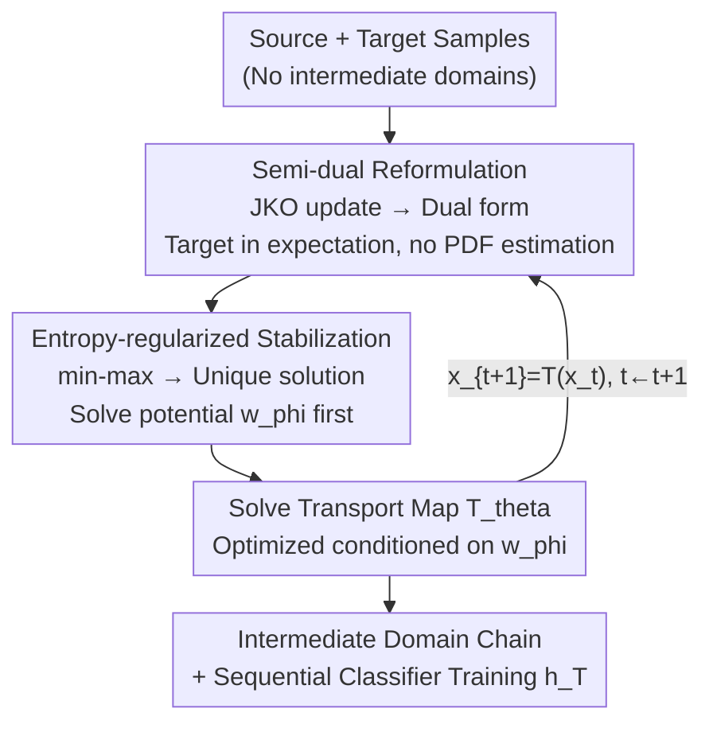

# Rethinking the Flow-Based Gradual Domain Adaptation: A Semi-Dual Optimal Transport Perspective

**Conference**: ICML2026  
**arXiv**: [2602.01179](https://arxiv.org/abs/2602.01179)  
**Code**: To be confirmed  
**Area**: Optimization / Optimal Transport / Gradual Domain Adaptation  
**Keywords**: Gradual Domain Adaptation, Semi-Dual Optimal Transport, Gradient Flow, Entropy Regularization, Adversarial Training Stability

## TL;DR
This paper reformulates flow-based Gradual Domain Adaptation (GDA), which typically constructs intermediate domains, as an Entropy-regularized Semi-dual Unbalanced Optimal Transport (E-SUOT) problem. By **bypassing explicit Probability Density Function (PDF) estimation** of the target domain and directly learning a sequence of transport maps to push source samples toward the target, the method consistently outperforms existing GDA/UDA approaches on Portraits, MNIST-rot, and Office-Home.

## Background & Motivation

**Background**: Unsupervised Domain Adaptation (UDA) aims to transfer knowledge from a labeled source domain to an unlabeled target domain. When the distribution shift is large, one-shot alignment can degrade discriminability and amplify pseudo-label errors during self-training. **Gradual Domain Adaptation (GDA)** addresses this by inserting intermediate domains $p_0, p_1, \dots, p_T$ to facilitate a step-by-step transition for the classifier. The core challenge in GDA is **how to construct these intermediate domains**. Flow-based methods are popular because they evolve distributions along continuous paths while preserving probability mass, naturally suiting interpolation.

**Limitations of Prior Work**: Standard flow methods (gradient flows) generate a velocity field $v_t = -\nabla \frac{\delta \mathbb{D}[p(x_t), p_T]}{\delta p}$ to drive samples, which depends on **explicit estimation of the target domain PDF**. For example, Zhuang et al. used score matching for target density estimation followed by Langevin dynamics. However, estimating a PDF from finite samples is an **ill-posed problem**. If the estimation is inaccurate, the flow may push samples into low-density regions, creating intermediate domains that do not align with the true target. The authors demonstrate this with a control experiment: EstTrans (estimation then transport) results in a 2-Wasserstein distance to the true target of $\mathcal{W}_2^2 \approx 9.7$, whereas DirTrans (direct mapping) achieves $\approx 7.8 \times 10^{-4}$, a four-order-of-magnitude difference.

**Key Challenge**: Flow methods require "constructing intermediate domains" but are bottlenecked by the requirement to "accurately estimate target density"—precisely the most unreliable step.

**Goal**: (1) Construct intermediate domains without estimating the target PDF; (2) Ensure generated domains are robust and stable; (3) Improve GDA performance.

**Key Insight**: The authors leverage a known equivalence: a forward Euler discretization of an $f$-divergence gradient flow is equivalent to solving an **optimization problem with a Wasserstein regularization term** (the JKO-type step update in Eq. 4). Instead of the "estimate density → calculate velocity → evolve" sequence, one can **directly solve this optimization problem** to pull samples toward the target domain.

**Core Idea**: Reformulate flow-based GDA as **semi-dual optimal transport**. Through duality, the target distribution $p_T$ appears only in the form of an expectation (estimable via Monte Carlo without requiring density). By adding **entropy regularization**, the unstable min-max adversarial structure is converted into a stable, sequentially optimizable problem with a unique solution.

## Method

### Overall Architecture
E-SUOT takes labeled source samples and unlabeled target samples as input and outputs a sequence of transport maps $\mathcal{T} = \{\boldsymbol{T}_{\theta, t}\}_{t=0}^{T-1}$ that push samples from the current domain $x_t$ to the next $x_{t+1} = \boldsymbol{T}_{\theta, t}(x_t)$. The classifier is then trained sequentially along this path.

The pipeline follows three stages: first, the primal JKO-type update is transformed into its **semi-dual form**, which contains only expectations (addressing the PDF estimation issue). Second, **entropy regularization** is applied to convert the $\sup$-$\inf$ adversarial structure into a stable sequential optimization where the potential $w_\phi$ is solved before the transport map $\boldsymbol{T}_\theta$. Finally, this single-step process is iterated for $t=0 \to T-1$ to build the intermediate domain chain.

### Key Designs

**1. Semi-dual Reformulation: Replacing Density Estimation with Expectation**

The critical dependency on target PDF estimation is removed. Starting from the JKO-type update (Eq. 4):

$$p(x_{t+\eta})=\arg\min_{\rho\in\mathcal{P}_2}\frac{1}{2\eta}\mathcal{W}_2^2(\rho,p(x_t))+\mathbb{D}_f[\rho,p_T],$$

which is a primal problem requiring both Wasserstein distance and $f$-divergence (touching target density). Proposition 3.1 transforms this into the **semi-dual** form (Eq. 7):

$$\mathcal{L}^{\text{SemiDual}}=\sup_w\,\mathbb{E}_{p(x_t)}\!\Big[\inf_{\boldsymbol{T}}\tfrac{1}{2\eta}\|\boldsymbol{T}(x_t)-x_t\|_2^2-w(\boldsymbol{T}(x_t))\Big]-\mathbb{E}_{p_T(x)}[f^\star(-w(x))],$$

where $w$ is the dual potential, $\boldsymbol{T}$ is the transport map, and $f^\star$ is the convex conjugate of $f$. Crucially, **$p(x_t)$ and $p_T$ appear only via the expectation operator $\mathbb{E}$**, eliminating the need for density values and allowing for direct Monte Carlo estimation.

**2. Entropy Regularization: Converting Adversarial min-max to Sequential Optimization**

While the semi-dual form avoids density, the $\sup$-$\inf$ structure is unstable and solutions may not be unique (Proposition 3.2). By adding **entropy regularization** (KL divergence relative to a reference joint distribution), the authors derive the Entropy-regularized Semi-dual (Eq. 9):

$$\mathcal{L}^{\text{E-SemiDual}}=\inf_w\,\mathbb{E}_{p_T}[f^\star(-w(x))]+\epsilon\,\mathbb{E}_{p(x_t)}\Big[\log\mathbb{E}_{p_T}\exp\big(\tfrac{w(x)-\frac{1}{2\eta}\|x-x_t\|_2^2}{\epsilon}\big)\Big].$$

This provides two benefits: (i) it replaces the inner $\inf$ with a **log-sum-exp soft-min**, eliminating the adversarial nature and ensuring a unique solution for $w$ (Proposition 3.4); and (ii) it allows training to be split into **two sequential steps**—first optimizing $w_\phi$ independently, then optimizing $\boldsymbol{T}_\theta$ **conditioned on $w_\phi$**:

$$\arg\min_\theta\ \tfrac{1}{2\eta}\|x_t-\boldsymbol{T}_\theta(x_t)\|_2^2-w_\phi(\boldsymbol{T}_\theta(x_t)).$$

**3. Domain Iteration and Sequential Classifier Training**

To build the full GDA chain, the single-step process is iterated (Algorithm 1): for each step $t$, $w_{\phi,t}$ and $\boldsymbol{T}_{\theta,t}$ are updated over $\mathcal{E}$ epochs. Samples are pushed to the next domain via $x_{t+1}^{(i)} = \boldsymbol{T}_{\theta,t}(x_t^{(i)})$. Finally, the classifier $h$ is trained stage-by-stage: at each step, $x_t$ is mapped to $x_{t+1}$ and used to update $h_t$, gradually adapting the source classifier $h_0$ to the target $h_T$.

### Loss & Training
The potential $w_\phi$ is optimized using the E-SemiDual objective (Eq. 9), while $\boldsymbol{T}_\theta$ minimizes the "transport cost minus potential" (Eq. 10). KL divergence ($f(u) = u \log u$) is used by default. Theoretical guarantees include Proposition 3.5, which proves the evolved distribution approaches the target as $t$ increases, and Proposition 3.6, which provides an upper bound on the target domain generalization error.

## Key Experimental Results

### Main Results
On Portraits and MNIST-rot (using UMAP embeddings), E-SUOT achieves the best performance, particularly on high-difficulty tasks like MNIST 60°:

| Dataset | Source | GGF (Prev. Flow SOTA) | STDW | E-SUOT | Gain vs. Source |
|---------|--------|-----------------------|------|--------|-----------------|
| Portraits | 71.2 | 83.4 | 84.3 | **86.4** | ↑21.5% |
| MNIST 45° | 58.4 | 57.7 | 60.3 | **72.1** | ↑23.4% |
| MNIST 60° | 36.8 | 40.8 | 43.9 | **51.0** | ↑38.6% |

Notably, flow methods like GGF sometimes underperform the source-only baseline (e.g., -1.2% on MNIST 45°), likely due to poor density estimation, highlighting E-SUOT's advantage. On UDA (Office-Home), E-SUOT achieves an average of 73.5%, the highest among all baselines.

| Method | Office-Home Avg. |
|--------|------------------|
| GVB-GD | 70.4 |
| CST | 72.9 |
| GGF | 72.9 |
| CoVi | 73.1 |
| **E-SUOT** | **73.5** |

### Ablation Study
Ablations on training strategies and $f^\star$ functions across three GDA datasets (Accuracy %):

| Configuration | Portraits | MNIST 45° | MNIST 60° | Note |
|---------------|-----------|-----------|-----------|------|
| **Entropy + KL (Full)** | **86.4** | **72.1** | **51.0** | E-SUOT |
| Adversarial + KL | 74.8 (↓13.4%) | 52.0 (↓27.8%) | 34.9 (↓31.5%) | Eq. 7 without Entropy |
| Barycentric + KL | 83.9 (↓3.0%) | 62.5 (↓13.3%) | 38.3 (↓24.8%) | Estimate plan then project |
| Entropy + SftPls | 80.1 | 59.7 | 38.2 | Variant conjugate |
| Entropy + χ² | 79.8 | 60.2 | 42.4 | χ² divergence |

### Key Findings
- **Entropy regularization is essential for stability**: Removing it (Adversarial + KL) causes significant performance drops (up to 31.5%), supporting the theory that it resolves non-uniqueness in adversarial solutions.
- **Direct mapping > Barycentric projection**: End-to-end mapping learning consistently outperforms two-step projection methods.
- **KL divergence is the most stable $f$-divergence**: Its conjugate aligns perfectly with the log-sum-exp structure.
- **Greater benefits in harder scenarios**: The relative improvement is highest (38.6%) on MNIST 60°, where the shift is most severe.

## Highlights & Insights
- **Reformulating construction as optimization**: The key insight is that JKO-type updates allow bypassing ill-posed density estimation in favor of direct optimization.
- **Three-in-one entropy regularization**: It simultaneously (i) removes the min-max competition, (ii) ensures a unique solution, and (iii) facilitates stable sequential training.
- **Theoretic-Empirical alignment**: Theoretical predictions regarding non-uniqueness are empirically validated by the failure of the adversarial variant.
- **Extensible idea**: This semi-dual OT approach could be applied to other tasks requiring "driving forces" (generation, sampling) where target density estimation is difficult.

## Limitations & Future Work
- **Standard GDA assumptions**: The work assumes smooth label functions and gradual shifts, which may not hold in all real-world scenarios.
- **Hyperparameter dependence**: Parameters like $T$, $\eta$, and $\epsilon$ currently require manual tuning.
- **UDA margin**: While superior on Office-Home, the performance gain over recent SOTA methods is relatively small (0.4%).
- **Entropy bias**: Large $\epsilon$ values ensure stability but diverge from the original OT solution; the optimal trade-off remains an area for exploration.

## Related Work & Insights
- **vs. GGF / CNF**: These methods rely on explicit density estimation (scores/flows) to drive samples, which this paper shows can be catastrophic if inaccurate.
- **vs. GOAT / STDW**: While effective, these can be inconsistent across datasets. E-SUOT demonstrates more robust stability.
- **vs. Neural OT**: E-SUOT borrows neural parameterization but solves the inherent instability of adversarial OT specifically for the GDA context.

## Rating
- Novelty: ⭐⭐⭐⭐⭐ 
- Experimental Thoroughness: ⭐⭐⭐⭐ 
- Writing Quality: ⭐⭐⭐⭐ 
- Value: ⭐⭐⭐⭐ 

<!-- RELATED:START -->

## Related Papers

- [\[CVPR 2026\] HFedATM: Hierarchical Federated Domain Generalization via Optimal Transport and Regularized Mean Aggregation](../../CVPR2026/optimization/hfedatm_hierarchical_federated_domain_generalization_via_optimal_transport_and_r.md)
- [\[ICML 2026\] Distribution Alignment for One-Shot Federated Learning via Optimal Transport](distribution_alignment_for_one-shot_federated_learning_via_optimal_transport.md)
- [\[ICLR 2026\] A Scalable Constant-Factor Approximation Algorithm for $W_p$ Optimal Transport](../../ICLR2026/optimization/a_scalable_constant-factor_approximation_algorithm_for_w_p_optimal_transport.md)
- [\[ICML 2026\] Learning Dynamics of Zeroth-Order Optimization: A Kernel Perspective](learning_dynamics_of_zeroth-order_optimization_a_kernel_perspective.md)
- [\[ICML 2025\] Sparse Causal Discovery with Generative Intervention for Unsupervised Graph Domain Adaptation](../../ICML2025/optimization/sparse_causal_discovery_with_generative_intervention_for_unsupervised_graph_doma.md)

<!-- RELATED:END -->
