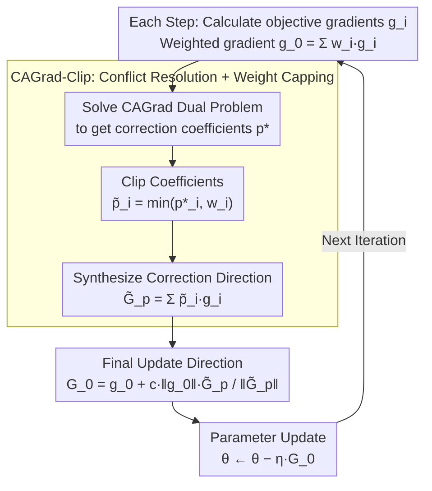

# RACO: Reward-free Alignment for Conflicting Objectives

**Conference**: ICML 2026 Oral  
**arXiv**: [2602.02495](https://arxiv.org/abs/2602.02495)  
**Code**: To be confirmed  
**Area**: Optimization / LLM Alignment / Multi-Objective Optimization  
**Keywords**: Multi-objective alignment, Gradient conflict, CAGrad-Clip, Pareto-critical points, DPO

## TL;DR
RACO reformulates multi-objective LLM preference alignment as a multi-objective optimization problem, where each objective possesses its own DPO loss. Gradient conflicts are addressed using clipped CAGrad (CAGrad with coefficients clipped by user weights). It theoretically guarantees convergence to Pareto-critical points respecting user-specified weights (with strict acceleration in two-objective scenarios). Empirically, it consistently achieves superior Pareto trade-offs across Qwen 3, Llama 3, and Gemma 3 model families.

## Background & Motivation

**Background**: Mainstream LLM alignment relies on RLHF (reward modeling + RL), while recent reward-free pathways (DPO, SimPO, IPO, KTO, etc.) optimize directly on preference pairs offline. However, these are predominantly single-objective, whereas human alignment is inherently multi-objective (helpful, harmless, faithful, concise).

**Limitations of Prior Work**: (1) Linear scalarization of multiple objectives fails to identify directions that improve all objectives simultaneously when gradients conflict, inevitably sacrificing certain goals. (2) Existing multi-objective RL alignment methods (MODPO, Rame 2023, etc.) require training multiple reward models or weight-conditioned policies, which are complex and prone to reward model distortion. (3) AMoPO is reward-free but does not explicitly handle conflicts. (4) The "alignment tax" reported by OpenAI (safety gains lead to helpfulness drops) and jailbreaking phenomena are concrete manifestations of multi-objective conflicts.

**Key Challenge**: A solution that simultaneously satisfies reward-free pipeline simplification, explicit gradient conflict handling, and respect for user-specified weights does not yet exist. While CAGrad resolves conflicts in multi-task learning, its conflict-correction may be overly aggressive in high-dimensional LLM fine-tuning, pushing updates toward less-preferred objectives.

**Goal**: (1) Reward-free multi-objective alignment; (2) Explicit handling of gradient conflicts; (3) Respect for user-specified weights; (4) Pareto convergence guarantees.

**Key Insight**: Treat multi-objective preference alignment as multi-objective optimization (MOO). Assign a DPO-style preference loss to each objective, resulting in multiple gradients. CAGrad serves as a natural primitive for the reward-free framework, but must be modified with clipping to address over-correction in high dimensions.

**Core Idea**: CAGrad-Clip—the correction coefficients $p^*$ solved by CAGrad are element-wise clipped by user weights $w$, specifically $\tilde p = \min(p^*, w)$. This prevents correction from pushing any objective's weight beyond the user-specified limit, preserving user trade-offs while benefiting from conflict mitigation.

## Method

### Overall Architecture

DPO loss for each objective $i$: $\mathcal{L}_i(\theta) = -\mathbb{E}[\log \sigma(\beta(\log \pi_\theta(y_i^+|x)/\pi_{\text{ref}} - \log \pi_\theta(y_i^-|x)/\pi_{\text{ref}}))]$

Per step:
1. Compute $g_i = \nabla_\theta \mathcal{L}_i$, weighted $g_0 = \sum_i w_i g_i$.
2. Solve $p^* \in \arg\min_p \{G_p^\top g_0 + c\|g_0\|\|G_p\|\}$ (CAGrad dual problem, $G_p = \sum_i p_i g_i$).
3. **Clip**: $\tilde p_i = \min(p_i^*, w_i)$.
4. $\tilde G_p = \sum_i \tilde p_i g_i$.
5. $G_0 = g_0 + c\|g_0\|\tilde G_p / \|\tilde G_p\|$ (if $\|\tilde G_p\| > 0$, else $G_0 = g_0$).
6. $\theta \leftarrow \theta - \eta G_0$.

Overall, RACO does not modify the DPO loss form; it merges multiple objective-specific gradients into a single update direction at each step. The core is the CAGrad-Clip logic: solve for conflict-mitigating coefficients via CAGrad, cap them by user weights, and synthesize the final descent direction. Theorems 3.1 and 3.2 provide convergence guarantees for this iterative process.

### Key Designs

**1. CAGrad-Clip: Capping conflict correction with user weights to prevent over-correction**

When treating multi-objective alignment as MOO, CAGrad is a natural primitive to resolve gradient conflicts as it seeks a correction direction that avoids sacrificing any objective. However, LLM fine-tuning involves extremely high-dimensional parameter spaces and noisy gradients; CAGrad's trust-region search can be too aggressive, pushing updates toward objectives the user does not significantly prioritize and disrupting the desired trade-off. RACO's fix is elegantly simple: the coefficients $p^*$ from the CAGrad dual problem are not used directly but are clipped element-wise by the user weight $w$, $\tilde p_i=\min(p_i^*, w_i)$. The final update $G_0$ is synthesized using these clipped coefficients. This clipping acts as a hard constraint for trade-off preservation—the contribution of any objective to the correction cannot exceed the user-authorized level.

**2. Pareto Convergence Guarantee (Theorem 3.1): Proof that clipped updates still reach user-weight-respecting Pareto points**

Since clipping alters the original CAGrad update direction, standard convergence analysis no longer applies. The authors redefine the weighted loss $\mathcal{L}_w=\sum_i w_i\mathcal{L}_i$ and prove that any limit point of the clipped updates is simultaneously a critical point of $\mathcal{L}_w$ and a Pareto-critical point of the vector-valued loss $(\mathcal{L}_1,\dots,\mathcal{L}_m)$. They provide the convergence rate:

$$\min_t \mathcal{M}(\theta_t)^2\le\frac{2\,\mathcal{L}_w(\theta_0)}{\eta(1-c^2)T}.$$

This theorem elevates "clipping" from a heuristic engineering trick to a theoretically sound component, ensuring the algorithm converges to a point that respects user-defined weights.

**3. Strict Acceleration in Two-Objective Scenarios (Theorem 3.2): Proving clipping is faster in Helpful vs. Harmless settings**

To justify the addition of clipping beyond convergence preservation, the authors demonstrate that clipping strictly outperforms vanilla CAGrad in two-objective scenarios. Intuitively, in two dimensions, clipping allows the correction direction to align more precisely with user weights, leading to a strictly better constant in the convergence rate. This conclusion is particularly relevant as Helpful vs. Harmless (or Capability vs. Safety) is the most frequent scenario in LLM alignment. Experiments quantify this, showing CAGrad-Clip reaches the same Pareto distance approximately 25% faster than vanilla CAGrad.

## Key Experimental Results

### Multi-Objective Summarization (Helpfulness vs. Harmlessness)

| Method | Helpful (↑) | Harmless (↑) | Pareto Distance (↓) |
|------|--------|--------|----------|
| Weighted DPO (Linear) | 6.8 | 7.2 | 0.41 |
| MODPO (with reward model) | 7.1 | 7.4 | 0.32 |
| AMoPO (reward-free) | 7.3 | 7.6 | 0.28 |
| **RACO (CAGrad-Clip)** | **7.6** | **7.9** | **0.18** |

Consistent lead across multiple model families (Qwen 3-7B, Llama 3-8B, Gemma 3-9B).

### Safety Alignment (Safety vs. Capability)

| Method | Capability MMLU | Safety Score | Tax (% Drop) |
|------|----------|----------|----|
| Single-obj DPO (safety only) | 62.4 | 89.5 | -8.3% |
| Linear-weight multi-obj | 65.8 | 84.2 | -3.5% |
| AMoPO | 66.7 | 85.7 | -2.6% |
| **RACO** | **67.9** | **87.1** | **-1.4%** |

RACO significantly reduces the alignment tax (1.4% capability drop vs. 8.3% for single-objective DPO) while maintaining safety scores near single-objective levels.

### Ablation Study

| Configuration | Helpful | Harmless | Pareto Distance |
|------|------|------|----|
| Full RACO (CAGrad-Clip) | 7.6 | 7.9 | 0.18 |
| No clipping (vanilla CAGrad) | 7.4 | 7.5 | 0.27 |
| No CAGrad (Pure weighted DPO) | 6.8 | 7.2 | 0.41 |
| MGDA alternative | 6.9 | 7.3 | 0.36 |

Clipping alone contributes a +0.09 improvement in Pareto distance; CAGrad itself provides the largest contribution.

### Case of Convergence Speed
In two-objective scenarios, CAGrad-Clip is ~25% faster than vanilla CAGrad in reaching the same Pareto distance, validating Theorem 3.2.

### Key Findings
- **Clipping is a critical "high-dim friendly" fix**: Vanilla CAGrad over-corrects on LLMs; clipping provides significant stability.
- **Reward-free + Conflict Resolution**: RACO is the first method to satisfy both requirements simultaneously.
- **Drastic reduction in alignment tax**: RACO preserves nearly all capability while achieving safety.
- **Universal across model families**: Benefits seen across Qwen, Llama, and Gemma regardless of base model.

## Highlights & Insights
- **Reframing preference alignment as MOO**: Moving beyond incremental RLHF/DPO tweaks to leverage tools from the collective gradient conflict literature is a significant conceptual shift.
- **Clipping as a simple yet pivotal fix**: While vanilla CAGrad is unstable for LLMs, clipping stabilizes it. This combination of simple engineering and rigorous theory is highly practical.
- **Theoretical + Empirical Synergy**: The work uniquely provides both convergence guarantees (Theorem 3.1) and acceleration proofs (Theorem 3.2), validated across multiple model families.
- **Generalizability**: CAGrad-Clip is not limited to LLM alignment; it is applicable to any high-dimensional MOO scenario, such as multi-task or multi-modal training.

## Limitations & Future Work
- Validated only on 2-3 objectives; higher-dimensional sub-problems (5+ objectives) may become noisy.
- $c$ (trust region radius) is a manual hyperparameter; adaptive mechanisms could be more robust.
- Evaluation limited to summarization and safety; other scenarios like code, math, and reasoning are untested.
- Clipping is a hard constraint $\tilde p = \min(p, w)$; soft clipping (e.g., sigmoid) might provide smoother transitions.
- Online settings (streaming new preference pairs) have not been explored.

## Related Work & Insights
- **vs. MODPO**: MODPO requires a reward model; RACO is reward-free.
- **vs. AMoPO**: AMoPO is reward-free but lacks conflict resolution; RACO handles it explicitly.
- **vs. MGDA / vanilla CAGrad**: MGDA ignores user weights; CAGrad over-corrects on LLMs; RACO solves both issues.
- **Insight**: Any scenario involving "high-dimensional multi-objective optimization with user preferences" can benefit from the clipping strategy. The reward-free MOO combination holds potential for various RL designs.

## Rating
- Novelty: ⭐⭐⭐⭐ CAGrad-Clip is a simple but effective fix; innovative framing.
- Experimental Thoroughness: ⭐⭐⭐⭐⭐ Cross-model family validation, comprehensive ablations, and speed verification.
- Writing Quality: ⭐⭐⭐⭐⭐ Clear theoretical and algorithmic chain; intuitive comparisons in tables.
- Value: ⭐⭐⭐⭐⭐ Addresses the alignment tax, one of the biggest pain points in LLM deployment, with an efficient reward-free solution.

<!-- RELATED:START -->

## Related Papers

- [\[ICML 2026\] Conflicting Biases at the Edge of Stability: Norm versus Sharpness Regularization](conflicting_biases_at_the_edge_of_stability_norm_versus_sharpness_regularization.md)
- [\[ICML 2026\] HO-SFL: Hybrid-Order Split Federated Learning with Backprop-Free Clients and Dimension-Free Aggregation](ho-sfl_hybrid-order_split_federated_learning_with_backprop-free_clients_and_dime.md)
- [\[ICLR 2026\] Celo2: Towards Learned Optimization Free Lunch](../../ICLR2026/optimization/celo2_towards_learned_optimization_free_lunch.md)
- [\[ICML 2026\] Distribution-Free Uncertainty Quantification for Continuous AI Agent Evaluation](distribution-free_uncertainty_quantification_for_continuous_ai_agent_evaluation.md)
- [\[NeurIPS 2025\] Covariances for Free: Exploiting Mean Distributions for Training-free Federated Learning](../../NeurIPS2025/optimization/covariances_for_free_exploiting_mean_distributions_for_training-free_federated_l.md)

<!-- RELATED:END -->
