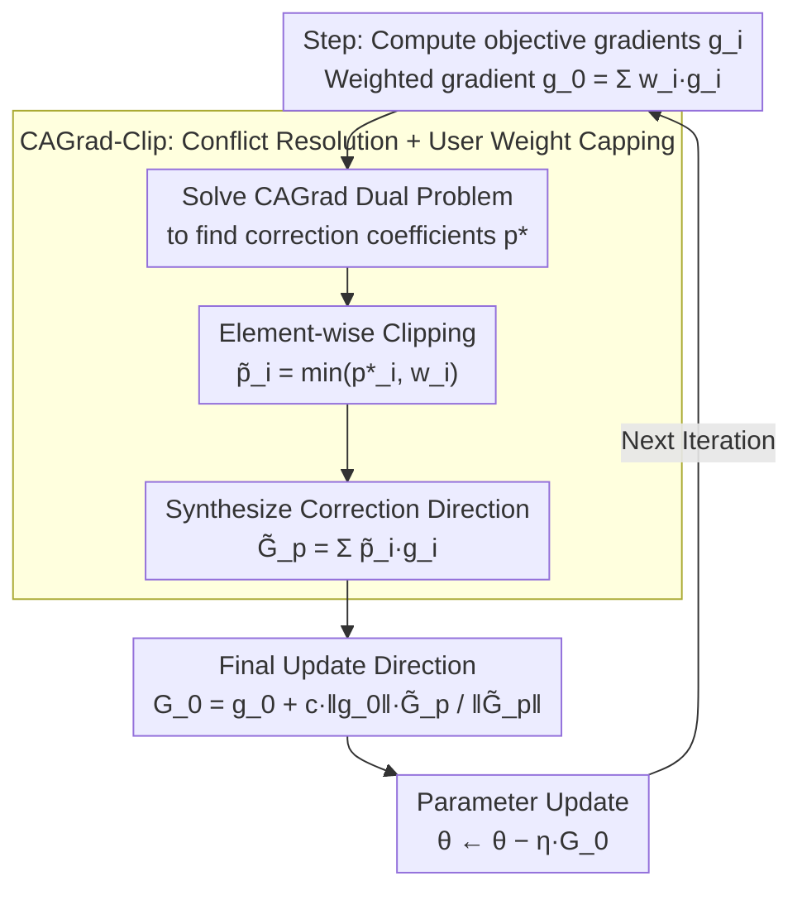

# RACO: Reward-free Alignment for Conflicting Objectives

**Conference**: ICML 2026 Oral  
**arXiv**: [2602.02495](https://arxiv.org/abs/2602.02495)  
**Code**: To be confirmed  
**Area**: Optimization / LLM Alignment / Multi-Objective Optimization  
**Keywords**: Multi-objective alignment, Gradient conflict, CAGrad-Clip, Pareto-critical point, DPO

## TL;DR
RACO reframes multi-objective LLM preference alignment as a multi-objective optimization problem—where each objective follows its own DPO loss. Gradient conflicts are resolved using clipped CAGrad (CAGrad combined with user-weight-based coefficient clipping). The authors theoretically prove convergence to a Pareto-critical point that respects user-specified weights (with strict acceleration for clipping in two-objective scenarios), and empirically demonstrate consistently better Pareto trade-offs across Qwen 3, Llama 3, and Gemma 3 model families.

## Background & Motivation

**Background**: Mainstream LLM alignment follows RLHF (reward modeling + RL), while recent reward-free DPO routes (DPO, SimPO, IPO, KTO, etc.) optimize directly on preference pairs offline. However, these are almost exclusively single-objective, whereas human alignment is inherently multi-objective (e.g., helpful, harmless, faithful, and concise).

**Limitations of Prior Work**: (1) Linear scalarization for multi-objective aggregation fails when gradients conflict, as no single direction can improve all objectives simultaneously, inevitably sacrificing some. (2) Existing multi-objective RL alignment methods (e.g., MODPO, Rame 2023) require training multiple reward models or weight-conditioned policies, which increases complexity and introduces reward model distortion. (3) AMoPO is reward-free but does not explicitly handle conflicts. (4) The "alignment tax" (where safety gains cause helpfulness to drop) and jailbreak phenomena reported by OpenAI are specific manifestations of multi-objective conflict.

**Key Challenge**: A solution that simultaneously offers reward-free pipeline simplification, explicit gradient conflict handling, and respect for user-specified weights does not currently exist. While CAGrad addresses conflict in multi-task learning, its conflict-correction may be overly aggressive in high-dimensional LLM fine-tuning, pushing updates toward less-preferred objectives.

**Goal**: (1) Reward-free multi-objective alignment; (2) Explicit gradient conflict handling; (3) Respect for user-specified weights; (4) Pareto convergence guarantees.

**Key Insight**: Treat multi-objective preference alignment as multi-objective optimization—one DPO-style preference loss per objective, yielding individual gradients. CAGrad serves as a natural primitive for a reward-free framework; however, clipping is introduced to address the over-correction problem in high-dimensional spaces.

**Core Idea**: CAGrad-Clip—The correction coefficients $p^*$ derived from CAGrad are element-wise clipped by the user weights $w$, specifically $\tilde p = \min(p^*, w)$. This prevents correction from pushing any objective weight beyond the user-specified limit, preserving user trade-offs while benefiting from conflict mitigation.

## Method

### Overall Architecture

The DPO loss for each objective $i$ is defined as: $\mathcal{L}_i(\theta) = -\mathbb{E}[\log \sigma(\beta(\log \pi_\theta(y_i^+|x)/\pi_{\text{ref}} - \log \pi_\theta(y_i^-|x)/\pi_{\text{ref}}))]$

At each step:
1. Compute $g_i = \nabla_\theta \mathcal{L}_i$ and the weighted gradient $g_0 = \sum_i w_i g_i$.
2. Solve $p^* \in \arg\min_p \{G_p^\top g_0 + c\|g_0\|\|G_p\|\}$ (the CAGrad dual problem, where $G_p = \sum_i p_i g_i$).
3. **Clip**: $\tilde p_i = \min(p_i^*, w_i)$.
4. Compute $\tilde G_p = \sum_i \tilde p_i g_i$.
5. Compute $G_0 = g_0 + c\|g_0\|\tilde G_p / \|\tilde G_p\|$ (if $\|\tilde G_p\| > 0$, otherwise $G_0 = g_0$).
6. Update parameters: $\theta \leftarrow \theta - \eta G_0$.

In summary, RACO maintains the standard DPO loss form but recombines individual gradients into a single update direction at each step. The core mechanism is the CAGrad-Clip sequence: solving for coefficients to mitigate conflict, capping them based on user weights, and synthesizing the final descent direction. Theorems 3.1 and 3.2 guarantee the convergence of this iterative process (see Key Designs 2 and 3).

### Key Designs

**1. CAGrad-Clip: Capping conflict correction with user weights to prevent over-correction**

By framing alignment as multi-objective optimization, CAGrad becomes a natural primitive for resolving conflicts as it seeks a correction direction that ensures no objective is sacrificed. However, in the extremely high-dimensional parameter space of LLM fine-tuning with noisy gradients, CAGrad’s trust-region search can be overly aggressive, pushing updates toward objectives the user favors less and disrupting the intended trade-off. RACO introduces a simple yet critical fix: the dual problem coefficients $p^*$ are clipped element-wise by user weights $w$, resulting in $\tilde p_i=\min(p_i^*, w_i)$. The final update $G_0$ is synthesized using these clipped weights. This clipping acts as a trade-off-preserving hard constraint, ensuring no objective's influence is boosted beyond the authorized limit, thereby achieving conflict mitigation without deviating from user-specified priorities.

**2. Pareto Convergence Guarantee (Theorem 3.1): Proving clipped updates reach user-weight-respecting Pareto points**

Since clipping modifies the original CAGrad direction, the original convergence analysis no longer applies. The authors prove that any limit point of the clipped updates is simultaneously a critical point of the weighted loss $\mathcal{L}_w=\sum_i w_i\mathcal{L}_i$ and a Pareto-critical point of the vector-valued loss $(\mathcal{L}_1,\dots,\mathcal{L}_m)$. They establish the convergence rate as:

$$\min_t \mathcal{M}(\theta_t)^2\le\frac{2\,\mathcal{L}_w(\theta_0)}{\eta(1-c^2)T}.$$

This theorem elevates clipping from a mere engineering trick to a theoretically sound component, ensuring the algorithm converges to a point that respects user-given weights rather than an arbitrary Pareto point.

**3. Strict Acceleration in Two-Objective Scenarios (Theorem 3.2): Proving clipping is faster for helpful vs. harmless settings**

Beyond preserving convergence, the authors demonstrate that clipping is strictly superior to vanilla CAGrad in two-objective scenarios. The intuition is that clipping allows the correction direction to align more precisely with user weights, leading to a strictly better constant in the convergence rate. This conclusion is particularly significant as most LLM alignment tasks involve two objectives (e.g., helpfulness vs. harmlessness, capability vs. safety). Experimental results quantify this acceleration, showing that CAGrad-Clip reaches the same Pareto distance approximately 25% faster than vanilla CAGrad.

## Key Experimental Results

### Main Results: Multi-objective Summarization (Helpfulness vs. Harmlessness)

| Method | Helpful (↑) | Harmless (↑) | Pareto Distance (↓) |
|------|--------|--------|----------|
| Weighted DPO (Linear) | 6.8 | 7.2 | 0.41 |
| MODPO (with reward model) | 7.1 | 7.4 | 0.32 |
| AMoPO (reward-free) | 7.3 | 7.6 | 0.28 |
| **Ours (RACO)** | **7.6** | **7.9** | **0.18** |

RACO consistently leads across multiple model families (Qwen 3-7B, Llama 3-8B, Gemma 3-9B).

### Main Results: Safety Alignment (Safety vs. Capability)

| Method | Capability MMLU | Safety Score | Tax (% Decrease) |
|------|----------|----------|----|
| Single-obj DPO (safety only) | 62.4 | 89.5 | -8.3% |
| Linear-weight multi-obj | 65.8 | 84.2 | -3.5% |
| AMoPO | 66.7 | 85.7 | -2.6% |
| **Ours (RACO)** | **67.9** | **87.1** | **-1.4%** |

RACO significantly reduces the alignment tax (1.4% capability drop vs. 8.3% for single-objective DPO) while maintaining safety scores near those of pure safety training.

### Ablation Study

| Configuration | Helpful | Harmless | Pareto Distance |
|------|------|------|----|
| Full RACO (CAGrad-Clip) | 7.6 | 7.9 | 0.18 |
| w/o clipping (vanilla CAGrad) | 7.4 | 7.5 | 0.27 |
| w/o CAGrad (pure weighted DPO) | 6.8 | 7.2 | 0.41 |
| Replace with MGDA | 6.9 | 7.3 | 0.36 |

Clipping alone improves the Pareto distance by 0.09, while CAGrad provides the largest individual contribution.

### Key Findings
- **Clipping is essential for high-dimensional stability**: Vanilla CAGrad over-corrects in LLMs, whereas clipping provides stabilization.
- **Reward-free + Conflict Resolution**: RACO is the first method to successfully combine both features.
- **Significant reduction in alignment tax**: RACO allows capability to remain nearly static while achieving safety alignment.
- **Universal across model families**: Benefits were observed across Qwen, Llama, and Gemma regardless of model architecture.

## Highlights & Insights
- **Reframing Alignment**: Reframes multi-objective preference alignment into the established domain of multi-objective optimization, transferring powerful tools from gradient conflict literature to LLM alignment.
- **Simple yet critical optimization**: Clipping is a simple engineering fix with profound impacts on stability in high-dim spaces, grounded in rigorous theoretical analysis.
- **Theoretical-Empirical Harmony**: Provides both convergence guarantees (Theorem 3.1) and practical acceleration proofs (Theorem 3.2), validated across multiple model families.
- **Generalizability**: The CAGrad-Clip mechanism is not limited to LLM alignment and can be applied to any high-dimensional multi-objective scenario, such as multi-task or multi-modal learning.

## Limitations & Future Work
- Validation was restricted to 2-3 objectives; higher counts (5+) may increase CAGrad sub-problem dimensionality and noise.
- The trust region radius $c$ is a manual hyperparameter; adaptive mechanisms might be more robust.
- Evaluation focused on summarization and safety; other domains like coding, math, or reasoning were not tested.
- Clipping is implemented as a hard constraint; soft clipping (e.g., sigmoid-based) could offer smoother optimization.
- The online setting (streaming preference pairs) remains unexplored.

## Related Work & Insights
- **vs. MODPO**: MODPO requires a reward model; RACO is reward-free.
- **vs. AMoPO**: AMoPO is reward-free but lacks conflict handling; RACO explicitly manages gradient conflict.
- **vs. MGDA / vanilla CAGrad**: MGDA ignores user weights, and CAGrad over-corrects in LLMs; RACO resolves both issues.
- **Insight**: The "reward-free + multi-objective" combination provides a blueprint for adapting RL designs to more efficient LLM alignment frameworks.

## Rating
- Novelty: ⭐⭐⭐⭐ CAGrad-Clip is a simple but effective innovation with a strong conceptual framing.
- Experimental Thoroughness: ⭐⭐⭐⭐⭐ Comprehensive cross-model validation with detailed ablations and convergence analysis.
- Writing Quality: ⭐⭐⭐⭐⭐ Clear logical flow between theory and empirical results.
- Value: ⭐⭐⭐⭐⭐ Directly addresses the alignment tax, one of the most significant pain points in LLM deployment.

<!-- RELATED:START -->

## Related Papers

- [\[ICML 2026\] HO-SFL: Hybrid-Order Split Federated Learning with Backprop-Free Clients and Dimension-Free Aggregation](ho-sfl_hybrid-order_split_federated_learning_with_backprop-free_clients_and_dime.md)
- [\[ICLR 2026\] Celo2: Towards Learned Optimization Free Lunch](../../ICLR2026/optimization/celo2_towards_learned_optimization_free_lunch.md)
- [\[ICML 2026\] Distribution-Free Uncertainty Quantification for Continuous AI Agent Evaluation](distribution-free_uncertainty_quantification_for_continuous_ai_agent_evaluation.md)
- [\[NeurIPS 2025\] Covariances for Free: Exploiting Mean Distributions for Training-free Federated Learning](../../NeurIPS2025/optimization/covariances_for_free_exploiting_mean_distributions_for_training-free_federated_l.md)
- [\[ICLR 2026\] LCA: Local Classifier Alignment for Continual Learning](../../ICLR2026/optimization/lca_local_classifier_alignment_for_continual_learning.md)

<!-- RELATED:END -->
