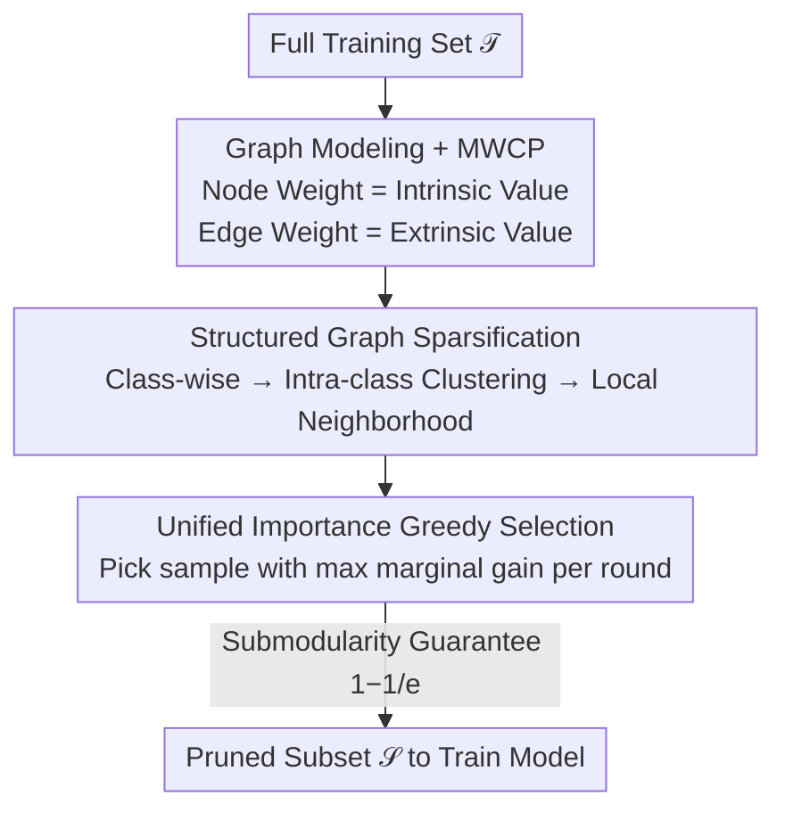

# Selecting Samples on Graphs: A Unified Dataset Pruning Framework for Lossless Training Acceleration

**Conference**: ICML2026  
**arXiv**: [2606.12913](https://arxiv.org/abs/2606.12913)  
**Code**: TBD  
**Area**: Dataset Pruning / Subset Selection / Optimization  
**Keywords**: Dataset Pruning, Maximum Weight Clique, Submodular Optimization, Greedy Algorithm, Training Acceleration

## TL;DR
Dataset pruning is reformulated as a "Maximum Weight Clique Problem" on a weighted graph, where node weights represent the intrinsic value of samples and edge weights represent redundancy/diversity relationships. Under mild conditions, this unified objective is proven to be submodular, allowing for a greedy solution with approximation guarantees. This approach reduces training time by over 40% on ImageNet-1k with ResNet-50 without sacrificing accuracy.

## Background & Motivation
**Background**: Modern datasets are increasingly large, often requiring weeks to train a single model. Dataset pruning (DP) aims to retain only a subset of "highly informative" real samples to save computation, which is safer than data distillation as it preserves real samples and offers explainable decisions. Typical DP strategies involve calculating an importance score for each sample and retaining those with the highest scores.

**Limitations of Prior Work**: The definition of "importance" is critical, yet current definitions are split into two incompatible camps. **Intrinsic criteria** evaluate each sample independently using loss, gradients, forgetting counts, or uncertainty to measure sample difficulty, but ignore redundancy, leading to the selection of similar difficult samples during aggressive pruning. **Extrinsic criteria** select samples based on relationships (e.g., K-center, herding, clustering) to encourage coverage and diversity, but often overlook the individual informativeness of samples.

**Key Challenge**: Sample value is inherently multifaceted, depending both on its own learning potential and its interaction with the selected subset. Existing hybrid methods (such as D²-pruning or InfoMax) attempt to combine both but rely on fixed heuristic metrics, which lack clarity on the underlying structure, flexibility for different pruning ratios, and optimization guarantees.

**Goal**: To develop a unified framework that accommodates both intrinsic and extrinsic values, allows for flexible metric substitution, and enables efficient optimization with theoretical guarantees.

**Key Insight**: By treating samples as nodes and pairwise relationships as edges, the task of selecting an informative yet non-redundant subset naturally becomes the selection of a high-quality subgraph.

**Core Idea**: Dataset pruning is shown to be **exactly equivalent** to the "Maximum Weight Clique Problem (MWCP)" in graph theory. Node weights encode intrinsic value, and edge weights encode extrinsic value. Although MWCP is NP-hard, its local structure permits a greedy solution with approximation guarantees. The authors name this framework **UGIES** (Unified Graph-based Importance Evaluation System).

## Method

### Overall Architecture
The input to UGIES is the full training set $\mathcal{T}=\{x_i\}_{i=1}^N$ and a pruning ratio $p$. The output is a retained subset $\mathcal{S}$ ($|\mathcal{S}|=(1-p)N$) used to train the target model. The pipeline's key transformation involves **translating the pruning problem into a MWCP on a weighted graph and solving it efficiently via greedy selection and sparsification**.

The process flows through four steps: ① Calculate an intrinsic importance $\mathcal{I}^{\mathrm{in}}(x_i)$ for each sample as the node weight; ② Compute distance-based extrinsic interactions for sample pairs as edge weights, sparsifying the graph via class-wise clustering to handle $O(N^2)$ complexity; ③ Iteratively select samples with the maximum "marginal gain" starting from an empty set; ④ Theoretically prove submodularity under mild conditions, ensuring a $(1-\tfrac1e)$ worst-case approximation guarantee.

### Key Designs

**1. Graph Modeling + MWCP Equivalence: Formulating Pruning as an Optimizable Objective**

This serves as the foundation of the work. The training set is constructed as an undirected weighted graph $G=(V,E)$, where node $v_i$ corresponds to sample $x_i$. The node weight $w_i=\alpha\,\mathcal{I}^{\mathrm{in}}(x_i)$ encodes intrinsic value, and the edge weight $a_{ij}=g(D(x_i,x_j))$ encodes extrinsic interaction when a pair is retained ($D$ is a distance/similarity metric, $g$ is a mapping, and $\alpha$ balances the terms). Selecting the optimal subset is equivalent to solving the MWCP:

$$\max_{C\subseteq V}\Big[\sum_{v_i\in C} w_i + \sum_{\{v_i,v_j\}\subseteq C} a_{ij}\Big],\quad \text{s.t. } |C|=b.$$

This represents an **exact equivalence** rather than an approximation. To facilitate algorithm design, the author rewrites this as a set-level objective $f(\mathcal{S})=\sum_{x_i\in\mathcal{S}}[\alpha\mathcal{I}^{\mathrm{in}}(x_i)+\mathcal{I}^{\mathrm{ex}}(x_i\mid\mathcal{S})]$, where the extrinsic term is $\mathcal{I}^{\mathrm{ex}}(x_i\mid\mathcal{S})=\sum_{x_j\in\mathcal{S}\setminus\{x_i\}} g(D(x_i,x_j))$.

**2. Unified Importance + Greedy Selection: Deriving Marginal Gain from Exact Solutions**

While MWCP is NP-hard, the authors discover a local property: when removing a single point ($b=N-1$), the optimal removal is **exactly solvable**. Removing node $v_i$ decreases the weight by $\Delta^-(v_i\mid G)=w_i+\sum_{v_j\in C\setminus\{v_i\}} a_{ij}$. Symmetrically, the unified importance is defined as the marginal gain of adding $x_i$ to the current subset: $\mathcal{I}(x_i\mid\mathcal{S})=\alpha\mathcal{I}^{\mathrm{in}}(x_i)+\mathcal{I}^{\mathrm{ex}}(x_i\mid\mathcal{S})$.

The greedy strategy constructs the subset by picking $x^\star=\arg\max_{x_i\in\mathcal{T}\setminus\mathcal{S}_t}\mathcal{I}(x_i\mid\mathcal{S}_t)$ in each round. This selection complexity is linear with respect to the subset size. This criterion is derived from the exact solution of the locally constrained MWCP rather than being a heuristic.

**3. Structured Graph Sparsification: Reducing $O(N^2)$ Complexity**

To avoid computing all pairwise interactions, the authors define a neighborhood $\mathcal{N}(x_i)$ using a two-level structure: samples are first partitioned by **labels**, and then by **feature clustering** within each class. The extrinsic term is only summed within this neighborhood.

This assumes that "redundancy is primarily local." Crucially, this sparsification does not break the problem structure; missing edges are treated as edges with zero weight, allowing the MWCP derivations and greedy solvers to remain valid without modification.

**4. Submodularity + Metric Design Criteria: Theoretical Guardrails**

The authors prove (Lemma 3.4) that as long as the distance $D(\cdot,\cdot)\ge 0$ is non-negative and the mapping $g:\mathbb{R}_{\ge0}\to\mathbb{R}_{\le0}$ is non-positive, the objective $f(\mathcal{S})$ is **submodular**, satisfying diminishing marginal returns. This property ensures the $(1-\tfrac1e)$ approximation guarantee for the greedy solution.

Importantly, these conditions serve as **design criteria** for metrics. For example, using the entropy of predictive distributions for the intrinsic term and a non-positive sigmoid-based interaction for the extrinsic term naturally satisfies these conditions.

### Loss & Training
UGIES does not introduce a new loss function; it acts as a data selection pre-processing step. The retained subset is trained using standard pipelines (e.g., 90 epochs for ResNet-50 on ImageNet). Key hyperparameters include the balance coefficient $\alpha$, the pruning ratio $p$, and the clustering granularity.

## Key Experimental Results

### Main Results
Comparisons against over ten DP baselines were conducted on CIFAR and ImageNet-1k. Representative results on CIFAR (Top-1 %) are as follows:

| Dataset | Pruning Ratio | Random | InfoBatch | DivBS | Ours (UGIES) | Full Data |
|--------|---------|--------|-----------|-------|------------|-----------|
| CIFAR-10 | 30% | 94.6 | 95.6 | 95.4 | **95.9** | 95.6±0.1 |
| CIFAR-10 | 50% | 93.3 | 95.1 | 95.2 | **95.4** | 95.6±0.1 |
| CIFAR-100 | 30% | 73.8 | 78.2 | 78.5 | **78.9** | 78.2±0.1 |
| CIFAR-100 | 50% | 72.1 | 78.1 | 78.2 | **78.6** | 78.2±0.1 |

On CIFAR-10 with a 30% pruning ratio, UGIES achieves 95.9%, outperforming full training (95.6%). Across ImageNet-1k, the method reduces training time by over 40% while maintaining accuracy across various pruning ratios.

### Ablation Study

| Configuration | Function | Conclusion |
|------|------|------|
| Intrinsic only | Traditional scoring-based pruning | Redundancy becomes uncontrolled under aggressive pruning |
| Extrinsic only | Pure diversity/coverage | Suboptimal due to ignoring sample informativeness |
| Intrinsic + Extrinsic | Full UGIES | Optimal performance via complementary values |
| Full Graph → Sparsification | Reduce $O(N^2)$ to local neighborhood | Formally equivalent; results nearly unchanged but scalable |

### Key Findings
- **Unification is Critical**: Single-camp criteria only perform well in specific scenarios; the unified objective is robust across different pruning ratios and data distributions.
- **Theoretical Conditions as Design Guides**: Submodularity is maintained regardless of the specific intrinsic metric, provided the interaction is non-positive.
- **Sparsification is Lossless**: Two-level neighborhood sparsification effectively scales the framework to ImageNet-sized datasets without performance degradation.

## Highlights & Insights
- **MWCP as a Unifying Language**: Rather than creating another heuristic score, the authors provide a unified optimization language for DP.
- **Elegance of Derived Marginal Gain**: The greedy criterion is derived from the exact optimal solution of a locally constrained MWCP.
- **Submodularity as a Guideline**: The framework provides a "shell" where switching metrics maintains theoretical guarantees, solving the conflict between flexibility and theoretical rigor.
- **Clean Sparsification Argument**: Treating missing edges as zero-weight edges preserves the problem's formal structure and simplifies the theoretical extension to sparse graphs.

## Limitations & Future Work
- **Dependence on Labels**: Neighborhood partitioning relies on labels; in self-supervised settings, neighborhood quality depends entirely on clustering.
- **Strong Submodularity Constraints**: The requirement for non-positive interactions excludes metrics that might encourage certain sample pairs to co-occur (positive interactions).
- **Coupling of $\alpha$ and Ratio**: The optimal balance coefficient $\alpha$ varies with the pruning ratio, but a self-adaptive mechanism is currently missing.
- **Limited to Classification**: Validation was primarily performed on image classification; scaling to LLM or multimodal pre-training remains to be explored.

## Related Work & Insights
- **vs. InfoBatch / DivBS**: Single-camp methods focus either on high loss or diversity; UGIES unifies both for better robustness across pruning ratios.
- **vs. D²-pruning / InfoMax**: These also combine values but use fixed heuristics; UGIES treats metrics as plug-and-play components within a submodular framework.
- **vs. CRAIG / GLISTER**: While prior works proved submodularity for specific functions, UGIES establishes submodularity as a design principle for a whole family of unified metrics.

## Rating
- Novelty: ⭐⭐⭐⭐⭐ (Formulating DP as MWCP provides a higher-level unification).
- Experimental Thoroughness: ⭐⭐⭐⭐ (Extensive benchmarks, though lacks LLM validation).
- Writing Quality: ⭐⭐⭐⭐⭐ (Logical flow from equivalence to submodularity is clear).
- Value: ⭐⭐⭐⭐ (Significant speedup with lossless performance).

<!-- RELATED:START -->

## Related Papers

- [\[NeurIPS 2025\] AutoOpt: A Dataset and a Unified Framework for Automating Optimization Problem Solving](../../NeurIPS2025/optimization/autoopt_a_dataset_and_a_unified_framework_for_automating_optimization_problem_so.md)
- [\[ICLR 2026\] SGD with Adaptive Preconditioning: Unified Analysis and Momentum Acceleration](../../ICLR2026/optimization/sgd_with_adaptive_preconditioning_unified_analysis_and_momentum_acceleration.md)
- [\[ICML 2026\] A General Framework for Dynamic Consistent Submodular Maximization](a_general_framework_for_dynamic_consistent_submodular_maximization.md)
- [\[CVPR 2026\] UniFusion: A Unified Image Fusion Framework with Robust Representation and Source-Aware Preservation](../../CVPR2026/optimization/unifusion_a_unified_image_fusion_framework_with_robust_representation_and_source.md)
- [\[ICML 2026\] URS: Unified Neural Routing Solver](urs_a_unified_neural_routing_solver_for_cross-problem_zero-shot_generalization.md)

<!-- RELATED:END -->
