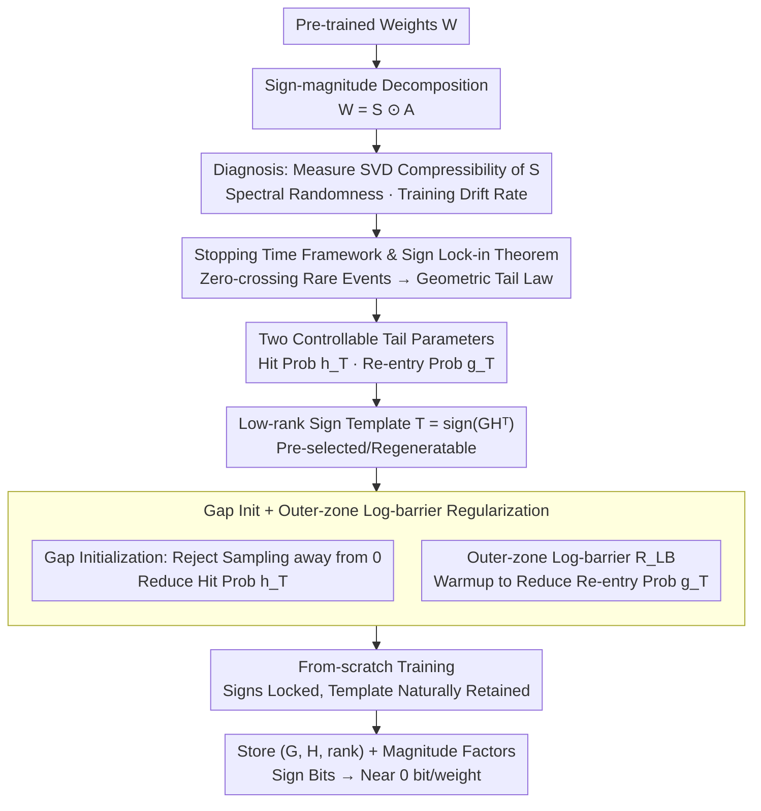

# Sign Lock-In: Randomly Initialized Weight Signs Persist and Bottleneck Sub-Bit Model Compression

**Conference**: ICML2026  
**arXiv**: [2602.17063](https://arxiv.org/abs/2602.17063)  
**Code**: TBD  
**Area**: Model Compression / Quantization / Optimization Dynamics  
**Keywords**: Sub-bit compression, sign bit, lock-in theory, geometric tail law, low-rank template

## TL;DR
This paper reveals that post-training weight sign matrices are indistinguishable from i.i.d. Rademacher noise across all architectures, forming a "one-bit wall" for sub-bit compression. Using stopping time analysis, it proves this pseudo-randomness is actually a "lock-in" of initialized signs. Consequently, it proposes a from-scratch training scheme using low-rank sign templates + gap initialization + outer-zone log-barrier regularization, amortizing sign bits to nearly 0 bit/weight.

## Background & Motivation

**Background**: The mainstream of model compression follows the "few-bit" route, using combinations of 2–4 bit quantization, low-rank decomposition, pruning, and entropy coding. It is not difficult to compress the magnitude $A=|W|$ to below 1 bit per weight. In such settings, the sign bits $S=\mathrm{sign}(W)$ are treated as a relatively small fixed overhead and are rarely discussed.

**Limitations of Prior Work**: Once the target is lowered to the "sub-bit" region (average <1 bit per weight), the sign bits become an incompressible bottleneck. The authors systematically tested three properties on MLP-Mixer / ResNet18 / TinyLlama-1.1B: (i) the best rank-$r$ Frobenius approximation error $E_r(S)$ of the sign matrix $S$ decays significantly slower than $E_r(A)$; (ii) the two-sample Kolmogorov–Smirnov test shows the normalized singular values of $S$ are almost indistinguishable from i.i.d. Rademacher noise; (iii) the entropy rate proxy $\widehat{H}_{\mathrm{RD}}\approx 1$ given by the Shannon rate-distortion lower bound implies that signs have almost no redundancy.

**Key Challenge**: Trained sign matrices "look like noise," yet the same study observes that, from a coordinate-wise perspective, the vast majority of weights retain their signs from initialization, with the flip ratio remaining below 0.5 over the long term. Thus, the "i.i.d. Rademacher-like marginal distribution" and the "highly persistent coordinate-wise trajectory" must coexist.

**Goal**: (1) Identify a mathematical mechanism to explain both the "pseudo-random distribution and strong persistent trajectory"; (2) Utilize this mechanism to transform sign bits from a bottleneck into a controllable variable.

**Key Insight**: Treat a single scalar weight as a 1D adaptation process $(w_t)$, where a sign change can only occur by crossing the zero boundary. If training dynamics keep the weights in an "outer zone" far from zero, sign flips must be triggered by rare deviation events towards zero—this is precisely a Freidlin–Wentzell type stopping time/first-passage problem.

**Core Idea**: Replace the step-by-step flip count with an effective "outer-to-outer" flip count $K_T^{\mathrm{eff}}(\rho)$ and prove it follows a geometric tail distribution. Since the initial signs are locked, the "initial signs" are set as low-rank reproducible templates, turning the lock-in from a bug into a feature.

## Method

### Overall Architecture
The paper is divided into two parts: diagnosis and intervention. The diagnosis part performs sign–magnitude decomposition $W=S\odot A$ and measures the SVD compressibility, spectral randomness, and training drift rate of $S$ and $A$ respectively; it then derives the sign lock-in theorem using 1D stopping time analysis. In the intervention part, two key quantities from the diagnosis—the initial hit probability $h_T$ and the re-entry probability $g_T$—are used as controllable knobs. A from-scratch training pipeline is proposed featuring "low-rank sign template initialization + gap sampling + outer-zone log-barrier regularization," ensuring that the sign matrix remains a shallow perturbation of the initial template after training, requiring only $(G, H, \text{rank})$ for storage.

### Key Designs

**1. 1D Stopping Time Framework and Sign Lock-in Theorem: Explaining Signs as Both Noise-like and Persistent via "Zero-crossing Boundary" Rare Events**

Spectral randomness tests suggest the sign matrix looks like i.i.d. Rademacher noise, but coordinate-wise observations show signs do not flip over time. This paradox cannot be resolved by traditional functional asymptotic analysis, as it averages out the critical rare boundary-crossing events. The authors view an individual scalar weight as a 1D process $(w_t)$, noting that a sign flip can only be triggered by $w_t$ passing through 0. They restate "whether a flip occurs after training" as a stopping time problem: fixing an outer threshold $\rho>0$ and a boundary radius $\epsilon=\max\{\epsilon_0,\Delta\}$, the following are recursively defined:

$$\sigma_0=\inf\{t:|w_t|\ge\rho\},\quad \tau_k=\inf\{t>\sigma_{k-1}:|w_t|\le\epsilon\},\quad \sigma_k=\inf\{t>\tau_k:|w_t|\ge\rho\}.$$

Under the "bounded update assumption" (step increment $|w_{t+1}-w_t|\le\Delta$ with probability $\ge 1-\delta_{\mathrm{upd}}$) and "re-entry rate assumption" ($\mathbb{P}[\tau_{k+1}\le T\mid\mathcal{F}_{\sigma_k}]\le g_T$), the count of effective outer-to-outer flips follows a geometric tail law:

$$\mathbb{P}[K_T^{\mathrm{eff}}(\rho)\ge k]\le h_T\, g_T^{k-1}+\delta_{\mathrm{upd}},\qquad h_T=\mathbb{P}[\tau_1\le T].$$

Developing this into Proposition 3.5 for SGD links the re-entry rate $g_T^{\mathrm{SGD}}$ to the boundary margin $\rho-\epsilon$, the sum of squared learning rates $\sum_t\eta_t^2$, and batch noise. This provides an operational scale for identifying which training recipes will lock signs more firmly.

**2. Low-rank Sign Template $T=\mathrm{sign}(GH^\top)$: Replacing Incompressible Random Signs with Regeneratable Structures**

The fundamental deadlock in the sub-bit region is that the sign matrix $S$ is almost impossible to approximate with low rank ($E_r(S)$ decays very slowly). Since the theorem guarantees that training rarely changes signs, the authors move this deadlock to before training: for each layer $W^{(l)}\in\mathbb{R}^{m\times n}$, $G\in\mathbb{R}^{m\times r}$ and $H\in\mathbb{R}^{n\times r}$ are sampled (i.i.d. standard normal, $r\ll\min(m,n)$, with $r=2$ in the paper), the template $T^{(l)}=\mathrm{sign}(GH^\top)$ is set, and magnitudes $A^{(l)}$ are sampled from a positive distribution. The initial weights are $W^{(l)}=T^{(l)}\odot A^{(l)}$. Because the signs will be locked, the template chosen before training remains valid after training. Only $(G, H, r)$ and the magnitude factors need to be stored, making the bits per weight for signs approach zero.

**3. Gap Initialization + Outer-zone Log-barrier Regularization: Turning "Lock-in" into a Tunable Knob**

To ensure templates are locked, $h_T$ and $g_T$ must be actively minimized. These are determined by initialization and early dynamics, respectively. Gap initialization uses rejection sampling $z\sim\mathcal{N}(0,\sigma_{\mathrm{init}}^2)$; if $|z|<a_{\mathrm{init}}=c_{\mathrm{gap}}\sigma_{\mathrm{init}}$, it is resampled. This ensures weights start far from 0, reducing the first-hit probability $h_T$. The outer-zone log-barrier is:

$$R_{\mathrm{LB}}(W)=\frac{1}{mn}\sum_{i,j}\log\max\Big\{1,\ \frac{a_{\mathrm{init}}}{|W_{ij}|+\epsilon_{\mathrm{lb}}}\Big\},$$

which is 0 when weights are in the outer zone and increases smoothly as they approach the boundary. The total loss is $\mathcal{L}_{\mathrm{total}}=\mathcal{L}_{\mathrm{task}}+\lambda(t)\sum_{l\in\mathcal{M}}R_{\mathrm{LB}}(W^{(l)})$, where $\lambda(t)$ decays to 0 after warmup to suppress early re-entry probability $g_T$.

### Loss & Training
Beyond the task loss, only one term $\lambda(t)\sum_{l\in\mathcal{M}}R_{\mathrm{LB}}(W^{(l)};a_{\mathrm{init}},\epsilon_{\mathrm{lb}})$ is added; $\lambda(t)$ stays constant during warmup and then decays to 0. The template $T^{(l)}$ is used only during initialization; the signs are not explicitly constrained during training, relying entirely on the geometric tail law to ensure template retention.

## Key Experimental Results

### Main Results

| Task / Data | Metric | Vanilla SVD on raw $W$ | Hashing / 1-bit baselines | **SVD on $\lvert W_{\mathrm{lockin}}\rvert$ (Ours)** |
|:---:|:---:|:---:|:---:|:---:|
| CharLM | Perplexity (Lower is better, $<1$ bpw region) | Sharp rise / Stuck at 1 bpw | Stagnates near 1 bpw | Continuous decline, significantly best in sub-bit |
| Text8-Char | Perplexity | As above | As above | As above |
| DBPedia14 | Classification Acc (Higher is better) | Collapses near 1 bpw | Upper bound at 1 bpw | Remains competitive in sub-bit |

(Numerical values in Figure 8; $\hat h$ and $\hat g$ decrease monotonically with scale in a sweep from 30M to 10B. On the largest model, $\hat g$ approaches 0, implying large models possess naturally stronger lock-in.)

### Ablation Study

| Configuration | Mean flip rate | Change in Val. PPL | Description |
|:---:|:---:|:---:|:---:|
| Baseline (Normal init + No reg) | $\sim 10^{-1}$ | Reference | Sign matrix nearly incompressible by low-rank |
| Gap init only ($a_{\mathrm{init}}$ moderate) | Moderate decrease | Almost no change | $h_T$ reduced, $g_T$ unchanged |
| Log-barrier only (Large $\lambda$) | Significant decrease | Slight increase | $g_T$ reduced, $h_T$ unchanged |
| **Gap + Log-barrier (Pareto Front)** | $\sim 10^{-3}$ | Only $\approx +1$ ppl | Knobs combined, sign structure retained |

### Key Findings
- The geometric tail law $\mathbb{P}[K_T^{\mathrm{eff}}\ge k]\approx \hat h\hat g^{k-1}$ is verified by semi-log tail plots across multiple learning rates. Scaling lr changes the effective step size $\Delta$, affecting the tail coefficient but not the geometric shape.
- Lock-in strength order: Inverse decay $\to$ Cosine $\to$ Exponential $\to$ Constant learning rate (strongest to weakest). ReLU positive homogeneity, normalization layers, and increased batch/model size all enhance lock-in.
- After training with the template + gap + log-barrier combination, the low-rank structure of the magnitude matrix is nearly identical to the baseline (Figure 7), but the sign matrix transitions from "nearly incompressible" to "manifestly low-rank," proving that the intervention does not sacrifice magnitude compressibility.

## Highlights & Insights
- Resolves the paradox between "signs look like noise empirically" and "signs are persistent coordinate-wise" using stopping times—the marginal distribution is a trajectory average of rare boundary events, while the trajectory is locked by the $\sigma_k$ sequence.
- Translates the two parameters $(h_T, g_T)$ of the geometric tail law into engineering knobs: rejection sampling adjusts $h_T$ and log-barrier adjusts $g_T$. This shifts the paradigm from "post-training quantization" to "pre-training template selection + boundary clamping."
- Natural strong lock-in in large models (Figure 4 shows $\hat g\to 0$ on 10B) suggests that sub-bit compression is more effective as models scale, contrary to the intuition that larger models are harder to compress.

## Limitations & Future Work
- Only applicable to from-scratch training: The template must be selected before optimization begins; it cannot be applied directly to arbitrary pre-trained checkpoints.
- Under extreme magnitude-side regularization, the system enters a "sign floating mode" (Appendix D.6) where weights are continuously sucked toward 0, and the geometric tail law no longer holds.
- Only the log-barrier enforcement was tested; other strategies like triangular barriers, stop-gradient, or direct sign-STE were not compared.
- The potential contribution of sign bits as "degrees of freedom" to expressive power was not discussed; fixing signs completely might limit performance on certain tasks.

## Related Work & Insights
- **vs. Classic Post-Training Quantization (GPTQ, AWQ, etc.)**: These assume post-training $S$ and $A$ can be manipulated freely, but they hit the "one-bit wall" in the sub-bit region. Ours intervenes before training to bypass the wall.
- **vs. 1-bit / Sign-SGD Series**: These methods assume the sign is the core info carrier. Our evidence suggests training rarely changes the sign, thus "saving the sign" is more efficient than "training the sign"—complementing works like BitNet b1.58.
- **vs. SGD Theory from SDE/Diffusion Perspectives**: Those works analyze average trajectories, whereas this work pushes towards first-passage and rare events, providing a new way to induce or suppress specific dynamical events in engineering.

## Rating
- Novelty: ⭐⭐⭐⭐⭐ Merges stopping time analysis, spectral randomness, and sub-bit compression for the first time with executable knobs.
- Experimental Thoroughness: ⭐⭐⭐⭐ Covers MLP/CNN/Transformer and scales from 30M to 10B, although downstream tasks are primarily language modeling and text classification.
- Writing Quality: ⭐⭐⭐⭐ Precise definitions and propositions with clear progression; although the text is dense and technical.
- Value: ⭐⭐⭐⭐⭐ Targets the "one-bit wall" of sub-bit compression with a first-principles explanation, offering direct engineering significance for LLM deployment.
- Overall: This is a classic "theory + engineering loop" work. It uses stopping times to characterize rare events and transforms theoretical parameters into tunable knobs, verified by from-scratch training.

<!-- RELATED:START -->

## Related Papers

- [\[AAAI 2026\] Personalized Federated Learning with Bidirectional Communication Compression via One-Bit Random Sketching](../../AAAI2026/optimization/personalized_federated_learning_with_bidirectional_communication_compression_via.md)
- [\[CVPR 2026\] Defending Unauthorized Model Merging via Dual-Stage Weight Protection](../../CVPR2026/optimization/defending_unauthorized_model_merging_via_dual-stage_weight_protection.md)
- [\[ICML 2026\] Limits of Convergence-Rate Control for Open-Weight Safety](limits_of_convergence-rate_control_for_open-weight_safety.md)
- [\[ICML 2026\] Automatic Unsupervised Ensemble Outlier Model Selection–Extended Version](automatic_unsupervised_ensemble_outlier_model_selection--extended_version.md)
- [\[ICML 2026\] On the Interaction of Batch Noise, Adaptivity, and Compression, under $(L_0,L_1)$-Smoothness: An SDE Approach](on_the_interaction_of_batch_noise_adaptivity_and_compression_under_l_0l_1-smooth.md)

<!-- RELATED:END -->
