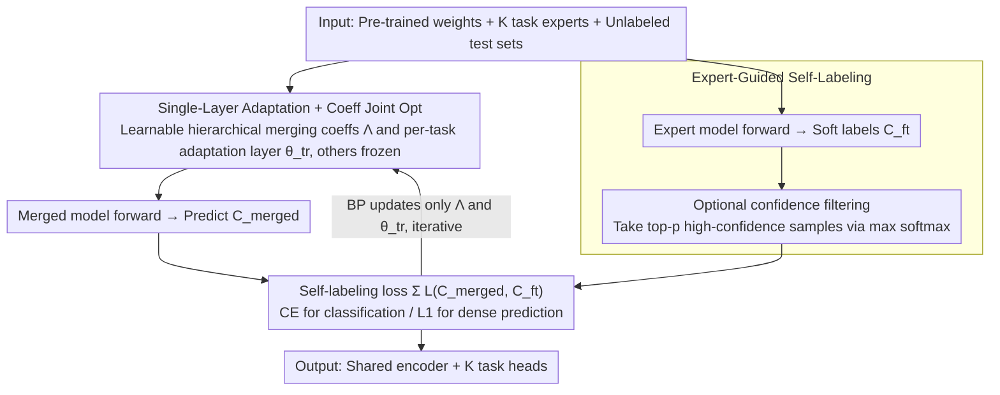

# SyMerge: From Non-Interference to Synergistic Merging via Single-Layer Adaptation

**Conference**: ICML 2026  
**arXiv**: [2412.19098](https://arxiv.org/abs/2412.19098)  
**Code**: https://aim-skku.github.io/SyMerge (Available)  
**Area**: Model Compression / Model Merging  
**Keywords**: Model Merging, Task Synergy, Test-Time Adaptation, Single-Layer Adaptation, Expert Self-Labeling

## TL;DR
This paper redefines the goal of "model merging" from "avoiding task interference" to "promoting task synergy." It proposes SyMerge: jointly optimizing only one task-specific layer for each task and the hierarchical merging coefficients of the encoder. By using fine-tuned expert models as soft-label teachers, it avoids entropy minimization drift during test-time, pushing the performance of merged models close to the single-task upper bound across vision, dense prediction, and NLP benchmarks.

## Background & Motivation
**Background**: Model merging methods combine multiple independently fine-tuned models of the same architecture in the parameter space. By reusing task vectors $\tau_k = \Theta_k - \Theta_{\text{pre}}$, a multi-task model is obtained without the cost of joint training. Mainstreams are divided into two branches: training-free (Task Arithmetic, Ties-Merging, PCB, Consensus, etc.) which use heuristics or grid search for coefficients; and test-time adaptation (AdaMerging, WEMoE, Surgery, etc.) which learn coefficients or post-adapters using unlabeled test data through proxy objectives like entropy minimization.

**Limitations of Prior Work**: The authors found that training-free methods collapse under slight distribution shifts by testing four tasks with Hendrycks standard corruptions. While test-time methods are more robust, they still treat "interference avoidance" as the sole goal—SVD truncation, parameter masking, and weight disentanglement all aim for the same thing: ensuring $\tau_i$ does not destroy task $j$, essentially pursuing $L_j[f(x;\theta_0+\tau_i)] = L_j[f(x;\theta_0)]$.

**Key Challenge**: The non-interference objective inherently has a ceiling—the performance of the merged model on task $j$ can at most match the pre-trained model since there is no mechanism for other tasks to "help." The authors conducted a pilot experiment on 20 vision tasks, showing a strong positive correlation ($r=0.863, p<0.001$) on ViT-B/32 between cross-task performance (using the encoder of Task A with the classifier of Task B) and post-merge performance. This suggests the real bottleneck in merging quality is the functional alignment between different tasks' encoder/predictor, rather than interference.

**Goal**: Upgrade the objective from non-interference to positive synergy $L_j[f(x;\theta_0+\tau_i)] < L_j[f(x;\theta_0)]$; find a method that improves cross-task alignment at minimal cost and works stably in unlabeled test scenarios.

**Key Insight**: The authors conducted a second pilot—retraining the last layer of task $k$ on a fixed merged encoder using labeled data, then testing this new classifier on the encoder of task $m \neq k$. Significant cross-task accuracy improvements were observed across all 8 tasks. This implies that adjusting just one layer (even an intermediate block) can align the functional mapping between the encoder and predictor across different tasks.

**Core Idea**: Transfer the "adjust one layer" finding to unlabeled test-time scenarios. Jointly optimize hierarchical merging coefficients $\{\lambda_k^l\}$ and one task-specific layer $\theta_k^{\text{tr}}$ per task. Replace entropy minimization with more stable expert-guided self-labeling cross-entropy using pre-fine-tuned expert model predictions as "soft-label teachers."

## Method

### Overall Architecture
Input: Pre-trained weights $\Theta_{\text{pre}}$, $K$ independently fine-tuned task experts $\{\Theta_k\}_{k=1}^K$, and unlabeled test sets $\mathcal{X}_k^{te}$ for each task; Output: A shared encoder $\Theta_{\text{MTL}}^{\text{enc}}$ plus $K$ task heads. The pipeline follows three steps: (1) Parameterize each encoder layer weight as $\theta_{\text{MTL}}^l = \theta_{\text{pre}}^l + \sum_k \lambda_k^l \tau_k^l$, where $\Lambda = \{\lambda_k^l\}$ is a learnable layer-wise $\times$ task coefficient matrix (following AdaMerging); (2) Select one task-specific adaptation layer $\theta_k^{\text{tr}}$ for each task, initialized with the original layer from the task expert; (3) Jointly optimize $\Lambda$ and $\{\theta_k^{\text{tr}}\}$ so that the merged model's predictions on $\mathcal{X}_k^{te}$ approximate those of the expert models. Only these two sets of parameters are updated while all other layers remain frozen.

### Key Designs

**1. Single-Layer Adaptation + Coefficient Joint Optimization: Transforming both encoder mixing and task outputs with minimal parameters**

The cross-task pilot proved that "adjusting one layer" is sufficient to align encoder-predictor functional mapping. SyMerge brings this to unlabeled test-time scenarios. Specifically, it opens two sets of parameters: shared encoder hierarchical coefficients $\Lambda=\{\lambda_k^l\}$ (where $\theta_{\text{MTL}}^l=\theta_{\text{pre}}^l+\sum_k\lambda_k^l\tau_k^l$) and one task-specific adaptation layer $\theta_k^{\text{tr}}$ per task (defaulting to the classification head or the last transformer block, initialized from the expert). Both minimize the same self-labeling loss while other layers remain frozen. Compared to AdaMerging, which only learns $\Lambda$, opening the adaptation layer provides stability—the authors found that "coefficients only" optimization collapses under different initializations (disjoint basins), falling below 30% average accuracy, whereas SyMerge recovers usable models. Furthermore, SyMerge can merge heterogenous experts that do not share the same pre-training, a practical scenario where coefficient-only methods fail. Unlike Surgery/ProbSurgery which add extra adapters, SyMerge introduces no new modules, simply making an existing layer trainable. This joint update allows the task-specific layer to compensate for unfavorable encoder mixtures, creating encoder-predictor synergy—the namesake "Synergistic" effect.

**2. Expert-Guided Self-Labeling Objective: Replacing unstable entropy minimization with "expert-as-teacher" soft-label supervision**

Since test-time merging lacks labels, methods like AdaMerging use entropy minimization as a proxy. However, the authors found this proxy unreliable—Spearman correlation between the proxy loss and ground-truth cross-entropy shows that entropy minimization drifts significantly after training (even showing negative correlation on the Cars dataset). SyMerge provides a direct alternative: fine-tuned experts already exist and are SOTA on their respective tasks. SyMerge uses their outputs $C_k^{\text{ft}}(x)$ (softmax probability vectors for classification, continuous values for regression) as soft-label teachers. The merged model $C_k^{\text{merged}}(x)$ is optimized to approximate these outputs by minimizing $\sum_k \mathcal{L}_{CE}(C_k^{\text{merged}}, C_k^{\text{ft}})$. For dense prediction tasks like segmentation or depth where entropy is inapplicable, cross-entropy is replaced by L1 loss, making the objective naturally versatile. Using experts is far more reliable than self-pseudo-labeling. Additionally, an optional confidence filtering mechanism is provided, where samples are ranked by the expert's max softmax probability in each batch, using only top-$p$ samples for backpropagation.

### Loss & Training
The unified objective is $\min_{\{\lambda_k^l\}, \{\theta_k^{\text{tr}}\}} \sum_{k=1}^K \mathcal{L}_k(C_k^{\text{merged}}, C_k^{\text{ft}})$, using cross-entropy for classification and L1 for regression. The optimizer and learning rate follow AdaMerging settings (see Appendix E.2). $\Lambda$ is initialized with uniform distribution, and $\theta_k^{\text{tr}}$ is initialized with the corresponding layer from the expert model. All reported results are means ± standard deviation of 5 random seeds.

## Key Experimental Results

### Main Results
Benchmarks cover three categories: Vision Classification (ViT-B/32 and ViT-L/14, merging 8 / 14 / 20 tasks), Dense Prediction (NYUv2 with ResNet-50 merging segmentation/depth/normal), and NLP (RoBERTa merging 8 GLUE tasks). The following table summarizes representative results:

| Benchmark Setup | Metric | AdaMerging | EMR-Merging | ProbSurgery | SyMerge | Individual Upper Bound |
|----------|----------|------------|-------------|-------------|---------|-----------------|
| ViT-B/32 / 8 tasks | Avg Acc | 80.1 | 88.7 | 87.4 | **90.1 ±0.1** | 90.5 |
| ViT-B/32 / 20 tasks | Avg Acc | 69.6 | 86.6 | 84.5 | **88.6 ±0.4** | 90.4 |
| ViT-L/14 / 20 tasks | Avg Acc | 82.1 | 92.0 | 90.2 | **93.2 ±0.1** | 94.0 |
| NYUv2 / Seg | mIoU↑ | — | 41.5 | 43.6 | **49.8 ±0.3** | 52.0 |
| GLUE / 8 tasks | Avg | — | 80.2 | 81.6 | **83.9 ±0.2** | 85.6 |

Under the ViT-B/32 20-task setting, SyMerge is only 1.8 points behind the single-task upper bound, outperforming the previously best EMR-Merging (86.6) by 2 points. In dense prediction, mIoU for segmentation jumped from 43.6 (ProbSurgery) to 49.8, closing 70% of the gap to the 52.0 upper bound. On GLUE, SyMerge's average of 83.9 is nearly equivalent to the single-task 85.6, reaching or exceeding Surgery series on most subtasks (CoLA, STSB, QNLI, RTE).

### Ablation Study

| Configuration | ViT-B/32 8-task Avg | Description |
|------|---------------------|------|
| Task Arithmetic (baseline) | 69.1 | Training-free, fixed $\lambda$ |
| AdaMerging (Learn $\Lambda$ only) | 80.1 | Hierarchical coeffs + entropy min |
| Learn $\Lambda$ + Self-labeling loss | ~85 | Replacing entropy with expert labels |
| Learn $\theta_k^{\text{tr}}$ only | ~83 | Adapting layer only, fixed $\Lambda$ |
| **SyMerge (Joint + Self-labeling)** | **90.1** | Full proposed method |
| Same + Confidence Filtering | 90.1+ | Optional; adds ~0.2-0.5 gain in Appendix |

(Approximate values for middle rows are inferred from Fig 4 / Sec 4.3 curves and text to show individual component contributions.)

### Key Findings
- Individually replacing entropy minimization with expert self-labeling increases accuracy from 80 to ~85, proving the stability of the supervision signal is more critical than coefficient search granularity.
- Opening the adaptation layer alone without $\Lambda$ increases score from 69 to ~83, but the ceiling is lower than joint optimization; only moving both reaches 90, validating "synergy."
- In the disjoint-basin setting (experts from different pre-training), coefficient-based methods like AdaMerging fall below 30%, while SyMerge maintains usable performance due to the adaptation layer (see Sec 4.3).
- The cross-task correlation $r=0.863$ serves not only as motivation but also suggests cross-task accuracy can be a cheap proxy for evaluating merging methods in the future.

## Highlights & Insights
- Redefining the model merging goal from "non-interference" to "synergy" is a clean conceptual upgrade—while previous SVD/masking/disentanglement works aimed at "do no harm," this paper uses the $r=0.863$ pilot to show that "do no harm" has a ceiling and active alignment is necessary.
- "Using expert models as soft-label teachers" is an overlooked yet simple option in test-time adaptation: fine-tuned experts are already available. The authors systematically demonstrate it is far more stable than entropy for self-labeling. This thinking can migrate to any test-time adaptation scenario (domain adaptation, TTA, prompt tuning).
- The "one layer is enough" conclusion is counter-intuitive. While Surgery/WEMoE add various extra adapters, this paper proves that simply opening an existing task-expert layer is sufficient without expanding parameter counts or changing architectures.

## Limitations & Future Work
- The method relies on keeping fine-tuned experts for every task—memory consumption increases with the number of experts ($K$), trading the cost of "training one multi-task model" for "running $K$ experts as teachers at test-time."
- "Which layer to adjust" is treated as a hyperparameter (defaulting to the last layer/block) without an automated selection strategy; it requires minor tuning across architectures.
- Experiments focused on medium-scale models (ViT, ResNet, RoBERTa). Extrapolating to LLM merging (>7B parameters) relies on AdaMerging results; whether expert self-labeling remains equally stable on LLMs requires verification.
- The definition of "synergy" is somewhat empirical (characterized by cross-task vs. merging performance correlation). The theoretical proof in Proposition 3.1 focuses on tightening convex bounds, which is still a distance away from a rigorous definition of "positive inter-task transfer."

## Related Work & Insights
- **vs AdaMerging**: AdaMerging only learns hierarchical coefficients $\Lambda$ using entropy minimization. SyMerge adds task-specific joint optimization and swaps entropy for expert self-labeling; experiments show each change contributes 5–10 points, making it a strict superset.
- **vs Surgery / ProbSurgery**: These methods stack an adapter network after the merged encoder for post-correction, requiring more parameters and extra inference overhead. SyMerge introduces no new modules and achieves better results with fewer parameters.
- **vs EMR-Merging**: EMR uses expert routing to switch weights during inference, closer to Mixture-of-Experts. SyMerge maintains a traditional "shared encoder + task head" form, making deployment simpler.
- **vs Non-interference routes (Ties-Merging / TSV-M / ISO-Merging)**: These works calculate how to make $\tau$ orthogonal or non-conflicting. SyMerge demonstrates that "active alignment via adjusting one layer" has a higher ceiling than "passive conflict avoidance."

<!-- RELATED:START -->

## Related Papers

- [\[NeurIPS 2025\] Quantitative Convergence of Trained Single Layer Neural Networks to Gaussian Processes](../../NeurIPS2025/optimization/quantitative_convergence_of_trained_single_layer_neural_networks_to_gaussian_pro.md)
- [\[CVPR 2026\] ACE-Merging: Data-Free Model Merging with Adaptive Covariance Estimation](../../CVPR2026/optimization/ace-merging_data-free_model_merging_with_adaptive_covariance_estimation.md)
- [\[ICML 2026\] Bayesian Gated Non-Negative Contrastive Learning](bayesian_gated_non-negative_contrastive_learning.md)
- [\[CVPR 2026\] Model Merging in the Essential Subspace](../../CVPR2026/optimization/model_merging_in_the_essential_subspace.md)
- [\[ICML 2026\] SPSsafe: Safeguarded Stochastic Polyak Step Sizes for Non-smooth Optimization](safeguarded_stochastic_polyak_step_sizes_for_non-smooth_optimization_robust_perf.md)

<!-- RELATED:END -->
