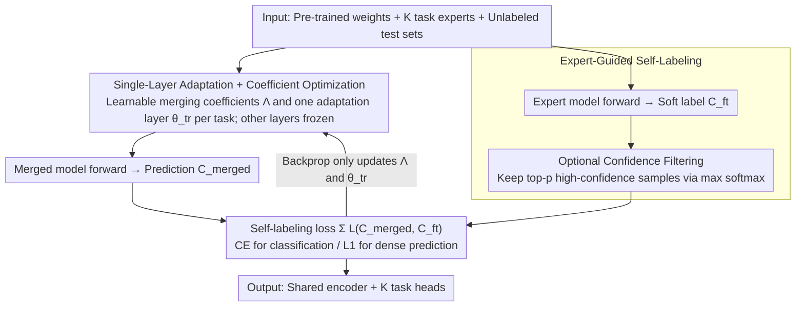

# SyMerge: From Non-Interference to Synergistic Merging via Single-Layer Adaptation

**Conference**: ICML 2026  
**arXiv**: [2412.19098](https://arxiv.org/abs/2412.19098)  
**Code**: https://aim-skku.github.io/SyMerge (Available)  
**Area**: Model Compression / Model Merging  
**Keywords**: Model Merging, Task Synergy, Test-Time Adaptation, Single-Layer Adaptation, Expert Self-Labeling

## TL;DR
This paper redefines the objective of "model merging" from "avoiding task interference" to "promoting task synergy." It proposes SyMerge: jointly optimizing only one task-specific layer per task and the layer-wise merging coefficients of the encoder, while employing fine-tuned expert models as soft-label teachers to prevent test-time drift caused by entropy minimization. This approach elevates merged models to performance levels near single-task upper bounds across vision, dense prediction, and NLP benchmarks.

## Background & Motivation
**Background**: Model merging methods combine multiple independently fine-tuned models of the same architecture in the parameter space. By reusing task vectors $\tau_k = \Theta_k - \Theta_{\text{pre}}$, a multi-task model is obtained without the cost of joint training. Mainstream approaches fall into two categories: training-free (Task Arithmetic, Ties-Merging, PCB, Consensus, etc.), which rely on heuristics or grid search for coefficients, and test-time adaptation (AdaMerging, WEMoE, Surgery, etc.), which learn merging coefficients or post-hoc adapters using unlabeled test data via proxy objectives like entropy minimization.

**Limitations of Prior Work**: The authors found, through corruption tests on four tasks according to Hendrycks standards, that training-free methods collapse even under slight distribution shifts. While test-time methods are more robust, they still treat "avoiding interference" as the sole objective—all works involving SVD truncation, parameter masking, or weight disentanglement aim to ensure that $\tau_i$ does not damage task $j$, essentially pursuing $L_j[f(x;\theta_0+\tau_i)] = L_j[f(x;\theta_0)]$.

**Key Challenge**: The non-interference objective has an inherent ceiling—the performance of the merged model on task $j$ can at best match the pre-trained model because the goal is merely "not letting other tasks harm me," with no mechanism for other tasks to "help me." Furthermore, a pilot experiment on 20 vision tasks showed a strong positive correlation ($r=0.863, p<0.001$) between cross-task performance (using task A's encoder with task B's classifier) and post-merge performance on ViT-B/32. This suggests that the true bottleneck for merging quality is functional alignment between different task encoders/predictors rather than interference.

**Goal**: Upgrade the objective from non-interference to positive synergy $L_j[f(x;\theta_0+\tau_i)] < L_j[f(x;\theta_0)]$; find a method that improves cross-task alignment at minimal cost and works stably in unlabeled test scenarios.

**Key Insight**: A second pilot study revealed that re-training the last layer of task $k$ on a fixed merged encoder, then testing this new classifier with encoder $m \neq k$, led to significant cross-task accuracy improvements across all 8 tasks. This implies that tuning just one layer (even an intermediate block) can align the functional mapping between encoder and predictor across different tasks.

**Core Idea**: Transfer the "single-layer tuning" discovery to unlabeled test-time scenarios by jointly optimizing layer-wise merging coefficients $\{\lambda_k^l\}$ and one task-specific layer $\theta_k^{\text{tr}}$ per task. Replace entropy minimization with stable expert-guided self-labeling cross-entropy using pre-fine-tuned expert models as "soft-label teachers."

## Method

### Overall Architecture
Input: Pre-trained weights $\Theta_{\text{pre}}$, $K$ independently fine-tuned task experts $\{\Theta_k\}_{k=1}^K$, and unlabeled test sets $\mathcal{X}_k^{te}$ for each task. Output: A shared encoder $\Theta_{\text{MTL}}^{\text{enc}}$ combined with $K$ sets of task heads. The pipeline follows three steps: (1) represent each encoder layer weight as $\theta_{\text{MTL}}^l = \theta_{\text{pre}}^l + \sum_k \lambda_k^l \tau_k^l$, setting $\Lambda = \{\lambda_k^l\}$ as a learnable layer-wise $\times$ task coefficient matrix; (2) select one task-specific adaptation layer $\theta_k^{\text{tr}}$ per task, initialized from the original layer of the task expert; (3) jointly optimize $\Lambda$ and $\{\theta_k^{\text{tr}}\}$ to align merged model predictions with expert model predictions on $\mathcal{X}_k^{te}$. Only these two sets of parameters are updated; all other layers remain frozen.

### Key Designs

**1. Joint Optimization of Single-Layer Adaptation and Coefficients: Modifying both encoder blending and task output with minimal parameters**

The cross-task pilot demonstrated that "tuning one layer" is sufficient to align encoder and predictor functions. SyMerge applies this to unlabeled test-time scenarios by releasing two sets of parameters: shared encoder layer-wise coefficients $\Lambda=\{\lambda_k^l\}$ and one task-specific adaptation layer $\theta_k^{\text{tr}}$ per task (defaulting to the classification head or the last transformer block). Both layers are updated simultaneously using the same self-labeling loss while other layers remain frozen. Compared to AdaMerging (which only learns $\Lambda$), SyMerge is more stable—the authors found that "coefficient-only tuning" collapses under different initializations (disjoint basins), falling below 30% accuracy, whereas SyMerge recovers usable performance. Since many open-source models do not share the same pre-trained initialization, SyMerge offers practical utility for merging heterogeneous experts. Unlike Surgery/ProbSurgery, which add external adapters, SyMerge introduces no new modules, simply making an existing layer trainable. This also allows the task-specific layer to compensate for unfavorable encoder mixtures, facilitating the "Synergistic" update between encoder and predictor.

**2. Expert-Guided Self-Labeling Objective: Replacing unstable entropy minimization with "expert-as-teacher" soft labels**

In unlabeled test-time merging, methods like AdaMerging use entropy minimization as a proxy objective. However, the authors found this proxy unreliable; Spearman correlation between entropy loss and true supervised cross-entropy is moderate before training but drifts significantly after training (even becoming inversely correlated on the Cars dataset). SyMerge addresses this by using the pre-existing fine-tuned experts (which are already SOTA on their respective tasks) as soft-label teachers. The merged model $C_k^{\text{merged}}(x)$ is trained to approximate the expert output $C_k^{\text{ft}}(x)$ by minimizing $\sum_k \mathcal{L}_{CE}(C_k^{\text{merged}}, C_k^{\text{ft}})$. For dense prediction tasks (segmentation, depth, normals) where entropy is not applicable, cross-entropy is replaced by L1 loss, making the objective universally applicable. Consistency measurements show this teacher signal remains highly aligned with true supervision throughout training. Additionally, an optional confidence filter is provided: batches are sorted by the expert's maximum softmax probability, and only the top-$p$ samples are used for backpropagation to prevent noisy labels from polluting the optimization.

### Loss & Training
The unified objective is $\min_{\{\lambda_k^l\}, \{\theta_k^{\text{tr}}\}} \sum_{k=1}^K \mathcal{L}_k(C_k^{\text{merged}}, C_k^{\text{ft}})$, using cross-entropy for classification and L1 for regression. The optimizer and learning rates follow AdaMerging settings. $\Lambda$ is initialized with uniform distribution, and $\theta_k^{\text{tr}}$ is initialized from the corresponding layer of the expert model. All reported results are averages $\pm$ standard deviation over 5 random seeds.

## Key Experimental Results

### Main Results
Covering three categories: Vision Classification (ViT-B/32 and ViT-L/14, merging 8 / 14 / 20 tasks), Dense Prediction (NYUv2 with ResNet-50 merging segmentation/depth/normal), and NLP (RoBERTa merging 8 GLUE tasks). The table below summarizes representative vision and NLP results:

| Benchmark Setting | Metric | AdaMerging | EMR-Merging | ProbSurgery | SyMerge | Individual Upper Bound |
|----------|----------|------------|-------------|-------------|---------|-----------------|
| ViT-B/32 / 8 tasks | Avg. Acc | 80.1 | 88.7 | 87.4 | **90.1 ±0.1** | 90.5 |
| ViT-B/32 / 20 tasks | Avg. Acc | 69.6 | 86.6 | 84.5 | **88.6 ±0.4** | 90.4 |
| ViT-L/14 / 20 tasks | Avg. Acc | 82.1 | 92.0 | 90.2 | **93.2 ±0.1** | 94.0 |
| NYUv2 / Seg | mIoU↑ | — | 41.5 | 43.6 | **49.8 ±0.3** | 52.0 |
| GLUE / 8 tasks | Avg. | — | 80.2 | 81.6 | **83.9 ±0.2** | 85.6 |

In the ViT-B/32 20-task setting, SyMerge is only 1.8 points away from the single-task upper bound, significantly outperforming EMR-Merging (86.6). For dense prediction, the segmentation mIoU increased from 43.6 (ProbSurgery) to 49.8, closing 70% of the gap to the 52.0 upper bound. On GLUE, SyMerge achieved an average of 83.9, close to the 85.6 single-task performance, with several sub-tasks (CoLA, STSB, QNLI, RTE) matching or exceeding the Surgery series.

### Ablation Study

| Configuration | ViT-B/32 8-task Avg. | Description |
|------|---------------------|------|
| Task Arithmetic (Baseline) | 69.1 | Training-free, fixed $\lambda$ |
| AdaMerging (Learn $\Lambda$ only) | 80.1 | Optimization + Entropy minimization |
| Learn $\Lambda$ + Self-labeling loss | ~85 | Replacing entropy with expert self-labels |
| Learn $\theta_k^{\text{tr}}$ only | ~83 | Tuning adaptation layer, fixed $\Lambda$ |
| **SyMerge (Joint + Self-labeling)** | **90.1** | Full proposed method |
| + Confidence Filtering | 90.1+ | Optional; brings approx. 0.2-0.5 gain |

*(Approximate values derived from graphs and text in Fig 4 / Sec 4.3 of the paper.)*

### Key Findings
- Replacing entropy minimization with expert self-labeling alone boosts performance from 80 to approximately 85, proving the stability of the supervision signal is more critical than the precision of coefficient search.
- Tuning the adaptation layer alone without modifying $\Lambda$ improves performance from 69 to 83, but the ceiling is lower than joint optimization; only the combined approach surpasses 90, validating the "synergy."
- In disjoint-basin settings (experts from different pre-trained weights), coefficient-based methods like AdaMerging fall below 30%, while SyMerge maintains usable performance due to the adaptation layer buffer.
- The $r=0.863$ cross-task correlation suggests that cross-task accuracy can serve as a cheap proxy for evaluating merging methods in the future.

## Highlights & Insights
- Redefining the model merging goal from "non-interference" to "synergy" is a clean conceptual upgrade. Previous SVD/masking/disentanglement works focused on preventing harm; this work shows that "doing no harm" has a ceiling and active alignment promotion is necessary.
- "Using expert models as soft-label teachers" is an overlooked yet simple option in test-time adaptation. Since fine-tuned experts already exist, the authors systematically demonstrate that they are more stable than entropy for self-labeling—a concept applicable to domain adaptation, TTA, and prompt tuning.
- The "tuning one layer is enough" conclusion is anti-intuitive and minimalist. While Surgery/WEMoE add various external adapters, this work proves that simply making an existing layer trainable is sufficient, avoiding parameter expansion or architectural changes.

## Limitations & Future Work
- The method requires each task's fine-tuned expert model to be available, increasing VRAM overhead as the number of tasks $K$ grows. This trades the cost of training a multi-task model for the cost of running $K$ experts as teachers during test-time.
- "Which layer to tune" is currently treated as a hyperparameter (defaulting to the last layer/block) without an automated selection strategy; it may require minor tuning for different architectures.
- Experiments focus on medium-sized models (ViT, ResNet, RoBERTa). Scaling to LLM merging (>7B parameters) remains an extrapolation, and the stability of expert self-labeling on LLMs requires further verification.
- The definition of "synergy" remains largely empirical (characterized by the correlation between cross-task and merged performance). While Proposition 3.1 provides an argument for tightening a convex upper bound, it is not yet a rigorous proof of "inter-task positive transfer."

## Related Work & Insights
- **vs. AdaMerging**: AdaMerging only learns layer-wise coefficients $\Lambda$ via entropy minimization. SyMerge adds joint optimization of task-specific layers and replaces entropy with expert self-labels, with both changes contributing 5–10 points in gain.
- **vs. Surgery / ProbSurgery**: These methods add an extra adapter network for post-hoc correction, requiring more parameters and additional inference overhead. SyMerge introduces no new modules and achieves better results with fewer trainable parameters.
- **vs. EMR-Merging**: EMR uses expert routing to switch weights during inference, similar to a Mixture-of-Experts. SyMerge maintains the traditional "shared encoder + task heads" form, which is simpler to deploy.
- **vs. Non-interference methods (Ties-Merging / TSV-M / ISO-Merging)**: These works calculate how to make $\tau$ orthogonal or non-conflicting. SyMerge demonstrates that actively tuning a layer to promote alignment yields a higher performance ceiling than passively avoiding conflict.

<!-- RELATED:START -->

## Related Papers

- [\[ICLR 2026\] On the Surprising Effectiveness of a Single Global Merging in Decentralized Learning](../../ICLR2026/optimization/on_the_surprising_effectiveness_of_a_single_global_merging_in_decentralized_lear.md)
- [\[CVPR 2026\] ACE-Merging: Data-Free Model Merging with Adaptive Covariance Estimation](../../CVPR2026/optimization/ace-merging_data-free_model_merging_with_adaptive_covariance_estimation.md)
- [\[ICML 2026\] Bayesian Gated Non-Negative Contrastive Learning](bayesian_gated_non-negative_contrastive_learning.md)
- [\[NeurIPS 2025\] Quantitative Convergence of Trained Single Layer Neural Networks to Gaussian Processes](../../NeurIPS2025/optimization/quantitative_convergence_of_trained_single_layer_neural_networks_to_gaussian_pro.md)
- [\[CVPR 2026\] Model Merging in the Essential Subspace](../../CVPR2026/optimization/model_merging_in_the_essential_subspace.md)

<!-- RELATED:END -->
