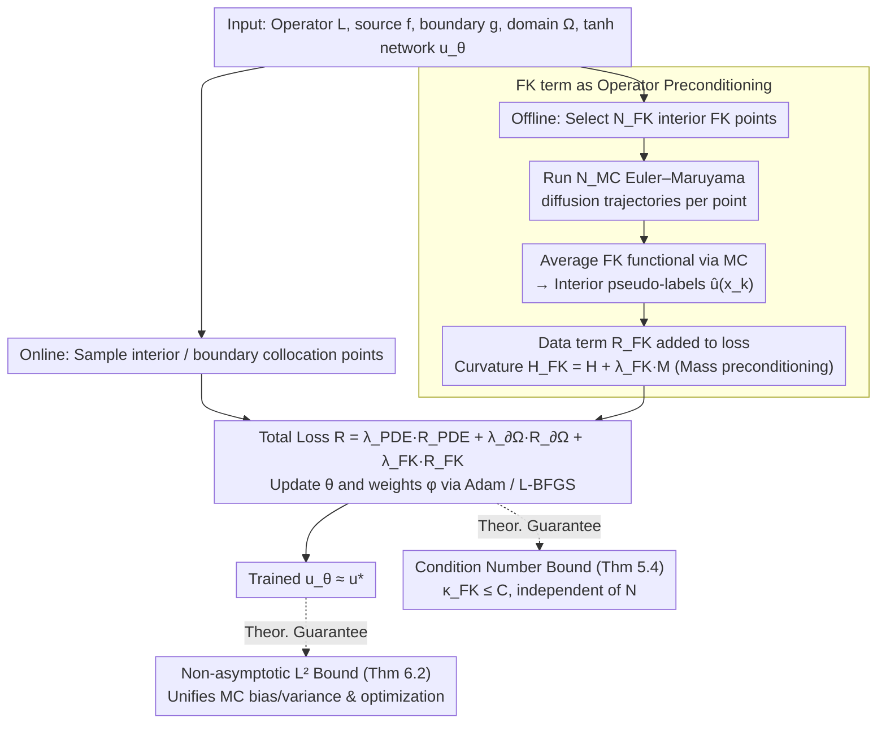

# Taming the Loss Landscape of PINNs with Noisy Feynman-Kac Supervision: Operator Preconditioning and Non-Asymptotic Error Bounds

**Conference**: ICML 2026  
**arXiv**: [2606.00643](https://arxiv.org/abs/2606.00643)  
**Code**: None  
**Area**: Optimization Theory / Physics-Informed Neural Networks / Loss Landscape  
**Keywords**: PINN, Feynman-Kac, Operator Preconditioning, Condition Number, Loss Landscape  

## TL;DR
Incorporating a small number of interior pseudo-labels obtained via Monte Carlo simulations of the Feynman–Kac formula into the PINN loss essentially acts as a preconditioner for the PDE operator. This work provides an operator-level proof that the condition number remains bounded with respect to the number of collocation points $N$, establishes non-asymptotic $L^2$ error bounds for $\tanh$ activation, and renders previously unsolvable problems (e.g., Schrödinger, Poisson, committor) solvable.

## Background & Motivation

**Background**: PINNs approximate PDE solutions $u_\theta$ by penalizing the residual $\mathcal{L}u - f$ and boundary violations at interior and boundary points. As a mesh-free solver, they are widely used in forward/inverse problems, parameter estimation, and multi-physics coupling scenarios.

**Limitations of Prior Work**: On moderately stiff or high-frequency problems, PINNs often train extremely slowly or fail to converge entirely. Switching hyperparameters or sampling strategies in the same code can lead to drastically different results. Existing alleviations—such as adaptive sampling, curriculum training, residual/gradient reweighting, domain decomposition, and specialized architectures—are often problem-specific and lack a universal, interpretable explanation.

**Key Challenge**: Recent perspectives on operator condition numbers (De Ryck et al. 2024, Rathore et al. 2024, etc.) indicate that training difficulties in PINNs stem from the severe ill-conditioning of the Hermite square $\mathcal{L}^*\mathcal{L}$ of the PDE operator $\mathcal{L}$. This is an inherent property of the problem rather than insufficient network capacity; thus, increasing network size or collocation density cannot resolve it. Existing remedies mostly focus on changing the optimizer (natural gradient, second-order methods, implicit preconditioning) rather than the training objective itself.

**Goal**: (1) Propose a preconditioning scheme that **modifies the training objective** rather than the optimizer by adding a data fidelity term to the PINN loss using arbitrary data sources (FEM, experimental, or MC simulation). (2) Rigorously prove that this term suppresses the PL$^*$ condition number of the loss from polynomial explosion with $N$ to being **uniformly bounded**. (3) Use the Feynman–Kac formula to provide a mesh-free, zero-extra-network label generation scheme compatible with PINNs. (4) Derive an end-to-end non-asymptotic $L^2$ error bound for $\tanh$ activation.

**Key Insight**: The authors observe that the "mass term" is typically neglected in the operator spectrum of PINNs. Adding $\sum_k (u_\theta(x_k) - \hat u(x_k))^2$ is equivalent to adding a positive definite term $\lambda_{\mathrm{FK}}M$ to the curvature matrix, which acts as "mass matrix" preconditioning in classical numerical analysis to supplement small eigenvalue directions. The Feynman–Kac formula provides an almost cost-free, parallelizable way to generate such pseudo-labels.

**Core Idea**: The probabilistic FK representation of the PDE solution $u^\star(x) = \mathbb{E}_x[\int_0^\tau r(X_t)\mathrm{d}t + h(X_\tau)]$ is estimated using MC via Euler–Maruyama simulation of several trajectories. This yields a small but useful set of "interior pseudo-labels." Integrating these as an auxiliary loss into standard PINNs significantly improves the condition number and stability without altering the architecture or optimizer.

## Method

The entire FK-PINN consists of two stages: "Offline FK Label Generation" and "Online PINN Training with Data Augmentation." The theoretical part proves bounded condition numbers under the PL$^*$ framework and incorporates MC noise into the approximation-estimation-optimization decomposition of learning theory to provide non-asymptotic error bounds.

### Overall Architecture

Inputs: Domain $\Omega\subset\mathbb{R}^d$, boundary $\partial\Omega$, second-order linear elliptic/parabolic operator $\mathcal{L}$, source term $f$, Dirichlet data $g$, and $\tanh$ network $u_\theta$. The pipeline is as follows:

1. **Offline**: Select $N_{\mathrm{FK}}$ interior FK supervision points $\{x_k^{\mathrm{FK}}\}$ (uniform, low-discrepancy, or adaptive). For each point, run $N_{\mathrm{MC}}$ diffusion trajectories using Euler–Maruyama with step $\Delta t$ and maximum time $T_{\max}$, estimating $\hat u^{\mathrm{MC}}(x_k^{\mathrm{FK}})$ via the accumulation formula $\hat u^{\mathrm{MC}}(x) = \frac{1}{N_{\mathrm{MC}}}\sum_m(\sum_{n=0}^{\hat\tau^{(m)}-1} r(X_n^{(m)})\Delta t + h(X_{\hat\tau^{(m)}}^{(m)}))$. This step is **fully offline, parallelizable**, and independent of the network.
2. **Online**: At each step, sample new interior/boundary collocation points and calculate the total loss (4.2) along with the existing FK dataset. Update $\theta$ and task weights $\phi$ using Adam/SGD. The total loss reverts to standard PINN only if $\lambda_{\mathrm{FK}} = 0$.

### Key Designs

**1. FK Supervision as Operator Preconditioning: Raising the Ill-conditioned Spectrum via Mass Terms**

Recent studies suggest that PINN training difficulties arise from the ill-conditioned spectrum of $\mathcal{L}^*\mathcal{L}$. Existing remedies often involve changing the optimizer (Natural Gradient, Newton), which is computationally expensive. The authors note that the "mass term" is often missing in PINN operator spectra and thus add a data fidelity term:

$$\mathcal{R}_{\mathrm{FK}}(\theta)=\frac{1}{N_{\mathrm{FK}}}\sum_k\big(u_\theta(x_k^{\mathrm{FK}})-\hat u^{\mathrm{MC}}_\Gamma(x_k^{\mathrm{FK}})\big)^2,$$

Total loss $\mathcal{R}_{\mathrm{FK\text{-}PINN}}=\lambda_{\mathrm{PDE}}\mathcal{R}_{\mathrm{PDE}}+\lambda_{\partial\Omega}\mathcal{R}_{\partial\Omega}+\lambda_{\mathrm{FK}}\mathcal{R}_{\mathrm{FK}}$. This modifies the curvature matrix $H$ to $H_{\mathrm{FK}}=H+\lambda_{\mathrm{FK}}M$ (where $M$ is positive semi-definite), acting as mass-matrix preconditioning to fill the small eigenvalue directions of $\mathcal{L}^*\mathcal{L}$. By modifying the objective rather than the optimizer, it remains compatible with existing PINN pipelines and provides preconditioning effects Regardless of data source—FK is simply a mesh-free implementation; coarse FEM or experimental data are also applicable.

**2. PL$^*$ Framework-based Condition Number Bound (Theorem 5.4): Proving "FK Term → Improved Condition Number"**

Directly proving the Hessian spectrum of deep networks is nearly impossible. Instead, the authors use the weaker PL$^*$ condition, valid even for non-isolated minimal submanifolds, defining $\kappa_{\mathrm{PL}}(\mathcal{J})=L(\mathcal{J})/\mu(\mathcal{J})$. While prior work showed $\kappa_{\mathrm{PINN}}\ge cN^{\beta/2}$ explodes with the number of collocation points, this work introduces a "compatibility condition" (Assumption 5.2) to prove that constants $\mu_0, L_0, C$ exist such that $\mathcal{R}_{\mathrm{FK\text{-}PINN}}$ is $L_0$-smooth and satisfies $\mu_0$-PL$^*$, yielding $\kappa_{\mathrm{FK}}\le C$. Consequently, the Gradient Descent iteration complexity is reduced from $\mathcal{O}(N^{\beta/2}\log(1/\varepsilon))$ to $\mathcal{O}(\log(1/\varepsilon))$.

**3. Non-asymptotic $L^2$ Error Bounds for $\tanh$ (Theorem 6.2): Translating Condition Numbers to Accuracy**

The authors decompose FK labels as $Y_i^{\mathrm{FK}}=u^\star(X_i^{\mathrm{FK}})+b(X_i^{\mathrm{FK}})+\zeta_i$, where bias $|b(x)|\le C_{\mathrm{bias}}\sqrt{\Delta t}+C_T e^{-\kappa T_{\max}}$ is controlled by Euler–Maruyama step size and truncation time. A key technical contribution is providing the first pseudo-dimension bounds for the first and second derivatives of $\tanh$ networks—whereas previous PINN bounds typically only applied to piecewise polynomial activations. This allows Rademacher/PAC estimates to extend to second-order terms in PDE residuals. Finally, for a depth $L=3$ FK-PINN after $T\gtrsim\log N_{\mathrm{FK}}$ GD steps:

$$\|u_{\theta_T}-u^\star\|_{L^2(\Omega)}\le C\big(N_{\mathrm{FK}}^{-\beta}+e^{-c_{\mathrm{opt}}T}+\varepsilon_{\mathrm{bias}}+\varepsilon_{\mathrm{bias}}^{1/2}\big),\qquad \beta=\frac{s-2}{2d+4(s-2)}.$$

This bound integrates MC bias/variance and optimization convergence into a single expression, providing engineering guidance on the FK budget.

### Loss & Training

The total loss employs uncertainty weighting (Kendall et al. 2018, Niu et al. 2025 version for PINNs): the log-variance of each task $s_j = \log\sigma_j^2$ is treated as a learnable weight $\lambda_j(\phi) = \exp(-s_j)$, with $s_j$ clipped to a bounded interval to prevent noisy FK terms from being ignored. The optimizer is Adam + L-BFGS, and the network is a $\tanh$ MLP with no architectural changes.

## Key Experimental Results

### Main Results

| Problem | Metric | Standard PINN | FK-PINN (Ours) | Gain |
| :--- | :--- | :--- | :--- | :--- |
| Poisson | Relative $L^2$ Error | $0.322\pm 0.149$ | $0.118\pm 0.003$ | Error reduced to 1/3, variance by 1 order |
| Schrödinger-type | Relative $L^2$ Error | $0.624\pm 0.195$ | $0.096\pm 0.010$ | PINN fails; FK-PINN recovers structure |
| Mean Exit Time | Relative $L^2$ Error | $1.007\pm 0.003$ | $0.107\pm 0.006$ | PINN output is noise; FK-PINN 10x better |
| Committor | Relative $L^2$ Error | $0.839\pm 0.661$ | $0.030\pm 0.008$ | Gain > 27x; variance drops from 0.66 to 0.008 |

### Ablation Study

| Configuration | Key Metrics | Observation |
| :--- | :--- | :--- |
| Schrödinger: Adam 30k + L-BFGS 15k | Qualitative visualization shows complete standard PINN failure | High-frequency potentials make the landscape unoptimizable; FK restores it |
| Mean/Std over 5 random seeds | FK-PINN variance is 1–2 orders smaller | Confirms bounded condition number → reduced sensitivity |
| FK Budget $N_{\mathrm{FK}}$ vs $N_{\mathrm{MC}}$ | Refers to coverage vs. variance | Matches scaling in Thm 6.2 |
| $\lambda_{\mathrm{FK}} = 0$ (Standard PINN) | Performance reverts to baseline | Benefit is from FK term, not architecture |

### Key Findings

- FK-PINN significantly outperforms PINNs across all four problems; **Schrödinger, Mean Exit Time, and Committor are "hard" problems where standard PINNs fail entirely**, yet become solvable with FK terms.
- Standard PINN variance is often of the same order as the mean, implying near-random results, whereas FK-PINN variance is 1–2 orders smaller, validating the theoretical prediction of bounded condition numbers.
- The benefit of operator preconditioning is agnostic to the data source; FK is merely a mesh-free implementation, implying sparse FEM or experimental data could be substituted.

## Highlights & Insights

- Reinterpreting the data fidelity term as operator preconditioning is the core narrative—it bridges classical mass-matrix preconditioning concepts with modern PINN operator condition number analysis.
- Providing pseudo-dimension bounds for $\tanh$ network derivatives is an independent contribution valuable for future PINN learning theory involving second-order residuals.
- Experimental design specifically target "hard" multi-scale/long-time diffusion problems to demonstrate that preconditioning transforms "unsolvable" problems into "solvable" ones.

## Limitations & Future Work

- The current theory assumes linear second-order elliptic/parabolic operators; extensions to general nonlinear PDEs would require branched diffusion or other advanced FK schemes.
- Assumption 5.2 (Compatibility) is natural in abstract form but requires case-by-case verification for specific problems.
- Error bounds depend on a depth $L=3$ setting; bounds for deeper networks remain a research area. Additionally, the MC bias $\varepsilon_{\mathrm{bias}}$ acts as a hard lower bound on error.
- In the "truly sparse" regime where $N_{\mathrm{FK}}$ is fixed but $N_{\mathrm{int}}$ increases, the error is saturated by the FK term—a statistical price for preconditioning acknowledged by the authors.

## Related Work & Insights

- **vs De Ryck et al. 2024**: Inherits the framework linking $\mathcal{L}^*\mathcal{L}$ to training dynamics but moves preconditioning from the "optimizer" to the "objective," lowering implementation costs.
- **vs Rathore et al. 2024**: Uses similar PL$^*$ and kernel integral operator tools to prove PINN deterioration, while this work provides the dual conclusion that adding data terms ensures $\kappa_{\mathrm{FK}}\leq C$.
- **vs Han et al. 2020 (Deep BSDE/FK methods)**: Those works use FK as the primary solver (requiring MC per $x$); this work uses FK only for sparse supervision, maintaining PINN's continuous solution advantage with minimal MC cost.
- **vs Adaptive Sampling (Wu et al. 2023, etc.)**: These methods provide minor fixes to the original operator spectrum; this work uses mass terms to fundamentally alter the spectrum.

<!-- RELATED:START -->

## Related Papers

- [\[ICML 2026\] FOAM: Frequency and Operator Error-Based Adaptive Damping Method for Reducing Staleness-Oriented Error for Shampoo](foam_frequency_and_operator_error-based_adaptive_damping_method_for_reducing_sta.md)
- [\[CVPR 2026\] Globscope: Toward a Global View of the Loss Landscape](../../CVPR2026/optimization/globscope_toward_a_global_view_of_the_loss_landscape.md)
- [\[ICML 2026\] Interpretability and Generalization Bounds for Learning Spatial Physics](interpretability_and_generalization_bounds_for_learning_spatial_physics.md)
- [\[ICLR 2026\] Non-Asymptotic Analysis of Efficiency in Conformalized Regression](../../ICLR2026/optimization/non-asymptotic_analysis_of_efficiency_in_conformalized_regression.md)
- [\[ICML 2026\] Sharp Description of Local Minima in the Loss Landscape of High-Dimensional Two-Layer ReLU Networks](sharp_description_of_local_minima_in_the_loss_landscape_of_high-dimensional_two-.md)

<!-- RELATED:END -->
