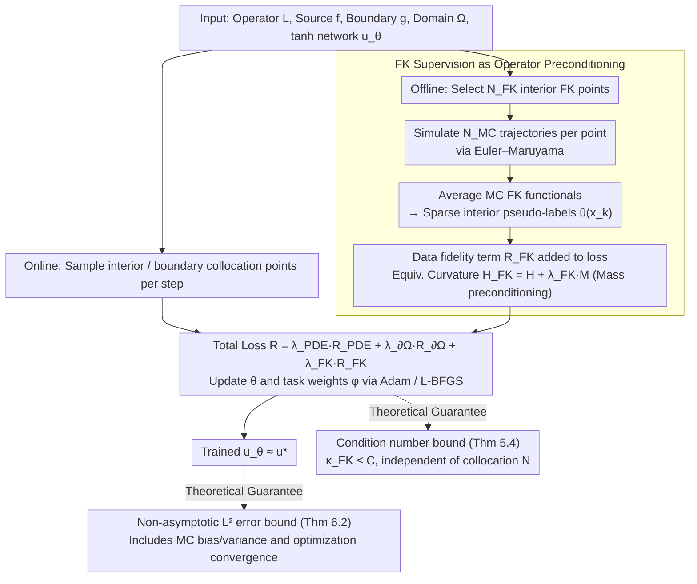

# Taming the Loss Landscape of PINNs with Noisy Feynman-Kac Supervision: Operator Preconditioning and Non-Asymptotic Error Bounds

**Conference**: ICML 2026  
**arXiv**: [2606.00643](https://arxiv.org/abs/2606.00643)  
**Code**: None  
**Area**: Optimization Theory / Physics-Informed Neural Networks / Loss Landscapes  
**Keywords**: PINN, Feynman-Kac, Operator Preconditioning, Condition Number, Loss Landscape  

## TL;DR
Incorporating a small number of interior point pseudo-labels, obtained via Monte Carlo simulation of the Feynman–Kac formula, into the PINN loss essentially acts as operator preconditioning for the PDE operator. This work provides an operator-level proof that the condition number remains bounded with respect to the number of collocation points $N$, along with a non-asymptotic $L^2$ error bound for $\tanh$ activations. This approach enables PINNs to solve previously failed problems such as Schrödinger, Poisson, and committor equations.

## Background & Motivation

**Background**: PINNs approximate PDE solutions $u_\theta$ by penalizing residuals $\mathcal{L}u - f$ and boundary violations at interior and boundary points. As a mesh-free solver paradigm, they are widely used in forward/inverse problems, parameter estimation, and multi-physics coupling.

**Limitations of Prior Work**: On moderately rigid or high-frequency problems, PINNs often train extremely slowly or fail to converge entirely. Performance can vary significantly with different hyperparameters or sampling strategies. Existing mitigation methods (adaptive sampling, curriculum training, residual/gradient reweighting, domain decomposition, specialized architectures) are often effective only for specific problems and lack a general, interpretable solution.

**Key Challenge**: Recent perspectives on operator condition numbers (De Ryck et al. 2024, Rathore et al. 2024, etc.) point out that the difficulty in training PINNs stems from the severe ill-conditioning of the Hermite square $\mathcal{L}^*\mathcal{L}$ of the PDE operator $\mathcal{L}$. This is an inherent property of the problem, not a lack of network capacity; thus, larger networks or denser collocation cannot resolve it. Existing remedies mostly focus on changing the optimizer (natural gradient, second-order methods, implicit preconditioning) rather than the training objective itself.

**Goal**: (1) Propose a preconditioning scheme that **modifies the training objective** rather than the optimizer: adding a data fidelity term to the PINN loss, where data can come from any source (FEM, experiments, MC simulations); (2) Rigorously prove that this term compresses the PL$^*$ condition number of the loss from polynomial explosion with $N$ to **uniform boundedness**; (3) Use the Feynman–Kac formula to provide a mesh-free, additional network-free label generation scheme compatible with PINNs; (4) Derive an end-to-end non-asymptotic $L^2$ error bound for $\tanh$ activations.

**Key Insight**: The authors observe that the "mass term" is usually ignored in the PINN operator spectrum. Adding $\sum_k (u_\theta(x_k) - \hat u(x_k))^2$ is equivalent to adding a positive definite term $\lambda_{\mathrm{FK}}M$ to the curvature matrix, similar to "mass matrix" preconditioning in classical numerical analysis, which compensates for small eigenvalue directions. The Feynman–Kac formula provides a nearly cost-free, parallelizable way to generate these pseudo-labels.

**Core Idea**: The Feynman–Kac probabilistic representation of the PDE solution $u^\star(x) = \mathbb{E}_x[\int_0^\tau r(X_t)\mathrm{d}t + h(X_\tau)]$ is used to generate MC estimates by simulating several trajectories via Euler–Maruyama. These limited but useful "interior pseudo-labels" are added to the standard PINN loss as an auxiliary term, significantly improving the condition number and stability without modifying the network architecture or optimizer.

## Method

The entire FK-PINN consists of two phases: "Offline FK Label Generation" and "Online PINN Training with Data Augmentation." The theoretical part proves the bounded condition number under the PL$^*$ framework and incorporates MC noise into the approximation-estimation-optimization decomposition of learning theory to provide non-asymptotic error bounds.

### Overall Architecture

Inputs include: domain $\Omega\subset\mathbb{R}^d$, boundary $\partial\Omega$, second-order linear elliptic/parabolic operator $\mathcal{L}$, source term $f$, Dirichlet data $g$, and a $\tanh$ network $u_\theta$. The pipeline is as follows:

1. **Offline**: Select $N_{\mathrm{FK}}$ interior FK supervision points $\{x_k^{\mathrm{FK}}\}$ (uniform, low-discrepancy, or adaptive). For each point, run $N_{\mathrm{MC}}$ diffusion trajectories using Euler–Maruyama with step $\Delta t$ and max time $T_{\max}$, estimating $\hat u^{\mathrm{MC}}(x_k^{\mathrm{FK}})$ according to the cumulative formula in Algorithm 1: $\hat u^{\mathrm{MC}}(x) = \frac{1}{N_{\mathrm{MC}}}\sum_m(\sum_{n=0}^{\hat\tau^{(m)}-1} r(X_n^{(m)})\Delta t + h(X_{\hat\tau^{(m)}}^{(m)}))$. This step is **fully offline, parallelizable**, and independent of the network.
2. **Online**: Sample new interior and boundary collocation points at each step. Compute the total loss (Eq. 4.2) along with the existing FK dataset. Update $\theta$ and task weights $\phi$ using Adam/SGD. The total loss reduces to standard PINN if and only if $\lambda_{\mathrm{FK}} = 0$.

### Key Designs

**1. Feynman–Kac Supervision as Operator Preconditioning: Raising the ill-conditioned spectrum via mass terms**

Recent studies indicate that the root of PINN training difficulty is the severe ill-conditioning of the $\mathcal{L}^*\mathcal{L}$ spectrum of the PDE operator. Existing remedies often modify the optimizer, which is costly. The authors observe that the "mass term" in the operator spectrum is usually ignored, thus they introduce a data fidelity term:

$$\mathcal{R}_{\mathrm{FK}}(\theta)=\frac{1}{N_{\mathrm{FK}}}\sum_k\big(u_\theta(x_k^{\mathrm{FK}})-\hat u^{\mathrm{MC}}_\Gamma(x_k^{\mathrm{FK}})\big)^2,$$

Total Loss: $\mathcal{R}_{\mathrm{FK\text{-}PINN}}=\lambda_{\mathrm{PDE}}\mathcal{R}_{\mathrm{PDE}}+\lambda_{\partial\Omega}\mathcal{R}_{\partial\Omega}+\lambda_{\mathrm{FK}}\mathcal{R}_{\mathrm{FK}}$. This is equivalent to modifying the curvature matrix $H$ to $H_{\mathrm{FK}}=H+\lambda_{\mathrm{FK}}M$ (where $M$ is positive semi-definite), acting as mass-matrix preconditioning to compensate for the small eigenvalues of $\mathcal{L}^*\mathcal{L}$. Modifying the training objective rather than the optimizer makes it fully compatible with existing PINN pipelines and theoretically ensures the preconditioning effect is independent of the data source—FK is merely a mesh-free, parallelizable implementation.

**2. Condition Number Bound based on PL$^*$ Framework (Theorem 5.4): Proving that adding FK terms improves the condition number**

Directly proving the Hessian spectrum of deep networks is nearly impossible. Instead, the authors use the weaker PL$^*$ condition, valid even for non-isolated minimal submanifolds, defining $\kappa_{\mathrm{PL}}(\mathcal{J})=L(\mathcal{J})/\mu(\mathcal{J})$. Rathore et al. proved that for standard PINNs, $\kappa_{\mathrm{PINN}}\ge cN^{\beta/2}$ explodes polynomially with $N$. This work introduces a "compatibility condition" (Assumption 5.2) and proves there exist constants $\mu_0, L_0, C$ independent of $N$ such that $\mathcal{R}_{\mathrm{FK\text{-}PINN}}$ is $L_0$-smooth and satisfies $\mu_0$-PL$^*$, hence $\kappa_{\mathrm{FK}}\le C$. With the PL$^*$ convergence theorem, the GD iteration complexity is reduced from $\mathcal{O}(N^{\beta/2}\log(1/\varepsilon))$ to $\mathcal{O}(\log(1/\varepsilon))$.

**3. Non-asymptotic $L^2$ Error Bound with $\tanh$ (Theorem 6.2): Translating condition number improvements into accuracy**

Beyond conditioning, the accuracy must be addressed. The authors decompose the FK MC labels as $Y_i^{\mathrm{FK}}=u^\star(X_i^{\mathrm{FK}})+b(X_i^{\mathrm{FK}})+\zeta_i$. The bias $|b(x)|\le C_{\mathrm{bias}}\sqrt{\Delta t}+C_T e^{-\kappa T_{\max}}$ is controlled by step size and truncation time, while $\zeta_i$ is sub-exponential. A key technical contribution is providing pseudo-dimension bounds for the first and second derivatives of $\tanh$ networks—previous PINN bounds mostly applied to piecewise polynomial activations. This allows Rademacher/PAC estimates to extend to the second-order terms in the PDE residual. Finally, with appropriate width and sampling budget, a depth $L=3$ FK-PINN after $T\gtrsim\log N_{\mathrm{FK}}$ GD steps satisfies:

$$\|u_{\theta_T}-u^\star\|_{L^2(\Omega)}\le C\big(N_{\mathrm{FK}}^{-\beta}+e^{-c_{\mathrm{opt}}T}+\varepsilon_{\mathrm{bias}}+\varepsilon_{\mathrm{bias}}^{1/2}\big),\qquad \beta=\frac{s-2}{2d+4(s-2)}.$$

This bound integrates MC bias/variance and optimization convergence into a single expression, providing an engineering guide for the FK budget.

### Loss & Training

The total loss follows uncertainty weighting (Kendall et al. 2018, PINN version by Niu et al. 2025): the log-variance $s_j = \log\sigma_j^2$ of each task is treated as a learnable weight $\lambda_j(\phi) = \exp(-s_j)$, with $s_j$ clipped to a bounded interval to prevent noisy FK terms from being ignored. The optimizer is Adam + L-BFGS, and the network is a $\tanh$ MLP.

## Key Experimental Results

### Main Results

| Problem | Metric | Standard PINN | FK-PINN | Gain |
|--------|------|------|----------|------|
| Poisson | $L^2$ Rel. Error | $0.322\pm 0.149$ | $0.118\pm 0.003$ | Error reduced to 1/3, Variance down by 1 OOM |
| Schrödinger-type | $L^2$ Rel. Error | $0.624\pm 0.195$ | $0.096\pm 0.010$ | PINN fails; FK-PINN recovers wave structure |
| Mean Exit Time | $L^2$ Rel. Error | $1.007\pm 0.003$ | $0.107\pm 0.006$ | PINN output meaningless; FK-PINN error down 1 OOM |
| Committor | $L^2$ Rel. Error | $0.839\pm 0.661$ | $0.030\pm 0.008$ | >27x improvement; Variance from 0.66 to 0.008 |

### Ablation Study

| Configuration | Key Metric | Description |
|------|---------|------|
| Qualitative Visual (Schrödinger) | Adam 30k + L-BFGS 15k | Standard PINN fails entirely due to high-freq potential. FK restores it. |
| Mean/Std over 5 runs | Variance analysis | FK-PINN variance is 1–2 OOMs lower than PINN across all problems. |
| FK Budget ($N_{\mathrm{FK}}, N_{\mathrm{MC}}$) | Appendix E | $N_{\mathrm{FK}}$ controls coverage; $N_{\mathrm{MC}}$ controls variance per point. Matches Theorem 6.2. |
| $\lambda_{\mathrm{FK}} = 0$ | Baseline performance | Performance reverts to standard PINN, verifying gains come from FK term. |

### Key Findings

- FK-PINN significantly outperforms standard PINN in all 4 problems; **Schrödinger, Mean Exit Time, and Committor are "unsolvable" for PINN** but become solvable with FK terms.
- Standard PINN variance is often of the same order as the mean, implying near-random results; FK-PINN variance is 1–2 OOMs lower, fulfilling the bounded condition number theoretical prediction.
- Preconditioning benefits are agnostic to source; coarse FEM or experimental data can similarly replace FK MC.

## Highlights & Insights

- Reinterpreting data fidelity as operator preconditioning is the core narrative—it bridges old mass-matrix concepts with modern operator condition number analysis in PINNs.
- The pseudo-dimension bound for derivatives of $\tanh$ networks is an independent contribution useful for future PINN theoretical work.
- The experiments target known PINN failure cases (multi-scale, long-time diffusion) to prove that preconditioning makes "unsolvable" problems "solvable."
- Flexibility: The theory covers any compatible supervision (FK MC, sparse FEM, etc.), provided Assumption 5.2 holds.

## Limitations & Future Work

- Currently limited to linear second-order elliptic/parabolic operators where FK representation is available. General nonlinear PDEs require extensions like branching diffusion.
- Assumption 5.2 (Compatibility) is abstract; practical checking tools are needed.
- Error bounds depend on depth $L=3$; bounds for deeper $\tanh$ networks can be tightened. The MC bias $\varepsilon_{\mathrm{bias}}$ remains a hard lower bound.
- In the "truly sparse" regime where $N_{\mathrm{FK}}$ is fixed but $N_{\mathrm{int}}$ grows, the error saturates due to the FK term—a statistical price for preconditioning.

## Related Work & Insights

- **vs De Ryck et al. 2024**: Inherits the $\mathcal{L}^*\mathcal{L}$ spectrum/dynamics framework but shifts the fix from the optimizer to the training objective, reducing implementation cost.
- **vs Rathore et al. 2024**: Complements their proof of polynomial $\kappa_{\mathrm{PINN}}$ explosion by proving that adding data terms yields $\kappa_{\mathrm{FK}}\le C$.
- **vs Han et al. 2020**: Unlike methods using FK as a direct solver (requiring MC at every $x$), this work uses sparse FK as supervision, maintaining the continuous solution advantages of PINNs.
- **vs Adaptive Sampling/Reweighting**: These methods often adjust the existing ill-conditioned spectrum; FK-PINN directly modifies it via mass terms.

<!-- RELATED:START -->

## Related Papers

- [\[ICML 2026\] FOAM: Frequency and Operator Error-Based Adaptive Damping Method for Reducing Staleness-Oriented Error for Shampoo](foam_frequency_and_operator_error-based_adaptive_damping_method_for_reducing_sta.md)
- [\[CVPR 2026\] Globscope: Toward a Global View of the Loss Landscape](../../CVPR2026/optimization/globscope_toward_a_global_view_of_the_loss_landscape.md)
- [\[ICLR 2026\] Non-Asymptotic Analysis of Efficiency in Conformalized Regression](../../ICLR2026/optimization/non-asymptotic_analysis_of_efficiency_in_conformalized_regression.md)
- [\[ICML 2026\] Sharp Description of Local Minima in the Loss Landscape of High-Dimensional Two-Layer ReLU Networks](sharp_description_of_local_minima_in_the_loss_landscape_of_high-dimensional_two-.md)
- [\[ICML 2026\] Interpretability and Generalization Bounds for Learning Spatial Physics](interpretability_and_generalization_bounds_for_learning_spatial_physics.md)

<!-- RELATED:END -->
