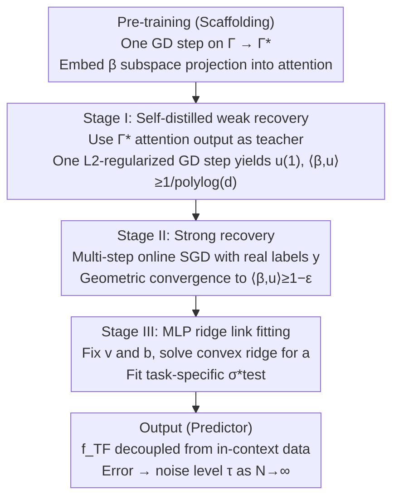

# Test time training enhances in-context learning of nonlinear functions

**Conference**: ICML 2026  
**arXiv**: [2509.25741](https://arxiv.org/abs/2509.25741)  
**Code**: None  
**Area**: Learning Theory / Transformer / Test-time Training  
**Keywords**: in-context learning, test-time training, single-index model, general exponent, LoRA

## TL;DR
This paper establishes the first rigorous generalization bound for the combination of a single-layer softmax-attention transformer and LoRA test-time fine-tuning. It proves that TTT compresses the sample complexity of ICL from $r^{\Theta(\mathrm{ie}(\sigma_*))}$ to $r^{\Theta(\mathrm{ge}(\sigma_*))}$ on single-index polynomial tasks, allows the link function to vary per task, and ensures that inference error scales with context length $\to$ noise level.

## Background & Motivation
**Background**: ICL refers to the ability of pre-trained transformers to solve new tasks via prompts without weight updates. Theoretically, it has been widely analyzed—bounds exist for linear regression, single-index models, causal structures, and feature learning under softmax attention. However, ICL capabilities are constrained by architectural factors such as pre-training data distribution, layer norm, and softmax.

**Limitations of Prior Work**: Existing ICL theories (e.g., Nishikawa et al. 2025) prove $\mathrm{loss}=o_d(1)$ as the dimension $d\to\infty$, but $d$ is typically fixed. They provide no guarantee that the loss approaches zero as the context length $N\to\infty$ because the softmax attention denominator converges to an expectation containing all Hermite coefficients, resulting in persistent structural bias. Furthermore, these theories assume a fixed link function $\sigma_*$ across all tasks, only allowing the feature vector $\beta$ to change, which limits task diversity.

**Key Challenge**: ICL is bottlenecked by the inherent form of softmax attention in two dimensions: achieving "asymptotic precision as $N\to\infty$" and "adapting to task-specific link function differences." To overcome this, part of the parameters must be updated during inference.

**Goal**: (i) Leverage TTT to enable ICL for task-specific link functions; (ii) Provide explicit $N_{\text{test}}$ convergence rates rather than just $d\to\infty$ limits; (iii) Reduce sample complexity from the CSQ upper bound $r^{\mathrm{ie}(\sigma_*)}$ to the tighter SQ magnitude $r^{\mathrm{ge}(\sigma_*)}$, where $\mathrm{ge}\le 2$ for dual/even functions.

**Key Insight**: During pre-training, the attention matrix $\Gamma^\star$ learns a projection onto the $r$-dimensional subspace where $\beta$ resides. During TTT, LoRA layers $\mathbf{u}^\top\mathbf{u}$ are superimposed onto $\Gamma^\star$, followed by a three-stage alignment (weak recovery / strong recovery / MLP link fitting) to the task parameters.

**Core Idea**: Treat the "subspace projection + general exponent power reduction" capability learned by the attention layer during pre-training as a "teacher signal" (self-distillation) for TTT. This signal is used for weak recovery, thereby bypassing the sample barrier of $r^{\mathrm{ie}}$ required for directly learning $\beta$ via SGD.

## Method

### Overall Architecture
Model: Single-layer softmax attention + ReLU MLP, parameterized as $\mathbf{W}^{KQ}=\mathrm{diag}(\Gamma,1)$, $\mathbf{W}^{FV}=[\mathbf{O}\;\mathbf{v}]$, with output $f_{\mathrm{IC}}(\Gamma,\mathbf{X}_N,\mathbf{y}_N,\mathbf{x})=\sum_j a_j\sigma(v_j\cdot\text{attn}(\Gamma)+b_j)$. Pre-training involves one GD step on $\Gamma$ to obtain $\Gamma^\star$. In the testing phase, the attention is modified into a LoRA form $\Gamma_u=\Gamma^\star+\mathbf{u}^\top\mathbf{u}$, and the prompt is split into four segments $(N_1,N_2,N_3,N_4)$ for weak recovery, strong recovery, and MLP training. The final predictor $f_{\mathrm{TF}}(\mathbf{x},\hat{\mathbf{u}},\mathbf{v},\mathbf{a},\mathbf{b})=\sum_j a_j\sigma(v_j\langle\hat{\mathbf{u}},\mathbf{x}\rangle+b_j)$ does not depend on in-context data, thus bypassing softmax asymptotic bias. The entire process is a serial pipeline: pre-training establishes the directional subspace projection in $\Gamma^\star$ (the scaffold), followed by three test-time stages that complete weak recovery, strong recovery, and link function fitting to assemble a predictor decoupled from the in-context data.

### Key Designs

**1. Pre-training Utilization + Self-distilled Weak Recovery: Bypassing sample barriers via the pre-trained scaffold**

Directly training LoRA using true labels $y$ is constrained by the information exponent $\mathrm{ie}(\sigma_*)$ of the link function. For high-order Hermite components, the signal is too weak, causing sample requirements to skyrocket. This work cleverly avoids using true $y$ initially, instead using the pre-trained attention output $g(\Gamma^\star,\mathbf{X}_{N_1},\mathbf{y}_{N_1},\mathbf{w}_i)$ as the teacher signal. By performing one $L_2$-regularized GD step on the newly sampled query $\mathbf{w}_i$, $\mathbf{u}^{(0)}$ is pushed to $\mathbf{u}^{(1)}$, achieving $\langle\beta,\mathbf{u}^{(1)}\rangle\ge 1/\mathrm{polylog}(d)$ weak recovery. The strength of this teacher signal relies on a core lemma: $\mathrm{ie}(\mathrm{He}_{\mathrm{ge}(\sigma_*)})=\mathrm{ge}(\sigma_*)$. The pre-trained attention can already compute $\langle\beta,\mathbf{x}\rangle^{\mathrm{ge}(\sigma_*)}$ within the context, increasing signal strength from $r^{-(\mathrm{ie}-1)}$ to $r^{-(\mathrm{ge}-1)}$. This reduces sample complexity from $r^{\mathrm{ie}(\sigma_*)}$ to a tighter $r^{\mathrm{ge}(\sigma_*)}$ (where $\mathrm{ge}\le 2$ for even functions). Self-distilling from attention avoids catastrophic forgetting while significantly reducing the cost of learning the direction $\beta$.

**2. Geometric Convergence in Strong Recovery: Pushing alignment from weak to strong**

Weak recovery only reaches a signal strength of $\Theta(1/\mathrm{polylog}(d))$, far from precise recovery. In this step, $N_3$ steps of online SGD push $\langle\beta,\mathbf{u}^{(n)}\rangle$ to $\ge 1-\varepsilon$. The key observation is that after weak recovery, the signal strength is decoupled from $\mathrm{ge}(\sigma_*)$. The paper proves that once the error $1-\langle\beta,\mathbf{u}^{(n)}\rangle$ drops below a certain threshold, it enters a geometric decay phase. This tightens the sample complexity from the $\Theta(\varepsilon^{-2})$ linear convergence bound found in Lee et al. 2024 to $\Theta(\varepsilon^{-1}\log\varepsilon^{-1})$. While the "weak $\to$ strong recovery" analysis is standard in single-index model theory, the specific contribution here is using geometric convergence to provide a tighter bound for the strong recovery phase.

**3. MLP Layer Ridge Training for Link Function: Decoupling "learning nonlinearity" from "learning direction"**

With direction $\beta$ handled by the attention layer, the task-specific nonlinearity $\sigma_*^{\text{test}}$ is fitted by the MLP layer using $N_4$ context samples. $\mathbf{v}$ and $\mathbf{b}$ are fixed as random, and only $\mathbf{a}$ is solved via convex ridge regression:

$$\mathbf{a}^\star=\arg\min\frac{1}{2N_4}\sum_t\big(f_{\mathrm{TF}}(\mathbf{x}_t,\mathbf{u}^{(N_3+1)},\mathbf{v}^\star,\mathbf{a},\mathbf{b}^\star)-y_t\big)^2+\frac{\lambda_2}{2}\|\mathbf{a}\|^2$$

Convexity ensures solvability, and Rademacher complexity yields a generalization bound of $O(N_4^{-1/2})+O(m^{-1/2})$. Separating the learning of direction (attention) and shape (MLP) is a standard technique for rigorous bounds in single-index theory and represents the core advantage of TTT over standard ICL—this layer allows the link function to vary per task, whereas it remains fixed in standard ICL. Note that the final predictor $f_{\mathrm{TF}}(\mathbf{x},\hat{\mathbf{u}},\mathbf{v},\mathbf{a},\mathbf{b})=\sum_j a_j\sigma(v_j\langle\hat{\mathbf{u}},\mathbf{x}\rangle+b_j)$ no longer depends on in-context data, which is precisely why it circumvents softmax asymptotic bias and achieves the "error $\to$ noise level $\tau$" guarantee as $N\to\infty$.

### Loss & Training
Pre-training: One GD step on $\Gamma$ with $\lambda_{pt}$ regularization. TTT Stage I: One GD step of self-distillation with $\lambda_1$ regularization. Stage II: Multi-step online SGD to learn $\mathbf{u}$. Stage III: Ridge regression to learn $\mathbf{a}$. Key complexity constraints: $T_{pt},N_{pt}=\tilde\Omega(r^2 d^{Q+2})$, $N_1,N_{\text{new}}=\tilde\Omega(r^{\mathrm{ge}(\sigma_*)+2})$, $N_2=\tilde\Theta(r^2)$.

## Key Experimental Results

### Main Results
Validated using a 2-layer GPT-2 in controlled experiments ($d=r=4$, $\sigma_*^t(z)=\frac{1}{\sqrt{3!}}\mathrm{He}_3(z)+\frac{c_t}{\sqrt{4!}}\mathrm{He}_4(z)$, $c_t\sim U(-0.5,0.5)$).

| Setting | Context Length | ICL Prediction Error | TTT Prediction Error | Remarks |
|------|-----------|--------------|--------------|------|
| Task-varying link functions | Short (Small $N$) | High | Initially unstable, then decreases | High learning rate in TTT causes initial noise |
| Task-varying link functions | Medium | High (Plateau) | Significantly lower | TTT continues to decrease |
| Task-varying link functions | Long (Large $N$) | Still high | Near noise level | ICL asymptotic bias exposed |

Key observation: ICL error does not decrease with $N$ in scenarios where link functions vary across tasks, whereas TTT error continues to approach the noise level $\tau$.

### Ablation Study

| Configuration | Phenomenon |
|------|------|
| Fixed $r=4, d\in\{4,8,16\}$ | TTT convergence curves almost overlap, indicating sample complexity depends only on intrinsic dimension $r$, not $d$ |
| Skipping Stage I (Self-distillation) | Sample requirement for $\mathbf{u}$ using only $y$ spikes to $r^{\mathrm{ie}(\sigma_*)}$ |
| Fixed link functions (Standard ICL setting) | TTT advantage disappears; standard ICL is sufficient |

### Key Findings
- **TTT's advantage is concentrated in scenarios with varying link functions**: While ICL can learn fixed links, TTT is necessary to fit new nonlinearities by updating the MLP at test time, even if the attention layer's directional projection is reused.
- **Geometric strong recovery** tightens the sample complexity upper bound for single-index models from $\varepsilon^{-2}$ to $\varepsilon^{-1}\log\varepsilon^{-1}$, serving as a useful theoretical supplement for SGD-based nonlinear learning.
- **Independence from in-context data for final prediction** is a critical design choice—it provides the asymptotic guarantee of "error $\to \tau$" as $N\to\infty$, avoiding the structural bias of softmax attention.

## Highlights & Insights
- **Sample complexity jump via "Self-distillation + LoRA"**: Using the attention layer as a teacher for weak recovery effectively reduces the exponent from $\mathrm{ie}$ to $\mathrm{ge}$, serving as an elegant bridge from pre-training to test-time training.
- **Clear division of labor between "Direction (Attention)" and "Shape (MLP)"**: This is theoretically clean and corresponds to the engineering practice of freezing the backbone and fine-tuning only the head at test time.
- **First $N$-dependent convergence rate in nonlinear ICL**: Unlike Gozeten 2025, which covers only linear transformers and data, this work extends TTT theory to softmax attention and polynomial link functions, marking a milestone in this direction.

## Limitations & Future Work
- Only proves single-index polynomial links; more general multi-index or non-polynomial links remain to be extended.
- Assumes test-time $\beta$ comes from the same subspace as pre-training; distribution shift (e.g., $\mathrm{Supp}(\beta)_{\text{test}}\ne\mathrm{Supp}(\beta)_{pt}$) is not covered.
- The algorithm explicitly separates attention and MLP training into two stages, which differs from the "joint training" used in practice; whether conclusions extend to joint training remains open.
- The controlled experiment used small dimensions ($d=4, r=4$); whether TTT gains in large models/real tasks are driven by the same mechanism is unverified.

## Related Work & Insights
- **vs. Gozeten et al. 2025**: Extends TTT theory from linear transformers/data to softmax/nonlinear polynomial links, proving the "link learning" advantage of TTT for the first time.
- **vs. Nishikawa et al. 2025**: Uses the same single-layer softmax attention framework but only provides $o_d(1)$ asymptotic bounds. Ours provides $N$-explicit convergence rates and allows task-varying links.
- **vs. Lee et al. 2024**: Lee proved SQ learning complexity of $r^{\mathrm{ge}(\sigma_*)}$. Ours ports this bound to the transformer setting using attention self-distillation and LoRA.
- **vs. Akyürek et al. 2025 (Empirical TTT)**: Provides the first nonlinear theoretical explanation for the empirical success of ICL+TTT.
- **Insight**: The paradigm of "updating only a few parameters outside of attention at test time" is valuable for engineering and suggests future theoretical work can generalize this framework to multi-index and distribution shift scenarios.

## Rating
- Novelty: ⭐⭐⭐⭐ First convergence theory for TTT-ICL under softmax and nonlinear links; extensible framework.
- Experimental Thoroughness: ⭐⭐⭐ Controlled experiments intuitively verify core theoretical claims, though scale is limited.
- Writing Quality: ⭐⭐⭐⭐ Problem and proof structures are clear; proof sketches are readable.
- Value: ⭐⭐⭐⭐ Provides the first nonlinear theoretical footing for the popular TTT direction; offers guidance for both algorithmic and analytical development.

<!-- RELATED:START -->

## Related Papers

- [\[ICLR 2026\] Test-Time Meta-Adaptation with Self-Synthesis](../../ICLR2026/optimization/test-time_meta-adaptation_with_self-synthesis.md)
- [\[ICML 2026\] Learning Context-Conditioned Predicate Semantics via Prototype Feedback](learning_context-conditioned_predicate_semantics_via_prototype_feedback.md)
- [\[ICML 2025\] Training Dynamics of In-Context Learning in Linear Attention](../../ICML2025/optimization/training_dynamics_of_in-context_learning_in_linear_attention.md)
- [\[CVPR 2025\] Test-Time Augmentation Improves Efficiency in Conformal Prediction](../../CVPR2025/optimization/test-time_augmentation_improves_efficiency_in_conformal_prediction.md)
- [\[ICML 2026\] Enhancing LLM Training via Spectral Clipping](enhancing_llm_training_via_spectral_clipping.md)

<!-- RELATED:END -->
