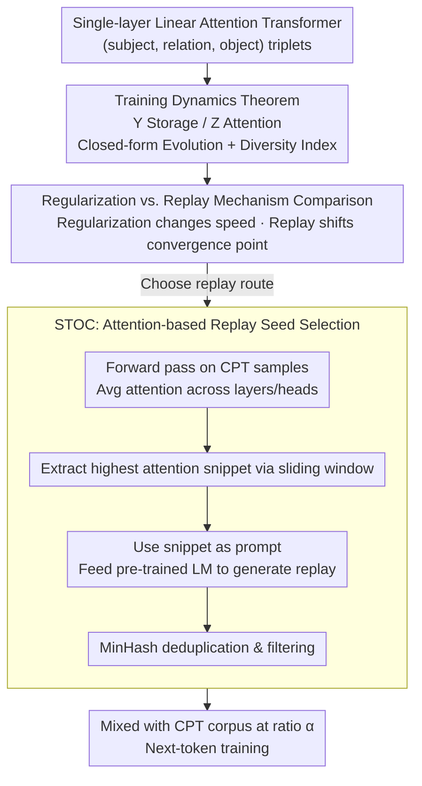

# Towards Understanding Continual Factual Knowledge Acquisition of Language Models: From Theory to Algorithm

**Conference**: ICML 2026  
**arXiv**: [2605.10640](https://arxiv.org/abs/2605.10640)  
**Code**: https://github.com/WhyDwelledOnAi/continual_Factual_Knowledge_Acquision (Available)  
**Area**: Continual Pre-training / Language Model Theory / Catastrophic Forgetting  
**Keywords**: Continual Pre-training, Catastrophic Forgetting, Transformer Training Dynamics, Data Replay, Attention Attribution

## TL;DR
The authors derive closed-form training dynamics for a simplified single-layer linear attention Transformer, proving that regularization methods only alter convergence speed without shifting the convergence point (doomed to fail in cFKA scenarios), whereas data replay directly shifts the convergence point and increases oscillation amplitude to stabilize old knowledge. Based on this, STOC is proposed: it selects snippets based on token-level attention contributions to guide the pre-trained model in generating replay corpora, consistently suppressing forgetting better than LAMOL on synthetic, KnowEdit, and IndustryCorpus legal datasets.

## Background & Motivation

**Background**: LLMs accumulate vast factual knowledge during open-domain pre-training (PT), but industrial applications often require continual pre-training (CPT) to inject domain knowledge (e.g., legal corpora) or new facts. CPT suffers from catastrophic forgetting, where old knowledge is overwritten by new data.

**Limitations of Prior Work**: Existing CPT mitigation solutions fall into two categories: regularization-based (e.g., EWC) and data replay-based (replay / LAMOL). Experiments on LLMs generally find limited effectiveness for regularization, while even small replay ratios significantly alleviate forgetting; however, the community lacks a unified theoretical explanation for this phenomenon, leading to heuristic ratio tuning in engineering.

**Key Challenge**: Continual Factual Knowledge Acquisition (cFKA) is essentially "shifting the output distribution of the same token towards new facts under a shared next-token prediction objective without collapsing the probability of old facts." However, it lacks a transformer-specific dynamical description of how learning rates, token frequencies, and relative attention allocation determine the degree of forgetting.

**Goal**: (a) Develop an analytical training dynamics framework for cFKA characterizing the evolution of $\mathbf{Y}$ (FFN-like knowledge storage) and $\mathbf{Z}$ (attention) parameters; (b) Use this theory to explain why regularization fails and replay succeeds; (c) Derive STOC, a transformer-native generative replay method based on token-level attention, and validate it in synthetic and real-world scenarios.

**Key Insight**: Following the "Physics of Language Models" series by Allen-Zhu & Li, facts are represented as (subject, relation, object) triplets fed into a single-layer linear attention Transformer. Assuming $\eta_Y \gg \eta_Z$ treats $\mathbf{Z}$ as slowly varying, simplifying the multi-body nonlinear optimization into a controllable Taylor expansion.

**Core Idea**: Instead of patching existing CPT algorithms, the authors first prove via transformer training dynamics that regularization is a "point-invariant" method while replay is a "point-moving and oscillation-amplifying" method for preserving old knowledge. Token attention attribution is then used to pick replay seeds, ensuring generative replay produces samples containing old knowledge.

## Method

### Overall Architecture
Analytical framework: The model is re-parameterized into $\mathbf{Y} := \mathbf{E}\mathbf{W}_O\mathbf{W}_V^\top \mathbf{E}^\top$ (FFN-like knowledge storage) and $\mathbf{Z} := \mathbf{E}\mathbf{W}_K\mathbf{W}_Q^\top \mathbf{E}^\top / \sqrt{d}$ (attention). Under cross-entropy optimization, SGD is used to derive the evolution theorem of $\mathbf{Y}$ and the conservation law of $\mathbf{Z}$. Regularization and replay are then incorporated into the gradient equations to compare their effects on convergence points, speeds, and oscillation amplitudes. Finally, based on the inference that "tokens with high attention scores carry more factual information," STOC is designed: a forward pass on each CPT sample yields token-level attention scores $\to$ averaged across layers $\to$ sliding window extracts highest attention snippets $\to$ used as prompts for the pre-trained LM to generate replay $\to$ MinHash deduplication $\to$ mixed with new data at ratio $\alpha$ for CPT. The workflow moves from "PT theory validation" to "CPT mechanism analysis" and finally "algorithm derivation."

### Key Designs

**1. cFKA Training Dynamics Theorem for Single-layer Transformer: Token-level Knowledge Storage**

Prior Transformer optimization theories either focus only on ICL or ignore multi-token knowledge structures, failing to explain how facts are distributed across tokens. By re-parameterizing storage $\mathbf{Y}$ and attention $\mathbf{Z}$, and assuming $\eta_Y\gg\eta_Z$ ($\mathbf{Z}$ as slowly varying), the loss is convex for $\mathbf{Y}$. The reference optimal solution is the Bayes optimal prediction $\mathbf{U}=\sum_{o,s}\frac{1}{a_s}[\ln\Pr(s\mid o)+\frac{1}{L}\ln\Pr(o)]\,\mathbf{x}_o\mathbf{x}_s^\top$. Error evolution is expressed in Taylor form:

$$\mathbf{e}_s(T)\approx\Big[\prod_{t=1}^T(\mathbf{I}-\eta_Y z_s\delta_s(t)\tilde{\mathbf{H}}(t))\Big]\mathbf{e}_s(0)+\sum_t\eta_Y z_s\delta_s(t)\Big[\prod(\cdot)\Big]\bm{\xi}(t),$$

where the first term's exponential decay determines convergence speed (controlled by the largest eigenvalue of $\tilde{\mathbf{H}}$), and the second term is a fixed-amplitude oscillation (controlled by the smallest positive eigenvalue). Simultaneously, $\mathbf{Z}$ satisfies the conservation law $\frac{d}{dt}[(\tfrac{z_s}{\eta_Z})^2-\sum_o(\tfrac{y_{o,s}}{\eta_Y})^2]=0$, leading to the conclusion that the attention of token $s$ is determined by its Diversity Index $\mathrm{DI}(\overline{\mathbf{x}}_s)\propto-\sqrt{\eta_Z/\eta_Y}\sqrt[4]{\sum_o[\ln\Pr(s\mid o)+L^{-1}\ln\Pr(o)]^2}+C$. Tokens with narrower distributions and more exclusive information have higher attention. Breaking dynamics down to the token level is the foundation for subsequent steps.

**2. Mechanism Comparison: Regularization vs. Data Replay**

The authors substitute both methods into the dynamics. For EWC-style objectives $\mathcal{L}=\mathcal{L}_{\text{new}}+\frac{k}{2}\sum_i w_i(\theta_i-\theta_i^*)^2$, the error includes an additional term $-\sum_t k\eta_Y[\prod(\cdot)]\,\tilde{\mathbf{u}}$, which is constrained by $\lambda^+_{\min}(\mathrm{diag}(\mathbf{w}_s))=\min_o w_{o,s}$. Since factual knowledge is carried by only a few dimensions of a token, this minimum eigenvalue is nearly zero, meaning the convergence point remains static while only the speed decreases. For replay, the frequency distribution becomes $\Pr(\mathbf{x}_s)=\frac{1-\alpha}{|\mathcal{O}_s^{\mathrm{old}}|}\sum_{o\in\mathcal{O}_s^{\mathrm{old}}}\mathbf{x}_o+\frac{\alpha}{|\mathcal{O}_s^{\mathrm{new}}|}\sum_{o\in\mathcal{O}_s^{\mathrm{new}}}\mathbf{x}_o$. The first term directly writes old knowledge back into the convergence point, while the oscillation term $\lambda^+_{\min}(\tilde{\mathbf{H}})$ is amplified after mixing, serving as a "reminder" for old knowledge. Conclusion: To suppress forgetting, the convergence point must be moved; regularization fails, only replay succeeds.

**3. STOC: Recalling via Familiar Directions using Attention Contribution**

Unlike LAMOL which uses special tokens as prompts, STOC uses signals from dynamics: a forward pass calculates token-level importance $a_t$ across all layers/heads; a sliding window finds the highest $\sum_t a_t$ snippet (typically 16–32 tokens) as a prompt for the pre-trained model. Dynamically, high-attention tokens are those with low Diversity Index that "lock" a set of old facts, making the continuation likely to cover old knowledge. MinHash deduplication ensures diversity, and the data is mixed at ratio $\alpha\in\{0.5, 0.67, 0.8, 0.9\}$. This forces the model to recall in its most familiar directions with zero additional training cost.

### Loss & Training
The base CPT uses cross-entropy $\mathcal{L} = -\mathrm{logit}(x_{T+2}\mid \mathbf{X}) + \log\sum_o \exp(\mathrm{logit}(x_o\mid \mathbf{X}))$. Synthetic Biography experiments use SGD with $\eta_Y \gg \eta_Z$. Real LLM experiments use Pythia-160M / Qwen2.5-0.5B-1.7B with full parameter tuning, rank-128 LoRA, and freezing the first 6 layers. EWC estimates parameter importance via Fisher Information. STOC and LAMOL use next-token loss on mixed data.

## Key Experimental Results

### Main Results
Comparison on Biography synthetic data using Pythia-160M. "Original" denotes retention of old (PT) knowledge, "Continual" denotes absorption of new (CPT) knowledge. $\alpha$ is the CPT data ratio; higher is better.

| Config ($\alpha$) | Replay | Update | Original sFTA | Original EM | Continual sFTA |
|---|---|---|---|---|---|
| 0.5 | Random | Full | 17.68 | 3.14 | 90.37 |
| 0.5 | LAMOL | Full | 19.90 | 5.95 | 92.58 |
| **0.5** | **STOC** | **Full** | **51.54** | **29.84** | 90.47 |
| 0.67 | Random | Freeze | 21.02 | 6.43 | 91.67 |
| 0.67 | LAMOL | Freeze | 21.69 | 9.47 | 92.62 |
| **0.67** | **STOC** | **Freeze** | **53.80** | **32.83** | 92.04 |
| 0.9 | LAMOL | Freeze | 18.88 | 7.58 | 92.06 |
| **0.9** | **STOC** | **Freeze** | **40.54** | **21.62** | 91.96 |

### Ablation Study
Average soft token accuracy on KnowEdit (higher is better) for Qwen2.5-0.5B:

| Method | ZSRE Orig | ZSRE Cont | Wiki_Bio Orig | Wiki_Bio Cont | Wiki_Recent Orig | Wiki_Recent Cont |
|---|---|---|---|---|---|---|
| Naive | 34.58 | 63.28 | 32.33 | 35.50 | 19.28 | 28.42 |
| LAMOL ($\alpha{=}0.5$) | 37.54 | 58.37 | 31.29 | 34.49 | 20.48 | 27.19 |
| **STOC ($\alpha{=}0.5$)** | **37.12** | **62.26** | **35.57** | 35.46 | **21.40** | **28.75** |
| STOC ($\alpha{=}0.8$) | 37.47 | 62.59 | 35.28 | 33.16 | 20.12 | 27.34 |

On IndustryCorpus2 (1B tokens) legal CPT evaluation, STOC consistently outperforms LAMOL by 1–4 percentage points on 0.6B and 1.7B models. On the SuperGPQA Continual subset, STOC improves performance from LAMOL's 13.35% to 15.85%.

### Key Findings
- Even a 10% replay ratio allows significant retention of old knowledge, aligning with the theory that replay shifts the convergence point via frequency distribution.
- In selection strategies, keeping one biography per individual is more effective than keeping two for half the individuals, suggesting replay should favor **broad coverage** over local depth.
- STOC's attention-based snippet selection outperforms random snippets, confirming that the choice is causally linked to attention rather than a heuristic accident.
- In 1-Aug synthetic settings, training EM is 87% but test EM is only 8.85%, highlighting the role of data augmentation. Augmentation makes relation token $\overline{\mathbf{x}}_s$ more uniform $\to$ decreases attention $\to$ forces dependence on subject tokens $\to$ improves generalization.
- LoRA performs worst at low $\alpha$ ratios, while full tuning and freezing are similar, suggesting cFKA is more sensitive to parameter count than specific layer freezing.

## Highlights & Insights
- The long-standing intuition that "regularization is ineffective for LLMs" is explained via eigenvalue analysis: $\lambda^+_{\min}(\mathrm{diag}(\mathbf{w}_s))$ being near zero means regularization cannot shift the $\mathbf{y}_s$ convergence point.
- The Diversity Index quantifies the role of tokens in factual expression in a closed form $\sqrt[4]{\sum_o[\ln\Pr(s\mid o)+L^{-1}\ln\Pr(o)]^2}$, which correlates strongly with measured attention in LLMs (Pearson $<-0.8$).
- STOC is a "zero-extra-training-cost" engineering component—collecting attention during the standard forward pass provides a high-quality replay source, orthogonal to freezing/LoRA.

## Limitations & Future Work
- The theory rests on single-layer linear attention + structured-input assumptions; softmax/multi-layer extensions are only empirically supported.
- Facts are modeled as (subject, relation, object) triplets, limiting coverage of common sense, reasoning chains, or long-context knowledge.
- STOC uses layer/head averaging for snippets; exploring layer-specific or head-specific selection strategies might yield more precise attribution.
- Scaling laws for replay ratios vs. model size beyond 1.7B remain an open question.

## Related Work & Insights
- **vs. LAMOL (Sun 2020)**: Both are generative replay; LAMOL uses special tokens, whereas STOC uses attention-attributed snippets to ensure content is closer to the old distribution.
- **vs. EWC (Kirkpatrick 2017)**: Proves EWC is doomed to only "slow down" rather than "inhibit" forgetting in cFKA settings.
- **vs. Allen-Zhu & Li "Physics of LM"**: Inherits the synthetic Biography task and metrics but extends the training dynamics to the CPT stage.

## Rating
- Novelty: ⭐⭐⭐⭐ Complete chain from cFKA dynamics to attention-based algorithm.
- Experimental Thoroughness: ⭐⭐⭐⭐ Synthetic + KnowEdit + IndustryCorpus + multiple sizes/strategies, though largest model is sub-10B.
- Writing Quality: ⭐⭐⭐⭐ Clear derivations and a well-structured "PT $\to$ CPT $\to$ Algorithm" roadmap.
- Value: ⭐⭐⭐⭐ Directly applicable tool (STOC) for industrial CPT and a theoretical explanation for the failure of regularization.

<!-- RELATED:START -->

## Related Papers

- [\[NeurIPS 2025\] The Trilemma of Truth in Large Language Models](../../NeurIPS2025/optimization/the_trilemma_of_truth_in_large_language_models.md)
- [\[ICML 2026\] Adaptive Sharpness-Aware Minimization with a Polyak-type Step size: A Theory-Grounded Scheduler](adaptive_sharpness-aware_minimization_with_a_polyak-type_step_size_a_theory-grou.md)
- [\[NeurIPS 2025\] Doubly Robust Alignment for Large Language Models](../../NeurIPS2025/optimization/doubly_robust_alignment_for_large_language_models.md)
- [\[ICML 2026\] Towards Understanding Adam Convergence on Highly Degenerate Polynomials](towards_understanding_adam_convergence_on_highly_degenerate_polynomials.md)
- [\[NeurIPS 2025\] Constrained Network Slice Assignment via Large Language Models](../../NeurIPS2025/optimization/constrained_network_slice_assignment_via_llms.md)

<!-- RELATED:END -->
