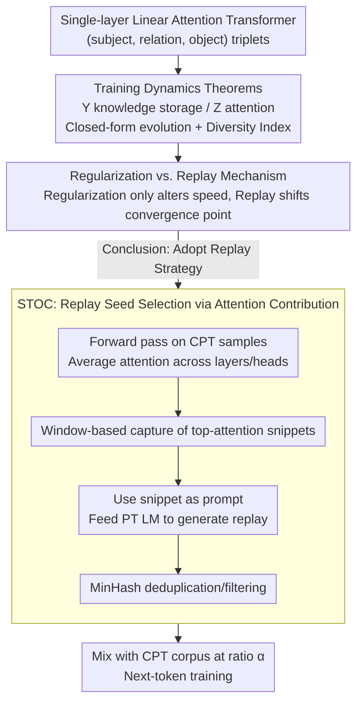

# Towards Understanding Continual Factual Knowledge Acquisition of Language Models: From Theory to Algorithm

**Conference**: ICML 2026  
**arXiv**: [2605.10640](https://arxiv.org/abs/2605.10640)  
**Code**: https://github.com/WhyDwelledOnAi/continual_Factual_Knowledge_Acquision (Available)  
**Area**: Continual Pre-training / Language Model Theory / Catastrophic Forgetting  
**Keywords**: Continual Pre-training, Catastrophic Forgetting, Transformer Training Dynamics, Data Replay, Attention Attribution

## TL;DR
The authors derive closed-form training dynamics for simplified single-layer linear attention Transformers, proving that regularization methods only alter convergence speed without shifting the convergence point (leading to inevitable failure in cFKA scenarios). In contrast, data replay directly modifies the convergence point and amplifies oscillations to stabilize old knowledge. Based on these findings, the authors propose STOC, which selects snippets via token-level attention contributions to guide pre-trained models in generating replay corpora. STOC consistently suppresses forgetting more effectively than LAMOL on synthetic, KnowEdit, and IndustryCorpus (legal) datasets.

## Background & Motivation

**Background**: LLMs accumulate vast factual knowledge during open-domain pre-training (PT), but industrial applications often require continual pre-training (CPT) to inject domain-specific knowledge (e.g., legal corpora) or new facts. Like traditional continual learning, CPT suffers from catastrophic forgetting, where old knowledge is overwritten by new data.

**Limitations of Prior Work**: Existing CPT mitigation strategies are primarily categorized into regularization-based (e.g., EWC) and replay-based (e.g., LAMOL) approaches. Empirical evidence in LLMs shows that regularization has limited effectiveness, while replay significantly alleviates forgetting even at small ratios. However, the community lacks a unified theoretical explanation for these phenomena, often relying on "voodoo" heuristics for ratio tuning.

**Key Challenge**: Continual Factual Knowledge Acquisition (cFKA) is essentially about shifting the output distribution for a token toward new facts under a shared next-token-prediction objective, without collapsing the probabilities of old facts. A transformer-specific dynamical description of how learning rates, token frequencies, and attention allocation determine forgetting is missing.

**Goal**: (a) Develop an analytical training dynamics framework for cFKA characterizing the evolution of parameters $\mathbf{Y}$ (FFN-like knowledge storage) and $\mathbf{Z}$ (attention). (b) Explain the failure of regularization and the success of replay using this theory. (c) Derive a transformer-native, token-level attention-based generative replay method, STOC, and validate it in synthetic and real-world scenarios.

**Key Insight**: Following the "Physics of Language Models" series by Allen-Zhu & Li, facts are represented as (subject, relation, object) triplets fed into a single-layer linear attention Transformer. By assuming $\eta_Y \gg \eta_Z$, $\mathbf{Z}$ is treated as slowly varying, simplifying multi-body nonlinear optimization into a controllable Taylor expansion.

**Core Idea**: Instead of merely patching existing CPT algorithms, the authors leverage transformer training dynamics to prove that regularization cannot move the convergence point, whereas replay can both shift the point and amplify oscillations to preserve old knowledge. They then use token attention attribution to identify replay seeds, enabling generative replay to produce samples containing old knowledge.

## Method

### Overall Architecture
Analysis framework: The model is reparameterized into $\mathbf{Y} := \mathbf{E}\mathbf{W}_O\mathbf{W}_V^\top \mathbf{E}^\top$ (knowledge storage) and $\mathbf{Z} := \mathbf{E}\mathbf{W}_K\mathbf{W}_Q^\top \mathbf{E}^\top / \sqrt{d}$ (attention). Under cross-entropy optimization, SGD is used to derive the evolution theorem for $\mathbf{Y}$ and conservation laws for $\mathbf{Z}$. Regularization and replay are then integrated into the gradient equations to compare their effects on convergence points, speeds, and oscillation magnitudes. Based on the inference that "tokens with high attention scores carry more factual information," STOC is designed: a forward pass on each CPT sample yields token-level attention scores $\rightarrow$ averaged across layers $\rightarrow$ sliding window captures fixed-length snippets with the highest attention $\rightarrow$ used as prompts for the pre-trained LM to generate replay data $\rightarrow$ MinHash deduplication $\rightarrow$ mixed with new data at ratio $\alpha$ for CPT.

### Key Designs

**1. cFKA Training Dynamics Theorem for Single-layer Transformer: Token-level Knowledge Distribution**

Prior transformer optimization theories focused on ICL or ignored multi-token knowledge structures, failing to explain how facts are distributed across tokens. Reparameterizing the model into storage $\mathbf{Y}$ and attention $\mathbf{Z}$, under the assumption $\eta_Y\gg\eta_Z$ (Z as slowly varying), makes $\mathbf{Y}$ convex relative to the loss. The optimal reference solution is the Bayes optimal prediction $\mathbf{U}=\sum_{o,s}\frac{1}{a_s}[\ln\Pr(s\mid o)+\frac{1}{L}\ln\Pr(o)]\,\mathbf{x}_o\mathbf{x}_s^\top$. Error evolution is expressed in Taylor form as:

$$\mathbf{e}_s(T)\approx\Big[\prod_{t=1}^T(\mathbf{I}-\eta_Y z_s\delta_s(t)\tilde{\mathbf{H}}(t))\Big]\mathbf{e}_s(0)+\sum_t\eta_Y z_s\delta_s(t)\Big[\prod(\cdot)\Big]\bm{\xi}(t),$$

where the first term (exponential decay) determines convergence speed (controlled by the largest eigenvalue of $\tilde{\mathbf{H}}$), and the second term determines fixed-amplitude oscillations (controlled by the smallest positive eigenvalue). Simultaneously, $\mathbf{Z}$ satisfies a conservation law $\frac{d}{dt}[(\tfrac{z_s}{\eta_Z})^2-\sum_o(\tfrac{y_{o,s}}{\eta_Y})^2]=0$, leading to the finding that attention for token $s$ is determined by its Diversity Index $\mathrm{DI}(\overline{\mathbf{x}}_s)\propto-\sqrt{\eta_Z/\eta_Y}\sqrt[4]{\sum_o[\ln\Pr(s\mid o)+L^{-1}\ln\Pr(o)]^2}+C$.

**2. Mechanism Comparison: Regularization vs. Data Replay**

The authors explain why regularization is ineffective while replay works even at low ratios (e.g., 10%). Substituting both methods into the dynamics: For EWC-style targets $\mathcal{L}=\mathcal{L}_{\text{new}}+\frac{k}{2}\sum_i w_i(\theta_i-\theta_i^*)^2$, an error term $-\sum_t k\eta_Y[\prod(\cdot)]\,\tilde{\mathbf{u}}$ is added, but it is bounded by $\lambda^+_{\min}(\mathrm{diag}(\mathbf{w}_s))=\min_o w_{o,s}$. When factual knowledge is held by only a few dimensions of a token, this minimal eigenvalue is near zero, causing the convergence point to remain stationary while only slowing the speed. For replay, the frequency distribution becomes $\Pr(\mathbf{x}_s)=\frac{1-\alpha}{|\mathcal{O}_s^{\mathrm{old}}|}\sum_{o\in\mathcal{O}_s^{\mathrm{old}}}\mathbf{x}_o+\frac{\alpha}{|\mathcal{O}_s^{\mathrm{new}}|}\sum_{o\in\mathcal{O}_s^{\mathrm{new}}}\mathbf{x}_o$. The first term writes old knowledge back into the convergence point, and the oscillation term $\lambda^+_{\min}(\tilde{\mathbf{H}})$ is amplified after mixing, serving as a "reminder" for old knowledge.

**3. STOC: Attention-based Seed Selection**

Methods like LAMOL use special tokens as prompts, ignoring the transformer's attention structure and risking generation drift. STOC uses the signals provided by the dynamics: after a forward pass on each CPT sample, the importance $a_t$ for each token is calculated by averaging attention scores across all layers and heads. A sliding window identifies the fixed-length snippet with the highest $\sum_t a_t$. According to the dynamics, high-attention tokens correspond to low Diversity Index tokens that effectively "lock in" a set of old facts, making the generated continuation more likely to cover old knowledge.

### Loss & Training
Standard CPT uses cross-entropy $\mathcal{L} = -\mathrm{logit}(x_{T+2}\mid \mathbf{X}) + \log\sum_o \exp(\mathrm{logit}(x_o\mid \mathbf{X}))$. For synthetic Biography experiments, SGD is performed assuming $\eta_Y \gg \eta_Z$. For real-world experiments, Pythia-160M / Qwen2.5-0.5B-1.7B were used with full fine-tuning, rank-128 LoRA, and freezing the first 6 layers. EWC utilizes Fisher Information for parameter importance, while STOC and LAMOL mix old and new data under next-token loss.

## Key Experimental Results

### Main Results
Comparison on Pythia-160M with synthetic Biography data. "Original" denotes retention of old (PT) knowledge, while "Continual" denotes acquisition of new (CPT) facts. $\alpha$ is the CPT data mixing ratio; higher is better.

| Config ($\alpha$) | Replay | Update | Original sFTA | Original EM | Continual sFTA |
|---|---|---|---|---|---|
| 0.5 | Random | Full | 17.68 | 3.14 | 90.37 |
| 0.5 | LAMOL | Full | 19.90 | 5.95 | 92.58 |
| **0.5** | **STOC** | **Full** | **51.54** | **29.84** | 90.47 |
| 0.67 | Random | Freeze | 21.02 | 6.43 | 91.67 |
| 0.67 | LAMOL | Freeze | 21.69 | 9.47 | 92.62 |
| **0.67** | **STOC** | **Freeze** | **53.80** | **32.83** | 92.04 |
| 0.9 | LAMOL | Freeze | 18.88 | 7.58 | 92.06 |
| **0.9** | **STOC** | **Freeze** | **40.54** | **21.62** | 91.96 |

### Ablation Study
Average soft token accuracy for Qwen2.5-0.5B on KnowEdit (ZSRE / Wiki_Bio / Wiki_Recent):

| Method | ZSRE Orig | ZSRE Cont | Wiki_Bio Orig | Wiki_Bio Cont | Wiki_Recent Orig | Wiki_Recent Cont |
|---|---|---|---|---|---|---|
| Naive | 34.58 | 63.28 | 32.33 | 35.50 | 19.28 | 28.42 |
| LAMOL ($\alpha{=}0.5$) | 37.54 | 58.37 | 31.29 | 34.49 | 20.48 | 27.19 |
| **STOC ($\alpha{=}0.5$)** | **37.12** | **62.26** | **35.57** | 35.46 | **21.40** | **28.75** |
| STOC ($\alpha{=}0.8$) | 37.47 | 62.59 | 35.28 | 33.16 | 20.12 | 27.34 |

In legal IndustryCorpus2 1B token trials, STOC outperformed LAMOL by 1–4 percentage points on MMLU / SuperGPQA across 0.6B and 1.7B models.

### Key Findings
- Even with a replay ratio of only 10%, models retain significant old knowledge, aligning with the theory that replay shifts the convergence point.
- Replaying one biography per individual is more effective than replaying two for half the individuals, suggesting that replay must prioritize **coverage** over local depth.
- STOC's attention-based snippets outperform random snippets, confirming that attention-based selection is a causal factor rather than a heuristic accident.
- LoRA performs worst at low $\alpha$, while full fine-tuning and freezing the first 6 layers show similar results, indicating that parameter volume is more sensitive than target-layer selection for cFKA.

## Highlights & Insights
- The empirical failure of regularization in LLMs is explained via eigenvalue analysis: $\lambda^+_{\min}(\mathrm{diag}(\mathbf{w}_s))$ being near zero means regularization cannot shift the target convergence position of $\mathbf{y}_s$.
- The Diversity Index provides a closed-form quantification of a token's role in fact expression, showing a strong correlation (Pearson $<-0.8$) with measured attention in multi-layer LMs.
- STOC is a zero-additional-training-cost component that leverages native attention for high-quality replay, orthogonal to freezing or LoRA.

## Limitations & Future Work
- The theory is grounded in single-layer linear attention + structured-input assumptions; extensions to softmax, multi-head, and multi-layer architectures are empirical rather than formal.
- Knowledge is modeled only as (subject, relation, object) triplets, limiting coverage of common sense, chain-of-thought, or long-context reasoning.
- Replay snippet selection uses simple sequence-dimension windowing and cross-layer averaging; more granular layer-specific or head-specific attribution strategies remain unexplored.

## Related Work & Insights
- **vs. LAMOL (Sun 2020)**: Both are generative replay; LAMOL uses special tokens as prompts, while STOC uses attention-based snippets to better align generated content with the old distribution.
- **vs. EWC (Kirkpatrick 2017)**: Classic regularization; this paper demonstrates why it can only "slow down" rather than "inhibit" forgetting in cFKA.
- **vs. Allen-Zhu & Li "Physics of LM"**: Inherits the synthetic biography framework but extends dynamics to the CPT phase to derive new algorithms.

## Rating
- Novelty: ⭐⭐⭐⭐ Provides a closed-form dynamics for cFKA and a corresponding attention-based replay algorithm.
- Experimental Thoroughness: ⭐⭐⭐⭐ Comprehensive coverage of synthetic, KnowEdit, and legal corpora, though model scales are limited.
- Writing Quality: ⭐⭐⭐⭐ Clear theoretical derivation and a well-structured roadmap from theory to algorithm.
- Value: ⭐⭐⭐⭐ Directly applicable tool for industrial CPT (STOC as plug-and-play) with a strong theoretical justification for why prior methods fail.

<!-- RELATED:START -->

## Related Papers

- [\[ICLR 2026\] Adaptive Acquisition Selection for Bayesian Optimization with Large Language Models](../../ICLR2026/optimization/adaptive_acquisition_selection_for_bayesian_optimization_with_large_language_mod.md)
- [\[ICML 2026\] Adaptive Sharpness-Aware Minimization with a Polyak-type Step size: A Theory-Grounded Scheduler](adaptive_sharpness-aware_minimization_with_a_polyak-type_step_size_a_theory-grou.md)
- [\[ICLR 2026\] Bilevel Optimization with Lower-Level Uniform Convexity: Theory and Algorithm](../../ICLR2026/optimization/bilevel_optimization_with_lower-level_uniform_convexity_theory_and_algorithm.md)
- [\[ICML 2026\] Towards Understanding Adam Convergence on Highly Degenerate Polynomials](towards_understanding_adam_convergence_on_highly_degenerate_polynomials.md)
- [\[ICML 2026\] LiMuon: Light and Fast Muon Optimizer for Large Models](limuon_light_and_fast_muon_optimizer_for_large_models.md)

<!-- RELATED:END -->
