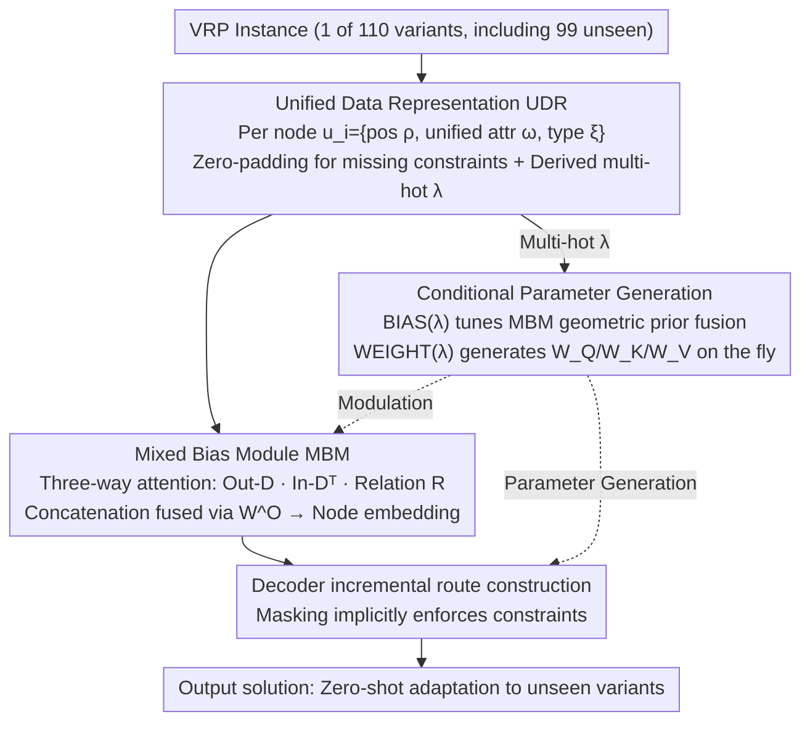

# URS: Unified Neural Routing Solver

**Conference**: ICML 2026  
**arXiv**: [2509.23413](https://arxiv.org/abs/2509.23413)  
**Code**: https://github.com/CIAM-Group/URS  
**Area**: Combinatorial Optimization / Neural Solvers / Vehicle Routing Problems  
**Keywords**: Routing Problems, Zero-shot Generalization, Unified Representation, Multi-task Learning

## TL;DR
The authors propose a Unified Data Representation (UDR) and a Mixed Bias Module (MBM) to replace problem enumeration—enabling a single neural model to generalize zero-shot to 110 VRP variants (99 unseen) without fine-tuning.

## Background & Motivation

**Background**: Vehicle Routing Problems (VRP) are critical combinatorial optimization problems. Recent Neural Combinatorial Optimization (NCO) methods have excelled on specific problems. However, multi-task neural solvers primarily adopt two strategies: (1) Constraint combination methods (treating VRP variants as combinations of different constraints, relying on manually predefined problem labels); (2) Adapter fine-tuning (while reducing retraining, extra fine-tuning is still required, preventing zero-shot generalization).

**Limitations of Prior Work**: Problem boundaries in existing methods are fixed by manually specified constraint sets, which cannot cover the open-ended VRP constraint space. Maintaining a problem taxonomy requires extensive domain expert knowledge. The constraint space is combinatorial and open; simply enumerating constraint combinations leads to model bloating.

**Key Challenge**: How to solve dozens or even hundreds of VRP variants simultaneously with a single model without relying on problem enumeration, while maintaining generalization capability for completely unseen variants?

**Goal**: Construct the first neural solver capable of handling 100+ VRP variants using a single model without any fine-tuning, including 99 unseen variants.

**Key Insight**: Although VRP variants differ significantly, they share a universal structural representation at the data level. This work rethinks the problem from the perspective of data representation unification rather than constraint enumeration.

**Core Idea**: Replace discrete problem labels with a Unified Data Representation (UDR) and a multi-hot problem representation ($\lambda$), achieving cross-problem generalization through data unification rather than problem enumeration.

## Method

### Overall Architecture
URS is based on an encoder-decoder architecture (using AM). The core innovation lies in unification at three levels: (1) UDR at the data layer; (2) MBM at the encoding layer to capture multiple geometric priors; (3) Conditional parameter generation at the decoding layer based on the multi-hot problem representation $\lambda$. This allows the model to adapt to different problem constraints rather than explicitly encoding them.

### Key Designs

**1. Unified Data Representation (UDR): Accommodating all VRP variants with a single set of node features to eliminate "problem enumeration" at the root.**

Existing multi-task solvers treat each VRP variant as a set of manual constraint labels; a new constraint requires a new category, causing the model to expand. URS changes the starting point: since these variants share a universal structure at the data level, all constraints are folded into a single set of node features. Each node is represented as $\mathbf{u}_i=\{\bm{\rho}_i, \bm{\omega}_i, \bm{\xi}_i\}$—position identifiers $\bm{\rho}_i=\{\eta_i, x_i, y_i\}$ are compatible with symmetric/asymmetric graphs, a unified attribute set $\bm{\omega}_i=\{\delta_i, \epsilon_i, \mu_i, e_i, l_i, s_i\}$ covers demand, reward, penalty, time windows, etc. (attributes not involved in a specific variant are zero-padded), and node type identifiers $\bm{\xi}_i\in\{0,1\}^5$ distinguish roles like depots/customers. From this, a multi-hot representation $\bm{\lambda}$ is derived to mark which features are active for the current problem. This design turns constraints into "data" rather than "architecture": new constraints are implicitly enforced during decoding via mask functions, requiring no changes to the model structure and bypassing the need for domain expertise to maintain problem taxonomies.

**2. Mixed Bias Module (MBM): An attention framework that simultaneously handles symmetric distance, asymmetric distance, and relational constraints.**

Geometric priors for VRP variants are diverse—some are symmetric, some asymmetric, and some include additional relationship matrices. Traditional approaches (like MatNet) use parallel layers to process asymmetry, which is complex. MBM replaces standard attention with a three-way parallel mechanism: attention is calculated for the outgoing distance matrix $\bm{D}$, the incoming distance matrix $\bm{D}^{\mathrm{T}}$, and an optional relationship matrix $\bm{R}$. The three outputs are concatenated and fused using a weight matrix $W^O$:

$$\hat{\mathbf{h}}_i^{(\ell)}=\big[\bar{\mathbf{h}}_i^{(0)},\, \bar{\mathbf{h}}_i^{(1)},\, \bar{\mathbf{h}}_i^{(2)}\big]\,W^O.$$

This unified design allows symmetric, asymmetric, and relational geometric constraints to share one encoding framework, obtaining better node embeddings at a much lower cost without needing parallel layers for asymmetry as in MatNet.

**3. Conditional Parameter Generation: Generating decoder parameters on the fly via the multi-hot representation $\bm{\lambda}$ to achieve true zero-shot adaptation.**

While UDR and MBM solve "how to represent the problem," the final step is "how to make the same model output reasonable strategies for unseen problems." URS avoids adapter fine-tuning, which requires secondary training. Instead, $\bm{\lambda}$ directly drives two lightweight networks: a bias network $\mathrm{BIAS}(\bm{\lambda})=\max(1, (\bm{\lambda}W_1+\mathbf{b}_1)W_2+\mathbf{b}_2)$ regulates the fusion of geometric priors in MBM, and a hypernetwork $\mathrm{WEIGHT}(\bm{\lambda})$ directly generates the decoder's projection matrices $W_Q(\bm{\lambda}), W_K(\bm{\lambda}), W_V(\bm{\lambda})$. For a new variant, given its $\bm{\lambda}$, the model calculates the corresponding parameters instantly—this mechanism enables URS to generalize zero-shot to 99 unseen variants.

## Key Experimental Results

### Main Results (Seen Problems)

| Dataset | Ours | Best MTL Baseline | Gain | Execution Time |
|--------|------|-------------|------|---------|
| TSP100 | 0.57% | POMO 0.13% | Comparable | 6s |
| CVRP100 | 1.81% | ReLD-MTL 1.42% | Slight degradation | 6s |
| ATSP100 | 2.26% | Baseline 3.05%+ | Significantly better than GOAL | 1.1m |
| CVRPTW100 | 6.13% | MVMoE 3.14% | Sacrificed for generalization | 8s |

### Zero-shot Generalization (Unseen Problems)

| Problem Type | Ours Performance | MVMoE | Gain | Notes |
|---------|--------|--------|------|------|
| CVRPBP (Unseen) | 12.95% | 13.95% | +1.0pp | Complex multi-constraint |
| MDOCVRPBPTW (Unseen) | 26.31% | 63.77% | +37.5pp | Extremely difficult: Multi-depot + Open + TW |
| APDCVRP (Unseen) | 7.03% | × | No baseline | Asymmetric + Pickup/Delivery |
| SPCTSP (Unseen) | -2.37% | × | Surpasses optimal | Priority TSP |

### Key Findings
- Averaged performance across 99 unseen VRP variants surpasses existing multi-task methods.
- Significant advantages on complex multi-constraint combinations (+37pp).
- Even surpasses heuristic algorithms on SPCTSP.
- Maintains reasonable solution times on large-scale instances of up to 7,000 nodes.

## Highlights & Insights
- **Data Unification vs. Problem Enumeration**: A fundamental paradigm shift—moving from "designing labels for every constraint combination" to "representing all constraints in a universal feature space for the model to learn trade-offs."
- **Versatility of the Mixed Bias Module**: A single attention framework compatible with symmetric distance, asymmetric distance, and relational constraints through a multi-path design.
- **Empirical Evidence of Zero-shot Generalization**: Works on 99 completely unseen problems without any fine-tuning, outperforming baselines specifically trained for those tasks in most cases.

## Limitations & Future Work
- Accuracy trade-offs on seen problems—URS slightly lags behind single-task models on standard problems like TSP/CVRP.
- Unknown scalability for ultra-large instances—tested up to 7,000 nodes, but real-world cases may involve tens of thousands.
- Insufficient analysis of constraint satisfaction—in-depth analysis of optimization quality for boundary constraints is needed.
- Future directions: Knowledge distillation; integrated search strategies; verifying method versatility in other combinatorial optimization domains.

## Related Work & Insights
- **vs. Constraint Combination Methods (MVMoE, MTPOMO)**: Exhaustive constraint combination leads to limited problem coverage ($\le 48$); URS unified representation is open and compatible, covering 110+.
- **vs. Adapter Fine-tuning Methods (GOAL, TSP-FT)**: Requiring fine-tuning of adapter parameters for each new problem is not true zero-shot; URS conditional parameter generation achieves this instantly.
- **General Inspiration**: Proves that neural networks can handle the open space of "problem families" similarly to heuristic algorithms.

## Rating
- Novelty: ⭐⭐⭐⭐⭐  Solves cross-problem generalization via data representation unification, a paradigm-level innovation.
- Experimental Thoroughness: ⭐⭐⭐⭐⭐  Comprehensive evaluation on 110 VRP variants (99 unseen) + ablation + scalability up to 7,000 nodes.
- Writing Quality: ⭐⭐⭐⭐  Method is clear, tables are detailed; some details are slightly verbose.
- Value: ⭐⭐⭐⭐⭐  First to unify 100+ VRP variants into a single model, holding significant value for practical applications like logistics scheduling.

<!-- RELATED:START -->

## Related Papers

- [\[NeurIPS 2025\] Learning to Insert for Constructive Neural Vehicle Routing Solver](../../NeurIPS2025/optimization/learning_to_insert_for_constructive_neural_vehicle_routing_solver.md)
- [\[ICML 2026\] Neural QAOA$^2$: Differentiable Joint Graph Partitioning and Parameter Initialization for Quantum Combinatorial Optimization](neural_qaoa2_differentiable_joint_graph_partitioning_and_parameter_initializatio.md)
- [\[ICML 2026\] LoRe: Adaptive Interaction-Evaluation Routing with Per-Step Interaction Budgets for Iterative Graph Solvers](lore_adaptive_interaction-evaluation_routing_with_per-step_interaction_budgets_f.md)
- [\[ICML 2026\] Probing Neural TSP Representations for Prescriptive Decision Support](probing_neural_tsp_representations_for_prescriptive_decision_support.md)
- [\[ICML 2026\] The Implicit Bias of Adam and Muon on Smooth Homogeneous Neural Networks](the_implicit_bias_of_adam_and_muon_on_smooth_homogeneous_neural_networks.md)

<!-- RELATED:END -->
